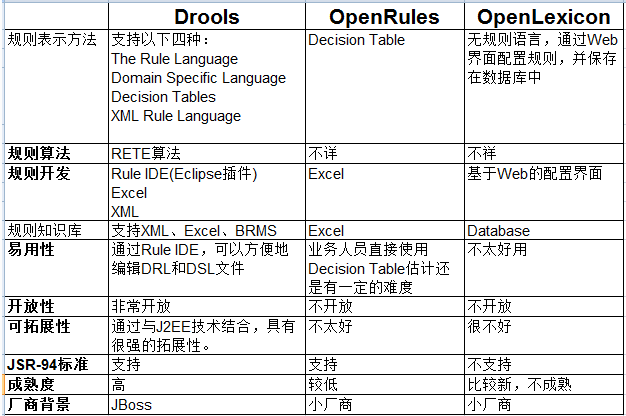

# 专题1 规则引擎

在 Java 领域，开源的规则引擎，没有太多的选择，直接选择 Drools 就对了。

DROOLS（JBOSS RULES ）具有一个易于访问企业策略、易于调整以及易于管理的开源业务规则引擎，符合业内标准，速度快、效率高。业务分析师或审核人员可以利用它轻松查看业务规则，从而检验是否已编码的规则执行了所需的业务规则。

> 用XML节点来规范If--Then句式和事实的定义，使引擎干起活来很舒服。 而使用Java,Groovy等原生语言来做判断和执行语句，让程序员很容易过渡、移植，学习曲线很低。

DROOLS 是一个基于 CHARLES FORGY'S 的 RETE 算法的，易于访问企业策略、易于调整以及易于管理的开源业务规则引擎，符合业内标准，速度快、效率高。 业务分析师人员或审核人员可以利用它轻松查看业务规则，检验已编码的规则执行了所需的业务规则。

当前最新版本为 7.32.0.Final ，可到[官网下载](https://www.drools.org/download/download.html)。