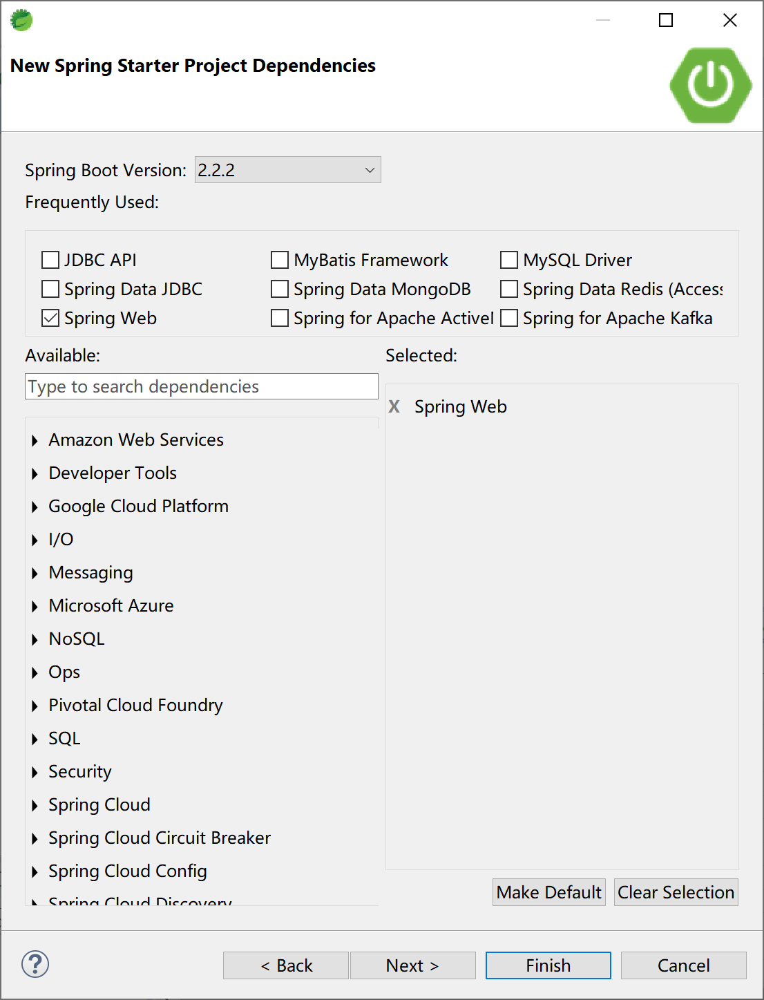

## 10.2 Spring Boot中全局异常的使用

在实际工作中，我们大部分时间在使用Spring Boot开发Web应用（当然，最经常使用到的是框架是Spring MVC）。由于和用户多有交互，所以在请求的过程中，发生错误异常是很常见的。Spring Boot为我们提供了一套默认的异常/错误处理机制，帮助我们来处理交互过程中的异常/错误。

> [官方文档](https://docs.spring.io/spring-boot/docs/current/reference/htmlsingle/#boot-features-error-handling)，对错误处理的描述如下：
>
> By default, Spring Boot provides an `/error` mapping that handles all errors in a sensible way, and it is registered as a “global” error page in the servlet container. For machine clients, it produces a JSON response with details of the error, the HTTP status, and the exception message. For browser clients, there is a “whitelabel” error view that renders the same data in HTML format (to customize it, add a `View` that resolves to `error`). To replace the default behavior completely, you can implement `ErrorController` and register a bean definition of that type or add a bean of type `ErrorAttributes` to use the existing mechanism but replace the contents.

例如，当我们通过浏览器访问一个不存在的url地址时，服务器就产生一个“404 Not Found”错误，Spring Boot提供的默认映射“/error”就起作用了，在这个请求中处理“404 Not Found”然后通过该请求配置的默认全局错误页面来展示错误信息。


如果是通过Postman之类的工具以Post方式访问，Spring Boot的默认全局异常处理机制则会返回一段json信息。


### 10.2.1 Spring Boot默认全局异常

在Spring Boot提供的`org.springframework.boot.autoconfigure.web.servlet.error.ErrorMvcAutoConfiguration`类通过自动配置错误处理Bean，为Web容器提供了默认的全局异常处理机制。

```java
...
@Bean//1.DefaultErrorAttributes
@ConditionalOnMissingBean(value = ErrorAttributes.class, search = SearchStrategy.CURRENT)
public DefaultErrorAttributes errorAttributes() {
    return new DefaultErrorAttributes(this.serverProperties.getError().isIncludeException());
}

@Bean//2.BasicErrorController
@ConditionalOnMissingBean(value = ErrorController.class, search = SearchStrategy.CURRENT)
public BasicErrorController basicErrorController(ErrorAttributes errorAttributes,
                                                 ObjectProvider<ErrorViewResolver> errorViewResolvers) {
    return new BasicErrorController(errorAttributes, this.serverProperties.getError(),
                                    errorViewResolvers.orderedStream().collect(Collectors.toList()));
}

@Bean//3.ErrorPageCustomizer
public ErrorPageCustomizer errorPageCustomizer(DispatcherServletPath dispatcherServletPath) {
    return new ErrorPageCustomizer(this.serverProperties, dispatcherServletPath);
}
...
    
@Configuration(proxyBeanMethods = false)
static class DefaultErrorViewResolverConfiguration {

    private final ApplicationContext applicationContext;

    private final ResourceProperties resourceProperties;

    DefaultErrorViewResolverConfiguration(ApplicationContext applicationContext,
                                          ResourceProperties resourceProperties) {
        this.applicationContext = applicationContext;
        this.resourceProperties = resourceProperties;
    }

    @Bean//4.DefaultErrorViewResolver
    @ConditionalOnBean(DispatcherServlet.class)
    @ConditionalOnMissingBean(ErrorViewResolver.class)
    DefaultErrorViewResolver conventionErrorViewResolver() {
        return new DefaultErrorViewResolver(this.applicationContext, this.resourceProperties);
    }

}

...
```

#### 10.2.1.1 DefaultErrorAttributes

其中配置的`org.springframework.boot.web.servlet.error.DefaultErrorAttributes`类，为我们提供了在页面共享信息的“getErrorAttributes”方法。

```java
@Override
public Map<String, Object> getErrorAttributes(WebRequest webRequest, boolean includeStackTrace) {
    Map<String, Object> errorAttributes = new LinkedHashMap<>();
    errorAttributes.put("timestamp", new Date());
    addStatus(errorAttributes, webRequest);
    addErrorDetails(errorAttributes, webRequest, includeStackTrace);
    addPath(errorAttributes, webRequest);
    return errorAttributes;
}
```

#### 10.2.1.2 BasicErrorController
其中配置的`org.springframework.boot.autoconfigure.web.servlet.error.BasicErrorController`类，根据请求头的不同，提供了不同的方法处理默认/error请求。

- 普通html请求，返回error错误页面并携带错误数据。
- 其他的请求（例如Postman发起的请求），就返回json数据。

```java
@RequestMapping(produces = MediaType.TEXT_HTML_VALUE)//处理浏览器请求，返回错误html页面
public ModelAndView errorHtml(HttpServletRequest request, HttpServletResponse response) {
    HttpStatus status = getStatus(request);
    Map<String, Object> model = Collections
        .unmodifiableMap(getErrorAttributes(request, isIncludeStackTrace(request, MediaType.TEXT_HTML)));
    response.setStatus(status.value());
    ModelAndView modelAndView = resolveErrorView(request, response, status, model);
    return (modelAndView != null) ? modelAndView : new ModelAndView("error", model);
}

@RequestMapping//处理其他请求，例如Postman发起的请求，返回json数据
public ResponseEntity<Map<String, Object>> error(HttpServletRequest request) {
    HttpStatus status = getStatus(request);
    if (status == HttpStatus.NO_CONTENT) {
        return new ResponseEntity<>(status);
    }
    Map<String, Object> body = getErrorAttributes(request, isIncludeStackTrace(request, MediaType.ALL));
    return new ResponseEntity<>(body, status);
}
```

其中的`org.springframework.boot.autoconfigure.web.servlet.error.ErrorMvcAutoConfiguration.StaticView`类的“render”方法提供的就是我们经常能够看到的“Whitelabel Error Page”页面。

```java
private static class StaticView implements View {

    private static final MediaType TEXT_HTML_UTF8 = new MediaType("text", "html", StandardCharsets.UTF_8);

    private static final Log logger = LogFactory.getLog(StaticView.class);

    @Override
    public void render(Map<String, ?> model, HttpServletRequest request, HttpServletResponse response)
        throws Exception {
        if (response.isCommitted()) {
            String message = getMessage(model);
            logger.error(message);
            return;
        }
        response.setContentType(TEXT_HTML_UTF8.toString());
        StringBuilder builder = new StringBuilder();
        Date timestamp = (Date) model.get("timestamp");
        Object message = model.get("message");
        Object trace = model.get("trace");
        if (response.getContentType() == null) {
            response.setContentType(getContentType());
        }
        builder.append("<html><body><h1>Whitelabel Error Page</h1>").append(
            "<p>This application has no explicit mapping for /error, so you are seeing this as a fallback.</p>")
            .append("<div id='created'>").append(timestamp).append("</div>")
            .append("<div>There was an unexpected error (type=").append(htmlEscape(model.get("error")))
            .append(", status=").append(htmlEscape(model.get("status"))).append(").</div>");
        if (message != null) {
            builder.append("<div>").append(htmlEscape(message)).append("</div>");
        }
        if (trace != null) {
            builder.append("<div style='white-space:pre-wrap;'>").append(htmlEscape(trace)).append("</div>");
        }
        builder.append("</body></html>");
        response.getWriter().append(builder.toString());
    }
...
```

#### 10.2.1.3 ErrorPageCustomizer

其中的`org.springframework.boot.autoconfigure.web.servlet.error.ErrorMvcAutoConfiguration.ErrorPageCustomizer`类，接管系统出现错误后的请求，并进行处理（web.xml注册的错误页面规则）。

```java
private static class ErrorPageCustomizer implements ErrorPageRegistrar, Ordered {

    private final ServerProperties properties;

    private final DispatcherServletPath dispatcherServletPath;

    protected ErrorPageCustomizer(ServerProperties properties, DispatcherServletPath dispatcherServletPath) {
        this.properties = properties;
        this.dispatcherServletPath = dispatcherServletPath;
    }

    @Override
    public void registerErrorPages(ErrorPageRegistry errorPageRegistry) {
        ErrorPage errorPage = new ErrorPage(
            this.dispatcherServletPath.getRelativePath(this.properties.getError().getPath()));
        errorPageRegistry.addErrorPages(errorPage);
    }

    @Override
    public int getOrder() {
        return 0;
    }

}
```

#### 10.2.1.4 DefaultErrorViewResolver

其中的`org.springframework.boot.autoconfigure.web.servlet.error.DefaultErrorViewResolver`类，完成默认的错误视图解析工作。

```java
@Override
public ModelAndView resolveErrorView(HttpServletRequest request, HttpStatus status, Map<String, Object> model) {
    ModelAndView modelAndView = resolve(String.valueOf(status.value()), model);
    if (modelAndView == null && SERIES_VIEWS.containsKey(status.series())) {
        modelAndView = resolve(SERIES_VIEWS.get(status.series()), model);
    }
    return modelAndView;
}

private ModelAndView resolve(String viewName, Map<String, Object> model) {
    //Spring Boot去找到一个处理错误的页面，例如error/404
    String errorViewName = "error/" + viewName;
    TemplateAvailabilityProvider provider = this.templateAvailabilityProviders.getProvider(errorViewName,
                                                                                           this.applicationContext);
    if (provider != null) {
        return new ModelAndView(errorViewName, model);
    }
    return resolveResource(errorViewName, model);
}
...
```

#### 10.2.1.5 Spring Boot处理过程

默认情况下，Web应用一旦出现错误，Spring Boot全局异常体系就接管该错误，并按照如下步骤进行处理：

1. 一但系统出现4xx或者5xx之类的错误，ErrorPageCustomizer就会生效（根据指定的错误响应规则），由“/error”请求接管；

2. “error”请求会被BasicErrorController处理，根据请求头的不同，返回“Whitelabel Error Page”页面或json数据；

3. 由DefaultErrorViewResolver解析得到响应页面。
   

### 10.2.2 自定义全局异常


