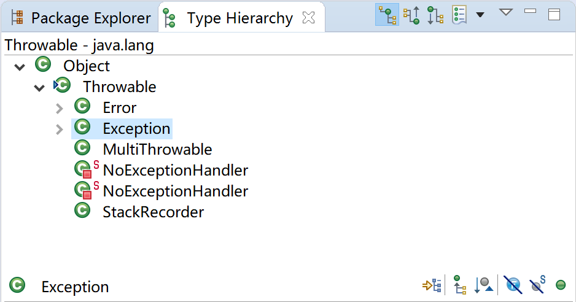

# 第10章 异常处理

异常本质上是程序上的错误，包括程序逻辑错误和系统错误。比如使用空的引用、数组下标越界、内存溢出错误、试图打开一个不存在的文件等，这些都是意外的情况，背离我们程序本身的意图。为了能够及时有效地处理程序中的运行错误，Java 专门引入了错误（Error）类和异常（Exception）类。

- **Throwable类：**是 Java 语言中所有错误和异常的超类。有两个重要的子类：Exception（异常）和 Error（错误），二者都是 Java 异常处理的重要子类，各自都包含了大量的子类。

- **Error类：**是程序无法处理的错误，表示运行应用程序时遇到的较严重问题。大多数错误与代码编写者执行的操作无关，而表示代码运行时 JVM（Java 虚拟机）出现的问题。遇见这类错误，程序只有终止运行，例如OutOfMemoryError（继承自VirtualMachineError）、NoClassDefFoundError（继承自LinkageError）等。

- **Exception类：**程序运行过程中出现的意外的情况，背离我们程序本身的意图，需要程序员接入处理。

异常和错误的本质区别是：异常能被程序本身处理，而错误无法处理。

> Error是一种严重的问题，应用程序不应该捕捉它。
>
> Error继承自Throwable而不是继承自Exception，就是为了方便程序可以使用 “catch (Exception)”来捕捉异常而不会把Error也捕捉在内。因为Exception发生后可以进行一些恢复工作的，但是Error发生后一般是不可恢复的。

本章在介绍Java异常及异常处理的基础上，介绍Spring Boot中如何处理全局异常，及针对某些异常的重试机制。