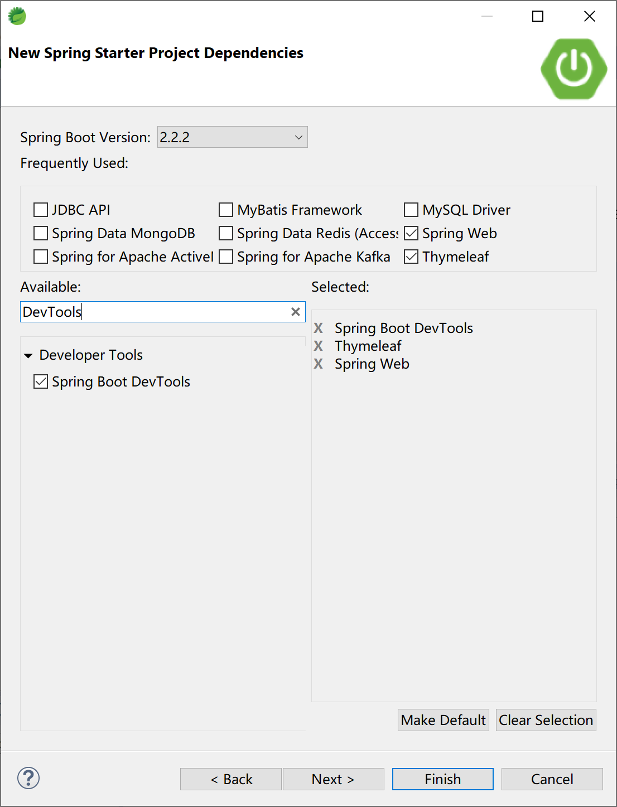
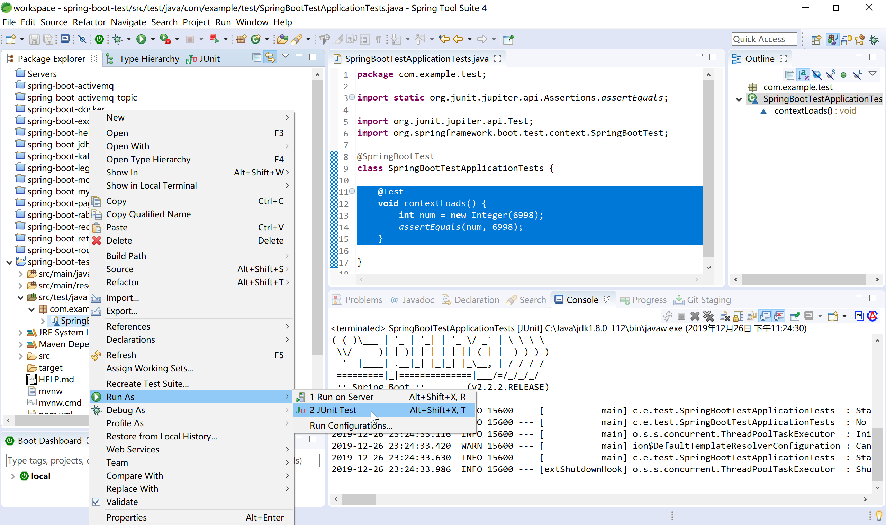
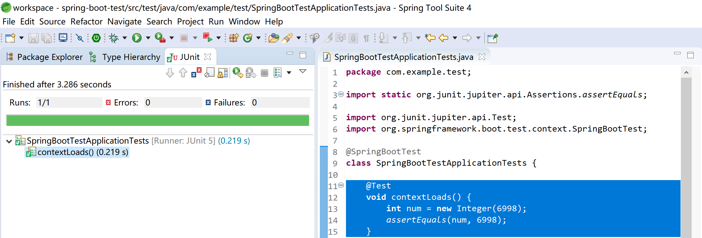
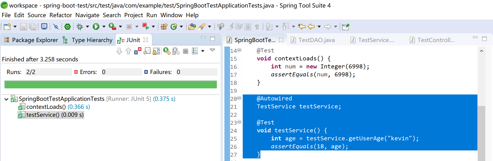
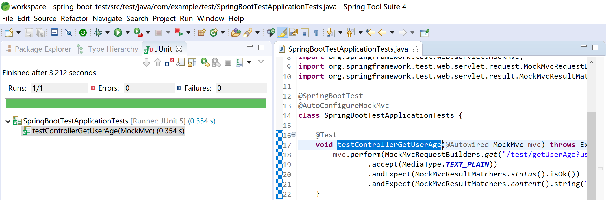
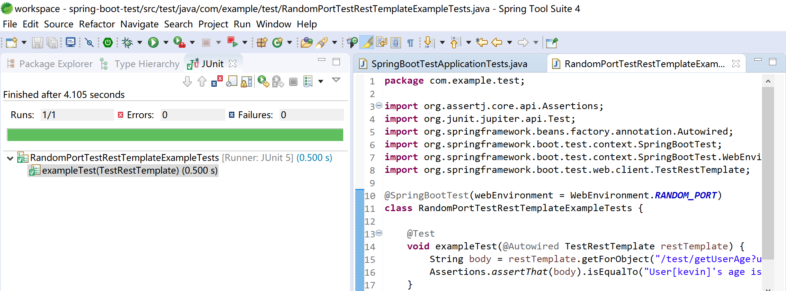

## 11.1 Spring Boot中的单元测试

单元测试是指对软件中的最小可测试单元进行检查和验证，单元测试归属于白盒测试。

这个定义有点抽象，下面举几个单元测试的特性，大家感受一下：

- 一般是一个函数配几个单元测试；
- 单元测试不应该依赖外部系统；
- 单元测试运行速度很快；
- 单元测试不应该造成测试环境的脏数据；
- 单元测试可以重复运行。

单元测试使得我们可以放心修改、重构业务代码，而不用担心修改某处代码后带来的副作用。

单元测试可以帮助我们反思模块划分的合理性，如果一个单元测试写得逻辑非常复杂、或者说一个函数复杂到无法写单元测试，那就说明模块的抽象有问题。

单元测试使得系统具备更好的可维护性、具备更好的可读性。对于团队的新人来说，可以从单元测试入手阅读代码，进而熟悉系统的逻辑。

优秀的开源框架，都配有完善的单元测试套件（Test Suite），以保证代码质量。

越是底层的代码，越是被更多客户调用的代码，越应该实践TDD（Test-Driven Development，测试驱动开发）。

> 测试驱动开发的基本思想就是在开发功能代码之前，先编写测试代码。也就是说在明确要开发某个功能后，首先思考如何对这个功能进行测试，并完成测试代码的编写，然后编写相关的代码满足这些测试用例。然后循环进行添加其他功能，直到完全部功能的开发。

虽然，我们日常工作中不会为每一段业务逻辑（类或方法）提供单元测试，但是针对大部分的产品级业务系统（主要工作是在某一技术基础平台上实现业务逻辑），都应该写单元测试。

大部分开发人员使用的单元测试框架都是JUnit，这也是Spring Boot的选择。

### 11.1.1 使用单元测试

> Spring  Boot[官方文档](https://docs.spring.io/spring-boot/docs/current-SNAPSHOT/reference/html/spring-boot-features.html#boot-features-testing)，对如何进行测试进行了充分的说明。
>
> Spring Boot provides a number of utilities and annotations to help when testing your application. Test support is provided by two modules: `spring-boot-test` contains core items, and `spring-boot-test-autoconfigure` supports auto-configuration for tests.

使用Spring Starter创建项目时，默认就添加了`spring-boot-starter-test`依赖。



查看项目pom文件中的单元测试依赖：

```xml
<dependency>
    <groupId>org.springframework.boot</groupId>
    <artifactId>spring-boot-starter-test</artifactId>
    <scope>test</scope>
    <exclusions>
        <exclusion>
            <groupId>org.junit.vintage</groupId>
            <artifactId>junit-vintage-engine</artifactId>
        </exclusion>
    </exclusions>
</dependency>
```

`spring-boot-starter-test`启动器依赖提供如下支持库：

- JUnit 5（包括与JUnit 4向后兼容的老式引擎）：Java领域的单元测试事实标准，使用最广泛的测试支持库。

- Spring Test和Spring Boot Test：对Spring Boot应用提供集成测试支持。

- AssertJ：Java领域常用的功能完备的断言库。

- Hamcrest：一个匹配对象的库（也称为约束或谓词）。

- Mockito：一个Java模拟框架，比如模拟http容器环境。

- JSONassert：JSON的断言库。

- JsonPath：JSON的XPath支持库。

Spring Boot认为这些公共库在编写测试时很有用。如果这些库不适合我们的需要，也可以手动添加自己喜欢的测试依赖库。

通过查看`org.springframework.boot:spring-boot-starters`依赖，可以看到其依赖的JUnit的版本信息

```xml
<dependency>
    <groupId>org.junit.jupiter</groupId>
    <artifactId>junit-jupiter</artifactId>
    <version>5.5.2</version>
    <scope>compile</scope>
</dependency>
```

打开Spring Boot创建的项目中的默认单元测试入口类`SpringBootTestApplicationTests`：

```java
package com.example.test;

import org.junit.jupiter.api.Test;
import org.springframework.boot.test.context.SpringBootTest;

@SpringBootTest
class SpringBootTestApplicationTests {

	@Test
	void contextLoads() {
	}

}
```

在contextLoads方法中添加一个断言：

```java
@Test
void contextLoads() {
    int num = new Integer(6998);
    assertEquals(num, 6998);
}
```

选中单元测试入口类，运行`JUnit Test`：



查看单元测试运行结果，如果没有错误，会出现熟悉的绿色长条。



### 11.1.2 普通后台代码测试

添加测试用的DAO类TestDAO，模拟从数据库中查询数据后返回用户年龄。其业务逻辑是“kevin用户的年龄为18岁”。

```java
package com.example.test.dao;

import org.springframework.stereotype.Repository;

@Repository
public class TestDAO {

	//模拟从数据库访问数据后返回用户的年龄
	public int getUserAge(String userId) {
		int result = 0;
		if (userId.equals("kevin")) {
			result = 18;
		} else if (userId.equals("roy")) {
			result = 12;
		} else {
			result = 28;
		}
		
		return result;
	}
}
```

添加测试用服务类TestService，使用TestDAO从数据库（模拟）中获取用户年龄。

```java
package com.example.test.service;

import org.springframework.beans.factory.annotation.Autowired;
import org.springframework.stereotype.Service;

import com.example.test.dao.TestDAO;

@Service
public class TestService {
	
	@Autowired
	TestDAO testDAO;
	
	public int getUserAge(String userId) {
		return testDAO.getUserAge(userId);
	}


}
```

在测试启动类中添加测试方法testService，使用注入的TestService获取用户`kevin`的年龄，并做相等断言（年龄等于18）。

```java
@Autowired
TestService testService;

@Test
void testService() {
    int age = testService.getUserAge("kevin");
    assertEquals(18, age);
}
```

运行测试，查看测试结果。



### 11.1.3 使用Mock测试控制层

由于控制器层会从浏览器接收用户的输入，所以在对测试控制层进行单元测试时，需要对Spring MVC和Servlet容器进行模拟，具体的模拟类为MockMvc。

修改测试启动类，为其添加`@AutoConfigureMockMvc`注解，启动MockMvc，创建testControllerGetUserAge测试方法，注意理解其中使用的MockMvc.perform方法，MockMvcRequestBuilders.get方法，MockMvcResultMatchers.status方法和MockMvcResultMatchers.content方法。

```java
package com.example.test;

import org.junit.jupiter.api.Test;
import org.springframework.beans.factory.annotation.Autowired;
import org.springframework.boot.test.autoconfigure.web.servlet.AutoConfigureMockMvc;
import org.springframework.boot.test.context.SpringBootTest;
import org.springframework.http.MediaType;
import org.springframework.test.web.servlet.MockMvc;
import org.springframework.test.web.servlet.request.MockMvcRequestBuilders;
import org.springframework.test.web.servlet.result.MockMvcResultMatchers;

@SpringBootTest
@AutoConfigureMockMvc
class SpringBootTestApplicationTests {

	@Test
	void testControllerGetUserAge(@Autowired MockMvc mvc) throws Exception {
		mvc.perform(MockMvcRequestBuilders.get("/test/getUserAge?userId=kevin")
				.accept(MediaType.TEXT_PLAIN))
				.andExpect(MockMvcResultMatchers.status().isOk())
				.andExpect(MockMvcResultMatchers.content().string("User[kevin]'s age is: 18."));
	}
	
}
```

运行JUnit Test，检查测试结果：



### 11.1.4 运行服务器后测试

有时候我们需要在一个完整运行的服务器中进行控制层的测试（模拟用户的浏览器操作行为），这个时候，我们可以使用Spring Boot提供的TestRestTemplate模板类来完成对运行中的服务器进行测试。

> 这个行为，已经不太像单元测试了，我个人认为有点儿像自动化测试了。

```java
package com.example.test;

import org.assertj.core.api.Assertions;
import org.junit.jupiter.api.Test;
import org.springframework.beans.factory.annotation.Autowired;
import org.springframework.boot.test.context.SpringBootTest;
import org.springframework.boot.test.context.SpringBootTest.WebEnvironment;
import org.springframework.boot.test.web.client.TestRestTemplate;

@SpringBootTest(webEnvironment = WebEnvironment.RANDOM_PORT)
class RandomPortTestRestTemplateExampleTests {

    @Test
    void exampleTest(@Autowired TestRestTemplate restTemplate) {
        String body = restTemplate.getForObject("/test/getUserAge?userId=kevin", String.class);
        Assertions.assertThat(body).isEqualTo("User[kevin]'s age is: 18.");
    }
    
}
```

运行JUnit Test，然后查看测试结果：



