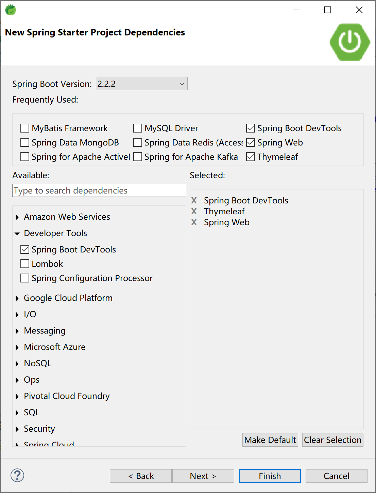
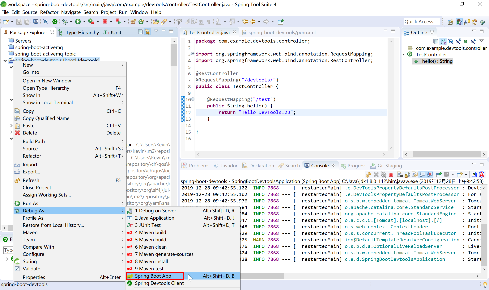

## 11.2 Spring Boot对热部署的支持

**[spring-boot-devtools](https://docs.spring.io/spring-boot/docs/current-SNAPSHOT/reference/html/using-spring-boot.html#using-boot-devtools)**是一个为开发者服务的一个模块，主要功能是监控程序的变化，然后进行自动重新启动，速度比手动停止后再启动要快，这样就可以节省出来手工操作的时间，达到提高开发效率工作效率的目的。

其实现原理主要是使用了两个类加载器（ClassLoader）：

- 一个根Class Loader加载不会改变的类（第三方Jar包）；
- 另一个称为 Restart Class Loader的类加载器加载会更改的类，这样在有代码更改的时候，原来的Restart Class Loader 被丢弃，重新创建一个新的Restart Class Loader，由于需要加载的类相比较少，所以实现了较快（秒级）的重启时间。

默认情况下，当DevTools检测到classpath下有文件（Class文件、配置文件等资源）内容变更时，它会对当前Spring Boot应用进行重新启动。

> 这种设计可以让程序快速的进行重启，因为这个时候第三方jar包中的资源已经在第一次启动的时候进行加载了，自动重启的时候就不需要加载它们了。在开发的时候，希望改动后立马生效的通常也是应用中自己定义的Class及其它资源。

在日常开发中，有些时候，我们会在修改了一组文件后才测试，也就是说我们不想在改变Class Path路径下的任何文件后立马就进行自动重启，而是希望在更改了很多文件后，在更改了一个特殊的文件后才触发自动重启。针对这种情况，可以通过spring.devtools.restart.trigger-file属性指定触发自动重启的文件，这样当该文件的内容发生了变更后就会触发自动重启。比如下面的配置就表示当更改了application.properties文件的内容时将触发自动重启。

```properties
spring.devtools.restart.trigger-file=application.properties
```

通过查看`DevToolsPropertyDefaultsPostProcessor`类，可以了解到devtools为方便开发提供的默认值：

```java
private static final Map<String, Object> PROPERTIES;

static {
    Map<String, Object> properties = new HashMap<>();
    properties.put("spring.thymeleaf.cache", "false");
    properties.put("spring.freemarker.cache", "false");
    properties.put("spring.groovy.template.cache", "false");
    properties.put("spring.mustache.cache", "false");
    properties.put("server.servlet.session.persistent", "true");
    properties.put("spring.h2.console.enabled", "true");
    properties.put("spring.resources.cache.period", "0");
    properties.put("spring.resources.chain.cache", "false");
    properties.put("spring.template.provider.cache", "false");
    properties.put("spring.mvc.log-resolved-exception", "true");
    properties.put("server.error.include-stacktrace", "ALWAYS");
    properties.put("server.servlet.jsp.init-parameters.development", "true");
    properties.put("spring.reactor.debug", "true");
    PROPERTIES = Collections.unmodifiableMap(properties);
}
```

当然，在我们的应用中，某些资源的修改其实并不需要重启服务。比如前端使用的静态资源文件，默认情况下，`Spring Boot` 在以下这些目录中的资源变更时，不会触发重启（但是会触发 live reload）：

```
/META-INF/maven , /META-INF/resources , /resources , /static , /public , /templates
```

我们也可以手动指定不需要重启的资源，覆盖devtools的默认值：

```properties
spring.devtools.restart.exclude=static/**,public/**
```

也可以在默认值上额外添加不需要重启的资源：

```properties
spring.devtools.restart.additional-exclude = /custom-path/**
```

如果我们觉得 `Spring Boot dev-tools` 提供的重启还是不够快的话，可以尝试使用其它的基于 `Reload` 的技术，如收费的`JRebel`。

在Spring Boot中使用devtools非常方便。使用Spring Starter创建项目时，勾选`Spring Boot DevTools`启动器依赖即可。



创建的初始项目pom文件中配置dev-tools的依赖为：

```xml
<dependency>
    <groupId>org.springframework.boot</groupId>
    <artifactId>spring-boot-devtools</artifactId>
    <scope>runtime</scope>
    <optional>true</optional>
</dependency>
```

> 绝大多数情况下 `spring-boot-devtools` 只使用于开发环境，在生产环境是需要禁用的，所以Spring Starter为我们生成的项目中`spring-boot-devtools`通过`<optional>true</optional>`配置到了开发环境。

在后续开发，这个项目就具有热部署（开发过程中，`Debug As`启动项目后根据情况重启）的功能了。

创建一个测试用的Controller类。

```java
package com.example.devtools.controller;

import org.springframework.web.bind.annotation.RequestMapping;
import org.springframework.web.bind.annotation.RestController;

@RestController
@RequestMapping("/devtools/")
public class TestController {
	
	@RequestMapping("/test")
	public String hello() {
		return "Hello DevTools.";
	}

}
```

以debug方式（在项目上右键，选择`Debug As`）启动项目。



在hello方法中，修改返回的字符串值，使用浏览器（[http://localhost:8080/devtools/test](http://localhost:8080/devtools/test)）测试，可以看到在不重新启动的情况下，浏览器能够正确返回hello方法修改后的字符串。

> 本小节示例项目代码：
>
> [https://github.com/gyzhang/SpringBootCourseCode/tree/master/spring-boot-devtools](https://github.com/gyzhang/SpringBootCourseCode/tree/master/spring-boot-devtools)

