## 12.2 集成Spring Security

在Spring Boot中集成Spring Security一如既往地使用了启动器依赖，在创建Spring Starter项目时选中“Spring Security”依赖即可。

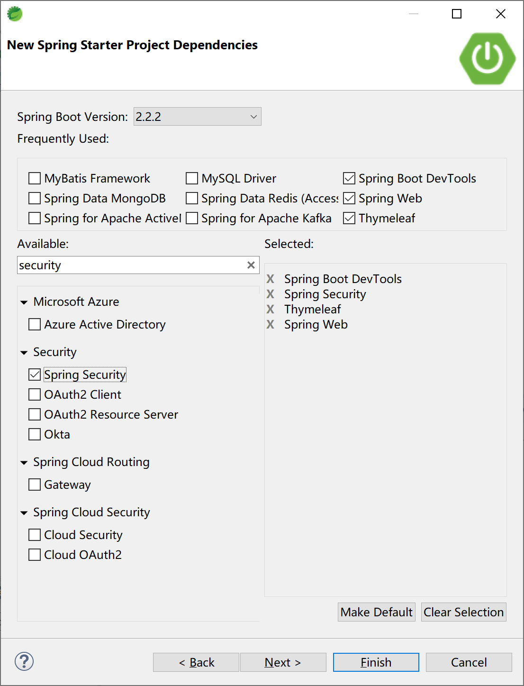

### 12.2.1 基本集成

添加“Spring Security”启动器依赖后，即完成了Spring Security，项目的pom文件中的依赖为：

```xml
<dependency>
    <groupId>org.springframework.boot</groupId>
    <artifactId>spring-boot-starter-security</artifactId>
</dependency>
```

在项目中添加一个控制器HelloController类，测试Spring Security是否正确工作。

```java
package com.example.security.controller;

import org.springframework.web.bind.annotation.RequestMapping;
import org.springframework.web.bind.annotation.RestController;

@RestController
@RequestMapping("/security/")
public class HelloController {
	
	@RequestMapping("/hello")
	public String hello() {
		return "Hello, Security.";
	}

}
```

运行应用后，打开浏览器，访问[http://localhost:8080/security/hello](http://localhost:8080/security/hello)，弹出Spring Security提供的默认认证页面，用户名为user，密码是在启动应用时生成的一个随机字符串（STS控制台中的密码信息：Using generated security password: 0585d7e0-dde1-4b9e-8352-27eb72517803）。

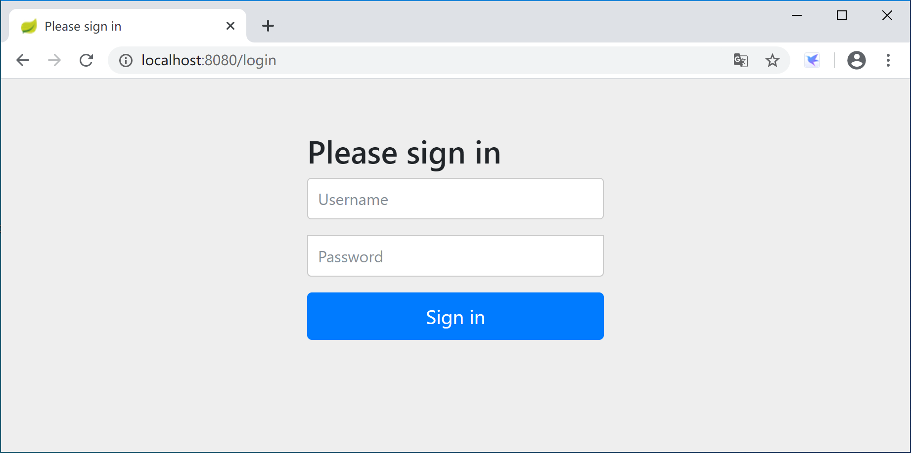

默认密码在应用启动时，打印在控制台中，当然每次启动时生成的密码都不一样。

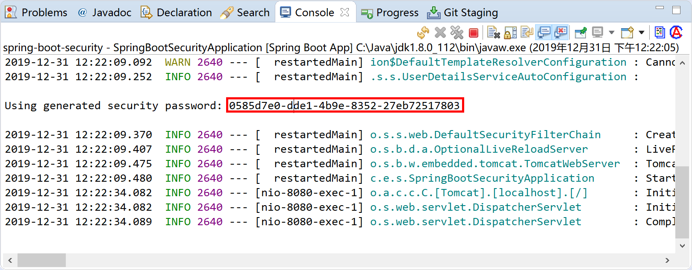

使用user用户名和生成的密码（这里是“0585d7e0-dde1-4b9e-8352-27eb72517803”）登录后，可正确访问HelloController返回的信息。

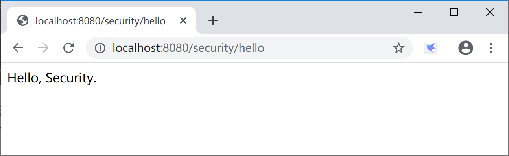

通过查看Spring Security的源码`org.springframework.boot.autoconfigure.security.servlet.UserDetailsServiceAutoConfiguration`类，可以看到inMemoryUserDetailsManager方法中使用的`SecurityProperties.User user`属性提供了用户名和密码。由getOrDeducePassword方法通过日志`logger.info(String.format("%n%nUsing generated security password: %s%n", user.getPassword()));`将生成的默认密码打印到控制台。

```java
public InMemoryUserDetailsManager inMemoryUserDetailsManager(SecurityProperties properties,
                                                             ObjectProvider<PasswordEncoder> passwordEncoder) {
    SecurityProperties.User user = properties.getUser();
    List<String> roles = user.getRoles();
    return new InMemoryUserDetailsManager(
        User.withUsername(user.getName()).password(getOrDeducePassword(user, passwordEncoder.getIfAvailable()))
        .roles(StringUtils.toStringArray(roles)).build());
}
```

进一步查看这个User类，可以看到默认登录用户为user，密码为一个uuid字符串。

```java
public static class User {

    /**
		 * Default user name.
		 */
    private String name = "user";

    /**
		 * Password for the default user name.
		 */
    private String password = UUID.randomUUID().toString();

    /**
		 * Granted roles for the default user name.
		 */
    private List<String> roles = new ArrayList<>();

    private boolean passwordGenerated = true;

    public String getName() {
        return this.name;
    }

    public void setName(String name) {
        this.name = name;
    }

    public String getPassword() {
        return this.password;
    }

    public void setPassword(String password) {
        if (!StringUtils.hasLength(password)) {
            return;
        }
        this.passwordGenerated = false;
        this.password = password;
    }

    public List<String> getRoles() {
        return this.roles;
    }

    public void setRoles(List<String> roles) {
        this.roles = new ArrayList<>(roles);
    }

    public boolean isPasswordGenerated() {
        return this.passwordGenerated;
    }

}
```

如果我们简单的在application.properties文件中指定用户名和密码：

```properties
spring.security.user.name=kevin
spring.security.user.password=6998
spring.security.user.roles=admin
```

则应用在启动时，就不会生成随机的uuid密码，也不会在控制台中打印`Using generated security password: 0585d7e0-dde1-4b9e-8352-27eb72517803`这样的信息了。

这个时候，通过浏览器访问[http://localhost:8080/security/hello](http://localhost:8080/security/hello)则需要输入kevin用户和6998密码，就可以正常访问后台业务逻辑并返回正确的结果，并且该用户具有admin角色（虽然这个示例中角色没有任何用处）。

### 12.2.2 密码加密

除了在学习环境下，为了安全起见，密码存储都**必须要加密**。

Spring Security通过实现PasswordEncoder接口，提供了众多的密码加密类（包括供我们在学习环境下使用的NoOpPasswordEncoder明文密码编码器），供我们在实际工作中根据需要选用。

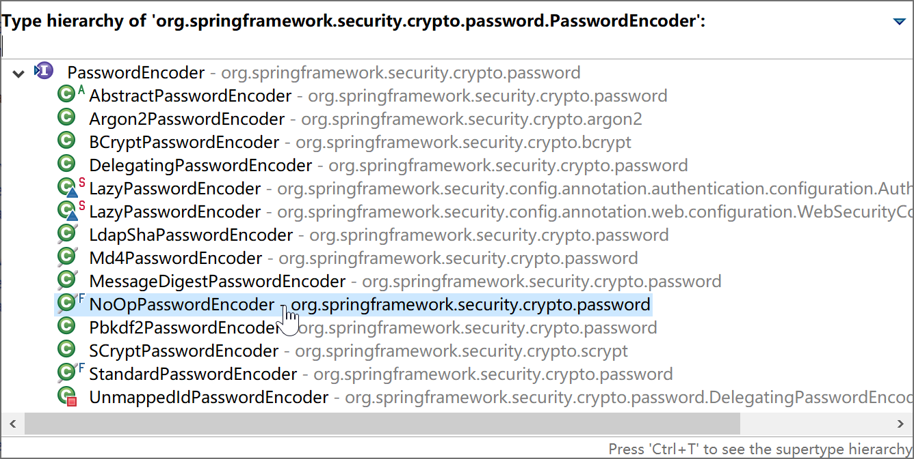

> 奇葩的NoOpPasswordEncoder类：encode(CharSequence rawPassword) 方法的返回值为encode(CharSequence rawPassword) ，也就是密码编码返回明文，所以千万不要在生产环境中使用。

修改SecurityConfiguration类，添加BCryptPasswordEncoder密码编码器。

> BCryptPasswordEncoder，使用了BCrypt强哈希方法来加密密码。

```java
package com.example.security.config;

import org.springframework.context.annotation.Bean;
import org.springframework.context.annotation.Configuration;
import org.springframework.security.config.annotation.authentication.builders.AuthenticationManagerBuilder;
import org.springframework.security.config.annotation.web.builders.HttpSecurity;
import org.springframework.security.config.annotation.web.configuration.EnableWebSecurity;
import org.springframework.security.config.annotation.web.configuration.WebSecurityConfigurerAdapter;
import org.springframework.security.crypto.bcrypt.BCryptPasswordEncoder;
import org.springframework.security.crypto.password.PasswordEncoder;

@Configuration
@EnableWebSecurity
public class SecurityConfiguration extends WebSecurityConfigurerAdapter {
	@Bean
	PasswordEncoder passwordEncoder() {
		PasswordEncoder encoder = new BCryptPasswordEncoder();
		return encoder;
	}
	
	@Override
	protected void configure(AuthenticationManagerBuilder auth) throws Exception {
		auth.inMemoryAuthentication()
		.withUser("admin").password(new BCryptPasswordEncoder().encode("admin")).roles("ADMIN", "USER")
		.and()
		.withUser("kevin").password(new BCryptPasswordEncoder().encode("6998")).roles("USER")
		.and()
		.withUser("roy").password(new BCryptPasswordEncoder().encode("3525")).roles("USER");
	}
	
	@Override
	protected void configure(HttpSecurity http) throws Exception {
		http.authorizeRequests()
		.antMatchers("/admin/**")
		.hasRole("ADMIN")
		.antMatchers("/user/**")
		.hasRole("USER")
		.anyRequest()
		.authenticated()
		.and()
		.formLogin()
		.loginProcessingUrl("/login")
		.permitAll();
	}
	
}
```

上面的示例中PasswordEncoder使用了BCryptPasswordEncoder实现类，并且在基于内存的认证器中给出用户密码时，使用了BCryptPasswordEncoder加密密码（password(new BCryptPasswordEncoder().encode("admin"))）。这样，内存中存储的密码时通过BCrypt加密的密码，用户在登录页面输入密码（例如admin用户的密码admin）后，Spring Security使用PasswordEncoder对密码进行编码后与内存中存储的加密后的密码对比，完成认证，正确后就放行。

### 12.2.3 基于内存的认证

在本小节的学习过程中，通过将用户、密码和角色配置在内存中，会更方便集中精力学习Spring Security。

注释掉上一小节application.properties文件中指定的用户名、密码和角色。

> 后续小节我们会通过数据库来完成一个RBAC的安全控制示例。

```java
package com.example.security.config;

import org.springframework.context.annotation.Bean;
import org.springframework.context.annotation.Configuration;
import org.springframework.security.config.annotation.authentication.builders.AuthenticationManagerBuilder;
import org.springframework.security.config.annotation.web.builders.HttpSecurity;
import org.springframework.security.config.annotation.web.configuration.EnableWebSecurity;
import org.springframework.security.config.annotation.web.configuration.WebSecurityConfigurerAdapter;
import org.springframework.security.crypto.password.NoOpPasswordEncoder;
import org.springframework.security.crypto.password.PasswordEncoder;

@Configuration
@EnableWebSecurity
public class SecurityConfiguration extends WebSecurityConfigurerAdapter {
	@Bean
	PasswordEncoder passwordEncoder() {
		return NoOpPasswordEncoder.getInstance();
	}
	
	@Override
	protected void configure(AuthenticationManagerBuilder auth) throws Exception {
		auth.inMemoryAuthentication()
			.withUser("admin").password("admin").roles("ADMIN", "USER")
		.and()
			.withUser("kevin").password("6998").roles("USER")
		.and()
			.withUser("roy").password("3525").roles("USER");
	}
	
	@Override
	protected void configure(HttpSecurity http) throws Exception {
		http.authorizeRequests()
            .antMatchers("/admin/**")
            .hasRole("ADMIN")
            .antMatchers("/user/**")
            .hasRole("USER")
            .anyRequest()
            .authenticated()
		.and()
            .formLogin()
            .loginProcessingUrl("/login")
            .permitAll();
	}
	
}
```

上述代码，首先注册一个PasswordEncoder（密码加密编码器类），这里为了测试简便，使用了不加密密码。在实际生产环境下**绝对不能使用**这个密码编码器类。

然后使用AuthenticationManagerBuilder.inMemoryAuthentication的内存认证，通过编码添加了3个用户和对应的角色（"ADMIN", "USER"）。

最后使用HttpSecurity为不同的资源匹配了不同的角色访问权限。

添加AdminController控制器类，提供“/admin/hello”资源。

```java
package com.example.security.controller;

import org.springframework.web.bind.annotation.RequestMapping;
import org.springframework.web.bind.annotation.RestController;

@RestController
@RequestMapping("/admin/")
public class AdminController {
	
	@RequestMapping("/hello")
	public String hello() {
		return "admin.hello";
	}

}
```

添加UserController控制器类，提供“/user/hello”资源。

```java
package com.example.security.controller;

import org.springframework.web.bind.annotation.RequestMapping;
import org.springframework.web.bind.annotation.RestController;

@RestController
@RequestMapping("/user/")
public class UserController {

	@RequestMapping("/hello")
	public String hello() {
		return "user.hello";
	}

}
```

启动应用，测试：

- 使用admin用户登录，可以正确访问“/admin/hello”和“/user/hello”资源。

- 使用kevin用户登录，可以正确访问“/user/hello”资源，不能正确访问“/admin/hello”资源，错误信息如下：

  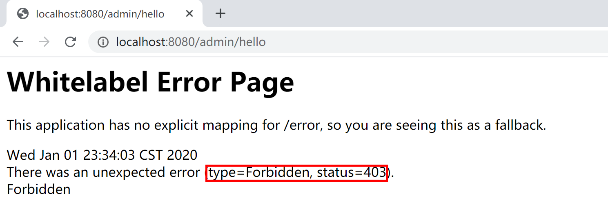

以上就是一个基于内存认证的最简单的RBAC（基于角色的存取控制）权限控制系统：

- kevin拥有USER角色；
- “/user/**”资源授权给USER角色；
- kevin登录后拥有USER角色，可以访问“/user/hello”资源。

### 12.2.4 登录表单/注销配置

虽然Spring Security提供了默认的登录表单，但是在实际工作中绝大多数情况都用不上。基本上在所有的项目/产品中，都会使用自定义的登录表单。当然，注销登录（或者叫做登出），也会使用自定义的配置。

通过查看Spring Security源码，可以看到默认登录表单在`org.springframework.security.web.authentication.ui.DefaultLoginPageGeneratingFilter.generateLoginPageHtml`方法中构建。

在DefaultLoginPageGeneratingFilter类的doFilter方法中`response.getWriter().write(loginPageHtml)`代码向浏览器输出登录表单。

```java
public void doFilter(ServletRequest req, ServletResponse res, FilterChain chain)
    throws IOException, ServletException {
    HttpServletRequest request = (HttpServletRequest) req;
    HttpServletResponse response = (HttpServletResponse) res;

    boolean loginError = isErrorPage(request);
    boolean logoutSuccess = isLogoutSuccess(request);
    if (isLoginUrlRequest(request) || loginError || logoutSuccess) {
        String loginPageHtml = generateLoginPageHtml(request, loginError,
                                                     logoutSuccess);
        response.setContentType("text/html;charset=UTF-8");
        response.setContentLength(loginPageHtml.getBytes(StandardCharsets.UTF_8).length);
        response.getWriter().write(loginPageHtml);

        return;
    }

    chain.doFilter(request, response);
}
```

本小节，我们使用Thymeleaf模板+基于内存认证方式来学习如何自定义登录表单。

首先，我们添加几个简单的页面，然后通过Spring Security基于内存的配置设置其用户、角色、自定义登录表单、注销等操作。

#### 12.2.4.1 首页

创建`src/main/resources/templates/index.html`页面，作为项目的首页。

```html
<!DOCTYPE html>
<html xmlns:th="http://www.thymeleaf.org">
<head>
<title>示例首页</title>
</head>
<body>
	<h1>示例首页</h1>
	<p>登录成功后，自动跳转到这里</p>
	<p>
		点击 <a th:href="@{/user/hello}">这里</a> 进入User Hello页面。
	</p>
	<p>
		点击 <a th:href="@{/admin/hello}">这里</a> 进入Admin Hello页面。
	</p>
	
	<form th:action="@{/logout}" method="post">
		<input type="submit" value="退出（登出，logout）" />
	</form>
</body>
</html>
```

#### 12.2.4.2 登录页面

创建`src/main/resources/templates/login.html`页面，作为项目的登录页面。

```html
<!DOCTYPE html>
<html xmlns:th="http://www.thymeleaf.org">
<head>
<title>自定义登录示例</title>
</head>
<body>
	<h1>请你登录</h1>
	<div th:if="${param.error}">用户名或密码错</div>
	<div th:if="${param.logout}">您已注销成功</div>
	<form th:action="@{/login}" method="post">
		<div>
			<label> 用户名 : <input type="text" name="login_username" />
			</label>
		</div>
		<div>
			<label> 密码 : <input type="password" name="login_password" />
			</label>
		</div>
		<div>
			<input type="submit" value="登录" />
		</div>
	</form>
</body>
</html>
```

在登录页面中，特意将用户名input设为login_username，演示匹配后续的自定义登录页面配置信息。

#### 12.2.4.3 管理页面

创建`src/main/resources/templates/admin/hello.html`，作为项目的管理页面，按照本示例设置，需要ADMIN角色的用户才可以访问。

```
<!DOCTYPE html>
<html xmlns:th="http://www.thymeleaf.org">
<head>
<title>Admin.Hello Page</title>
</head>
<body>
	<h1>Admin Page</h1>
	<p th:text="${user}"/>
	<p><a th:href="@{/index}">返回</a></p>
</body>
</html>
```

#### 12.2.4.4 用户页面

创建`src/main/resources/templates/user/hello.html`，作为项目的用户页面，按照本示例设置，需要USER角色的用户才可以访问。

```html
<!DOCTYPE html>
<html xmlns:th="http://www.thymeleaf.org">
<head>
<title>User.Hello Page</title>
</head>
<body>
	<h1>User Page</h1>
	<p><p th:text="${user}"/></p>
	<p><a th:href="@{/index}">返回</a></p>
</body>
</html>
```

#### 12.2.4.5 其他页面

创建`src/main/resources/templates/other/hello.html`，作为项目的其他页面，按照本示例设置，任何登录用户（任何角色）都可以访问。

```html
<!DOCTYPE html>
<html xmlns:th="http://www.thymeleaf.org">
<head>
<title>Other.Hello Page</title>
</head>
<body>
	<h1>Other Page</h1>
	<p><p th:text="${user}"/></p>
	<p><a th:href="@{/index}">返回</a></p>
</body>
</html>
```


#### 12.2.4.6 页面Controller

新建一个控制页面跳转的PageController，将上述4个页面串接起来。

```java
package com.example.security.controller;

import org.springframework.stereotype.Controller;
import org.springframework.web.bind.annotation.RequestMapping;
import org.springframework.web.bind.annotation.RequestMethod;
import org.springframework.web.servlet.ModelAndView;

@Controller
public class PagesController {
	
	@RequestMapping("/index")
	public String index() {
		return "/index";
	}
	
	@RequestMapping(value = "/login", method = RequestMethod.GET)
	public String login() {
		return "/login";
	}
	
	@RequestMapping("/admin/hello")
	public ModelAndView adminHello() {
		ModelAndView mv = new ModelAndView();
		mv.addObject("user", "admin");
		mv.setViewName("/admin/hello");
		return mv;
	}

	@RequestMapping("/user/hello")
	public ModelAndView userHello() {
		ModelAndView mv = new ModelAndView();
		mv.addObject("user", "kevin");
		mv.setViewName("/user/hello");
		return mv;
	}
	
	@RequestMapping("/other/hello")
	public ModelAndView otherHello() {
		ModelAndView mv = new ModelAndView();
		mv.addObject("user", "other");
		mv.setViewName("/other/hello");
		return mv;
	}
	
}
```

#### 12.2.4.7 Spring Security配置

在启用了Spring Security的Spring Boot应用中，我们可以通过自定义表单html页面，然后通过HttpSecurity的formLogin和logout自定义登录页面和注销（登出）操作和行为。

```java
package com.example.security.config;

import org.springframework.context.annotation.Configuration;
import org.springframework.security.config.annotation.authentication.builders.AuthenticationManagerBuilder;
import org.springframework.security.config.annotation.web.builders.HttpSecurity;
import org.springframework.security.config.annotation.web.builders.WebSecurity;
import org.springframework.security.config.annotation.web.configuration.EnableWebSecurity;
import org.springframework.security.config.annotation.web.configuration.WebSecurityConfigurerAdapter;
import org.springframework.security.crypto.bcrypt.BCryptPasswordEncoder;

@Configuration
@EnableWebSecurity
public class SecurityConfiguration extends WebSecurityConfigurerAdapter {
	
	@Override
	protected void configure(AuthenticationManagerBuilder auth) throws Exception {
		auth.inMemoryAuthentication()
		.passwordEncoder(new BCryptPasswordEncoder())
		.withUser("admin").password(new BCryptPasswordEncoder().encode("admin")).roles("ADMIN", "USER")
		.and()
		.withUser("kevin").password(new BCryptPasswordEncoder().encode("6998")).roles("USER")
		.and()
		.withUser("roy").password(new BCryptPasswordEncoder().encode("3525")).roles("OTHER");
	}
	
	@Override
	protected void configure(HttpSecurity http) throws Exception {
		http.formLogin()
			.loginPage("/login")
			.usernameParameter("login_username")
			.passwordParameter("login_password")
			.failureUrl("/login?error")
			.defaultSuccessUrl("/index")
			.permitAll()
		.and().logout()
			.logoutUrl("/logout")
			.logoutSuccessUrl("/login?logout")
			.clearAuthentication(true)
			.invalidateHttpSession(true)
			.permitAll()
		.and().authorizeRequests()
			.antMatchers("/admin/**").hasRole("ADMIN")
			.antMatchers("/user/**").hasRole("USER")
			.anyRequest()
			.authenticated();
	}
	
	@Override
    public void configure(WebSecurity web) {
		web.ignoring().antMatchers("/config/**", "/css/**", "/images/**", "/js/**");
    }
	
}
```

- `formLogin().permitAll()`代码指示Spring Security允许任何用户访问formLogin与之关联的URL（/login）；
- `logout().permitAll()`代码指示Spring Security允许任何用户访问logout与之关联的URL（/logout）；
- `authorizeRequests().anyRequest().authenticated()`代码指示Spring Security允许登录（通过认证的）用户访问所有的页面（比如“other/hello.html”页面）；
- `antMatchers("/admin/**").hasRole("ADMIN")`具有ADMIN角色的登录用户才都访问/admin/开头的页面。

#### 12.2.4.8 测试

启动应用程序，打开浏览器，输出[http://localhost:8080/](http://localhost:8080/)地址，自动跳转到登录页面。

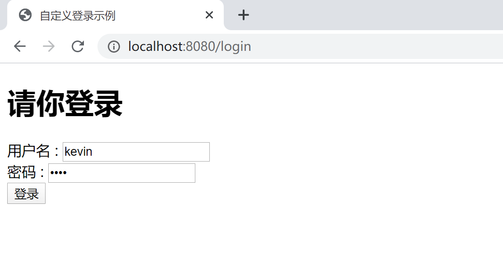

输入错误的用户名，会跳转回登录页面，并且显示错误信息：用户名或密码错。

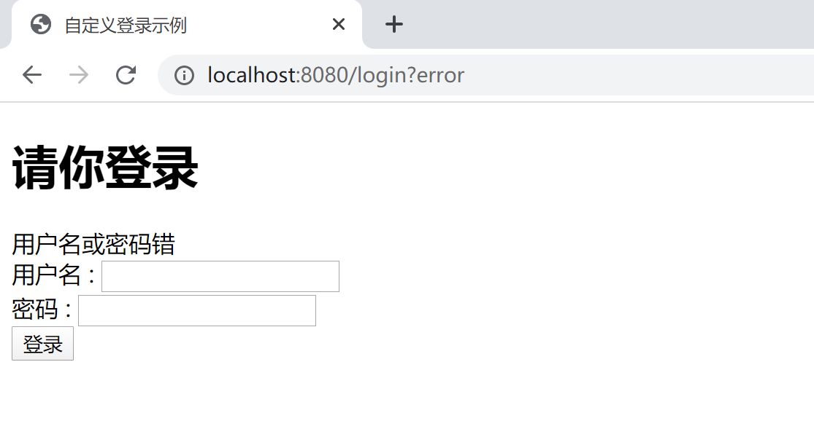

输入正确的用户名和密码，登录后会跳转到首页。

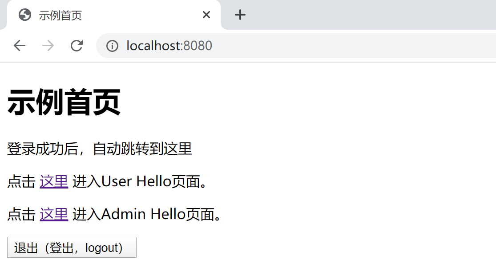

点击User Hello页面的链接，可以正确访问User Hello页面。

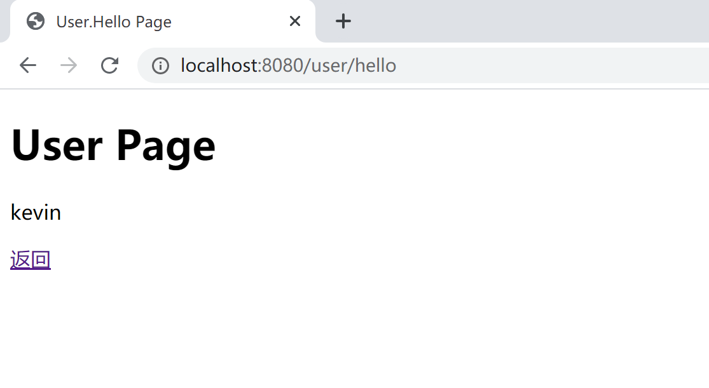

返回首页，后点击Admin Hello页面的链接，由于Kevin用户不具有ADMIN角色，所以不可以访问Admin Hello页面。

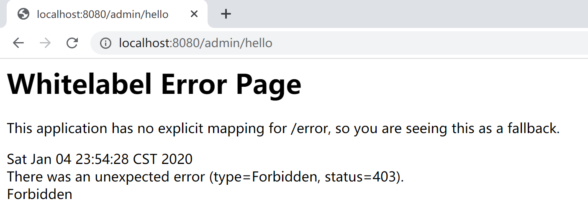

使用roy用户登录（其用户角色为OTHER），既不能访问admin/hello页面，也不能访问user/hello页面，只能访问other/hello页面。当然，admin和kevin用户登录，都可以访问other/hello页面。

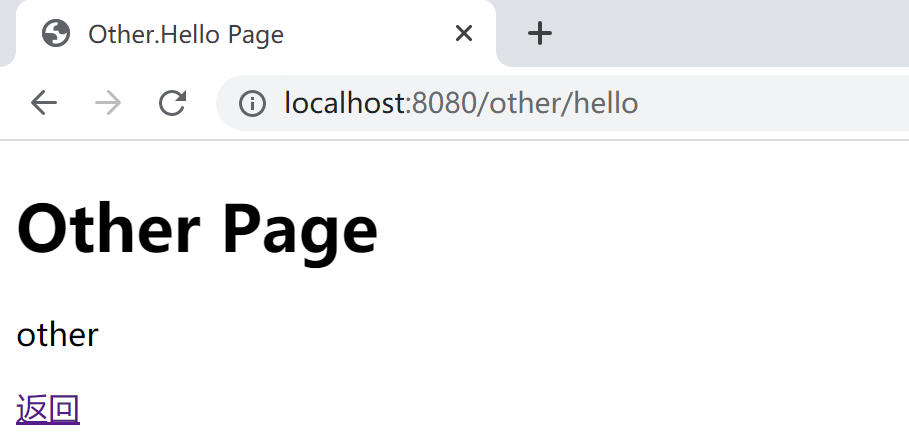

在首页，点击`退出（登出，logout）`按钮，可以正确注销当前登录。

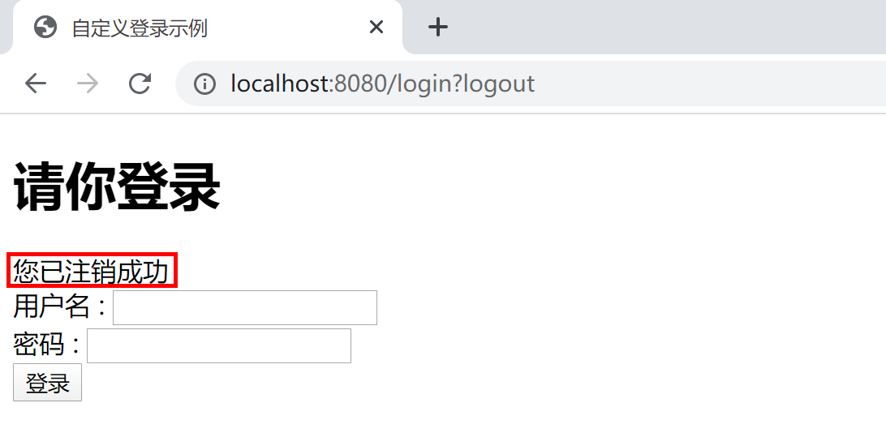

以上测试，符合项目权限控制预期。

> 本小节示例项目代码：
>
> [https://github.com/gyzhang/SpringBootCourseCode/tree/master/spring-boot-security](https://github.com/gyzhang/SpringBootCourseCode/tree/master/spring-boot-security)

### 12.2.5 基于数据库的认证

在我们实际的工作中，几乎所有的认证授权，都是基于数据库中存储的用户授权数据来的完成的。

在Spring Security中，通过`org.springframework.security.core.userdetails.UserDetails`l和`org.springframework.security.core.userdetails.UserDetailsService`两个接口完成程序定义（在这两个接口的实现类中访问数据库中的数据）的用户服务，然后通过`AuthenticationManagerBuilder.userDetailsService(customUserService())`将我们通过数据库存储的用户角色（授权）连接到Spring Security，完成用户认证与授权（Authentication和Authorization）。

```java
@Bean
UserDetailsService customUserService() { // 注册UserDetailsService 的bean
    return new CustomUserDetailsService();
}
@Bean
PasswordEncoder passwordEncoder() {
    PasswordEncoder encoder = new BCryptPasswordEncoder();
    return encoder;
}

@Override
public void configure(AuthenticationManagerBuilder auth) throws Exception {
    auth.userDetailsService(customUserService()).passwordEncoder(passwordEncoder());
}
```

本小节，我们使用MySQL数据库，通过MyBatis来学习如何基于数据库来支持Spring Security的用户认证。

创建项目，添加数据库及Spring Security相关的启动器依赖。

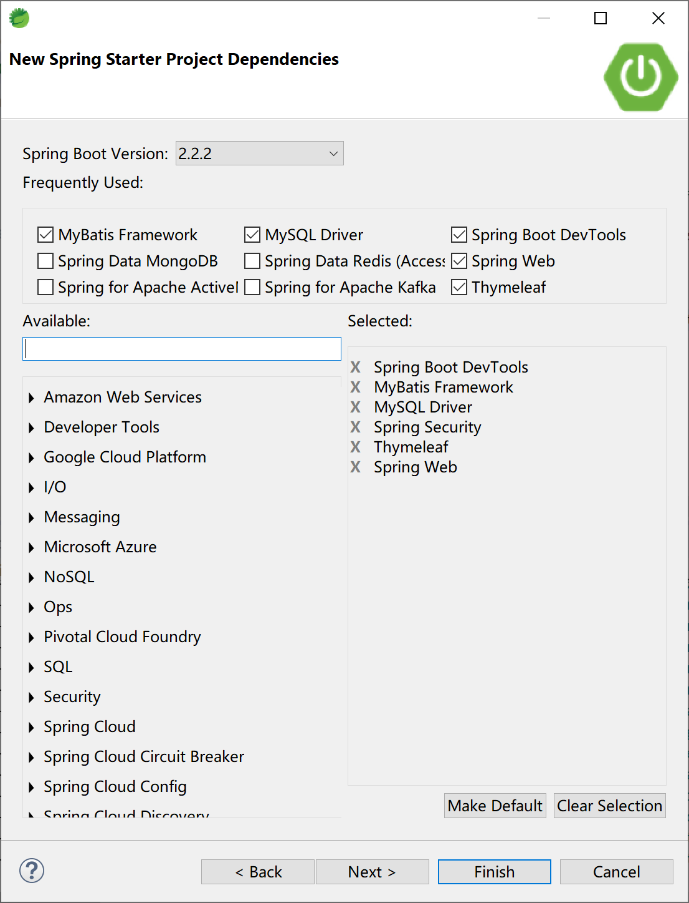

项目的pom依赖为：

```xml
<dependency>
    <groupId>org.springframework.boot</groupId>
    <artifactId>spring-boot-starter-security</artifactId>
</dependency>
<dependency>
    <groupId>org.springframework.boot</groupId>
    <artifactId>spring-boot-starter-thymeleaf</artifactId>
</dependency>
<dependency>
    <groupId>org.springframework.boot</groupId>
    <artifactId>spring-boot-starter-web</artifactId>
</dependency>
<dependency>
    <groupId>org.mybatis.spring.boot</groupId>
    <artifactId>mybatis-spring-boot-starter</artifactId>
    <version>2.1.1</version>
</dependency>

<dependency>
    <groupId>org.springframework.boot</groupId>
    <artifactId>spring-boot-devtools</artifactId>
    <scope>runtime</scope>
    <optional>true</optional>
</dependency>
<dependency>
    <groupId>mysql</groupId>
    <artifactId>mysql-connector-java</artifactId>
    <scope>runtime</scope>
</dependency>
```

项目的application.yml文件中配置数据库连接及MyBatis属性。

```yaml
# mysql数据源配置
spring:
  datasource:
    url: jdbc:mysql://localhost:3306/ssdemo?useUnicode=true&characterEncoding=utf-8&serverTimezone=GMT%2B8
    username: root
    password: 123456
    driver-class-name: com.mysql.cj.jdbc.Driver
# mybatis 配置信息
mybatis:
  mapper-locations: classpath:mapping/*Mapper.xml
  type-aliases-package: com.example.security.db.entity
  configuration:
    map-underscore-to-camel-case: true
```

> `mybatis.configuration.map-underscore-to-camel-case=true`是打开字段下划线和java实体类中属性“驼峰命名”之间的映射。例如role_code字段自动映射为roleCode，反之亦然。

#### 12.2.5.1 创建数据库表

基于最简学习案例原则，设计的数据库表（用户、角色和用户角色关联表）只包含最少的字段。

```sql
drop table if exists sys_role;

drop table if exists sys_user;

drop table if exists sys_user_role;

/*==============================================================*/
/* Table: sys_role                                              */
/*==============================================================*/
create table sys_role
(
   role_code            varchar(64) not null,
   role_name            varchar(64),
   primary key (role_code)
);

/*==============================================================*/
/* Table: sys_user                                              */
/*==============================================================*/
create table sys_user
(
   username             varchar(64) not null,
   password             varchar(64),
   primary key (username)
);

/*==============================================================*/
/* Table: sys_user_role                                         */
/*==============================================================*/
create table sys_user_role
(
   id                   varchar(64) not null,
   username             varchar(64),
   role_code            varchar(64),
   primary key (id)
);

alter table sys_user_role add constraint FK_Reference_1 foreign key (username)
      references sys_user (username) on delete restrict on update restrict;

alter table sys_user_role add constraint FK_Reference_2 foreign key (role_code)
      references sys_role (role_code) on delete restrict on update restrict;
```

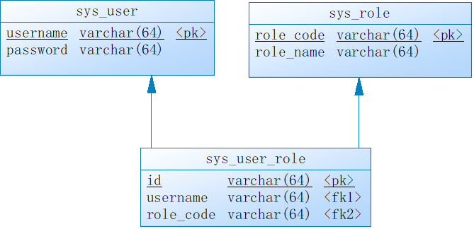

在3张表中插入一些测试数据。

```sql
INSERT INTO `sys_user` VALUES ('admin', 'admin');
INSERT INTO `sys_user` VALUES ('kevin', '6998');
INSERT INTO `sys_user` VALUES ('roy', '3525');

INSERT INTO `sys_role` VALUES ('ROLE_ADMIN', '管理角色');
INSERT INTO `sys_role` VALUES ('ROLE_OTHER', '其他角色');
INSERT INTO `sys_role` VALUES ('ROLE_USER', '用户角色');

INSERT INTO `sys_user_role` VALUES ('1', 'admin', 'ROLE_ADMIN');
INSERT INTO `sys_user_role` VALUES ('2', 'admin', 'ROLE_USER');
INSERT INTO `sys_user_role` VALUES ('3', 'kevin', 'ROLE_USER');
INSERT INTO `sys_user_role` VALUES ('4', 'roy', 'ROLE_OTHER');
```

#### 12.2.5.2 创建实体类

根据数据库设计，创建3个实体类，供后续MyBatis输出据库操作用。

创建SysUser实体类（对应sys_user表）。

```java
package com.example.security.db.entity;

public class SysUser {

	private String username;
	private String password;
	
	public String getUsername() {
		return username;
	}
	public void setUsername(String username) {
		this.username = username;
	}
	public String getPassword() {
		return password;
	}
	public void setPassword(String password) {
		this.password = password;
	}
	
}
```

创建SysRole实体类（对应sys_role表）。

```java
package com.example.security.db.entity;

public class SysRole {
	
	private String roleCode;
	private String roleName;
	
	public String getRoleCode() {
		return roleCode;
	}
	public void setRoleCode(String roleCode) {
		this.roleCode = roleCode;
	}
	public String getRoleName() {
		return roleName;
	}
	public void setRoleName(String roleName) {
		this.roleName = roleName;
	}	

}
```

创建SysUserRole实体类（对应sys_user_role表）。

```java
package com.example.security.db.entity;

public class SysUserRole {
	
	private String id;
	private String username;
	private String roleCode;
	
	public String getId() {
		return id;
	}
	public void setId(String id) {
		this.id = id;
	}
	public String getUsername() {
		return username;
	}
	public void setUsername(String username) {
		this.username = username;
	}
	public String getRoleCode() {
		return roleCode;
	}
	public void setRoleCode(String roleCode) {
		this.roleCode = roleCode;
	}
	
}
```

#### 12.2.5.3 创建DAO

最简起见，我们创建SysUser和SysUserRole对应的DAO（mapper）。

SysUser的mapper.xml：

```xml
<?xml version="1.0" encoding="UTF-8"?>
<!DOCTYPE mapper PUBLIC "-//mybatis.org//DTD Mapper 3.0//EN" "http://mybatis.org/dtd/mybatis-3-mapper.dtd">
<mapper namespace="com.example.security.db.mapper.SysUserMapper">

    <select id="selectSysUser" resultType="SysUser">
        select * from sys_user where username = #{username}
    </select>
    
</mapper>
```

SysUser的Mapper：

```java
package com.example.security.db.mapper;

import org.springframework.stereotype.Repository;

import com.example.security.db.entity.SysUser;

@Repository
public interface SysUserMapper {

	SysUser selectSysUser(String username);

}
```

SysUserRole的mapper.xml：

```xml
<?xml version="1.0" encoding="UTF-8"?>
<!DOCTYPE mapper PUBLIC "-//mybatis.org//DTD Mapper 3.0//EN" "http://mybatis.org/dtd/mybatis-3-mapper.dtd">
<mapper namespace="com.example.security.db.mapper.SysUserRoleMapper">

    <select id="selectSysUserRole" resultType="SysUserRole">
        select * from sys_user_role where username = #{username}
    </select>
    
</mapper>
```

SysUserRole的Mapper：

```java
package com.example.security.db.mapper;

import java.util.List;

import org.springframework.stereotype.Repository;

import com.example.security.db.entity.SysUserRole;

@Repository
public interface SysUserRoleMapper {

	List<SysUserRole> selectSysUserRole(String username);

}
```

以上两个mapper，完成用户的用户角色关系这两张表的访问。

#### 12.2.5.4 创建CustomUserService

CustomUserService实现`org.springframework.security.core.userdetails.UserDetailsService`接口，完成用户及用户所拥有的角色信息从数据库中获取的功能。

创建CustomUserService类：

```java
package com.example.security.db.service;

import java.util.ArrayList;
import java.util.List;

import org.springframework.beans.factory.annotation.Autowired;
import org.springframework.security.core.authority.SimpleGrantedAuthority;
import org.springframework.security.core.userdetails.User;
import org.springframework.security.core.userdetails.UserDetails;
import org.springframework.security.core.userdetails.UserDetailsService;
import org.springframework.security.core.userdetails.UsernameNotFoundException;

import com.example.security.db.entity.SysUser;
import com.example.security.db.entity.SysUserRole;
import com.example.security.db.mapper.SysUserMapper;
import com.example.security.db.mapper.SysUserRoleMapper;

public class CustomUserService implements UserDetailsService {
	@Autowired
	SysUserMapper sysUserMapper;
	@Autowired
	SysUserRoleMapper sysUserRoleMapper;

	@Override
	public UserDetails loadUserByUsername(String username) throws UsernameNotFoundException {
		SysUser sysUser = sysUserMapper.selectSysUser(username);
		String password = sysUser.getPassword();
		List<SysUserRole> sysUserRoles = sysUserRoleMapper.selectSysUserRole(username);
		List<SimpleGrantedAuthority> authorities = new ArrayList<>();
		for (SysUserRole sysUserRole : sysUserRoles) {
			authorities.add(new SimpleGrantedAuthority(sysUserRole.getRoleCode()));
		}

		return new User(username, password, authorities);
	}

}
```

#### 12.2.5.5 创建Controller

按照上一小节创建页面访问的控制器PagesController：

```java
package com.example.security.db.controller;

import org.springframework.stereotype.Controller;
import org.springframework.web.bind.annotation.RequestMapping;
import org.springframework.web.bind.annotation.RequestMethod;
import org.springframework.web.servlet.ModelAndView;

@Controller
public class PagesController {

	@RequestMapping("/index")
	public String index() {
		return "/index";
	}

	@RequestMapping(value = "/login", method = RequestMethod.GET)
	public String login() {
		return "/login";
	}

	@RequestMapping("/admin/hello")
	public ModelAndView adminHello() {
		ModelAndView mv = new ModelAndView();
		mv.addObject("user", "admin");
		mv.setViewName("/admin/hello");
		return mv;
	}

	@RequestMapping("/user/hello")
	public ModelAndView userHello() {
		ModelAndView mv = new ModelAndView();
		mv.addObject("user", "kevin");
		mv.setViewName("/user/hello");
		return mv;
	}

	@RequestMapping("/other/hello")
	public ModelAndView otherHello() {
		ModelAndView mv = new ModelAndView();
		mv.addObject("user", "other");
		mv.setViewName("/other/hello");
		return mv;
	}

}
```

#### 12.2.5.6 Thymeleaf页面

复用上一小节（12.2.4）中的Thymeleaf页面。

#### 12.2.5.7 Spring Security配置

创建配置类SecurityConfiguration，其中关键的一句代码（将数据库访问用户信息的CustomUserService类注入）是`auth.userDetailsService(customUserService()); `

```java
package com.example.security.db.config;

import org.springframework.context.annotation.Bean;
import org.springframework.context.annotation.Configuration;
import org.springframework.security.config.annotation.authentication.builders.AuthenticationManagerBuilder;
import org.springframework.security.config.annotation.web.builders.HttpSecurity;
import org.springframework.security.config.annotation.web.builders.WebSecurity;
import org.springframework.security.config.annotation.web.configuration.EnableWebSecurity;
import org.springframework.security.config.annotation.web.configuration.WebSecurityConfigurerAdapter;
import org.springframework.security.core.userdetails.UserDetailsService;
import org.springframework.security.crypto.bcrypt.BCryptPasswordEncoder;
import org.springframework.security.crypto.password.NoOpPasswordEncoder;
import org.springframework.security.crypto.password.PasswordEncoder;

import com.example.security.db.service.CustomUserService;

@Configuration
@EnableWebSecurity
public class SecurityConfiguration extends WebSecurityConfigurerAdapter {
	
	@Bean
	PasswordEncoder passwordEncoder() {
		return NoOpPasswordEncoder.getInstance();
	}	
	
	@Bean
    UserDetailsService customUserService(){
        return new CustomUserService();
    }
	
	@Override
	protected void configure(AuthenticationManagerBuilder auth) throws Exception {
		auth.userDetailsService(customUserService()); 
	}
	
	@Override
	protected void configure(HttpSecurity http) throws Exception {
		http.formLogin()
			.loginPage("/login")
			.usernameParameter("login_username")
			.passwordParameter("login_password")
			.failureUrl("/login?error")
			.defaultSuccessUrl("/index")
			.permitAll()
		.and().logout()
			.logoutUrl("/logout")
			.logoutSuccessUrl("/login?logout")
			.clearAuthentication(true)
			.invalidateHttpSession(true)
			.permitAll()
		.and().authorizeRequests()
			.antMatchers("/admin/**").hasRole("ADMIN")
			.antMatchers("/user/**").hasRole("USER")
			.anyRequest()
			.authenticated();
	}
	
	@Override
    public void configure(WebSecurity web) {
		web.ignoring().antMatchers("/config/**", "/css/**", "/images/**", "/js/**");
    }
	
}
```

> 在学习过程中为了方便往数据库中录入用户密码信息（明文），所以上面的配置中使用了NoOpPasswordEncoder这个奇葩的密码编码器，一如既往地强调：严禁在非学习系统中使用这个（明文的）密码编码器。
>
> Spring Security配置中使用角色默认前缀为“ROLE_”，例如使用角色“ADMIN”，在数据库表中应该存储为“ROLE_ADMIN”。参考`org.springframework.security.access.vote.RoleVoter`类中的`rolePrefix`属性。

#### 12.2.5.8 启动类

启动类中别忘了MyBatis的@MapperScan注解。

```java
package com.example.security.db;

import org.mybatis.spring.annotation.MapperScan;
import org.springframework.boot.SpringApplication;
import org.springframework.boot.autoconfigure.SpringBootApplication;

@SpringBootApplication
@MapperScan("com.example.security.db.mapper")
public class SpringBootSecurityDbApplication {

	public static void main(String[] args) {
		SpringApplication.run(SpringBootSecurityDbApplication.class, args);
	}

}
```

#### 12.2.5.9 测试

启动项目测试，和上一小节（12.2.4）效果一致。


> 本小节示例项目代码：
> 
> [https://github.com/gyzhang/SpringBootCourseCode/tree/master/spring-boot-security-db](https://github.com/gyzhang/SpringBootCourseCode/tree/master/spring-boot-security-db)