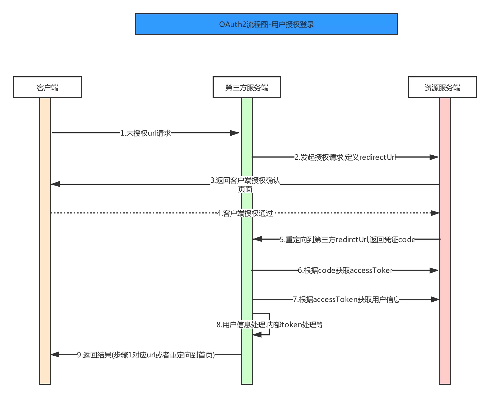

## 12.3 OAuth 2

OAuth（Open Authorization，开放授权）是为用户资源的授权定义了一个安全、开放及简单的标准，第三方无需知道用户的账号及密码，就可获取到用户的授权信息。OAuth 2.0是OAuth协议的延续版本，但不向后兼容。经常用于第三方应用授权登录：在APP或者网页接入一些第三方应用时，时常会需要用户登录另一个合作平台，比如微信，QQ，微博的授权登录，在这种应用场景下，第三方应用就是通过OAuth 2方式获取的用户信息。

