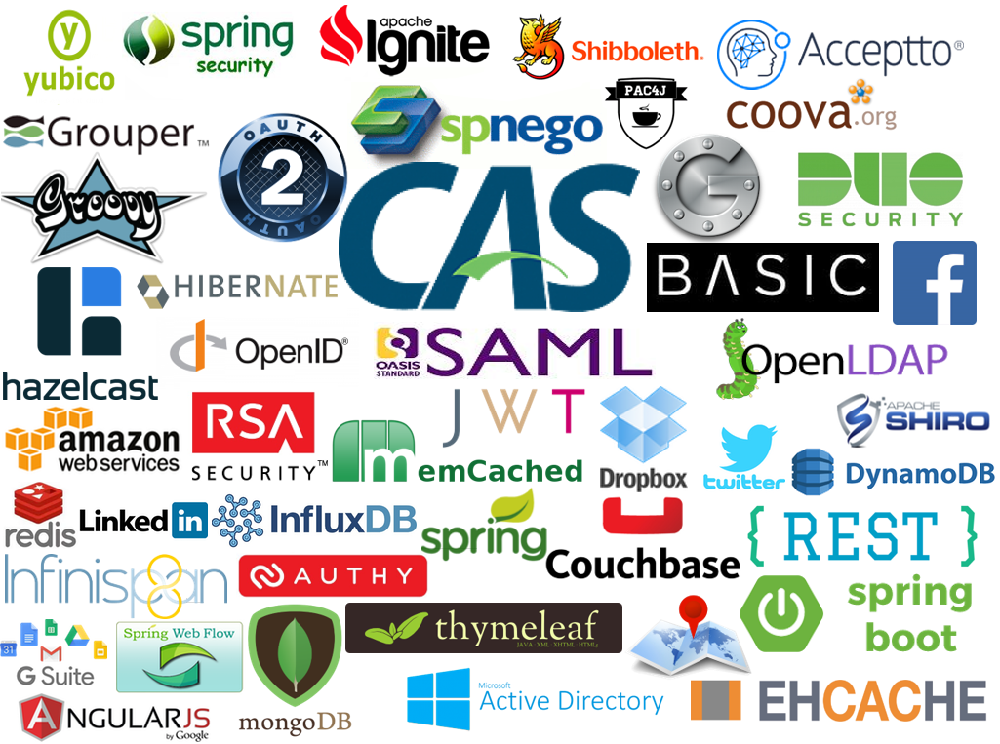
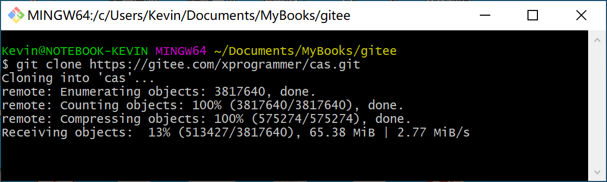
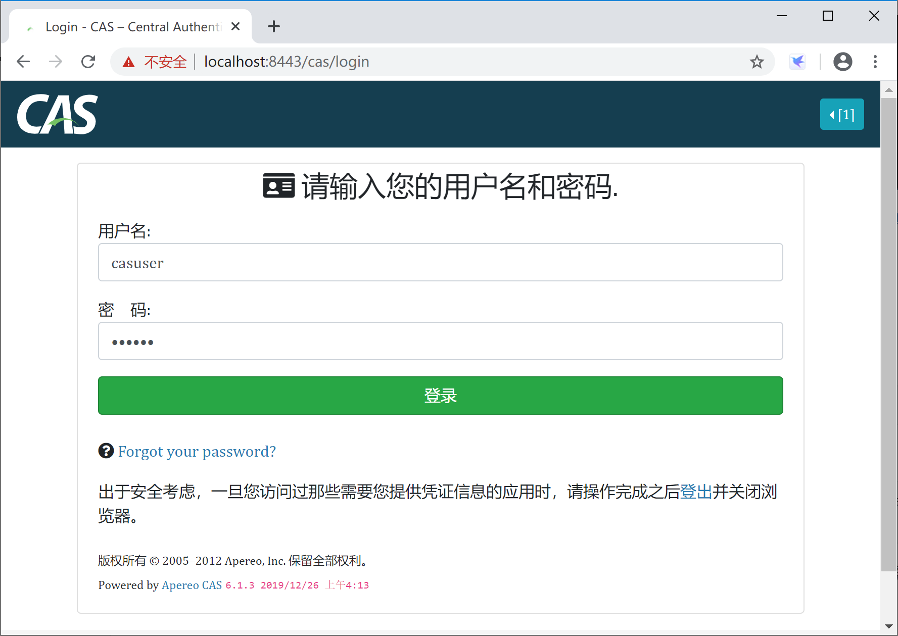
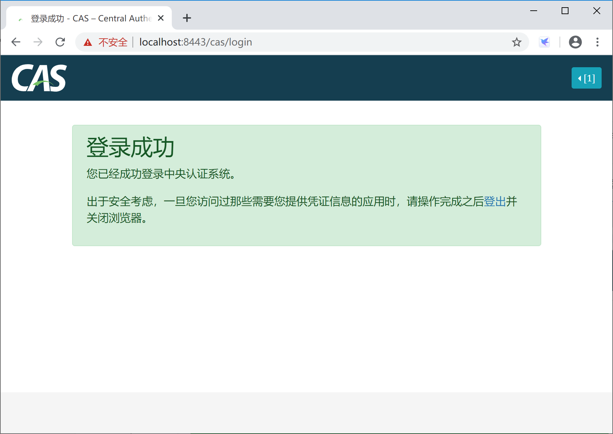
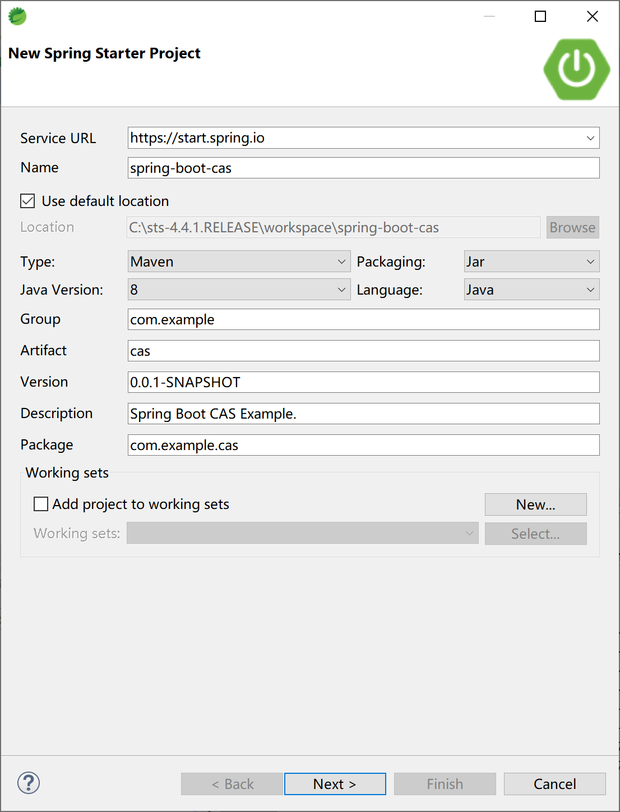
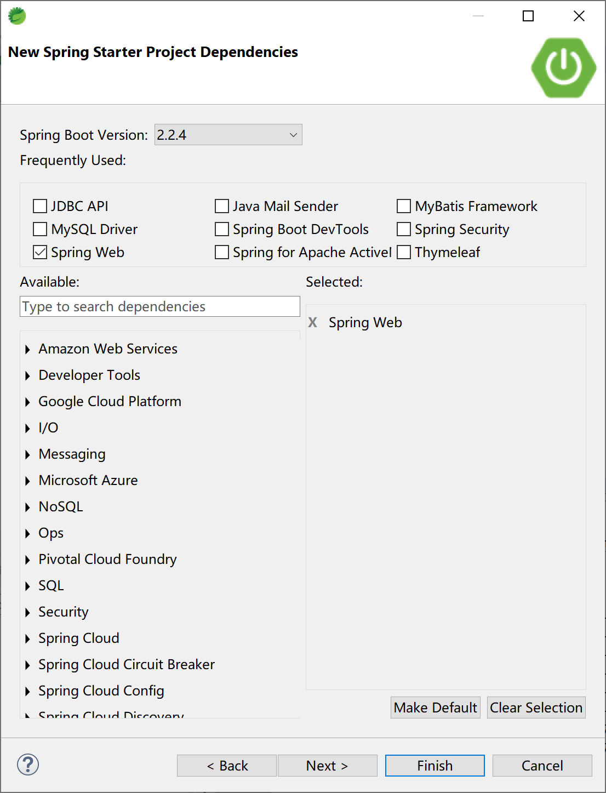

## 12.4 集成CAS单点登录--保留，后续添加

[CAS](https://apereo.github.io/cas/index.html)（Central Authentication Service） 是 Yale 大学发起的一个开源项目，是单点登录的一种实现方式，在全球有着广泛的使用，也和众多的开源软件做了集成。



### 12.4.1 下载部署

当前最新版本[v6.1.4](https://github.com/apereo/cas/releases/tag/v6.1.4)，源码下载地址 https://github.com/apereo/cas/archive/v6.1.4.zip，下载后自行编译。

在官方下载很慢（不支持断点续传，迅雷现在也很难成功）编译也比较麻烦，推荐 gitee 下载或下载 docker image 部署 cas 环境。



> 我在 gitee 上导入了 github 上的官方库，感兴趣的同学可以去这里 [https://gitee.com/xprogrammer/cas](https://gitee.com/xprogrammer/cas) 下载，速度。

这里，我们以 docker 方式下载部署 cas 环境。

首先到 [hub.docker](https://hub.docker.com/r/apereo/cas/) 下载 cas 的 v6.1.3 镜像。

> latest 镜像不能运行，指定 v6.1.3 镜像可运行。

```powershell
docker pull apereo/cas:v6.1.3
```

用 apereo/cas:v6.1.3 镜像创建容器。

```powershell
docker run --name cas -p 8443:8443 -p 8878:8080 apereo/cas:v6.1.3 /bin/sh /cas-overlay/bin/run-cas.sh
```

打开浏览器，访问 https://localhost:8443/cas，使用官方默认用户名 casuser 和默认密码 Mellon 登录。



cas 返回登录成功页面。



====以下不用

这时候，cas 容器中的 tomcat 没有证书，停止容器，制作证书。

```
docker stop cas
```

使用 Java 的 keytool 制作证书。

```powershell
C:\Java\jdk1.8.0_112\bin>keytool -genkey -alias tomcat -keypass goodman -keyalg RSA -keystore server.keystore
输入密钥库口令:
再次输入新口令:
您的名字与姓氏是什么?
  [Unknown]:  Kevin Zhang
您的组织单位名称是什么?
  [Unknown]:  cas.spring.boot.course
您的组织名称是什么?
  [Unknown]:  spring.boot.courese
您所在的城市或区域名称是什么?
  [Unknown]:  ChengDu
您所在的省/市/自治区名称是什么?
  [Unknown]:  SiChuan
该单位的双字母国家/地区代码是什么?
  [Unknown]:  CN
CN=Kevin Zhang, OU=cas.spring.boot.course, O=spring.boot.courese, L=ChengDu, ST=SiChuan, C=CN是否正确?
  [否]:  y
```

拷贝证书到容器中。

```powershell
docker cp server.keystore cas:/etc/cas/thekeystore
```

启动 cas 的 docker 容器。

```powershell
docker start cas
```


### 12.4.2 集成

新建 Spring Boot 项目。



添加 Spring Web 启动器依赖。



在项目的 pom 文件中手动添加 cas 的自动配置依赖。 

```xml
<dependency>
    <groupId>net.unicon.cas</groupId>
    <artifactId>cas-client-autoconfig-support</artifactId>
    <version>2.3.0-GA</version>
</dependency>
```

修改 `C:\Windows\System32\drivers\etc\hosts` 文件，添加两个域名。

```
127.0.0.1 cas.course
127.0.0.1 spring.boot.course
```

添加/修改项目的 application.yml 配置文件，添加如下配置。

```yaml
server:
  port: 8088
cas:
  server-url-prefix: https://cas.course:8443/cas #填CAS服务器的前缀
  server-login-url: https://cas.course:8443/cas/login #填CAS服务器的登录地址
  client-host-url: http://spring.boot.course:8088 #填客户端的访问前缀 spring.boot.course 是在hosts文件中映射到127.0.0.1
```

