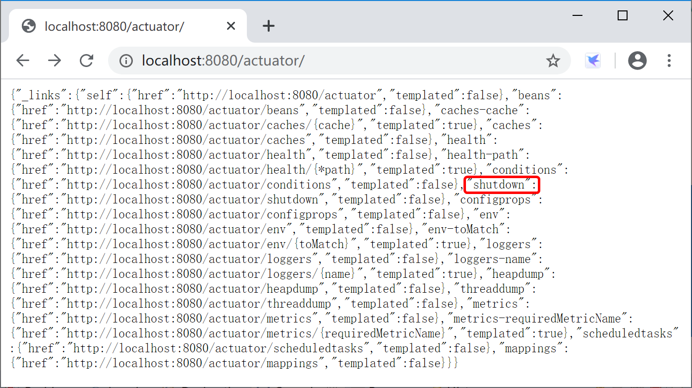

## 13.1 应用监控介绍

Spring Boot包含了许多附加功能，可以帮助你在将应用程序部署到生产环境时监视和管理它。你可以选择使用HTTP端点或与JMX一起管理和监视应用程序。你可以在你的应用程序中收集审计数据、运行状况和度量（如，性能）数据。SpringBoot自带的[监控功能Actuator](https://docs.spring.io/spring-boot/docs/current-SNAPSHOT/reference/html/production-ready-features.html#production-ready)（执行器）组件，就可以帮助开发人员实现对程序内部运行情况的监控，比如监控服务器状况、Bean加载情况、环境变量、日志信息、线程信息等。

> 执行器是一个制造业术语，指的是用于移动或控制东西的一个机械装置，一个很小的改变就能让执行器产生大量的运动。

### 13.1.1 启用Actuator

Spring Boot Actuator模块为应用在生产场景（Production-ready）的监控内置提供了大量的便捷服务。

启动SpringBoot的Actuator模块，最简单的方式就是添加`spring-boot-starter-actuator`启动器（spring boot starter）。

```xml
<dependencies>
    <dependency>
        <groupId>org.springframework.boot</groupId>
        <artifactId>spring-boot-starter-actuator</artifactId>
    </dependency>
</dependencies>
```

### 13.1.2 端点

执行器端点（endpoints）可用于监控应用及与应用进行交互，Spring Boot包含很多内置的端点，你也可以添加自己的。例如，health端点提供了应用的基本健康信息。

每个端点都可以启用或禁用。你可以通过配置文件（application.properties或application.yml）控制是否启用每一个内置的端点。然后，通过JMX或HTTP远程访问这些启用并暴露的端点。端点的ID映射到一个带`/actuator`前缀的URL。例如，health端点默认映射到`/actuator/health`。

> 在Spring Boot 2.2中，默认HTTP上打开的端点只有health和info，其他端点默认关闭。

| id               | 描述                                                         |
| ---------------- | ------------------------------------------------------------ |
| auditevents      | 显示当前应用程序的审计事件信息，需要配置有`AuditEventRepository` Bean |
| beans            | 显示应用中Spring Beans的完整列表                             |
| caches           | 显示可用缓存信息                                             |
| conditions       | 显示自动装配类的状态及及应用信息                             |
| configprops      | 显示所有 @ConfigurationProperties 列表                       |
| env              | 显示 ConfigurableEnvironment 中的属性                        |
| flyway           | 显示 Flyway 数据库迁移信息                                   |
| health           | 显示应用的健康信息（未认证只显示status，认证显示全部信息详情） |
| httptrace        | 显示HTTP跟踪信息（默认显示最后100个HTTP请求 - 响应交换）     |
| info             | 显示任意的应用信息                                           |
| integrationgraph | 显示Spring Integration graph， 需要依赖 spring-integration-core。 |
| loggers          | 显示或修改应用程序内的日志配置。                             |
| liquibase        | 展示Liquibase 数据库迁移                                     |
| metrics          | 展示当前应用的 metrics 信息                                  |
| mappings         | 显示所有 @RequestMapping 路径集列表                          |
| scheduledtasks   | 显示应用程序中的计划任务                                     |
| sessions         | 允许从Spring会话支持的会话存储中检索和删除用户会话。         |
| shutdown         | 允许应用以优雅的方式关闭（默认情况下不启用）                 |
| threaddump       | 执行一个线程dump                                             |

如果你的应用是一个web应用（Spring MVC，Spring WebFlux或者Jersey），你还能使用如下的这几个额外的监控端点：

| ID           | Description                                                  |
| :----------- | :----------------------------------------------------------- |
| `heapdump`   | 返回一个`hprof`堆dump文件。Returns an `hprof` heap dump file. |
| `jolokia`    | 通过HTTP暴露`JMX beans`（当Jolokia在类路径上时，WebFlux不可用）。需要依赖 `jolokia-core`。 |
| `logfile`    | 返回日志文件内容（如果设置了`logging.file.name` or `logging.file.path`属性的话），支持使用HTTP Range头接收日志文件内容的部分信息。 |
| `prometheus` | 以可以被Prometheus服务器抓取的格式显示度量（metrics）信息。需要依赖 `micrometer-registry-prometheus`。 |

### 13.1.3 启用端口

默认情况下，除**shutdown**以外的所有端点均已启用。要配置单个端点的启用，请使用`management.endpoint.<id>.enabled`属性。以下示例启用**shutdown**端点：

```properties
management.endpoint.shutdown.enabled=true
```

另外可以通过`management.endpoints.enabled-by-default`来修改全局端点默认配置，以下示例启用info端点并禁用所有其他端点：

```properties
management.endpoints.enabled-by-default=false
management.endpoint.info.enabled=true
```

需要注意的是，禁用的端点将从应用程序上下文中完全删除。如果您只想更改端点暴露情况，请改为使用`include`和`exclude`属性。

- include属性列出了公开的端点的ID，exclude属性列出了不应该公开的端点的ID；
- exclude属性优先于include属性。包含和排除属性都可以使用端点ID列表进行配置。

```properties
management.endpoints.web.exposure.include=*
management.endpoints.web.exposure.exclude=env,beans
```

由于端点可能包含敏感信息，因此应仔细考虑如何暴露它们。

Spring Boot默认暴露端点情况如下表所示：

| ID                 | JMX  | Web  |
| :----------------- | :--- | :--- |
| `auditevents`      | Yes  | No   |
| `beans`            | Yes  | No   |
| `caches`           | Yes  | No   |
| `conditions`       | Yes  | No   |
| `configprops`      | Yes  | No   |
| `env`              | Yes  | No   |
| `flyway`           | Yes  | No   |
| `health`           | Yes  | Yes  |
| `heapdump`         | N/A  | No   |
| `httptrace`        | Yes  | No   |
| `info`             | Yes  | Yes  |
| `integrationgraph` | Yes  | No   |
| `jolokia`          | N/A  | No   |
| `logfile`          | N/A  | No   |
| `loggers`          | Yes  | No   |
| `liquibase`        | Yes  | No   |
| `metrics`          | Yes  | No   |
| `mappings`         | Yes  | No   |
| `prometheus`       | N/A  | No   |
| `scheduledtasks`   | Yes  | No   |
| `sessions`         | Yes  | No   |
| `shutdown`         | Yes  | No   |
| `threaddump`       | Yes  | No   |

以下为在学习过程中的配置：启用了shutdown端点，暴露除了info之外的所有端口：

```yaml
management:
  endpoint:
    shutdown:
      enabled: true
  endpoints:
    web:
      exposure:
        include: "*"
        exclude:
        - info
```



### 13.1.4 保护端点

我们应该时刻注意保护HTTP端点，其保护方式与使用其他任何敏感网址的方式相同。如果存在Spring Security，则默认使用Spring Security的内容协商策略（content-negotiation strategy）保护端点。例如，如果你希望为HTTP端点配置自定义的安全性，比方说只允许具有特定角色的用户访问它们，Spring Boot提供了一些方便的`RequestMatcher`对象，可以与Spring Security结合使用。

一个典型的Spring Security配置可能看起来像下面的例子：

```java
@Configuration(proxyBeanMethods = false)
public class ActuatorSecurity extends WebSecurityConfigurerAdapter {

    @Override
    protected void configure(HttpSecurity http) throws Exception {
        http.requestMatcher(EndpointRequest.toAnyEndpoint()).authorizeRequests((requests) ->
                requests.anyRequest().hasRole("ENDPOINT_ADMIN"));
        http.httpBasic();
    }

}
```

上例使用`EndpointRequest.toAnyEndpoint()`将请求与所有端点进行匹配，然后确保所有端点都具有**ENDPOINT_ADMIN**角色。

当然，如果我们的应用程序部署在防火墙后面，可能更喜欢所有的执行器端点都可以在无需验证的情况下进行访问。但是也要注意的是，内网有时候也不是很安全，应用程序可能会遇到有意或无意的危险操作。

我们可以通过更改`management.endpoints.web.exposure.include`属性来完成此操作。

```properties
management.endpoints.web.exposure.include=*
```

此外，如果存在Spring Security，则需要添加自定义安全配置，以允许对端点进行未经身份验证的访问，如以下示例所示：

```java
@Configuration(proxyBeanMethods = false)
public class ActuatorSecurity extends WebSecurityConfigurerAdapter {

    @Override
    protected void configure(HttpSecurity http) throws Exception {
        http.requestMatcher(EndpointRequest.toAnyEndpoint()).authorizeRequests((requests) ->
            requests.anyRequest().permitAll());
    }

}
```

