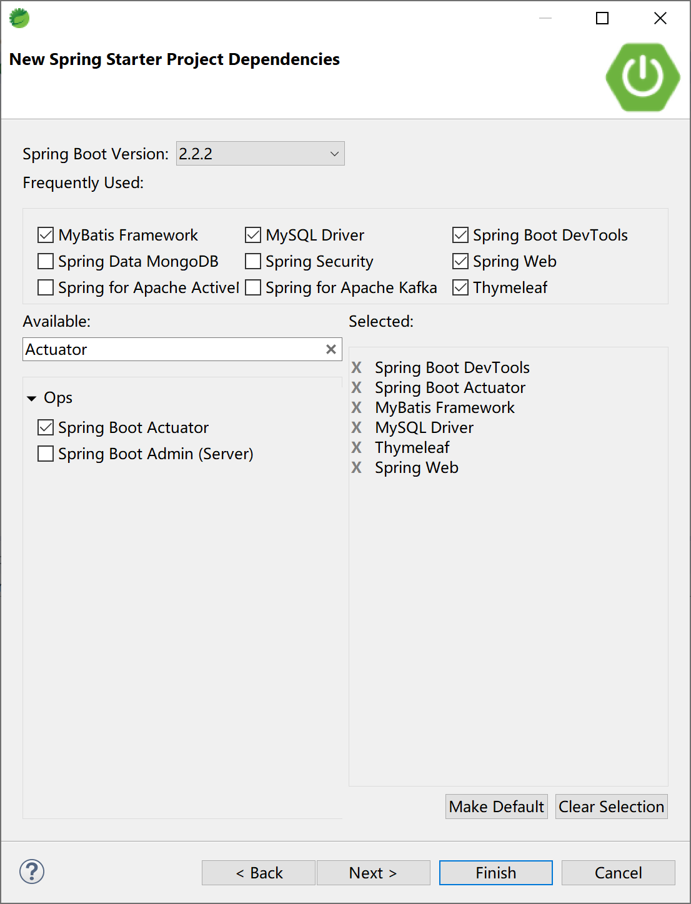
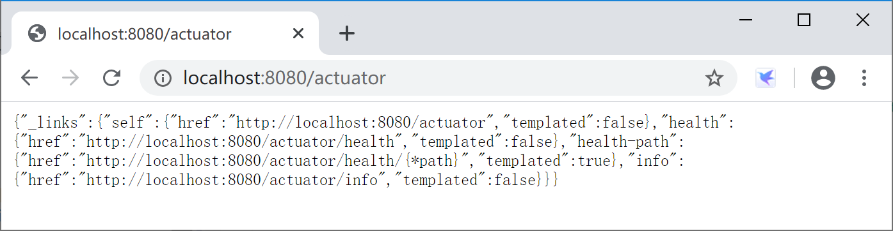
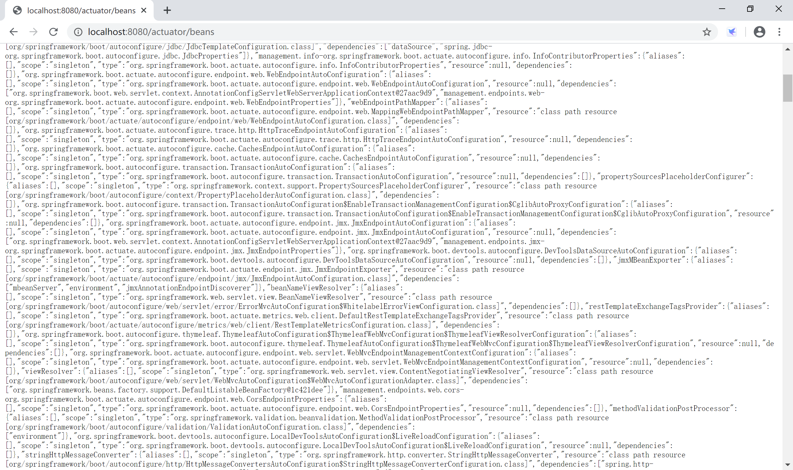
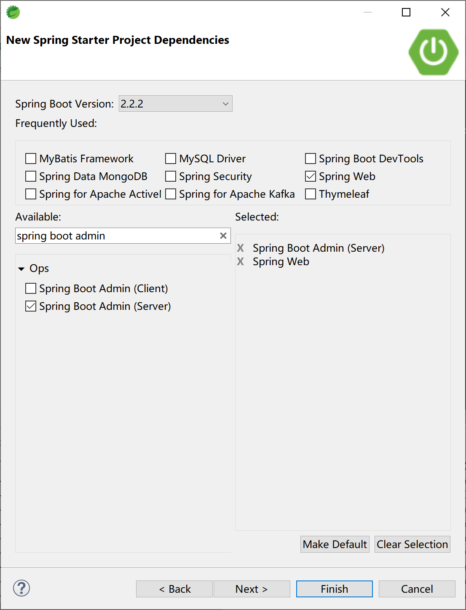
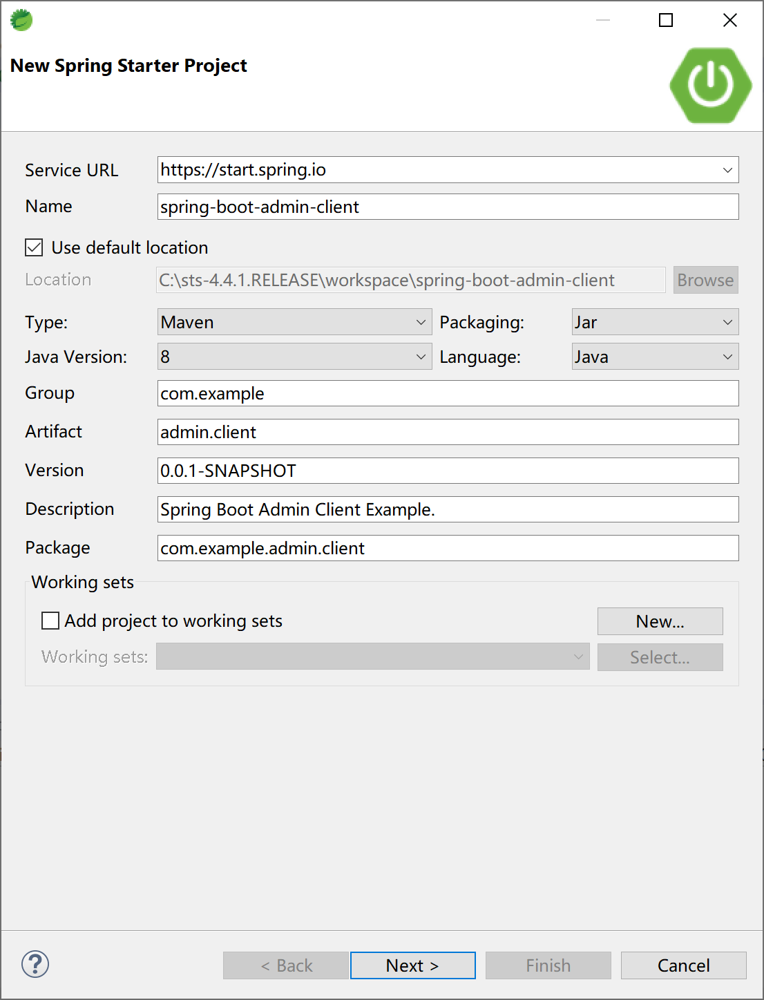
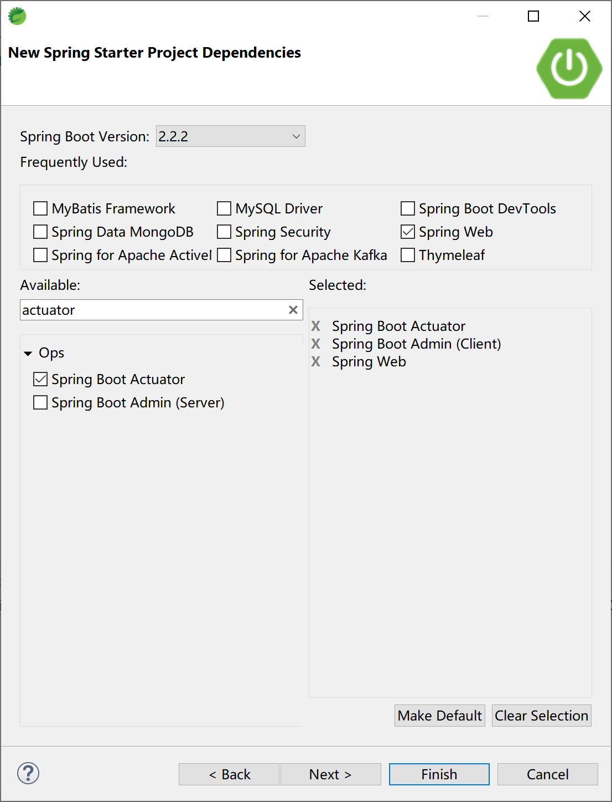
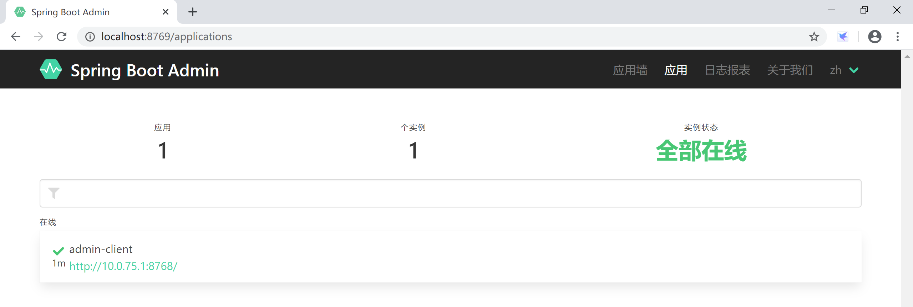
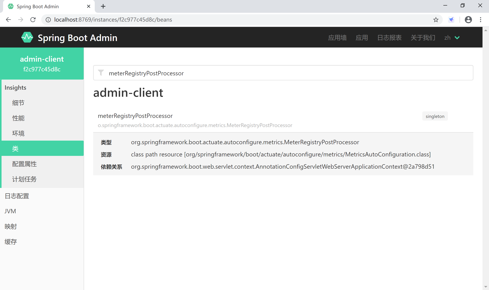

## 13.2 使用应用监控

Spring Boot 应用在启用 Actuator 后，提供了非常原始的监控信息（json 数据），当然我们也可以使用 Spring Boot Admin 来以一种直观的方式监控 Spring Boot 应用中的各种信息。

### 13.2.1 使用 Actuator

创建新的 Spring Boot 应用，引入需要的启动器依赖，特别是`spring-boot-starter-actuator`。



在配置文件 application.yml 中，添加数据库连接及 MyBatis 配置信息。

```yaml
# mysql数据源配置
spring:
  datasource:
    url: jdbc:mysql://localhost:3306/ssdemo?useUnicode=true&characterEncoding=utf-8&serverTimezone=GMT%2B8
    username: root
    password: 123456
    driver-class-name: com.mysql.cj.jdbc.Driver
# mybatis 配置信息
mybatis:
  mapper-locations: classpath:mapping/*Mapper.xml
  type-aliases-package: com.example.actuator.entity
  configuration:
    map-underscore-to-camel-case: true
```

Spring Starter 项目向导生成的项目 pom 依赖配置信息如下，最主要的启动器依赖是`spring-boot-starter-actuator`依赖配置项。

```xml
<dependency>
    <groupId>org.springframework.boot</groupId>
    <artifactId>spring-boot-starter-actuator</artifactId>
</dependency>
<dependency>
    <groupId>org.springframework.boot</groupId>
    <artifactId>spring-boot-starter-thymeleaf</artifactId>
</dependency>
<dependency>
    <groupId>org.springframework.boot</groupId>
    <artifactId>spring-boot-starter-web</artifactId>
</dependency>
<dependency>
    <groupId>org.mybatis.spring.boot</groupId>
    <artifactId>mybatis-spring-boot-starter</artifactId>
    <version>2.1.1</version>
</dependency>

<dependency>
    <groupId>org.springframework.boot</groupId>
    <artifactId>spring-boot-devtools</artifactId>
    <scope>runtime</scope>
    <optional>true</optional>
</dependency>
<dependency>
    <groupId>mysql</groupId>
    <artifactId>mysql-connector-java</artifactId>
    <scope>runtime</scope>
</dependency>
```

根据监控需要，在 application.yml 配置文件中打开除了 info 之外的所有（为了方便学习）监控端点。

```yaml
# Actuator 端口配置
management:
  endpoint:
    shutdown:
      enabled: true
  endpoints:
    web:
      exposure:
        include: "*"
        exclude:
        - info
```

启动应用后，访问[http://localhost:8080/actuator/](http://localhost:8080/actuator/)， 查看监控端点信息。



在浏览器中进一步访问[http://localhost:8080/actuator/beans](http://localhost:8080/actuator/beans) 端点，可以查看应用中注册的所有的 bean。



> 本小节示例项目代码：
> 
> [https://github.com/gyzhang/SpringBootCourseCode/tree/master/spring-boot-actuator](https://github.com/gyzhang/SpringBootCourseCode/tree/master/spring-boot-actuator)

### 13.2.2 使用 Spring Boot Admin

Spring Boot Admin 是一个开源社区项目，用于管理和监控 Spring Boot 应用程序。 应用程序作为 Spring Boot Admin Client 向为 Spring Boot Admin Server 注册（通过 HTTP）或使用 Spring Cloud 注册中心（例如 Eureka，Consul）发现。 UI 是的 AngularJs 应用程序，展示 Spring Boot Admin Client 的 Actuator 端点上的一些监控。常见的功能或者监控如下：

- 显示健康状况
- 显示详细信息，例如
  - JVM 和内存指标
  - micrometer.io 指标
  - 数据源指标
  - 缓存指标
- 显示构建信息编号
- 关注并下载日志文件
- 查看 JVM 系统和环境属性
- 查看 Spring Boot 配置属性
- 支持 Spring Cloud 的 postable / env- 和 / refresh-endpoint
- 轻松的日志级管理
- 与 JMX-beans 交互
- 查看线程转储
- 查看 http 跟踪
- 查看 auditevents
- 查看 http-endpoints
- 查看计划任务
- 查看和删除活动会话（使用 spring-session）
- 查看 Flyway / Liquibase 数据库迁移
- 下载 heapdump
- 状态变更通知（通过电子邮件，Slack，Hipchat，......）
- 状态更改的事件日志（非持久性）

当前 Spring Boot Admin 最新版本为 2.2.1 版。

#### 13.2.2.1 创建服务器端

创建 Spring Boot Admin 监控服务器。


选择 Spring Web 和 Spring Boot Admin Server 启动依赖。



其 pom 依赖文件主要内容如下：

```xml
<dependency>
    <groupId>org.springframework.boot</groupId>
    <artifactId>spring-boot-starter-web</artifactId>
</dependency>
<dependency>
    <groupId>de.codecentric</groupId>
    <artifactId>spring-boot-admin-starter-server</artifactId>
</dependency>
```

在配置文件 application.yml 中设置应用名称和服务器端口。

```yaml
spring:
  application:
    name: admin-server
server:
  port: 8769
```

在启动类中添加 @EnableAdminServer 注解。

```java
package com.example.admin.server;

import org.springframework.boot.SpringApplication;
import org.springframework.boot.autoconfigure.SpringBootApplication;

import de.codecentric.boot.admin.server.config.EnableAdminServer;

@SpringBootApplication
@EnableAdminServer
public class SpringBootAdminServerApplication {

	public static void main(String[] args) {
		SpringApplication.run(SpringBootAdminServerApplication.class, args);
	}

}
```

> 本小节示例项目代码：
> 
> [https://github.com/gyzhang/SpringBootCourseCode/tree/master/spring-boot-admin-server](https://github.com/gyzhang/SpringBootCourseCode/tree/master/spring-boot-admin-server)

#### 13.2.2.2 创建客户端

创建被监控的客户端。



添加 Actuator 和 Spring Boot Admin Client 启动器依赖。



在 application.yml 配置文件中添加 Actuator 配置，打开所有的监控端点。并将监控客户端注册到监控服务器上。

```yaml
spring:
  application:
    name: admin-client
  boot:
    admin:
      client:
        url: http://localhost:8769
server:
  port: 8768

management:
  endpoints:
    web:
      exposure:
        include: '*'
  endpoint:
    health:
      show-details: ALWAYS
```

#### 13.2.2.3 测试验证

依次启动 server 和 client 两个应用，打开浏览器，访问[http://localhost:8769/](http://localhost:8769/) Spring Boot Admin Server，可以看到监控了 1 个客户端。



可以通过 Spring Boot Admin Server 提供的界面，方便地查看 client 应用通过 Actuator 输出的监控数据，相比原生的监控（json）数据友好多了。



> 本小节示例项目代码：
> 
> [https://github.com/gyzhang/SpringBootCourseCode/tree/master/spring-boot-admin-client](https://github.com/gyzhang/SpringBootCourseCode/tree/master/spring-boot-admin-client)
