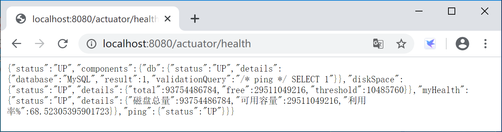
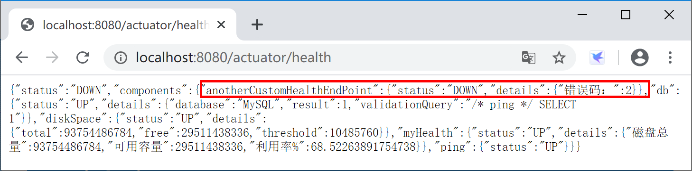
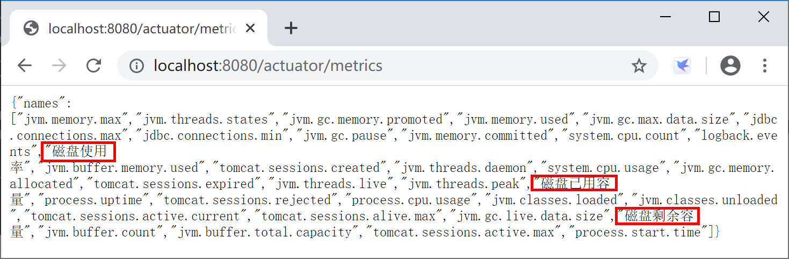
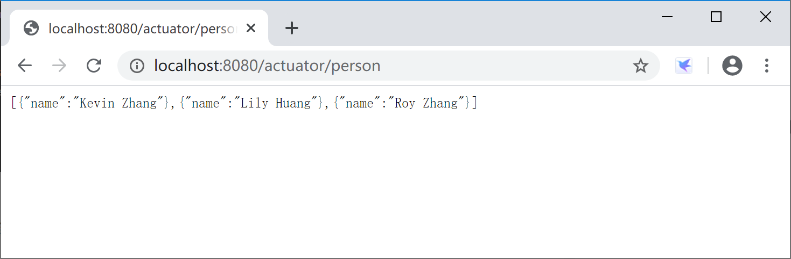
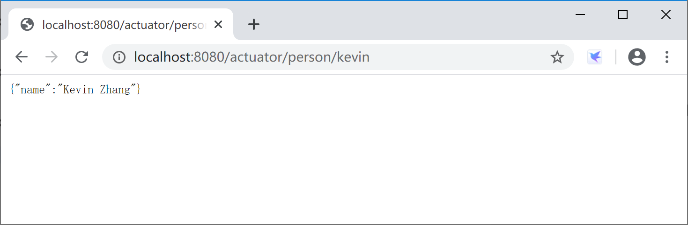

## 13.3 自定义端点

在项目中，我们可能需要根据实际情况来自定义监控端点，特别是一些和业务相关的监控端点。

### 13.3.1 自定义健康监控端点

自定义健康监测的端点有两种方式：

1. 继承 AbstractHealthIndicator 类；
2. 实现 HealthIndicator 接口。

通过查看 HealthIndicator 接口源码，可以看到，系统内置的众多健康检测端点都是从 AbstractHealthIndicator 抽象类继承而来的。


在 **spring-boot-actuator** 项目的 application.yml 配置文件中添加 Actuator 健康监控总是显示详细信息配置。

```yaml
# Actuator 端口配置
management:
  endpoint:
    health:
      show-details: always
```

#### 13.3.1.1 继承 AbstractHealthIndicator 类

创建一个监控端点类 CustomHealthEndPoint 继承 AbstractHealthIndicator 类。

在其中获取磁盘使用信息并输出监控信息。

```java
package com.example.actuator.custom;

import java.io.File;

import org.springframework.boot.actuate.health.AbstractHealthIndicator;
import org.springframework.boot.actuate.health.Health.Builder;
import org.springframework.stereotype.Component;

/**
 * 自定义监控示例，监控磁盘容量
 * @author Kevin
 *
 */
@Component("myHealth")
public class CustomHealthEndPoint extends AbstractHealthIndicator {

	@Override
	protected void doHealthCheck(Builder builder) throws Exception {
		File[] rootFiles = File.listRoots();
		if (rootFiles != null && rootFiles.length != 0) {
			long total = 0, free = 0;
			for (File file : rootFiles) {
				total += file.getTotalSpace(); // 磁盘总量
				free += file.getUsableSpace(); // 可用容量
			}
			long user = total - free; // 已用容量
			double userRate = total == 0 ? 0 : ((double) user / total);// 磁盘利用率
			builder.up()
				.withDetail("磁盘总量", total) // 这里是你要显示的具体健康监测信息
				.withDetail("可用容量", free)
				.withDetail("利用率%", userRate * 100).build();
		} else {
			builder.down().build();
		}
	}

}
```

运行 Spring Boot 应用程序，访问监控监控端点[http://localhost:8080/actuator/health](http://localhost:8080/actuator/health)， 查看自定义监控端点输出的监控信息。



#### 13.3.1.2 实现 HealthIndicator 接口

创建一个 AnotherCustomHealthEndPoint 类，实现 HealthIndicator 接口。实现`public Health health()`方法，在其中生成一个随机数，然后根据这个随机数是否为零来输出健康状态。

```java
package com.example.actuator.custom;

import java.util.Random;

import org.springframework.boot.actuate.health.Health;
import org.springframework.boot.actuate.health.HealthIndicator;
import org.springframework.stereotype.Component;

@Component("anotherCustomHealthEndPoint")
public class AnotherCustomHealthEndPoint implements HealthIndicator {

	@Override
	public Health health() {
        int errorCode = new Random().nextInt(5); // 定义一个错误代码 随机产生
        if (errorCode != 0) {
            return Health.down().withDetail("错误码：", errorCode).build();
        } else {
            return Health.up().withDetail("正确代码：", errorCode).build();
        }
	}

}
```

运行 Spring Boot 应用程序，访问监控监控端点[http://localhost:8080/actuator/health](http://localhost:8080/actuator/health)， 查看自定义监控端点输出的监控信息。



### 13.3.2 自定义 Metrics 端点

自定义 Metrics 是通过实现 MeterBinder 接口完成的。

新建一个 DiskspaceMetrics 类，实现 MeterBinder 接口，代码如下：

```java
package com.example.actuator.custom;

import java.io.File;

import org.springframework.stereotype.Component;

import io.micrometer.core.instrument.Gauge;
import io.micrometer.core.instrument.MeterRegistry;
import io.micrometer.core.instrument.binder.MeterBinder;

@Component("diskspaceMetrics")
public class DiskspaceMetrics implements MeterBinder {
	private File rootFilePath;

	public DiskspaceMetrics() {
		this.rootFilePath = new File(".");
	}

	@Override
	public void bindTo(MeterRegistry registry) {
		Gauge.builder("磁盘已用容量", rootFilePath, File::getTotalSpace).register(registry);
		Gauge.builder("磁盘剩余容量", rootFilePath, File::getFreeSpace).register(registry);
		Gauge.builder("磁盘使用率", rootFilePath, c -> {
			long totalDiskSpace = rootFilePath.getTotalSpace();
			if (totalDiskSpace == 0) {
				return 0.0;
			}
			long usedDiskSpace = totalDiskSpace - rootFilePath.getFreeSpace();
			return (double) usedDiskSpace / totalDiskSpace * 100;
		}).register(registry);
	}

}
```

运行 Spring Boot 应用程序，访问监控监控端点[http://localhost:8080/actuator/metrics](http://localhost:8080/actuator/metrics)， 查看自定义监控端点输出的监控信息。



### 13.3.3 完全自定义端点

我们也可以通过 Spring Boot 提供的 @Endpoint、 @ReadOperation、@WriteOperation、@DeleteOperation 注解完全自定义监控端点，例如和业务运行状态相关的端点。

创建一个 PersonEndpoint 类：

```java
package com.example.actuator.custom;

import java.util.ArrayList;
import java.util.HashMap;
import java.util.List;
import java.util.Map;

import org.springframework.boot.actuate.endpoint.annotation.Endpoint;
import org.springframework.boot.actuate.endpoint.annotation.ReadOperation;
import org.springframework.boot.actuate.endpoint.annotation.Selector;
import org.springframework.boot.actuate.endpoint.annotation.WriteOperation;
import org.springframework.stereotype.Component;

@Endpoint(id = "person")
@Component
public class PersonEndpoint {

	private final Map<String, Person> people = new HashMap<>();

    PersonEndpoint() {
        this.people.put("kevin", new Person("Kevin Zhang"));
        this.people.put("roy", new Person("Roy Zhang"));
        this.people.put("lily", new Person("Lily Huang"));
    }

    @ReadOperation
    public List<Person> getAll() {
        return new ArrayList<>(this.people.values());
    }

    @ReadOperation
    public Person getPerson(@Selector String person) {
        return this.people.get(person);
    }

    @WriteOperation
    public void updatePerson(@Selector String name, String person) {
        this.people.put(name, new Person(person));
    }

    public static class Person {
        private String name;

        Person(String name) {
            this.name = name;
        }

        public String getName() {
            return this.name;
        }

        public void setName(String name) {
            this.name = name;
        }
    }
}
```

运行 Spring Boot 应用程序，访问监控监控端点[http://localhost:8080/actuator/person](http://localhost:8080/actuator/person)， 查看自定义监控端点输出的监控信息。



进一步访问[http://localhost:8080/actuator/person/kevin](http://localhost:8080/actuator/person/kevin)， 查看针对 kevin 用户的监控信息。



> 本小节示例项目代码：
>
> [https://github.com/gyzhang/SpringBootCourseCode/tree/master/spring-boot-actuator](https://github.com/gyzhang/SpringBootCourseCode/tree/master/spring-boot-actuator)
