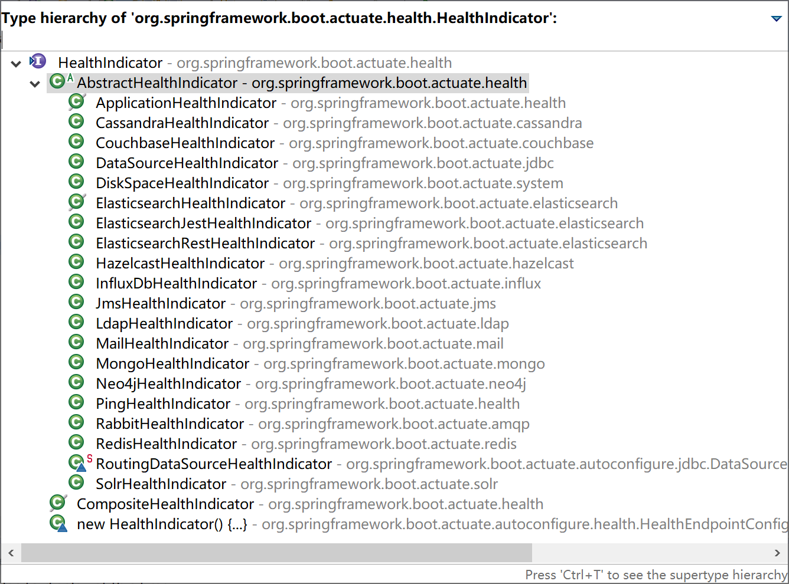

## 13.3 自定义端点

在项目中，我们可能需要根据实际情况来自定义监控端点，特别是一些和业务相关的监控端点。

自定义健康监测的端点有两种方式：

1. 继承AbstractHealthIndicator类；
2. 实现HealthIndicator接口。

通过查看HealthIndicator接口源码，可以看到，系统内置的众多健康检测端点都是从AbstractHealthIndicator抽象类继承而来的。

