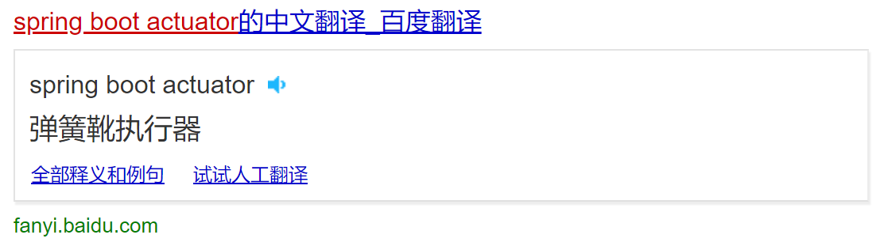

# 第13章 Spring Boot 应用监控

当我们开发的应用程序上线运行后，开发者（或运维人员）需要对其运行情况进行实时监控，在项目出错（或即将出错）时能够自动报警，提醒运维（开发）人员进行处理，以保证业务运行的连续性。

Spring Boot 通过 Actuator（执行器）组件来帮助开发者获取应用运行时的实时数据。这样，我们就可以通过 HTTP 端点（Endpoints）或 JMX 来监控应用程序的状态，例如应用程序的健康情况、应用运行过程中需要输出的业务信息（一般而言，这个级别的监控都是自定义端点）、内存使用情况等。

> 百度的奇葩翻译，倒是歪打正着，**弹簧靴执行器**，蛮有“从光脚到穿靴，弹性应变”的意味，也算是另样的“信达雅”境界了吧。

在本章中，我们首先通过使用 Spring Boot 提供的内置端点来熟悉 Actuator 的监控机制，然后遵循 Spring Boot 规范添加自定义端点，最后学习如何保护这些监控端点 。
