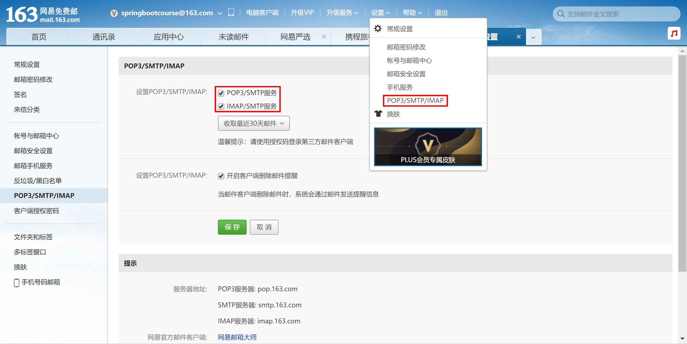
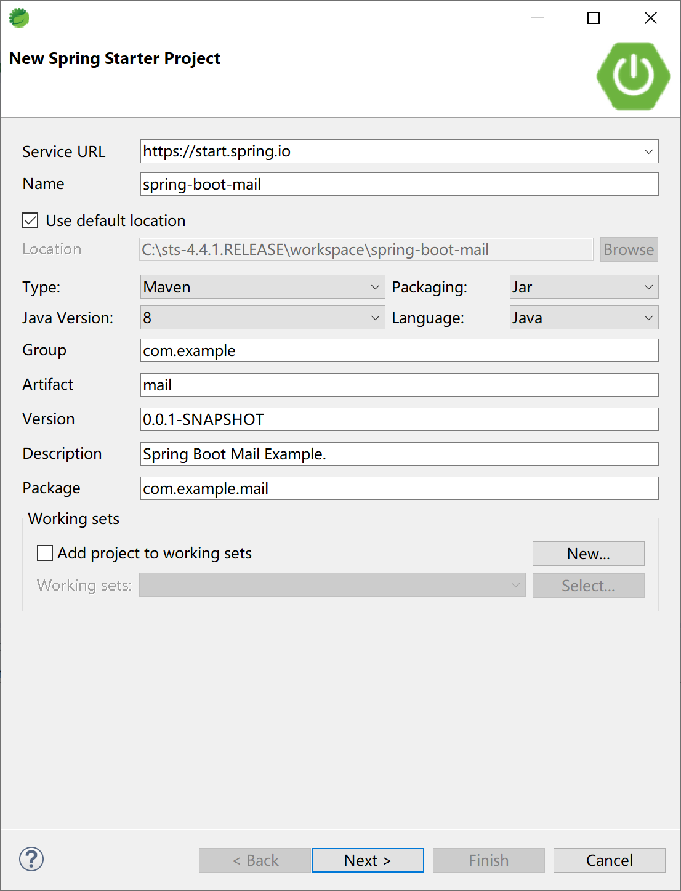
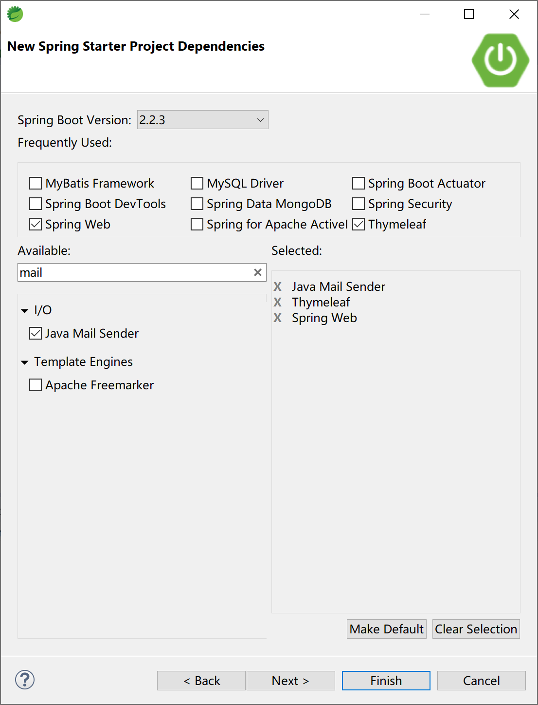
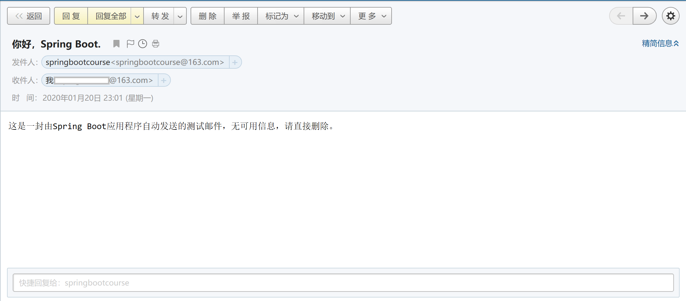

## 14.1 邮件发送

邮件发送，是企业开发中最经常使用到的通用功能，例如用户注册时的身份认证，审批节点任务通知，库存低报警通知邮件等。

Spring提供了`org.springframework.mail.javamail.JavaMailSender`接口（实现类JavaMailSenderImpl）来发送邮件，Spring Boot则提供`spring-boot-starter-mail`起步器依赖来完成邮件发送功能的集成。

### 14.1.1 邮件基本概念

在邮件发送开发中，有一些基本概念，理解这些基本概念，有助于理解如何编写应用代码及配置。

#### 14.1.1.1 SMTP

SMTP全称为Simple Mail Transfer Protocol（简单邮件传输协议），它是一组用于从源地址到目的地址传输邮件的规范，通过它来控制邮件的中转方式。SMTP认证要求必须提供账号和密码才能登陆服务器，其设计目的在于避免用户受到垃圾邮件的侵扰。

SMTP的默认端口为25。

#### 14.1.1.2 IMAP

IMAP全称为Internet Message Access Protocol（互联网邮件访问协议），IMAP允许从邮件服务器上获取邮件的信息、下载邮件等。IMAP与POP类似，都是一种邮件获取协议。

IMAP的默认端口为143。

#### 14.1.1.3 POP3

POP3全称为Post Office Protocol 3（邮局协议），POP3支持客户端远程管理服务器端的邮件。POP3常用于“离线”邮件处理，即允许客户端下载服务器邮件，然后服务器上的邮件将会被删除。目前很多POP3的邮件服务器只提供下载邮件功能，服务器本身并不删除邮件，这种属于改进版的POP3协议。

POP3的默认端口为110。

#### 14.1.1.4 IMAP和POP3的区别

两者最大的区别在于，IMAP允许双向通信，即在客户端的操作会反馈到服务器上，例如在客户端收取邮件、标记已读等操作，服务器会跟着同步这些操作。而对于POP协议虽然也允许客户端下载服务器邮件，但是在客户端的操作并不会同步到服务器上面的，例如在客户端收取或标记已读邮件，服务器不会同步这些操作。

### 14.1.2 注册邮箱

本示例使用163邮箱。

首先，请注册邮箱，例如springbootcourse@163.com，设置登录密码。

然后，通过[https://mail.163.com/](https://mail.163.com/) 登录新注册的163邮箱，设置打开POP3/SMTP等邮件发送接收服务，在设置时会结合手机发送短信验证设置“授权码”。



记录好邮箱账号、密码、授权码及163邮箱服务器地址（pop.163.com，smtp.163.com，imap.163.com）以备在后续代码中配置使用。

### 14.1.3 集成邮件发送

首先，创建Spring Boot应用。



选择Spring Web，Thymeleaf和Java Mail Sender起步器依赖。



示例项目的主要pom依赖如下：

```xml
<dependency>
    <groupId>org.springframework.boot</groupId>
    <artifactId>spring-boot-starter-mail</artifactId>
</dependency>
<dependency>
    <groupId>org.springframework.boot</groupId>
    <artifactId>spring-boot-starter-thymeleaf</artifactId>
</dependency>
<dependency>
    <groupId>org.springframework.boot</groupId>
    <artifactId>spring-boot-starter-web</artifactId>
</dependency>
```

在application.yml文件中配置邮件发送属性：

```yaml
spring:
  mail:
    host: smtp.163.com
    port: 25
    username: springbootcourse@163.com
    password: 授权码，不是邮箱登录密码，切记
    default-encoding: UTF-8
    properties:
      mail: 
       smtp:
        auth: true
        starttls:
          enable: true
          required: true
```

创建发送邮件的服务类SendMailService，在其中封装邮件发送SimpleMailMessage对象。

```java
package com.example.mail.service;

import org.springframework.beans.factory.annotation.Autowired;
import org.springframework.beans.factory.annotation.Value;
import org.springframework.mail.SimpleMailMessage;
import org.springframework.mail.javamail.JavaMailSender;
import org.springframework.stereotype.Service;

@Service
public class SendMailService {
    @Autowired
    private JavaMailSender mailSender;
    
    @Value("${spring.mail.username}")
    private String from;

    public String sendMail(String to, String subject, String text) {
    	SimpleMailMessage message =	new SimpleMailMessage();
    	
    	message.setFrom(from);
    	message.setTo(to);
    	message.setSubject(subject);
    	message.setText(text);
    	
    	mailSender.send(message);
    	
    	return "Mail Sended.";
    }

}
```

创建与用户交互的控制器类SendMailController，为了简单起见，我们不从用户界面上收集邮件信息，直接在sendMail处理器方法中提供接收者，主题和邮件内容。

```java
package com.example.mail.controller;

import org.springframework.beans.factory.annotation.Autowired;
import org.springframework.web.bind.annotation.RequestMapping;
import org.springframework.web.bind.annotation.RestController;

import com.example.mail.service.SendMailService;

@RestController
@RequestMapping("/mail/")
public class SendMailController {
	@Autowired
	private SendMailService sendMailService;

	@RequestMapping("/send")
	public String sendMail() {
		String to = "xxx@163.com";//一个可用的邮件地址
		String subject = "你好，Spring Boot.";
		String text = "这是一封由Spring Boot应用程序自动发送的测试邮件，无可用信息，请直接删除。";
		return sendMailService.sendMail(to, subject, text);
	}

}
```

运行项目，打开浏览器，访问[http://localhost:8080/mail/send](http://localhost:8080/mail/send)，测试发送邮件。


在[https://mail.163.com/](https://mail.163.com/) 上登录接收邮件的用户，查看是否正确收到邮件。



发送HTML格式邮件的参考代码：

```java
public void sendHtmlMail(String subject, String content) {
    //使用MimeMessage，MIME协议
    MimeMessage message = mailSender.createMimeMessage();
    MimeMessageHelper helper;
    //MimeMessageHelper帮助我们设置更丰富的内容
    try {
        helper = new MimeMessageHelper(message, true);
        helper.setFrom(mailConfig.getFrom());
        helper.setTo(mailConfig.getRecipient());
        helper.setSubject("HTML格式邮件");
        helper.setText(content, true);//true代表支持html
        mailSender.send(message);
    } catch (MessagingException e) {//发送HTML邮件失败
        e.printStackTrace();
    }
}
```

发送带附件邮件的参考代码：

```java
public void sendAttachmentMail(String subject, String content, File file) {
    MimeMessage message = mailSender.createMimeMessage();
    MimeMessageHelper helper;
    try {
        helper = new MimeMessageHelper(message, true);//true代表支持多组件，如附件，图片等
        helper.setFrom(mailConfig.getFrom());
        helper.setTo(mailConfig.getRecipient());
        helper.setSubject("带附件的HTML格式邮件");
        helper.setText(content, true);//true代表支持html
        FileSystemResource file1 = new FileSystemResource(file);
        String fileName = file1.getFilename();        
        helper.addAttachment(fileName, file1);//添加附件，可多次调用该方法添加多个附件  
        mailSender.send(message);
    } catch (MessagingException e) {
        e.printStackTrace();
    }
}
```

发送带静态资源（一般指的是图片）的邮件示例代码：

```java
public void sendInlineResourceMail(String subject, String content, String rscPath, String rscId) {
    MimeMessage message = mailSender.createMimeMessage();
    MimeMessageHelper helper;
    try {
        helper = new MimeMessageHelper(message, true);
        helper.setFrom(mailConfig.getFrom());
        helper.setTo(mailConfig.getRecipient());
        helper.setSubject("静态资源邮件");
        helper.setText(content, true);
        FileSystemResource res = new FileSystemResource(new File(rscPath));
        helper.addInline(rscId, res);//重复使用添加多个图片
        mailSender.send(message);
    } catch (MessagingException e) {
        e.printStackTrace();
    }
}
```

> 本小节示例项目代码：
> 
> [https://github.com/gyzhang/SpringBootCourseCode/tree/master/spring-boot-mail](https://github.com/gyzhang/SpringBootCourseCode/tree/master/spring-boot-mail)