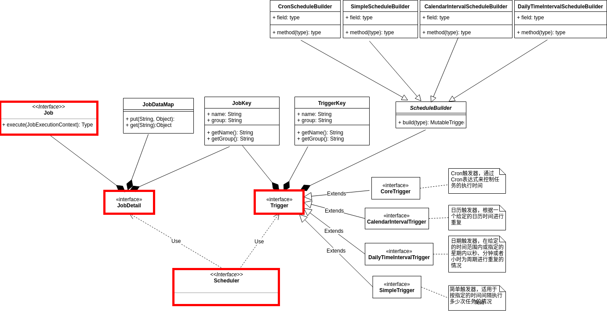
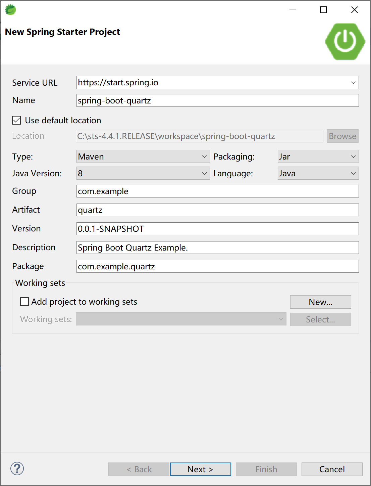
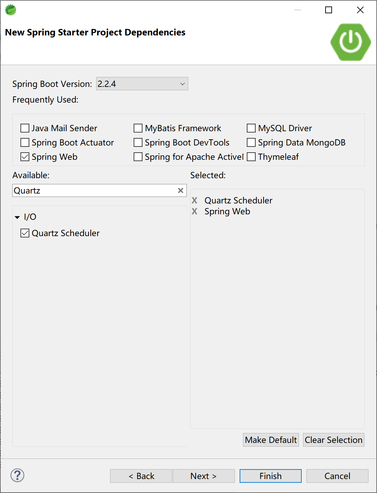
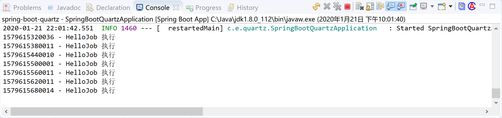
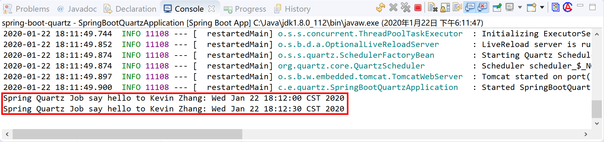

## 14.2 定时任务

在Java领域中，调度（Schedule）定时任务可以简单的在Spring 框架中使用注解`@Scheduled`来完成，比如 `@Scheduled(cron = "0 0/10 * * * ?")`，也可以使用专用的调度框架。

常用的调度框架有[Quartz](http://www.quartz-scheduler.org/)、[Elastic-Job](http://elasticjob.io/)和[xxl-job](https://github.com/xuxueli/xxl-job)。

- **Quartz：**Java上的定时任务标准。但Quartz关注点在于定时任务而非数据，并无一套根据数据处理而定制化的流程。虽然Quartz可以基于数据库实现作业的高可用，但缺少分布式并行调度的功能。当前版本2.3.0，官方组织持续更新中。
- **Elastic-Job：**当当开发的弹性分布式任务调度系统，功能丰富强大，采用zookeeper实现分布式协调，实现任务高可用以及分片，目前是版本2.1.5，并且可以支持云开发。
- **xxl-job：**是大众点评员工徐雪里于2015年发布的分布式任务调度平台，其核心设计目标是开发迅速、学习简单、轻量级、易扩展。当前版本2.1.2，并在持续更新中。

本小节介绍这3种调度框架，并做简单对比，然后学习如何在Spring Boot中集成Quartz调度框架。其他两种分布式调度框架，请读者阅读官方文档和示例。

### 14.2.1 Quartz

Quartz是用来实现定时任务的一个框架。

- Quart的定时任务可以随时修改。即使任务已经在调度系统中了。你还是可以随时去改变任务的实行时间(@scheduled实现该功能就比较麻烦了)。
- 服务重启之后Quartz的任务会自动拉起来，自动在调度系统里面根据触发器设置的时间执行。
- Quartz支持集群(多台服务器部署了quartz任务，只有有一台服务器执行。而且一台服务器挂了相应的会转到其他服务器执行)。

Quartz种最重要的类是Scheduler、Job 、JobDetail、Trigger这四个类。



Scheduler 调度程序，只有安排进执行计划的Job（通过 scheduler.scheduleJob 方法安排），才有可能被调度执行。

常用的cron表达式参考，供读者选择使用。

```
0 0 12 * * ? 每天12点执行 
0 15 10 ? * * 每天的10:15执行 
0 15 10 * * ? 每天的10:15执行 
0 15 10 * * ? * 每天的10:15执行 
0 15 10 * * ? 2005 2005年每天的10:15执行 
0 * 14 * * ? 每天的14:00到14:59期间每分钟执行 
0 0/5 14 * * ? 每天的14:00到14:55每隔5分钟执行 
0 0/5 14,18 * * ? 每天的14:00到14:55每隔5分钟执行和18:00到18:55每隔5分钟执行 
0 0-5 14 * * ? 每天的14:00到14:05执行 
0 10,44 14 ? 3 WED 三月的每一个周三的14:10和14:44执行 
0 15 10 ? * MON-FRI 工作日每天的10:15:00执行 
0 15 10 15 * ? 每个月的第15天的10:15:00执行 
0 15 10 L * ? 每个月最后一天的10:15:00执行 
0 15 10 ? * 6L 每个月最后一个周五的10:15:00执行 
0 15 10 ? * 6L 2002-2005 2002, 2003, 2004, 和2005年每个月最后一个周五的10:15:00执行 
0 15 10 ? * 6#3 每个月的第三个周五的10:15:00执行 
0 0 12 1/5 * ? 每个月的第一天的12:00:00开始执行，每隔5天间隔执行 
0 11 11 11 11 ? 每年的11月11日11:11:00执行
```

#### 14.2.1.1 Job

Job用于定义任务具体的逻辑。简单来说就是用来定义定时任务需要干的事情。比如我们想每天早上10点给某某人发一封邮件。Job干的事情就是发邮件的事情。每个任务对应一个Job（我们一般会自定义一个Job，继承QuartzJobBean，通过实现里面的executeInternal方法实现具体的任务逻辑）。这样调度器(Scheduler)会根据触发器(Trigger)设置的时间调度这个任务（Job）执行其中的业务逻辑。

在Job类里面怎么获取到外部参数呢？

首先我们会在定义任务详情的时候给这个Job的JobDataMap属性里面设置一些参数。

然后在Job执行的时候，我们通过`JobDataMap jobDataMap = jobExecutionContext.getMergedJobDataMap();`获取到JobDataMap，取出相应的参数了。

```java
/**
 * 模拟任务：定时发送邮件任务
 */
public class SendEmailJob extends QuartzJobBean {
    @Override
    protected void executeInternal(JobExecutionContext jobExecutionContext) {

        JobDataMap jobDataMap = jobExecutionContext.getMergedJobDataMap();
        if (jobDataMap != null && !jobDataMap.isEmpty()) {
            String level= jobDataMap.get("JOB_LEVEL");//获取参数
            ... 
            System.out.println("开始发送邮件了");
        }
    }
}
```

#### 14.2.1.2 JobDetail

JobDetail定义任务详情。包含执行任务的Job，任务的一些身份信息（可以帮助找到这个任务），给任务设置JobDataMap（把参数带到任务里面去）。

JobDetail实例一般是通过JobBuilder来创建（Build设计模式）。

```java
JobDetail jobDetail = JobBuilder
    .newJob(SendEmailJob.class)
    .withIdentity("sendEmail", "groupName")//JobKey是任务的唯一标识。修改任务，删除任务都是需要通过这个JobKey来找到指定的任务。
    .build();
// 参数使用
JobDataMap map = jobDetail.getJobDataMap();
map.put("JOB_NAME", "sendEmail");
map.put("JOB_LEVEL", "B9+");//设置参数
...
```

#### 14.2.1.3 Trigger

Trigger触发器，设置Job什么时候执行。Quartz框架默认给咱们提供了四种触发器。

| 触发器                   | 试用场景                                                     |
| ------------------------ | ------------------------------------------------------------ |
| SimpleTrigger            | 简单触发器，适用于 按指定的时间间隔执行多少次任务的情况      |
| CronTrigger              | Cron触发器，通过Cron表达式来控制任务的执行时间               |
| DailyTimeIntervalTrigger | 日期触发器，在给定的时间范围内或指定的星期内以秒、分钟或者小时为周期进行重复的情况 |
| CalendarIntervalTrigger  | 日历触发器，根据一个给定的日历时间进行重复                   |

一个Trigger只能绑定一个Job，但是一个Job可以被多个Trigger绑定。

以下以灵活的CronTrigger为例来说明如何创建一个触发器。

CronTrigger使用Cron表达是来定义任务的触发时间。相对来说比较灵活，对于复杂的业务需求来说更加的实用。

```java
String cronExpression = String.format("0 %d %d ? * *", 15, 30);//每天15:30执行
CronTrigger trigger = TriggerBuilder.newTrigger()
    .withIdentity("trigger1", "trigger_group1")// 触发器名,触发器组
    .withSchedule(CronScheduleBuilder.cronSchedule(cronExpression))
    .build();
```

> Job和Trigger是通过Scheduler绑定起来的。`scheduler.scheduleJob(job, trigger);` 

#### 14.2.1.4 Scheduler

Scheduler调度器，是Quartz框架的心脏，用来管理Trigger和Job，并保证Job能在Trigger设置的时间被触发执行。

```java
Scheduler scheduler = StdSchedulerFactory.getDefaultScheduler(); 
scheduler.scheduleJob(job, trigger);
```

调度程序创建之后，处于“待机”状态，必须调用 scheduler 的 `start()` 方法启用调度程序。可以使用 `shutdown()` 方法关闭调度程序，使用 `isShutdown()` 方法判断该调度程序是否已经处于关闭状态。通过 `Scheduler.scheduleJob(…)` 方法将任务纳入调度程序中，当任务触发时间到了的时候，该任务将被执行。

### 14.2.2 Elastic-Job

Elastic-Job是一个分布式调度解决方案，由两个相互独立的子项目Elastic-Job-Lite和Elastic-Job-Cloud组成。

#### 14.2.2.1 Elastic-Job-Lite

Elastic-Job-Lite定位为轻量级无中心化解决方案，使用jar包的形式提供分布式任务的协调服务。

其特点为：

- 分布式调度协调
- 弹性扩容缩容
- 失效转移
- 错过执行作业重触发
- 作业分片一致性，保证同一分片在分布式环境中仅一个执行实例
- 自诊断并修复分布式不稳定造成的问题
- 支持并行调度
- 支持作业生命周期操作
- 丰富的作业类型
- Spring整合以及命名空间提供
- 运维平台

#### 14.2.2.2 Elastic-Job-Cloud

Elastic-Job-Cloud使用Mesos + Docker的解决方案，额外提供资源治理、应用分发以及进程隔离等服务。

其特点为：

- 应用自动分发
- 基于Fenzo的弹性资源分配
- 分布式调度协调
- 弹性扩容缩容
- 失效转移
- 错过执行作业重触发
- 作业分片一致性，保证同一分片在分布式环境中仅一个执行实例
- 支持并行调度
- 支持作业生命周期操作
- 丰富的作业类型
- Spring整合
- 运维平台
- 基于Docker的进程隔离(TBD)

### 14.2.3 xxl-job

XXL-JOB是一个分布式任务调度平台，其核心设计目标是开发迅速、学习简单、轻量级、易扩展。现已开放源代码并接入多家公司线上产品线，开箱即用。

官方文档介绍的特点如下：

- 1、简单：支持通过Web页面对任务进行CRUD操作，操作简单，一分钟上手；
- 2、动态：支持动态修改任务状态、启动/停止任务，以及终止运行中任务，即时生效；
- 3、调度中心HA（中心式）：调度采用中心式设计，“调度中心”自研调度组件并支持集群部署，可保证调度中心HA；
- 4、执行器HA（分布式）：任务分布式执行，任务”执行器”支持集群部署，可保证任务执行HA；
- 5、注册中心: 执行器会周期性自动注册任务, 调度中心将会自动发现注册的任务并触发执行。同时，也支持手动录入执行器地址；
- 6、弹性扩容缩容：一旦有新执行器机器上线或者下线，下次调度时将会重新分配任务；
- 7、路由策略：执行器集群部署时提供丰富的路由策略，包括：第一个、最后一个、轮询、随机、一致性HASH、最不经常使用、最近最久未使用、故障转移、忙碌转移等；
- 8、故障转移：任务路由策略选择”故障转移”情况下，如果执行器集群中某一台机器故障，将会自动Failover切换到一台正常的执行器发送调度请求。
- 9、阻塞处理策略：调度过于密集执行器来不及处理时的处理策略，策略包括：单机串行（默认）、丢弃后续调度、覆盖之前调度；
- 10、任务超时控制：支持自定义任务超时时间，任务运行超时将会主动中断任务；
- 11、任务失败重试：支持自定义任务失败重试次数，当任务失败时将会按照预设的失败重试次数主动进行重试；其中分片任务支持分片粒度的失败重试；
- 12、任务失败告警；默认提供邮件方式失败告警，同时预留扩展接口，可方便的扩展短信、钉钉等告警方式；
- 13、分片广播任务：执行器集群部署时，任务路由策略选择”分片广播”情况下，一次任务调度将会广播触发集群中所有执行器执行一次任务，可根据分片参数开发分片任务；
- 14、动态分片：分片广播任务以执行器为维度进行分片，支持动态扩容执行器集群从而动态增加分片数量，协同进行业务处理；在进行大数据量业务操作时可显著提升任务处理能力和速度。
- 15、事件触发：除了”Cron方式”和”任务依赖方式”触发任务执行之外，支持基于事件的触发任务方式。调度中心提供触发任务单次执行的API服务，可根据业务事件灵活触发。
- 16、任务进度监控：支持实时监控任务进度；
- 17、Rolling实时日志：支持在线查看调度结果，并且支持以Rolling方式实时查看执行器输出的完整的执行日志；
- 18、GLUE：提供Web IDE，支持在线开发任务逻辑代码，动态发布，实时编译生效，省略部署上线的过程。支持30个版本的历史版本回溯。
- 19、脚本任务：支持以GLUE模式开发和运行脚本任务，包括Shell、Python、NodeJS、PHP、PowerShell等类型脚本;
- 20、命令行任务：原生提供通用命令行任务Handler（Bean任务，”CommandJobHandler”）；业务方只需要提供命令行即可；
- 21、任务依赖：支持配置子任务依赖，当父任务执行结束且执行成功后将会主动触发一次子任务的执行, 多个子任务用逗号分隔；
- 22、一致性：“调度中心”通过DB锁保证集群分布式调度的一致性, 一次任务调度只会触发一次执行；
- 23、自定义任务参数：支持在线配置调度任务入参，即时生效；
- 24、调度线程池：调度系统多线程触发调度运行，确保调度精确执行，不被堵塞；
- 25、数据加密：调度中心和执行器之间的通讯进行数据加密，提升调度信息安全性；
- 26、邮件报警：任务失败时支持邮件报警，支持配置多邮件地址群发报警邮件；
- 27、推送maven中央仓库: 将会把最新稳定版推送到maven中央仓库, 方便用户接入和使用;
- 28、运行报表：支持实时查看运行数据，如任务数量、调度次数、执行器数量等；以及调度报表，如调度日期分布图，调度成功分布图等；
- 29、全异步：任务调度流程全异步化设计实现，如异步调度、异步运行、异步回调等，有效对密集调度进行流量削峰，理论上支持任意时长任务的运行；
- 30、跨平台：原生提供通用HTTP任务Handler（Bean任务，”HttpJobHandler”）；业务方只需要提供HTTP链接即可，不限制语言、平台；
- 31、国际化：调度中心支持国际化设置，提供中文、英文两种可选语言，默认为中文；
- 32、容器化：提供官方docker镜像，并实时更新推送dockerhub，进一步实现产品开箱即用；
- 33、线程池隔离：调度线程池进行隔离拆分，慢任务自动降级进入”Slow”线程池，避免耗尽调度线程，提高系统稳定性；
- 34、用户管理：支持在线管理系统用户，存在管理员、普通用户两种角色；
- 35、权限控制：执行器维度进行权限控制，管理员拥有全量权限，普通用户需要分配执行器权限后才允许相关操作；

如需要在项目上使用，请进一步阅读[官方文档](https://www.xuxueli.com/xxl-job/#%E3%80%8A%E5%88%86%E5%B8%83%E5%BC%8F%E4%BB%BB%E5%8A%A1%E8%B0%83%E5%BA%A6%E5%B9%B3%E5%8F%B0XXL-JOB%E3%80%8B)进行学习。

### 14.2.4 对比总结

上面介绍了3种调度框架，对比如下，供读者选择使用。

| 对比项           | Quartz                                                 | elastic-job                                                  | xxl-job                                                      |
| ---------------- | ------------------------------------------------------ | ------------------------------------------------------------ | ------------------------------------------------------------ |
| 依赖             | mysql                                                  | jdk1.7+, zookeeper 3.4.6+ ,maven3.0.4+ ,mesos                | mysql ,jdk1.7+ , maven3.0+                                   |
| 集群、弹性扩容   | 多节点部署，通过竞争数据库锁来保证只有一个节点执行任务 | 通过zookeeper的注册与发现，可以动态的添加服务器。 支持水平扩容 | 使用Quartz基于数据库的分布式功能，服务器超出一定数量会给数据库造成一定的压力 |
| 任务分片         | 不支持                                                 | 支持                                                         | 支持                                                         |
| 管理界面         | 无                                                     | 支持                                                         | 支持                                                         |
| 高级功能         | 无                                                     | 弹性扩容，多种作业模式，失效转移，运行状态收集，多线程处理数据，幂等性，容错处理，spring命名空间支持 | 弹性扩容，分片广播，故障转移，Rolling实时日志，GLUE（支持在线编辑代码，免发布）,任务进度监控，任务依赖，数据加密，邮件报警，运行报表，国际化 |
| 缺点             | 没有管理界面，以及不支持任务分片等。不适用于分布式场景 | 需要引入zookeeper , mesos, 增加系统复杂度, 学习成本较高      | 调度中心通过获取 DB锁来保证集群中执行任务的唯一性， 如果短任务很多，随着调度中心集群数量增加，那么数据库的锁竞争会比较厉害，性能不好。 |
| 任务不能重复执行 | 数据库锁                                               | 将任务拆分为n个任务项后，各个服务器分别执行各自分配到的任务项。一旦有新的服务器加入集群，或现有服务器下线，elastic-job将在保留本次任务执行不变的情况下，下次任务开始前触发任务重分片。 | 使用Quartz基于数据库的分布式功能                             |
| 并行调度         |                                                        | 采用任务分片方式实现。将一个任务拆分为n个独立的任务项，由分布式的服务器并行执行各自分配到的分片项。 | 调度系统多线程（默认10个线程）触发调度运行，确保调度精确执行，不被堵塞。 |
| 失败处理策略     |                                                        | 弹性扩容缩容在下次作业运行前重分片，但本次作业执行的过程中，下线的服务器所分配的作业将不会重新被分配。失效转移功能可以在本次作业运行中用空闲服务器抓取孤儿作业分片执行。同样失效转移功能也会牺牲部分性能。 | 调度失败时的处理策略，策略包括：失败告警（默认）、失败重试（界面可配置） |
| 动态分片策略     |                                                        | 支持多种分片策略，可自定义分片策略。 默认包含三种分片策略： 基于平均分配算法的分片策略、 作业名的哈希值奇偶数决定IP升降序算法的分片策略、根据作业名的哈希值对Job实例列表进行轮转的分片策略，支持自定义分片策略。elastic-job的分片是通过zookeeper来实现的。分片的分片由主节点分配，如下三种情况都会触发主节点上的分片算法执行：a、新的Job实例加入集群b、现有的Job实例下线（如果下线的是leader节点，那么先选举然后触发分片算法的执行）c、主节点选举” | 分片广播任务以执行器为维度进行分片，支持动态扩容执行器集群从而动态增加分片数量，协同进行业务处理；在进行大数据量业务操作时可显著提升任务处理能力和速度。 执行器集群部署时，任务路由策略选择”分片广播”情况下，一次任务调度将会广播触发对应集群中所有执行器执行一次任务，同时传递分片参数；可根据分片参数开发分片任务； |

- quartz
  - 调用API的的方式操作任务，不人性化；
  - 需要持久化业务QuartzJobBean到底层数据表中，系统侵入性相当严重。
  - 调度逻辑和QuartzJobBean耦合在同一个项目中，这将导致一个问题，在调度任务数量逐渐增多，同时调度任务逻辑逐渐加重的情况加，此时调度系统的性能将大大受限于业务；
  - Quartz关注点在于定时任务而非数据，并无一套根据数据处理而定制化的流程。虽然Quartz可以基于数据库实现作业的高可用，但缺少分布式并行调度的功能。
- elastic-job
  - 关注的是数据，增加了弹性扩容和数据分片的思路，以便于更大限度的利用分布式服务器的资源。但是学习成本相对高些，推荐在“数据量庞大，且部署服务器数量较多”时使用。
- xxl-job
  - 侧重的业务实现的简单和管理的方便，学习成本简单，失败策略和路由策略丰富。推荐使用在“用户基数相对少，服务器数量在一定范围内”的情景下使用。

### 14.2.5 集成Quartz

在下面的示例中，为了集中学习Quartz的用法，使用内存存储job对象（RAMJobStore）不涉及数据库。

在Spring Boot中创建一个新的应用。



添加“Quartz Scheduler”启动器依赖。



项目的pom主要依赖如下：

```xml
<dependency>
    <groupId>org.springframework.boot</groupId>
    <artifactId>spring-boot-starter-quartz</artifactId>
</dependency>
<dependency>
    <groupId>org.springframework.boot</groupId>
    <artifactId>spring-boot-starter-web</artifactId>
</dependency>
```

配置文件application.yml中设置Quartz的任务存储类型。

```yaml
spring:
  quartz:
    job-store-type: memory
```

#### 14.2.5.1 传统集成方式

传统集成方式为直接使用Quartz的API，方便我们理解Quartz的4个主要的类。

创建HelloJob类，继承Job接口。

```java
package com.example.quartz.job;

import org.quartz.Job;
import org.quartz.JobExecutionContext;
import org.quartz.JobExecutionException;

/**
 * 创建一个示例任务
 * @author Kevin
 *
 */
public class HelloJob implements Job {

	@Override
	public void execute(JobExecutionContext context) throws JobExecutionException {
		System.out.println(System.currentTimeMillis() + " - HelloJob 执行"); 
	}

}
```

创建一个TestQuartz类，在其中创建JobDetail，Trigger和Scheduler。

其中的Trigger为CronTrigger，其Cron表达式为“0 0/1 22,23 * * ?”含义为“每晚10点-11点，每隔1分钟执行1次”。

```java
package com.example.quartz.scheduler;

import org.quartz.CronScheduleBuilder;
import org.quartz.CronTrigger;
import org.quartz.JobBuilder;
import org.quartz.JobDetail;
import org.quartz.Scheduler;
import org.quartz.SchedulerException;
import org.quartz.TriggerBuilder;
import org.quartz.impl.StdSchedulerFactory;
import org.springframework.stereotype.Service;

import com.example.quartz.job.HelloJob;

/**
 * Quartz调度器示例
 * @author Kevin
 *
 */
@Service
public class TestQuartz {

	public TestQuartz() {
		Scheduler scheduler;
		try {
			scheduler = StdSchedulerFactory.getDefaultScheduler();
			System.out.println(scheduler.getSchedulerName() + " - " + scheduler.getSchedulerInstanceId());
			
			JobDetail jobDetail = JobBuilder
				    .newJob(HelloJob.class)
				    .withIdentity("helloJob", "groupName")
				    .build();
			
			String cronExpression = "0 0/1 22,23 * * ?";//每晚10点-11点，每隔1分钟执行1次
			CronTrigger trigger = TriggerBuilder.newTrigger()
			    .withIdentity("helloTrigger", "trigger_group")// 触发器名,触发器组
			    .withSchedule(CronScheduleBuilder.cronSchedule(cronExpression))
			    .build();
			
			scheduler.scheduleJob(jobDetail, trigger);//Scheduler绑定job和trigger
			
			scheduler.start();
		} catch (SchedulerException e) {
			e.printStackTrace();
		}
	}

}
```

启动应用，通过控制台，查看任务执行效果：



#### 14.2.5.2 Spring集成方式

Spring为Quartz提供了API扩展支持，在实际项目中使用起来更方便。

首先创建一个SpringQuartzJob，在其中接收任务参数（name）。

```java
package com.example.quartz.job;

import java.util.Date;

import org.quartz.JobExecutionContext;
import org.quartz.JobExecutionException;
import org.springframework.scheduling.quartz.QuartzJobBean;

/**
 * 使用Spring提供的Quartz集成API方式
 * @author Kevin
 *
 */
public class SpringQuartzJob extends QuartzJobBean {
	private String name;
	public void setName(String name) {
		this.name = name;
	}

	@Override
	protected void executeInternal(JobExecutionContext context) throws JobExecutionException {
		System.out.println("Spring Quartz Job say hello to " + name + ": " + new Date());
	}

}
```

创建一个Configuration配置类，在其中设置JobDetail，Trigger和Scheduler。

```java
package com.example.quartz.config;

import org.quartz.CronTrigger;
import org.quartz.JobDataMap;
import org.springframework.context.annotation.Bean;
import org.springframework.context.annotation.Configuration;
import org.springframework.scheduling.quartz.CronTriggerFactoryBean;
import org.springframework.scheduling.quartz.JobDetailFactoryBean;
import org.springframework.scheduling.quartz.SchedulerFactoryBean;

import com.example.quartz.job.SpringQuartzJob;

@Configuration
public class SpringQuartzConfig {

	@Bean
	JobDetailFactoryBean jobDetail() {
		JobDataMap jobDataMap = new JobDataMap();
		jobDataMap.put("name", "Kevin Zhang");

		JobDetailFactoryBean bean = new JobDetailFactoryBean();
		
		bean.setJobClass(SpringQuartzJob.class);
		bean.setJobDataMap(jobDataMap);
		
		return bean;
	}
	
	@Bean
	CronTriggerFactoryBean cronTrigger() {
		CronTriggerFactoryBean bean = new CronTriggerFactoryBean();
		bean.setCronExpression("0/30 * * * * ?");//每隔30秒执行1次
		bean.setJobDetail(jobDetail().getObject());
		return bean;
	}
	
	@Bean
	SchedulerFactoryBean scheduler() {
		SchedulerFactoryBean bean = new SchedulerFactoryBean();
		CronTrigger trigger = cronTrigger().getObject();
		bean.setTriggers(trigger);
		return bean;
	}
	
}
```

以上代码：

- 在jobDetail方法中，为Job提供了name参数的值，Kevin Zhang；
- 在cronTrigger方法中，为Trigger提供cron表达式，并将JobDetail绑定到Trigger上；
- 在scheduler方法中，将前面创建的Trigger注册到scheduler中。

然后启动应用，观察控制台输出信息，可以看到每隔30秒，SpringQuartzJob执行1次，并可以正确获取name参数的值（Kevin Zhang）。



> 本小节示例项目代码：
> 
> [https://github.com/gyzhang/SpringBootCourseCode/tree/master/spring-boot-quartz](https://github.com/gyzhang/SpringBootCourseCode/tree/master/spring-boot-quartz)

