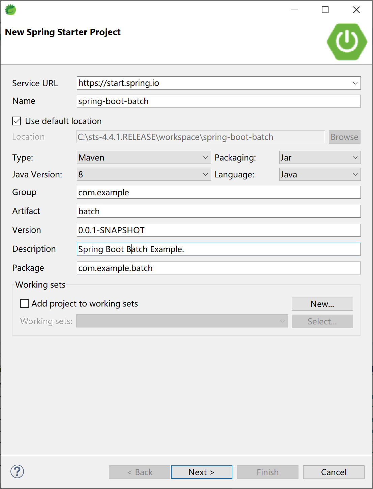
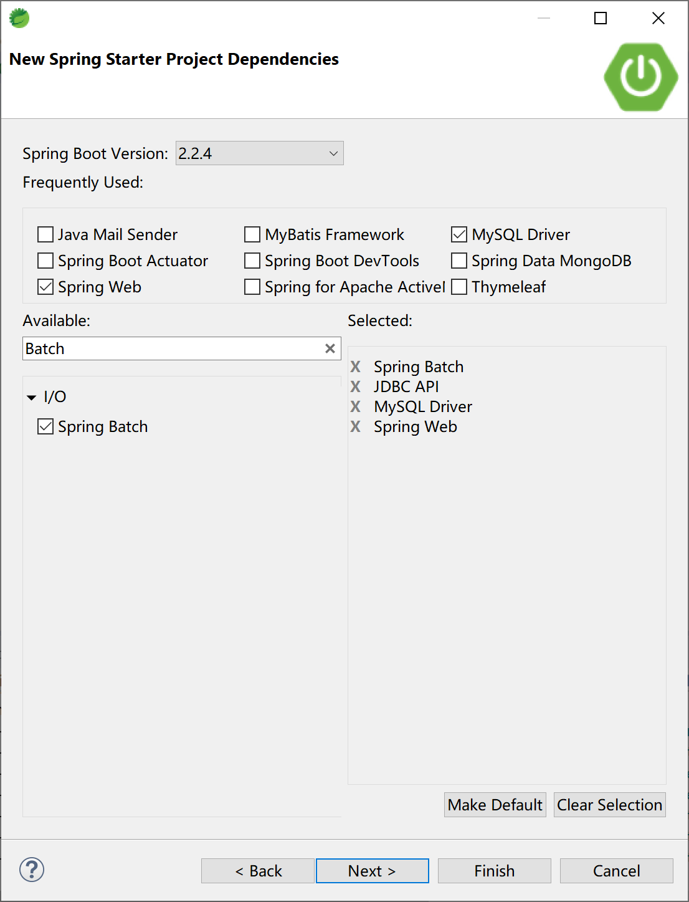
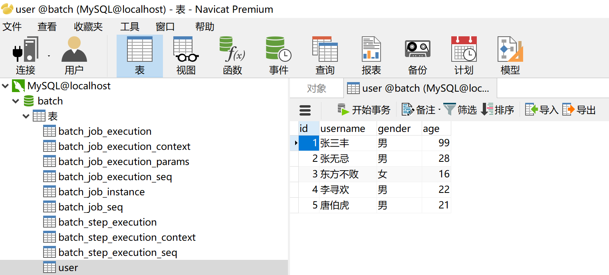

## 14.3 批处理

在日常的项目开发过程中，批处理是一个非常常见的企业级开发功能，比如日终结息，日终对账，日终盘点库存等业务需求。

Spring Batch 是一款开源的基于 Spring 的企业批处理框架。通过它可以构建出健壮的企业级批处理应用，比如我们可以将 csv 文件中的数据（数据量几百万甚至几千万都没问题）批处理插入保存到数据库中。

Spring Batch 提供了统一的读写接口、丰富的任务处理方式、灵活的事务管理及并发处理，包括日志/跟踪（tracing），事务管理，任务处理（processing）统计，任务重启， 忽略（skip），和资源管理等功能。 此外还提供了许多高级服务和特性，使之能够通过优化（optimization） 和分片技术（partitioning techniques）来高效地执行超大型数据集的批处理任务。这些功能对大数据量处理来说是必不可少的，并且大大简化了批处理应用开发，将开发人员从复杂的任务配置管理过程中解放出来，使他们可以更多地去关注核心的业务处理过程。

正如我们知道的，Spring Batch 是一款批处理应用框架，而不是调度框架。它只关注批处理任务相关的问题，如事务、并发、监控、执行等，并不提供相应的调度功能。因此，如果我们希望批处理任务定期执行（一般的企业应用都有这样的需求，也都是这么做的），可结合 Quartz 等成熟的调度框架实现。

> 比如 Quartz 结合 Spring Batch 完成日终对账功能。更大的业务场景（如结息）可能需要 Elastic-Job 分布式调度框架。

### 14.3.1 基本概念

Spring Batch 框架的组成部分有：

1. JobRepository：用来注册 Job 容器，设置数据库相关属性。

2. JobLauncher：用来启动 Job 的接口。

3. Job：我们要实际执行的任务，包含一个或多个。

4. Step：即步骤，包括：ItemReader->ItemProcessor->ItemWriter。

5. ItemReader：用来读取数据，做实体类与数据字段之间的映射。比如读取 csv 文件中的人员数据，之后对应实体 person 的字段做 mapper。

6. ItemProcessor：用来处理数据的接口，同时可以做数据校验（设置校验器，使用 JSR-303（hibernate-validator）注解），比如将中文性别男/女，转为 M/F。同时校验年龄字段是否符合要求等。

7. ItemWriter：用来输出数据的接口，设置数据库源。编写预处理 SQL 插入语句。

一个典型的处理过程如下图所示：


### 14.3.2 集成

在Spring Boot中集成Spring Batch一如既往地方便。

> Spring Batch 本身较为复杂，本示例演示如何在 Spring Boot 中集成使用 Spring Batch，并不深入演示 Spring Batch 的使用，感兴趣的读者请自行寻找 Spring Batch 更进一步的学习资料。

创建一个 Spring Boot 项目。



选择 Spring Batch 等启动器依赖。



项目的 pom 主要依赖如下：

```xml
<dependency>
    <groupId>org.springframework.boot</groupId>
    <artifactId>spring-boot-starter-batch</artifactId>
</dependency>
<dependency>
    <groupId>org.springframework.boot</groupId>
    <artifactId>spring-boot-starter-jdbc</artifactId>
</dependency>
<dependency>
    <groupId>org.springframework.boot</groupId>
    <artifactId>spring-boot-starter-web</artifactId>
</dependency>

<dependency>
    <groupId>mysql</groupId>
    <artifactId>mysql-connector-java</artifactId>
    <scope>runtime</scope>
</dependency>
```

在 application.yml 配置文件中设置数据源及 Spring Batch 配置信息。

```yaml
spring:
  datasource:
    url: jdbc:mysql://localhost:3306/batch?useUnicode=true&characterEncoding=utf-8&serverTimezone=GMT%2B8
    username: root
    password: 123456
    driver-class-name: com.mysql.cj.jdbc.Driver
  batch:
    job:
      enabled: false #需要jobLaucher.run执行
    initialize-schema: always
```

在 src/main/resources 文件夹中创建 user.csv 文件，添加 5 条记录，以供 Spring Batch 读取并存入数据库。

```
id,username,gender,age
1,张三丰,男,99
2,张无忌,男,28
3,东方不败,女,16
4,李寻欢,男,22
5,唐伯虎,男,21
```

创建 user 数据库表，以存储 Spring Batch 从 csv 文件读取到的数据。

```sql
DROP TABLE IF EXISTS `user`;
CREATE TABLE `user` (
  `id` int(11) NOT NULL,
  `username` varchar(255) DEFAULT NULL,
  `gender` varchar(8) DEFAULT NULL,
  `age` int(11) DEFAULT NULL,
  PRIMARY KEY (`id`)
) ENGINE=InnoDB DEFAULT CHARSET=utf8;
```

创建数据库 user 表对应的实体类 User。

```java
package com.example.batch.entity;

public class User {
	private Integer id;
	private String username;
	private String gender;
	private int age;

	public Integer getId() {
		return id;
	}

	public void setId(Integer id) {
		this.id = id;
	}

	public String getUsername() {
		return username;
	}

	public void setUsername(String username) {
		this.username = username;
	}

	public String getGender() {
		return gender;
	}

	public void setGender(String gender) {
		this.gender = gender;
	}

	public int getAge() {
		return age;
	}

	public void setAge(int age) {
		this.age = age;
	}

}
```

创建 SpringBatchConfig 配置类，在其中通过 @EnableBatchProcessing 注解打开 Spring Batch 支持。

```java
package com.example.batch.config;

import javax.sql.DataSource;

import org.springframework.batch.core.Job;
import org.springframework.batch.core.Step;
import org.springframework.batch.core.configuration.annotation.EnableBatchProcessing;
import org.springframework.batch.core.configuration.annotation.JobBuilderFactory;
import org.springframework.batch.core.configuration.annotation.StepBuilderFactory;
import org.springframework.batch.item.database.BeanPropertyItemSqlParameterSourceProvider;
import org.springframework.batch.item.database.JdbcBatchItemWriter;
import org.springframework.batch.item.file.FlatFileItemReader;
import org.springframework.batch.item.file.mapping.BeanWrapperFieldSetMapper;
import org.springframework.batch.item.file.mapping.DefaultLineMapper;
import org.springframework.batch.item.file.transform.DelimitedLineTokenizer;
import org.springframework.beans.factory.annotation.Autowired;
import org.springframework.context.annotation.Bean;
import org.springframework.context.annotation.Configuration;
import org.springframework.core.io.ClassPathResource;

import com.example.batch.entity.User;

/**
 * Spring Batch示例
 * @author Kevin
 *
 */
@Configuration
@EnableBatchProcessing // 开启批处理的支持
public class SpringBatchConfig {
	@Autowired
	DataSource dataSource;
	@Autowired
	JobBuilderFactory jobBuilderFactory;
	@Autowired
	StepBuilderFactory stepBuilderFactory;

	/**
	 * 定义Reader，读取ClassPath下的user.csv，并封包到User实体类
	 * @return
	 */
	@Bean
	FlatFileItemReader<User> itemReader() {
		FlatFileItemReader<User> reader = new FlatFileItemReader<User>();
		reader.setLinesToSkip(1);// 跳过表头
		reader.setResource(new ClassPathResource("user.csv"));

		reader.setLineMapper(new DefaultLineMapper<User>() {// entity与csv数据做映射
			{
				setLineTokenizer(new DelimitedLineTokenizer() {
					{
						setNames(new String[] { "id", "username", "gender", "age" });
						setDelimiter(DELIMITER_COMMA);
					}
				});
				setFieldSetMapper(new BeanWrapperFieldSetMapper<User>() {
					{
						setTargetType(User.class);
					}
				});
			}
		});
		return reader;
	}

	/**
	 * 定义Writer，用给定的sql将User实体类写入数据库
	 * @return
	 */
	@Bean
	JdbcBatchItemWriter<User> jdbcBatchItemWriter() {
		JdbcBatchItemWriter<User> writer = new JdbcBatchItemWriter<>();
		writer.setDataSource(dataSource);
		writer.setItemSqlParameterSourceProvider(new BeanPropertyItemSqlParameterSourceProvider<User>());
		writer.setSql("insert into user(id,username,gender,age) values(:id,:username,:gender,:age)");
		return writer;
	}

	/**
	 * 定义步骤，在步骤中绑定Reader和Writer，每读到2条数据及写入数据库
	 * @return
	 */
	@Bean
	Step myStep(FlatFileItemReader<User> reader, JdbcBatchItemWriter<User> writer) {
		return stepBuilderFactory.get("myStep")
				.<User, User>chunk(2)
				.reader(reader)
				.writer(writer)
				.build();
	}

	/**
	 * 创建任务，使用上面的步骤
	 * @return
	 */
	@Bean
	Job myJob(Step step) {
		return jobBuilderFactory.get("myJob")
				.start(step)
				.build();
	}

}
```

Spring Batch 使用的一般步骤就是：创建 Reader，创建 Writer，创建步骤绑定 Reader 和 Writer，创建任务（绑定步骤）。

创建一个 Controller，以 JobLauncher.run 启动 Spring Batch，运行 Job，从 csv 文件中读取数据，并写入数据库。

```java
package com.example.batch.controller;

import org.springframework.batch.core.Job;
import org.springframework.batch.core.JobParametersBuilder;
import org.springframework.batch.core.launch.JobLauncher;
import org.springframework.beans.factory.annotation.Autowired;
import org.springframework.web.bind.annotation.RequestMapping;
import org.springframework.web.bind.annotation.RestController;

@RestController
@RequestMapping("/batch/")
public class JobController {
	@Autowired
	JobLauncher jobLauncher;
	@Autowired
	Job job;
	
	@RequestMapping("/run")
	public String run() {
		String result = "STOP";
		try {
			jobLauncher.run(job, new JobParametersBuilder().toJobParameters());
			result = "RUN";
		} catch (Exception e) {
			e.printStackTrace();
		}
		return result;
	}

}
```

运行 Spring Boo t应用，打开浏览器访问[http://localhost:8080/batch/run](http://localhost:8080/batch/run)， 启动 JobLauncher，观察控制台输出的日志信息。

```
2020-01-22 21:46:57.137  INFO 10692 --- [nio-8080-exec-1] o.s.b.c.l.support.SimpleJobLauncher      : Job: [SimpleJob: [name=myJob]] launched with the following parameters: [{}]
2020-01-22 21:46:57.193  INFO 10692 --- [nio-8080-exec-1] o.s.batch.core.job.SimpleStepHandler     : Executing step: [myStep]
2020-01-22 21:46:57.288  INFO 10692 --- [nio-8080-exec-1] o.s.batch.core.step.AbstractStep         : Step: [myStep] executed in 95ms
2020-01-22 21:46:57.303  INFO 10692 --- [nio-8080-exec-1] o.s.b.c.l.support.SimpleJobLauncher      : Job: [SimpleJob: [name=myJob]] completed with the following parameters: [{}] and the following status: [COMPLETED] in 140ms
```

通过数据库管理工具，可以看到 Spring Batch 创建了 9 张以 batch\_ 开头的表。并且，user 表中插入了 5 条数据，这 5 条数据来源于 user.csv 文件。



> 本小节示例项目代码：
> 
> [https://github.com/gyzhang/SpringBootCourseCode/tree/master/spring-boot-batch](https://github.com/gyzhang/SpringBootCourseCode/tree/master/spring-boot-batch)
