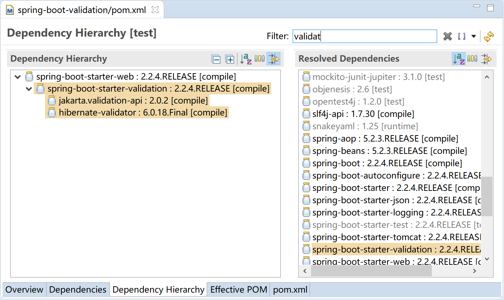
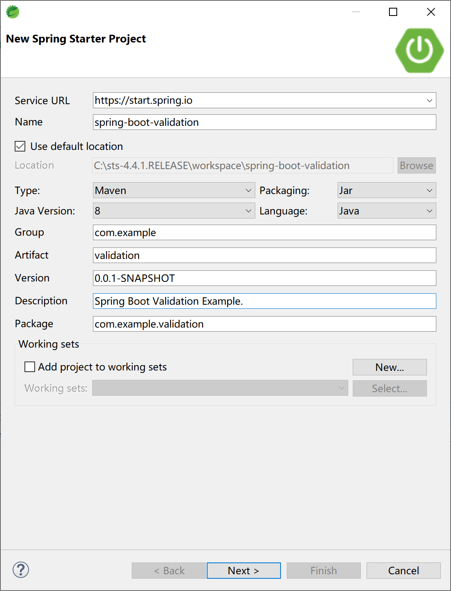
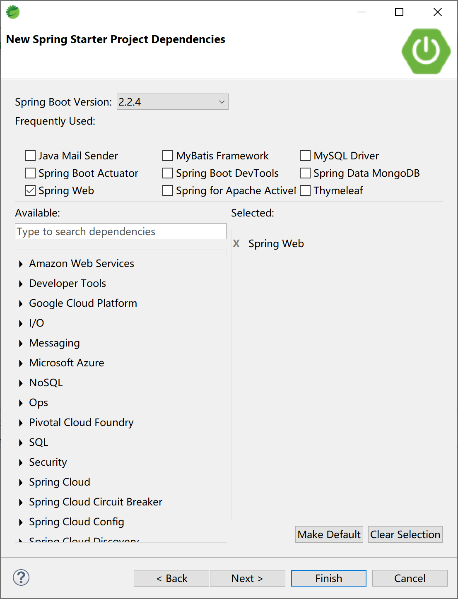
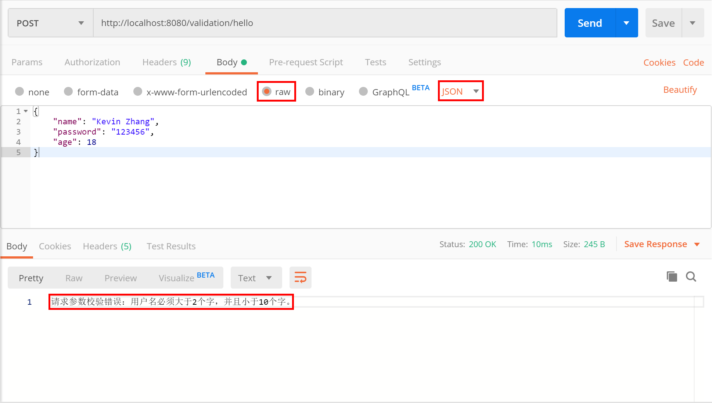

## 14.4 数据校验

在我们的日常工作中，对于任何一个应用而言，数据绝大多数情况下都会从客户端（前端，如浏览器）与服务端（后端，如 tomcat）之间来回传输，如果只做客户端数据校验是远远不够的，是不安全的。我们必须在后台对数据进行验证，然后才将其持久化存储（如新增或更新到数据库）。

数据校验是一个企业级项目架构上最为基础的功能模块。

Spring Boot 对数据校验提供了完美的集成，框架本身大量使用了数据校验功能，我们在实际项目中也应该大量使用数据校验功能以保护后台数据的安全。

### 14.4.1 概念

[JSR-303 Bean Validation](https://jcp.org/en/jsr/detail?id=303) 是一个运行时的数据验证规范，为 JavaBean 验证定义了相应的元数据模型和 API。缺省的元数据是 Java Annotations，通过使用 XML 可以对原有的元数据信息进行覆盖和扩展。在应用程序中，通过使用 Bean Validation 或是你自己定义的 constraint，例如 `@NotNull`, `@Max`, `@ZipCode`， 就可以确保数据模型（JavaBean）的正确性。constraint 可以附加到字段，getter 方法，类或者接口上面。对于一些特定的需求，用户可以很容易的开发定制化的 constraint。Bean Validation 是一个运行时的数据验证框架，在验证之后验证的错误信息会被马上返回。

[Hibernate Validator](http://hibernate.org/validator/) 是 Bean Validation 的参考实现。 Hibernate Validator 提供了 JSR 303 规范中所有内置 constraint 的实现，除此之外还有一些附加的 constraint。

Spring's JSR-303 规范，是标准 JSR-303 的一个变种（默认使用Hibernate Validator）。Spring Validation 验证框架对参数的验证机制提供了 @Validated，javax 提供了 @Valid（标准JSR-303规范），配合 BindingResult 可以直接提供参数验证结果。

常用的数据校验注解如下表：

| 限制                      | 说明                                                         |
| :------------------------ | :----------------------------------------------------------- |
| @Null                     | 限制只能为 null                                              |
| @NotNull                  | 限制必须不为 null                                            |
| @AssertFalse              | 限制必须为 false                                             |
| @AssertTrue               | 限制必须为 true                                              |
| @DecimalMax(value)        | 限制必须为一个不大于指定值的数字                             |
| @DecimalMin(value)        | 限制必须为一个不小于指定值的数字                             |
| @Digits(integer,fraction) | 限制必须为一个小数，且整数部分的位数不能超过 integer，小数部分的位数不能超过 fraction |
| @Future                   | 限制必须是一个将来的日期                                     |
| @Max(value)               | 限制必须为一个不大于指定值的数字                             |
| @Min(value)               | 限制必须为一个不小于指定值的数字                             |
| @Past                     | 限制必须是一个过去的日期                                     |
| @Pattern(value)           | 限制必须符合指定的正则表达式                                 |
| @Size(max,min)            | 限制字符长度必须在 min 到 max 之间                           |
| @Past                     | 验证注解的元素值（日期类型）比当前时间早                     |
| @NotEmpty                 | 验证注解的元素值不为 null 且不为空（字符串长度不为 0、集合大小不为 0） |
| @NotBlank                 | 验证注解的元素值不为空（不为 null、去除首位空格后长度为 0），不同于 @NotEmpty，@NotBlank 只应用于字符串且在比较时会去除字符串的空格 |
| @Email                    | 验证注解的元素值是 Email，也可以通过正则表达式和 flag 指定自定义的 email 格式 |

### 14.4.2 原理

请参考 Spring 校验处理器org.springframework.validation.beanvalidation.BeanValidationPostProcessor 类的源码。

BeanValidationPostProcessor 类内部有个 boolean 类型的属性 afterInitialization，默认是 false，如果是 false，在 postProcessBeforeInitialization 过程中对 bean 进行验证，否则在 postProcessAfterInitialization 过程对 bean 进行验证。

```java
@Nullable
private Validator validator;

private boolean afterInitialization = false;

public Object postProcessBeforeInitialization(Object bean, String beanName) throws BeansException {
    if (!this.afterInitialization) {
        doValidate(bean);
    }
    return bean;
}

public Object postProcessAfterInitialization(Object bean, String beanName) throws BeansException {
    if (this.afterInitialization) {
        doValidate(bean);
    }
    return bean;
}
```

真正处理校验的方法是 doValidate 方法，缺省使用 ValidatorFactory 的默认 Validator（校验器）。

在 Spring Boot 中，默认校验器框架是 HibernateValidator，所以 Spring 默认调用`org.hibernate.validator.internal.engine.ValidatorFactoryImpl`来生成 validator 供 Spring Boot 校验使用。

```java
protected void doValidate(Object bean) {
    Assert.state(this.validator != null, "No Validator set");
    Object objectToValidate = AopProxyUtils.getSingletonTarget(bean);
    if (objectToValidate == null) {
        objectToValidate = bean;
    }
    Set<ConstraintViolation<Object>> result = this.validator.validate(objectToValidate);

    if (!result.isEmpty()) {
        StringBuilder sb = new StringBuilder("Bean state is invalid: ");
        for (Iterator<ConstraintViolation<Object>> it = result.iterator(); it.hasNext();) {
            ConstraintViolation<Object> violation = it.next();
            sb.append(violation.getPropertyPath()).append(" - ").append(violation.getMessage());
            if (it.hasNext()) {
                sb.append("; ");
            }
        }
        throw new BeanInitializationException(sb.toString());
    }
}
```

在 Spring Boot 中添加 spring-boot-starter-validation 后，支持方法级别的 JSR-303 规范：

1. Spring Boot 自动配置（`org.springframework.boot.autoconfigure.validation.ValidationAutoConfiguration`）添加`org.springframework.validation.beanvalidation.MethodValidationPostProcessor`到 Spring 容器中；
2. 类上加上 @Validated 注解；
3. 在方法的参数中加上验证注解，比如 @Max、@Min、@NotEmpty、@NotNull 等。

```java
@Service
@Validated
public class MyBean {

    public Archive findByCodeAndAuthor(@Size(min = 8, max = 10) String code,
            Author author) {
        ...
    }

}
```

### 14.4.3 自动装配

spring-boot-starter-web 依赖的 spring-boot-starter-validation 会在项目中添加 hibernate-validator-6.0.18.Final.jar 包。



hibernate-validator-6.0.18.Final.jar 包中会使用 HibernateValidator 校验器。


Spring Boot 自动装配类 ValidationAutoConfiguration 上的注解 @ConditionalOnResource(resources = "classpath:META-INF/services/javax.validation.spi.ValidationProvider") 检测到存在 hibernate-validator-6.0.18.Final.jar 包中的 spi 配置，就启动 Spring Boot 中的 Validation 自动配置，将 LocalValidatorFactoryBean 和 MethodValidationPostProcessor 装载（@Bean）到 Spring 容器中。

```java
@Configuration(proxyBeanMethods = false)
@ConditionalOnClass(ExecutableValidator.class)
@ConditionalOnResource(resources = "classpath:META-INF/services/javax.validation.spi.ValidationProvider")
@Import(PrimaryDefaultValidatorPostProcessor.class)
public class ValidationAutoConfiguration {

	@Bean
	@Role(BeanDefinition.ROLE_INFRASTRUCTURE)
	@ConditionalOnMissingBean(Validator.class)
	public static LocalValidatorFactoryBean defaultValidator() {
		LocalValidatorFactoryBean factoryBean = new LocalValidatorFactoryBean();
		MessageInterpolatorFactory interpolatorFactory = new MessageInterpolatorFactory();
		factoryBean.setMessageInterpolator(interpolatorFactory.getObject());
		return factoryBean;
	}

	@Bean
	@ConditionalOnMissingBean
	public static MethodValidationPostProcessor methodValidationPostProcessor(Environment environment,
			@Lazy Validator validator) {
		MethodValidationPostProcessor processor = new MethodValidationPostProcessor();
		boolean proxyTargetClass = environment.getProperty("spring.aop.proxy-target-class", Boolean.class, true);
		processor.setProxyTargetClass(proxyTargetClass);
		processor.setValidator(validator);
		return processor;
	}

}
```

这样，在运行时，Spring 就会调用校验器对数据进行校验。

### 14.4.4 集成

创建一个 Spring Boot 应用。



添加 Spring Web 启动器依赖。



在项目的 pom 中查看 maven 依赖，可以看到数据校验依赖（`spring-boot-starter-validation`）是直接包含在`spring-boot-starter-web`里面的，并且使用了`hibernate-validator`，所以我们在 Web 应用中可以直接使用 JSR-303 规范的数据校验功能。

新建一个 User 类，用来接收客户端传过来的数据。

```java
@Validated
public class User {
	@Size(min = 2, max = 10, message = "用户名必须大于2个字，并且小于10个字。")
	private String name;

	@Length(min = 6, max = 12, message = "密码长度必须在1~12位之间。")
	private String password;
	
	@Max(value = 100, message = "非法年龄。")
	private int age;

//getter & setter ...
}

```

创建 UserController，接收客户端 Post 传递过来的数据，验证测试。

```java
@RestController
@RequestMapping("/validation/")
public class UserController {

	@PostMapping("/hello")
	public String sayHello(@Valid @RequestBody User user, BindingResult results) {
		if (results.hasErrors()) {
			return "请求参数校验错误：" + 
		           results.getFieldError().getDefaultMessage();
		}
		return "success";
	}

}
```

在 Postman 中输入请求参数（json），访问[http://localhost:8080/validation/hello](http://localhost:8080/validation/hello) 地址：

```json
{
	"name": "Kevin Zhang", 
	"password": "123456",
	"age": 18
}
```

检查返回的校验结果“请求参数校验错误：用户名必须大于 2 个字，并且小于 10 个字。”，符合预期。



> 本小节示例项目代码：
> 
> [https://github.com/gyzhang/SpringBootCourseCode/tree/master/spring-boot-validation](https://github.com/gyzhang/SpringBootCourseCode/tree/master/spring-boot-validation)
