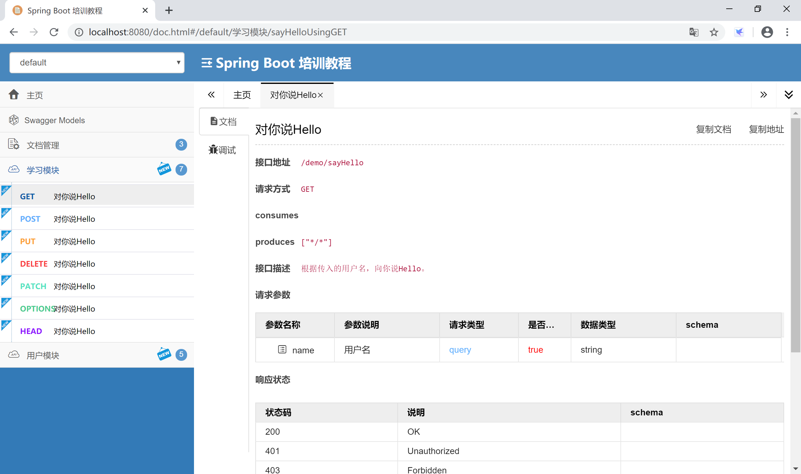
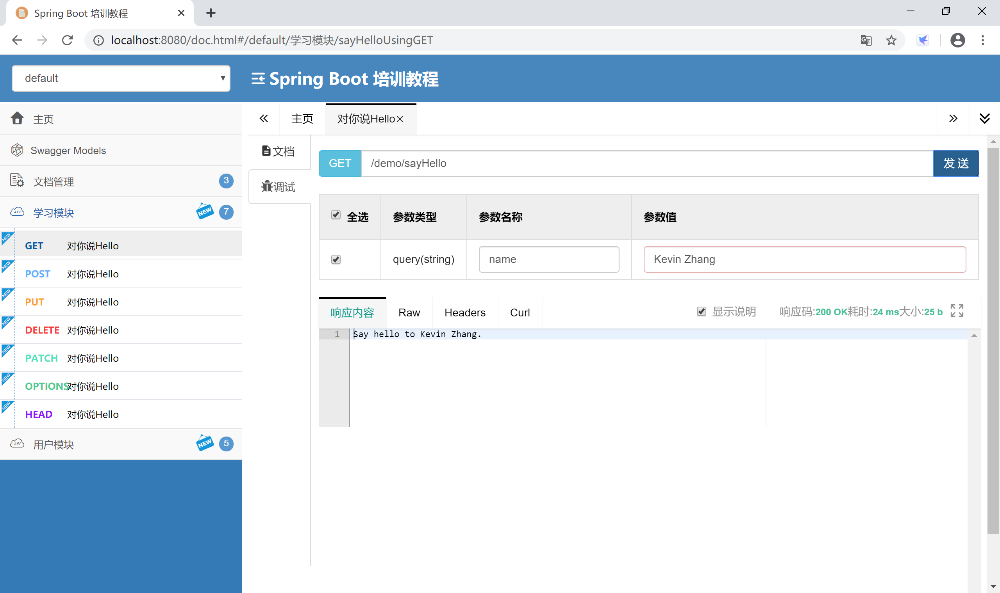

## 14.6 Swagger 2

当前，前后端分离已经逐渐成为企业级应用项目的一种标准的开发方式，前端与后端交给不同的人员开发，但是项目开发中的沟通成本也随之升高，这部分沟通成本主要在于前端开发人员与后端开发人员对后台开发功能接口的沟通。通常情况下，后端开发人员会制作一份 API 接口文档发放给前端开发人员，但是企业级应用在开发阶段 API 通常会有较大变化，随变化维护一份 API 开发接口文档成本相当高，并且不方便测试。

Swagger 2 是一个规范和完整的框架，用于生成、描述、调用和可视化 Restful 风格的 Web 服务，它可以动态生成 API 接口文档，这样就能很好地解决功能和 API 接口一致性的问题，从而降低沟通成本，促进项目高效开发。

### 14.6.1 常用注解

Swagger 2 常用注解：

- @Api 注解可以用来标记后台接口类的功能。
- @ApiOperation 注解用来标记一个方法的作用。
- @ApilmplicitParam 注解用来描述一个参数，可以配置参数的中文含义，也可以给参数设置默认值，这样在接口测试的时候可以避免手动输入。
- @ApilmplicitParams 如果有多个参数，则需要使用多个 @ApilmplicitParam 注解来描述， 多个 @ApilmplicitParam 注解需要放在一个 @ApilmplicitParams 注解中。
- @ApiModel 如果参数是一个对象，则需要在对象所在的类上加上此注解。
- @ApiModelProperty 如果参数是一个对象，则需要在对应的属性上加上此注解，还需要在对象所在的类上加上 @ApiModel。
- @ApiIgnore 注解标识此参数可以忽略。

### 14.6.2 集成

Spring Boot 集成 Swagger 2 非常方便，官方提供了监控界面，也有第三方提供的更为漂亮的监控界面。 

首先创建一个 Spring Boot 应用。


选择 Spring Web 启动器依赖。


添加 Swagger2 依赖，官方提供了监控界面，也有第三方提供的更漂亮的监控界面。

监控界面需要二选一。

```xml
<dependency>
    <groupId>io.springfox</groupId>
    <artifactId>springfox-swagger2</artifactId>
    <version>2.9.2</version>
</dependency>
<!-- 官方监控界面 -->
<dependency>
    <groupId>io.springfox</groupId>
    <artifactId>springfox-swagger-ui</artifactId>
    <version>2.9.2</version>
</dependency>
<!-- 第三方更漂亮的监控界面，推荐使用 -->
<dependency>
    <groupId>com.github.xiaoymin</groupId>
    <artifactId>swagger-bootstrap-ui</artifactId>
    <version>1.9.6</version>
</dependency>
```

创建一个 Swagger 2 配置类。

```java
package com.example.swagger2.config;

import org.springframework.context.annotation.Bean;
import org.springframework.context.annotation.Configuration;

import com.github.xiaoymin.swaggerbootstrapui.annotations.EnableSwaggerBootstrapUI;

import springfox.documentation.builders.ApiInfoBuilder;
import springfox.documentation.builders.PathSelectors;
import springfox.documentation.builders.RequestHandlerSelectors;
import springfox.documentation.service.ApiInfo;
import springfox.documentation.service.Contact;
import springfox.documentation.spi.DocumentationType;
import springfox.documentation.spring.web.plugins.Docket;
import springfox.documentation.swagger2.annotations.EnableSwagger2;

@Configuration
@EnableSwagger2
@EnableSwaggerBootstrapUI //官方监控UI需要删除这一句
public class Swagger2Config {

    @Bean
    public Docket createRestApi() {
        return new Docket(DocumentationType.SWAGGER_2)
                .apiInfo(apiInfo())
                .select()
                .apis(RequestHandlerSelectors.basePackage("com.example.swagger2"))
                .paths(PathSelectors.any())
                .build();
    }

    private ApiInfo apiInfo() {
        return new ApiInfoBuilder()
                .title("Spring Boot 培训教程")   //标题
                .description("示例API文档") //描述
                .termsOfServiceUrl("https://www.xprogrammer.net") //这里配置的是服务网站
                .contact(new Contact("Kevin Zhang", "https://www.xprogrammer.net", "goodman@example.com")) // 三个参数依次是姓名，个人网站，邮箱
                .version("1.0") //版本
                .build();
    }
    
}
```

创建一个示例 Controller，其中使用 Swagger 2 的注解，对类，方法和参数进行标注。

```java
package com.example.swagger2.controller;

import org.springframework.web.bind.annotation.RequestMapping;
import org.springframework.web.bind.annotation.RestController;

import io.swagger.annotations.Api;
import io.swagger.annotations.ApiImplicitParam;
import io.swagger.annotations.ApiOperation;

@Api(value = "Demo控制器", tags = "学习模块")
@RestController
@RequestMapping("/demo/")
public class DemoController {

	@ApiOperation(value = "对你说Hello", notes = "根据传入的用户名，向你说Hello。")
    @ApiImplicitParam(name = "name", value = "用户名", required = true, dataType = "String")
	@RequestMapping("/sayHello")
	public String sayHello(String name) {
		return "Say hello to " + name + ".";
	}

}
```

启动应用，访问官方监控UI[http://localhost:8080/swagger-ui.html](http://localhost:8080/swagger-ui.html)， 查看在线 API 文档。因为这个 API 接口文档是系统在启动时 Swagger 2 读取代码中的注解生成的，所以一定是和代码保持一致的。


如果使用的是第三方监控 UI 依赖，启动应用后，访问监控地址[http://localhost:8080/doc.html](http://localhost:8080/doc.html)， 可以看到更漂亮的监控界面。



可以在监控界面直接测试接口，检查后台功能是否正确。



> 本小节示例项目代码：
> 
> [https://github.com/gyzhang/SpringBootCourseCode/tree/master/spring-boot-swagger2](https://github.com/gyzhang/SpringBootCourseCode/tree/master/spring-boot-swagger2)
