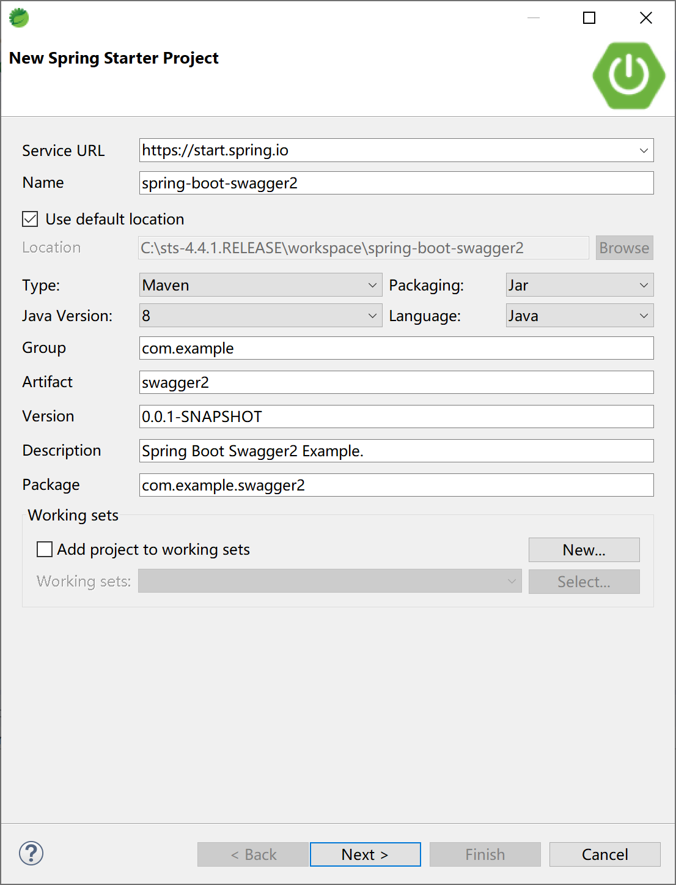
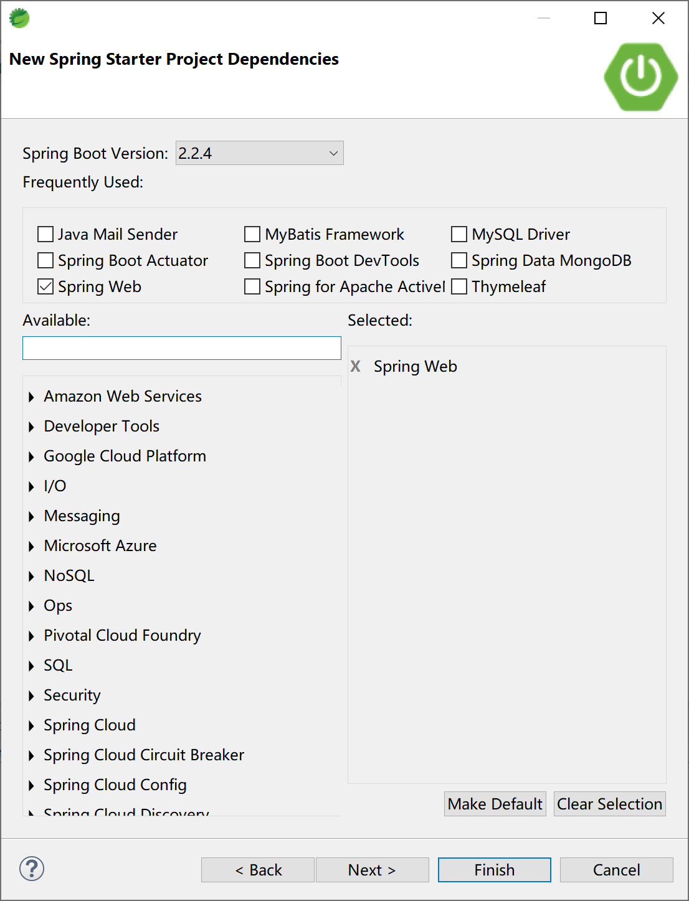

## 14.6 Swagger 2

当前，前后端分离已经逐渐成为企业级应用项目的一种标准的开发方式，前端与后端交给不同的人员开发，但是项目开发中的沟通成本也随之升高，这部分沟通成本主要在于前端开发人员与后端开发人员对后台开发功能接口的沟通。通常情况下，后端开发人员会制作一份API接口文档发放给前端开发人员，但是企业级应用在开发阶段API通常会有较大变化，随变化维护一份API开发接口文档成本相当高，并且不方便测试。

Swagger2 是一个规范和完整的框架，用于生成、描述、调用和可视化Restful风格的Web服务，它可以动态生成Api接口文档，这样就能很好地解决功能和API接口一致性的问题，从而降低沟通成本，促进项目高效开发。

Swagger2常用注解：

- @Api 注解可以用来标记 Controller 的功能。
- @ApiOperation 注解用来标记一个方法的作用。
- @ApilmplicitParam 注解用来描述一个参数，可以配置参数的中文含义，也可以给参数设置默认值，这样在接口测试的时候可以避免手动输入。
- @ApilmplicitParams 如果有多个参数，则需要使用多个 @ApilmplicitParam 注解来描述， 多个 @ApilmplicitParam 注解需要放在一个 @ApilmplicitParams 注解中。
- @ApiModel 如果参数是一个对象，则需要在对象所在的类上加上此注解。
- @ApiModelProperty 如果参数是一个对象，则需要在对应的属性上加上此注解，还需要在对象所在的类上加上 @ApiModel。
- @ApiIgnore 注解标识此参数可以忽略。

Spring Boot 集成 Swagger2 非常方便，官方提供了监控界面，也有第三方提供的更为漂亮的监控界面。 








```xml
<dependency>
    <groupId>io.springfox</groupId>
    <artifactId>springfox-swagger2</artifactId>
    <version>2.9.2</version>
</dependency>
<!-- 官方监控界面 -->
<dependency>
    <groupId>io.springfox</groupId>
    <artifactId>springfox-swagger-ui</artifactId>
    <version>2.9.2</version>
</dependency>
<!-- 第三方更漂亮的监控界面，推荐使用 -->
<dependency>
    <groupId>com.github.xiaoymin</groupId>
    <artifactId>swagger-bootstrap-ui</artifactId>
    <version>1.9.6</version>
</dependency>
```

