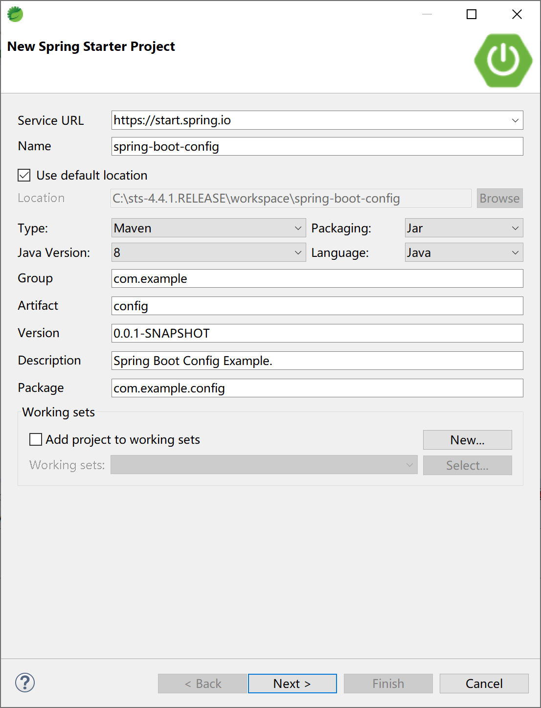
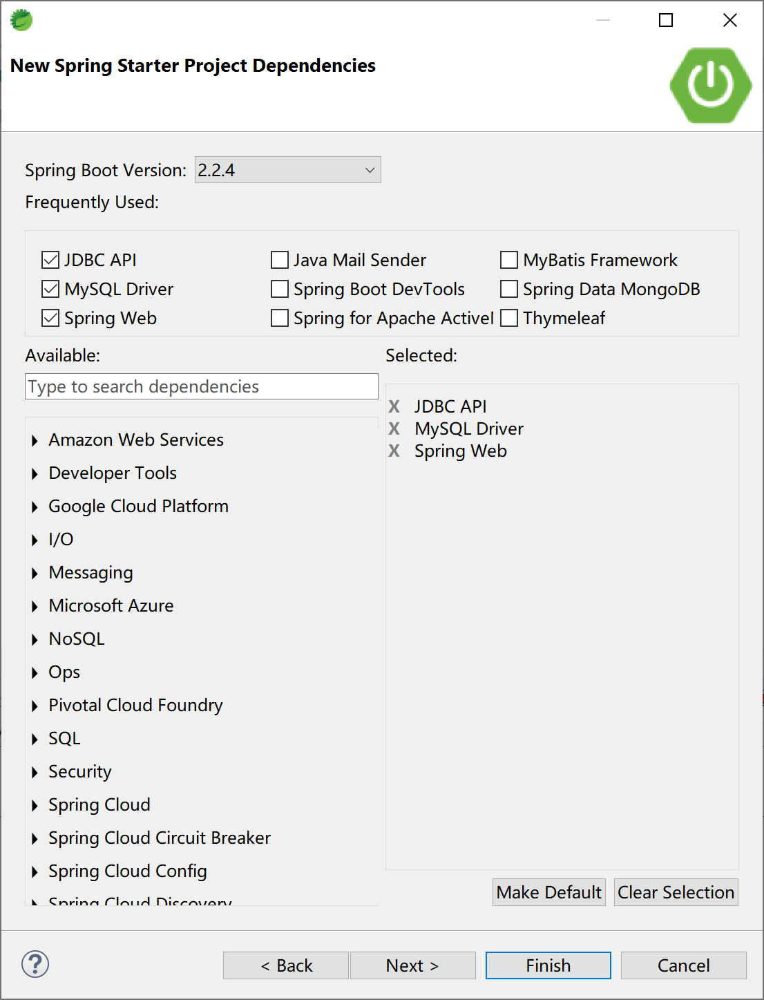

## 15.1 使用多环境配置

Spring Boot 是通过概要文件（profile）机制对多环境配置提供支持的。

典型的用法是，通过在resources目录下提供多个application-xxx.properties文件，然后再application.properties中设置spring.profiles.active=xxx之类的配置或在运行时提供--spring.profiles.active=xxx参数来激活某个概要文件。

还有一种不常用的方法是通过在启动类中设置激活的概要文件。

```java
@SpringBootApplication
public class SpringBootConfigApplication {

	public static void main(String[] args) {
		SpringApplicationBuilder builder = new SpringApplicationBuilder(SpringBootConfigApplication.class);
		builder.application().setAdditionalProfiles("dev");
		builder.run(args);
	}

}
```

创建一个Spring Boot 应用。



选择支持数据库的Web应用启动器依赖。



提供4个配置文件application.properties、application-dev.properties、application-prod.properties和application-test.properties，

开发环境概要文件application-dev.properties内容如下：

```properties
server.port=8080
spring.datasource.url=jdbc:mysql://localhost:3306/ssdev?useUnicode=true&characterEncoding=utf-8&serverTimezone=GMT%2B8
spring.datasource.username=root
spring.datasource.password=123456
spring.datasource.driver-class-name=com.mysql.cj.jdbc.Driver
```

测试环境概要文件application-test.properties内容如下：

```properties
server.port=7070
spring.datasource.url=jdbc:mysql://localhost:3306/sstest?useUnicode=true&characterEncoding=utf-8&serverTimezone=GMT%2B8
spring.datasource.username=root
spring.datasource.password=123456
spring.datasource.driver-class-name=com.mysql.cj.jdbc.Driver
```

生产环境概要文件application-prod.properties内容如下：

```properties
server.port=9090
spring.datasource.url=jdbc:mysql://localhost:3306/ssprod?useUnicode=true&characterEncoding=utf-8&serverTimezone=GMT%2B8
spring.datasource.username=root
spring.datasource.password=123456
spring.datasource.driver-class-name=com.mysql.cj.jdbc.Driver
```

项目配置文件application.properties中设置激活的概要文件，其内容如下：

```properties
spring.profiles.active=dev
```

添加entiy、dao、service和controller类，以便测试配置文件是否生效。数据库结构和代码复用“5.1 Spring Boot集成JdbcTemplate”小节的对应代码。

数据库表结构DDL语句：

```sql
DROP TABLE IF EXISTS `user`;
CREATE TABLE `user` (
  `id` int(32) NOT NULL AUTO_INCREMENT,
  `userName` varchar(32) NOT NULL,
  `passWord` varchar(50) NOT NULL,
  `realName` varchar(32) DEFAULT NULL,
  PRIMARY KEY (`id`)
) ENGINE=InnoDB AUTO_INCREMENT=2 DEFAULT CHARSET=utf8;
```

实体User类：

```java
public class User {
	
	private Integer id;
	private String userName;
	private String passWord;
	private String realName;
//...setter & getter
	@Override
	public String toString() {

        return "User{" +
                "id=" + id +
                ", userName='" + userName + '\'' +
                ", passWord='" + passWord + '\'' +
                ", realName='" + realName + '\'' +
                '}';
	}
}
```

数据访问UserDAO类：

```java
@Repository
public class UserDAO {

	@Autowired
	JdbcTemplate jdbcTemplate;

	public User getUser(int id) {
		String sql = "select * from user where id=" + id;
		return jdbcTemplate.queryForObject(sql, new BeanPropertyRowMapper<>(User.class));
	}

}
```

服务UserService类：

```java
@Service
public class UserService {

	@Autowired
	UserDAO userDAO;

	public User getUser(int id) {
		return userDAO.getUser(id);
	}

}
```

控制器UserController类：

```java
@RestController
@RequestMapping("/user")
public class UserController {

	@Autowired
	private UserService userService;

	@RequestMapping("get/{id}")
	public String getUser(@PathVariable int id) {
		return userService.getUser(id).toString();
	}
	
}
```

清空配置文件application.properties内容，使用启动类中的代码配置方式激活“dev”概要文件，应用程序在8080端口提供服务，在浏览器中访问测试，情况如下：


在配置文件application.properties中添加“spring.profiles.active=prod”激活生产环境概要文件，应用程序在9090端口提供服务，在浏览器中访问测试，情况如下：


应用打包后，在项目的“spring-boot-config\target”下，通过启动参数`java -jar config-0.0.1-SNAPSHOT.jar --spring.profiles.active=test`激活测试环境概要文件。

```
java -jar config-0.0.1-SNAPSHOT.jar --spring.profiles.active=test

  .   ____          _            __ _ _
 /\\ / ___'_ __ _ _(_)_ __  __ _ \ \ \ \
( ( )\___ | '_ | '_| | '_ \/ _` | \ \ \ \
 \\/  ___)| |_)| | | | | || (_| |  ) ) ) )
  '  |____| .__|_| |_|_| |_\__, | / / / /
 =========|_|==============|___/=/_/_/_/
 :: Spring Boot ::        (v2.2.4.RELEASE)
...
2020-01-31 10:40:31.269  INFO 12344 --- [           main] o.s.b.w.embedded.tomcat.TomcatWebServer  : Tomcat started on port(s): 7070 (http) with context path ''
2020-01-31 10:40:31.275  INFO 12344 --- [           main] c.e.config.SpringBootConfigApplication   : Started SpringBootConfigApplication in 3.369 seconds (JVM running for 4.134)
```

应用程序在测试环境的7070端口提供服务，在浏览器中访问测试，情况如下：


通过上述示例，我们可以知道如何配置概要文件，和如何激活概要文件。也验证了概要文件的激活优先顺序：

1. 启动命令行参数`--spring.profiles.active=test`最优先；
2. 配置配置文件application.properties中`spring.profiles.active=prod`的设置次之；
3. 启动类种`SpringApplicationBuilder.application().setAdditionalProfiles("dev")`优先级最低。

这也是符合开发运维的通行做法：命令优先于配置，配置优先于代码。这样的原则或做法，在 Spring 体系内大量存在，广泛使用。

> 本小节示例项目代码：
>
> [https://github.com/gyzhang/SpringBootCourseCode/tree/master/spring-boot-config](https://github.com/gyzhang/SpringBootCourseCode/tree/master/spring-boot-config)

