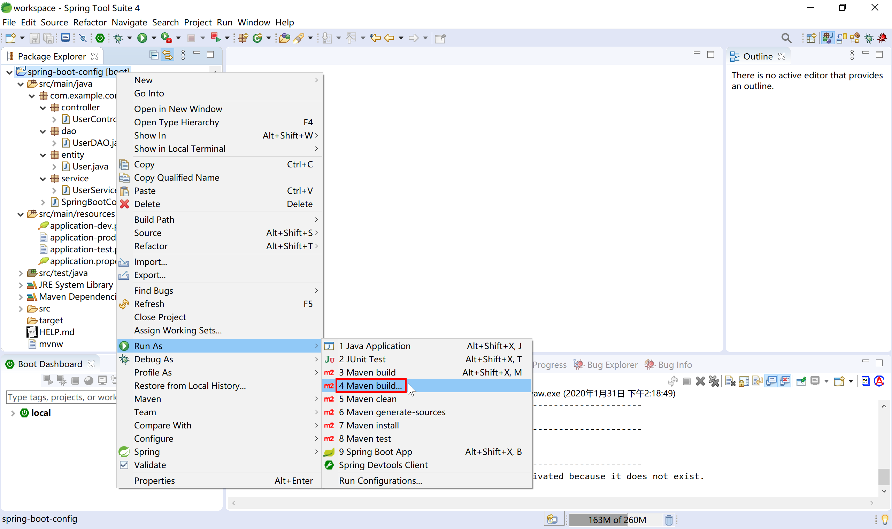
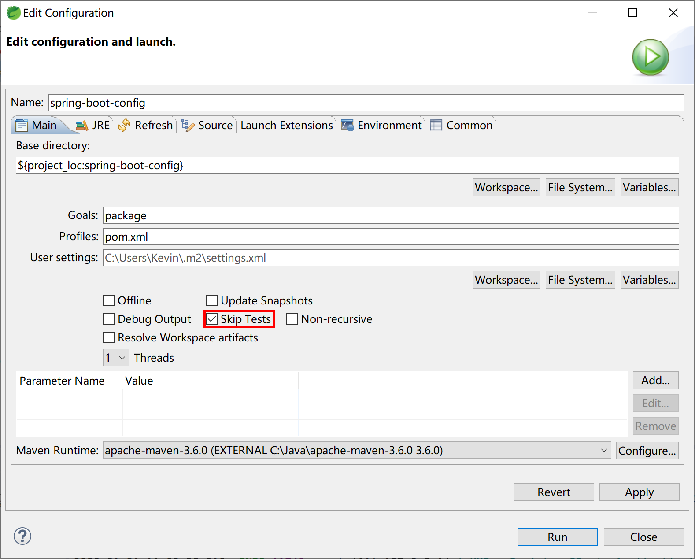
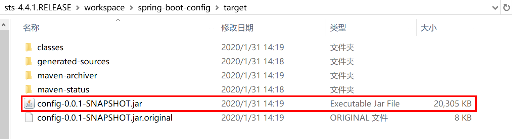
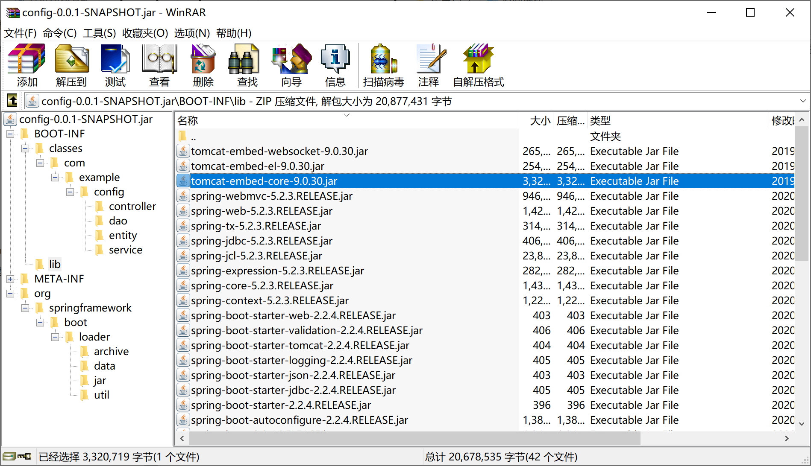
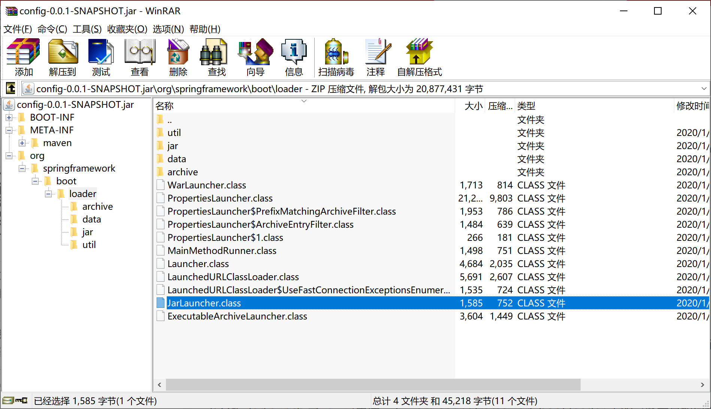
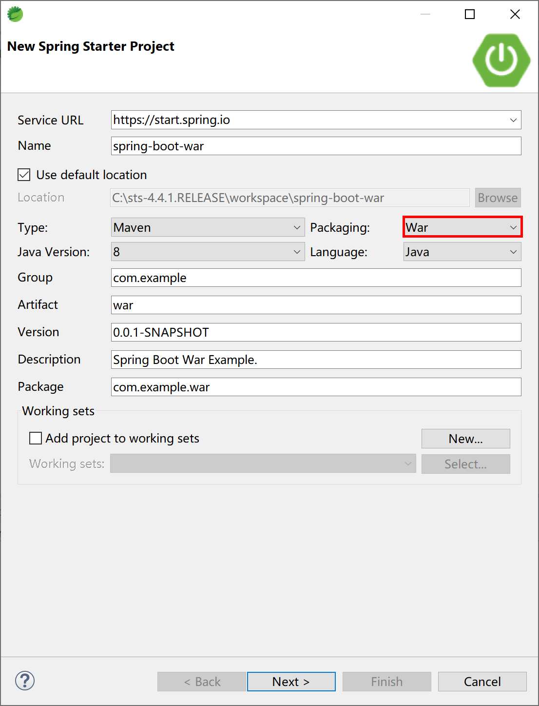
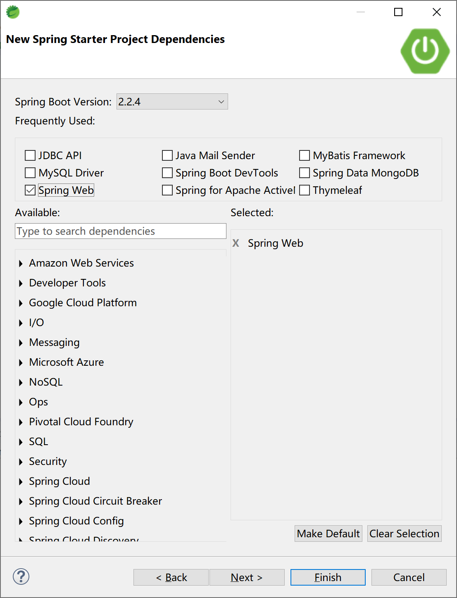
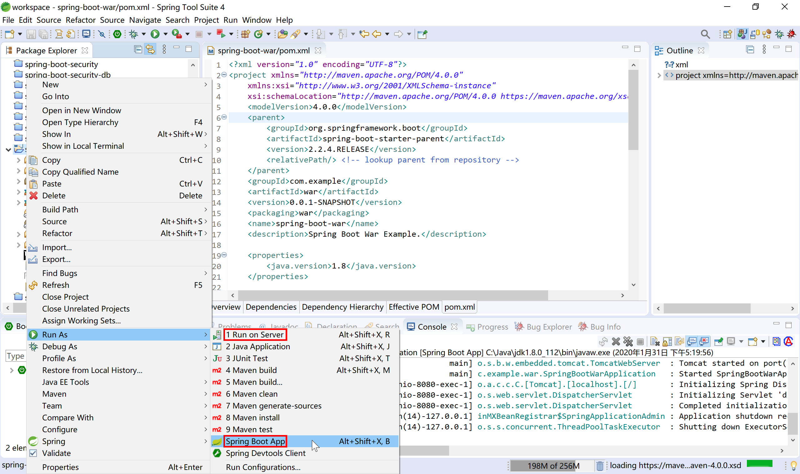
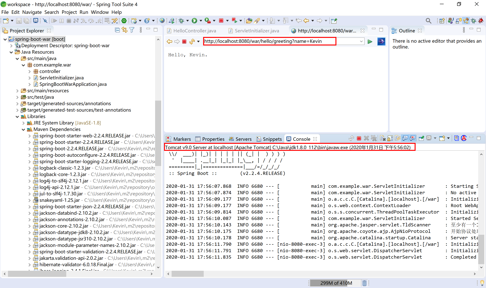
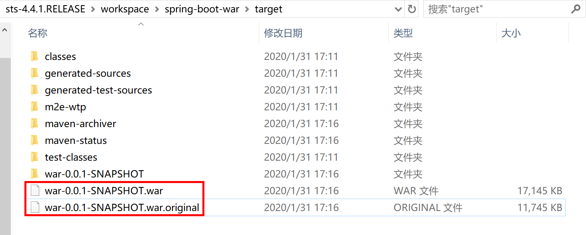

## 15.2 打包部署应用

Spring Boot 项目可以如传统的web应用一样打包成war包，部署到不同的应用服务器（如tomcat，jetty，WebSphere Application Server，WebLogic等）中，也可以使用内嵌服务器（tomcat，jetty，Undertow 等开源容器），以直接可运行的可执行jar包（Spring Boot 官方称之为fat jar）方式部署。

> 由于我们在绝大多数情况下使用 Spring Boot 开发前后端分离的企业级应用，所以这里介绍的 Spring Boot 项目特指 Spring Boot Web项目，即使用 Spring MVC 通过REST方式在HTTP上提供服务的后端项目。

本小节对这两种打包部署方式进行介绍。

[官方文档](https://docs.spring.io/spring-boot/docs/current-SNAPSHOT/reference/html/build-tool-plugins.html#build-tool-plugins-maven-plugin)介绍，其支持 Maven 和 Gradle 两种构建系统，本小节只介绍我们在项目中经常使用的 Maven 构建系统。

在Maven构建系统中，Spring Boot 是通过 Maven 插件的方式提供打包支持的。

```xml
<build>
    <plugins>
        <plugin>
            <groupId>org.springframework.boot</groupId>
            <artifactId>spring-boot-maven-plugin</artifactId>
        </plugin>
    </plugins>
</build>
```

### 15.2.1 Fat JAR

为了分析 Spring Boot Fat JAR 的启动机制，添加“spring-boot-loader”依赖，以便打开 Spring Boot 对应的源码。

```xml
<dependency>
    <groupId>org.springframework.boot</groupId>
    <artifactId>spring-boot-loader</artifactId>
    <scope>provided</scope>
</dependency>
```

在 Spring Boot 项目的pom.xml文件中指定项目打包类型为 jar（`<packaging>jar</packaging>`，不提供打包类型，默认就是打包为jar），然后添加`spring-boot-maven-plugin`插件，在项目上运行 Maven Build... 



在 Goals 输入package 构建命令（可选跳过测试），然后运行。Maven就开始编译打包。

> 在STS中新建 Spring  Starter 项目，默认就添加了`spring-boot-maven-plugin`插件。



Maven 打包完成后，在项目的 target 目录中就生成了两个jar包：

- config-0.0.1-SNAPSHOT.jar.original：原始的jar包，包含项目代码编译后的内容；
- config-0.0.1-SNAPSHOT.jar：spring-boot-maven-plugin 插件添加依赖的其他jar包（如内嵌tomcat服务器，Spring MVC，MySQL驱动等）的“Fat Jar”文件。



使用 WinRAR 压缩工具打开这个 Fat Jar 文件，可以看到在BOOT-INF下的lib子目录下包含了tomcat内嵌服务器及其他依赖jar包。在 BOOT-INF\classes 目录下就是我们在项目中配置文件、Java 类编译后的 class 字节码文件。



```
├── BOOT-INF # 存放项目中开发的业务相关类和配置文件，和依赖的jar
│   ├── classes # 项目业务代码及配置文件
│   └── lib # 存放项目的依赖库，如Spring MVC，MySQL JDBC驱动，Tomcat内嵌服务器
├── META-INF # 包括 MANIFEST.MF 描述文件和 maven 的构建信息
│   ├── MANIFEST.MF
│   └── maven
└── org # Spring Boot 相关的类
    └── springframework
```

根据 Java jar 的运行规范，查看/META-INF/MANIFEST.MF，找到的Main-Class是`org.springframework.boot.loader.JarLauncher`，这是 Spring Boot 提供的一个启动类。

```
Manifest-Version: 1.0
Implementation-Title: spring-boot-config
Implementation-Version: 0.0.1-SNAPSHOT
Start-Class: com.example.config.SpringBootConfigApplication
Spring-Boot-Classes: BOOT-INF/classes/
Spring-Boot-Lib: BOOT-INF/lib/
Build-Jdk-Spec: 1.8
Spring-Boot-Version: 2.2.4.RELEASE
Created-By: Maven Archiver 3.4.0
Main-Class: org.springframework.boot.loader.JarLauncher
```



打开 JarLauncher 源码，可以看到其继承自 ExecutableArchiveLauncher 类，并提供了 "BOOT-INF/classes/" 和 "BOOT-INF/lib/" 常量。

```java
public class JarLauncher extends ExecutableArchiveLauncher {

	static final String BOOT_INF_CLASSES = "BOOT-INF/classes/";

	static final String BOOT_INF_LIB = "BOOT-INF/lib/";

	public JarLauncher() {
	}

	protected JarLauncher(Archive archive) {
		super(archive);
	}

	@Override
	protected boolean isNestedArchive(Archive.Entry entry) {
		if (entry.isDirectory()) {
			return entry.getName().equals(BOOT_INF_CLASSES);
		}
		return entry.getName().startsWith(BOOT_INF_LIB);
	}

	public static void main(String[] args) throws Exception {
		new JarLauncher().launch(args);
	}

}
```

查看 ExecutableArchiveLauncher 类，可以看到 getMainClass 方法获取 Start-Class（/META-INF/MANIFEST.MF文件中提供的：Start-Class: com.example.config.SpringBootConfigApplication），这个就是我们在项目中用 @SpringBootApplication 注解标注的 SpringBootConfigApplication 启动类。

```java
	@Override
	protected String getMainClass() throws Exception {
		Manifest manifest = this.archive.getManifest();
		String mainClass = null;
		if (manifest != null) {
			mainClass = manifest.getMainAttributes().getValue("Start-Class");
		}
		if (mainClass == null) {
			throw new IllegalStateException("No 'Start-Class' manifest entry specified in " + this);
		}
		return mainClass;
	}
```

简单的说，jar 包中的 Main-Class JarLauncher 找到 Start-Class（就是@SpringBootApplication 注解标注的的启动类），使用 Fat JAR 文件中 BOOT-INF/lib/ 路径下的依赖jar包，运行 Spring Boot 应用程序。

一旦打包好了 Fat JAR，就可以 ssh 到工作机/堡垒机然后通过 scp 将这个Fat JAR 拷贝到部署服务器上，通过`nohup java -jar xxx.jar &` 即可启动 Spring Boot 应用。以上几个命令，都为 Linux 下的命令。

> 本小节示例项目代码：
>
> [https://github.com/gyzhang/SpringBootCourseCode/tree/master/spring-boot-config](https://github.com/gyzhang/SpringBootCourseCode/tree/master/spring-boot-config)

### 15.2.2 WAR

在较少遇到的一些特殊情况下，我们需要将 Spring Boot 后端项目打包部署到客户指定的服务器上，比如WebSphere Application Server、WebLogic上，这种传统部署方式就需要传统的war包。

Spring Starter 新建项目向导提供了完善的支持，可以快速的开发测试项目，并将项目打包为传统war包。

首先创建一个 Spring Boot 项目，打包类型选择“War”。



选择 Spring Web 启动器依赖。



Spring Starter新建项目向导为项目pom文件中添加打包类型`<packaging>war</packaging>`和`spring-boot-starter-tomcat`依赖。

```xml
<?xml version="1.0" encoding="UTF-8"?>
<project xmlns="http://maven.apache.org/POM/4.0.0" xmlns:xsi="http://www.w3.org/2001/XMLSchema-instance"
	xsi:schemaLocation="http://maven.apache.org/POM/4.0.0 https://maven.apache.org/xsd/maven-4.0.0.xsd">
	<modelVersion>4.0.0</modelVersion>
	<parent>
		<groupId>org.springframework.boot</groupId>
		<artifactId>spring-boot-starter-parent</artifactId>
		<version>2.2.4.RELEASE</version>
		<relativePath/> <!-- lookup parent from repository -->
	</parent>
	<groupId>com.example</groupId>
	<artifactId>war</artifactId>
	<version>0.0.1-SNAPSHOT</version>
	<packaging>war</packaging>
	<name>spring-boot-war</name>
	<description>Spring Boot War Example.</description>

	<properties>
		<java.version>1.8</java.version>
	</properties>

	<dependencies>
		<dependency>
			<groupId>org.springframework.boot</groupId>
			<artifactId>spring-boot-starter-web</artifactId>
		</dependency>

		<dependency>
			<groupId>org.springframework.boot</groupId>
			<artifactId>spring-boot-starter-tomcat</artifactId>
			<scope>provided</scope>
		</dependency>
		<dependency>
			<groupId>org.springframework.boot</groupId>
			<artifactId>spring-boot-starter-test</artifactId>
			<scope>test</scope>
			<exclusions>
				<exclusion>
					<groupId>org.junit.vintage</groupId>
					<artifactId>junit-vintage-engine</artifactId>
				</exclusion>
			</exclusions>
		</dependency>
	</dependencies>

	<build>
		<plugins>
			<plugin>
				<groupId>org.springframework.boot</groupId>
				<artifactId>spring-boot-maven-plugin</artifactId>
			</plugin>
		</plugins>
	</build>

</project>
```

Spring 为我们生成了一个ServletInitializer类，在 configure 方法中完成初始化操作。

```java
package com.example.war;

import org.springframework.boot.builder.SpringApplicationBuilder;
import org.springframework.boot.web.servlet.support.SpringBootServletInitializer;

public class ServletInitializer extends SpringBootServletInitializer {

	@Override
	protected SpringApplicationBuilder configure(SpringApplicationBuilder application) {
		return application.sources(SpringBootWarApplication.class);
	}

}
```

在开发环境下可按照“Spring Boot App”方式正常运行，和传统内嵌tomcat容器运行方式一样。



服务器启动后，访问[http://localhost:8080/hello/greeting?name=Kevin](http://localhost:8080/hello/greeting?name=Kevin)可按照预期返回结果。


也可以在 STS 中添加 tomcat 9，然后选择“Run on Server”按照传统Web应用开发方式运行。

在 STS 内打开的浏览器地址栏中输入[http://localhost:8080/war/hello/greeting?name=Kevin](http://localhost:8080/war/hello/greeting?name=Kevin)可正确的返回期望的结果。



执行 maven package 打包操作后，在项目 target 目录下生成两个 war 包文件，和传统内嵌web容器的 jar 包类似，一个为原始封包，一个为可运行 war 包。



通过 WinRAR 打开 war-0.0.1-SNAPSHOT.war 文件，可以看到熟悉的 war 包结构和 Spring Boot 的 Fat JAR 的 `org.springframework.boot.loader.JarLauncher` 类等类似结构。


查看“/META-INF/MANIFEST.MF”文件，可以看到 Main-Class 变更为 `Main-Class: org.springframework.boot.loader.WarLauncher` ，通过 `java -jar war-0.0.1-SNAPSHOT.war` 可运行内嵌服务器版的 Spring Boot war 应用。

```
Manifest-Version: 1.0
Implementation-Title: spring-boot-war
Implementation-Version: 0.0.1-SNAPSHOT
Start-Class: com.example.war.SpringBootWarApplication
Spring-Boot-Classes: WEB-INF/classes/
Spring-Boot-Lib: WEB-INF/lib/
Build-Jdk-Spec: 1.8
Spring-Boot-Version: 2.2.4.RELEASE
Created-By: Maven Archiver 3.4.0
Main-Class: org.springframework.boot.loader.WarLauncher
```

将打包后的 war-0.0.1-SNAPSHOT.war 文件拷贝到“apache-tomcat-9.0.30\webapps”目录下，启动 tomcat，打开浏览器访问[http://localhost:8080/war-0.0.1-SNAPSHOT/hello/greeting?name=Kevin](http://localhost:8080/war-0.0.1-SNAPSHOT/hello/greeting?name=Kevin)可正确的返回期望的结果。


Spring Boot 为我们打包的war文件，即可单独运行（使用内嵌web容器），也可以部署到web服务器（如tomcat 9）中运行。

所以，我们可以将 Spring Boot 打包出来的 war 包称之为 **Fat WAR**。

> 本小节示例项目代码：
>
> [https://github.com/gyzhang/SpringBootCourseCode/tree/master/spring-boot-war](https://github.com/gyzhang/SpringBootCourseCode/tree/master/spring-boot-war)