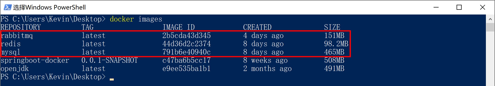
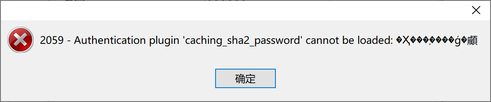
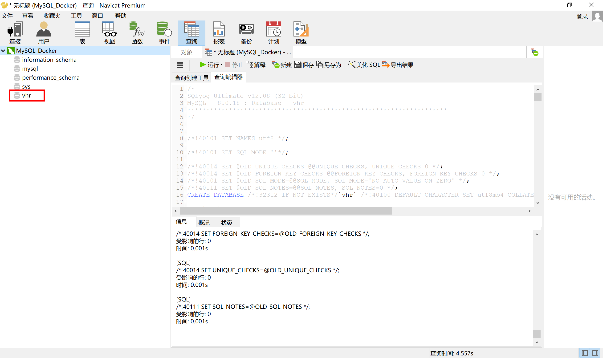
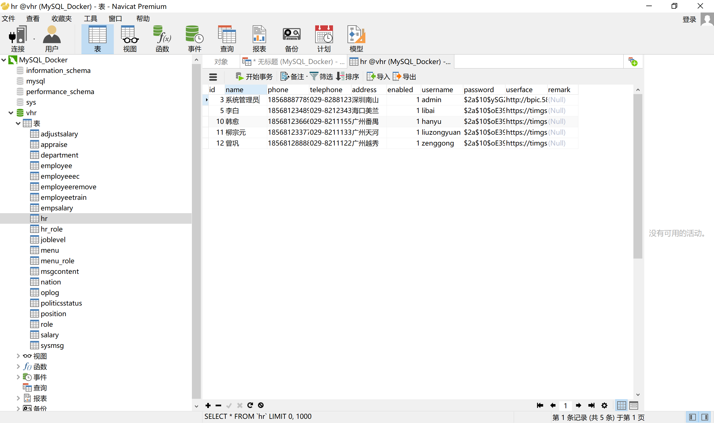
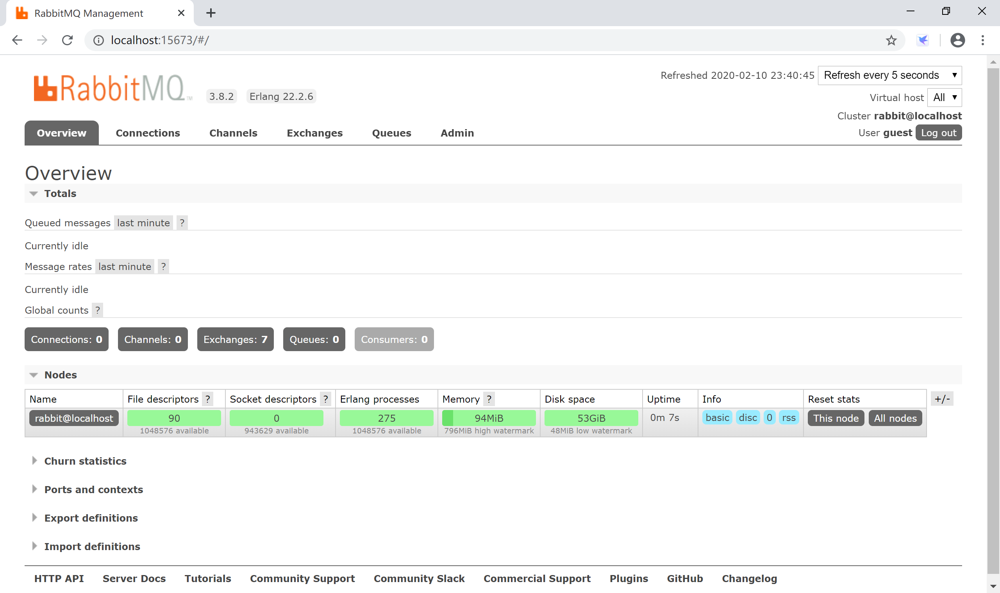
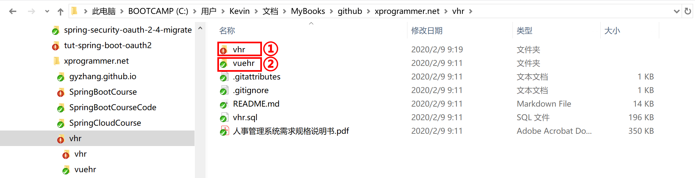
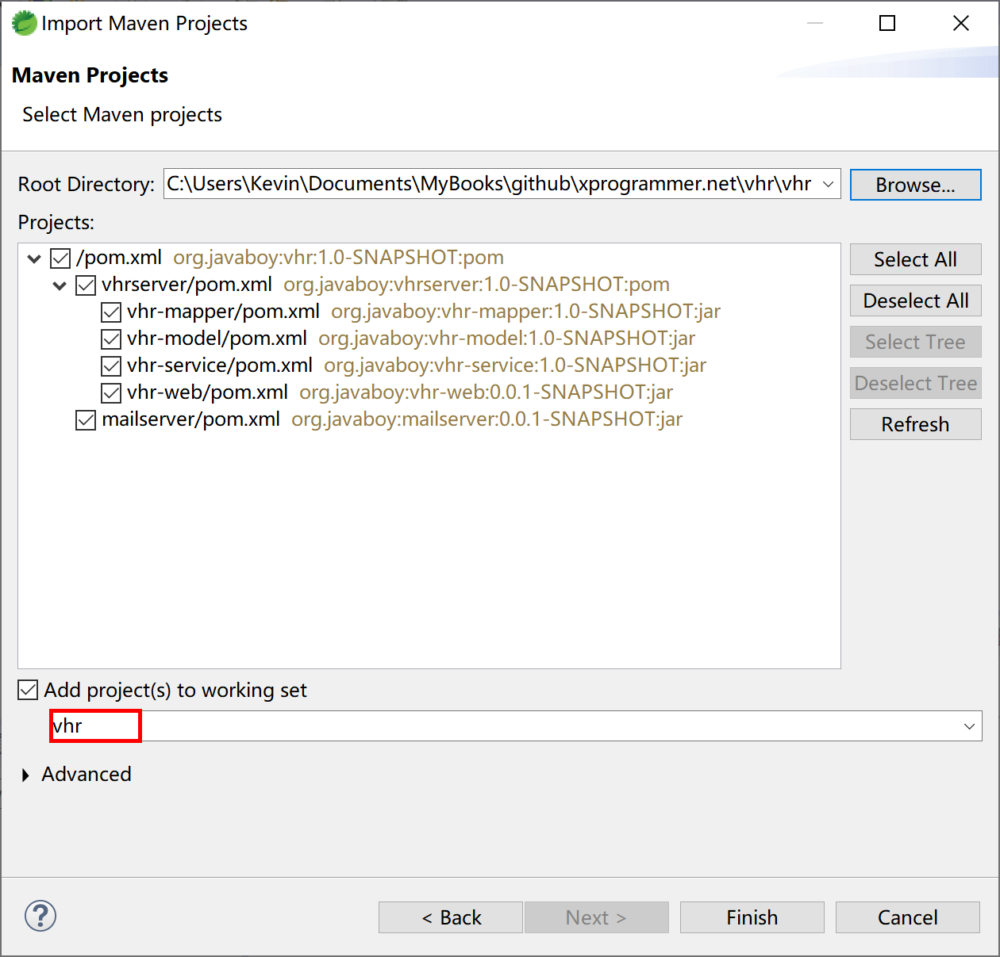
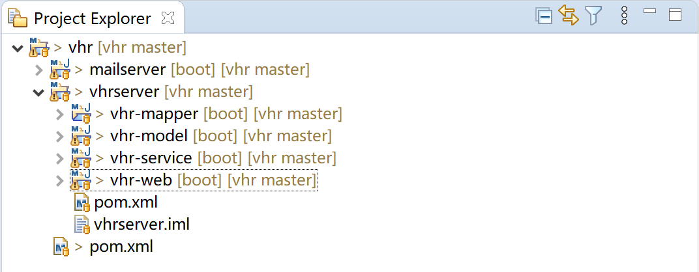
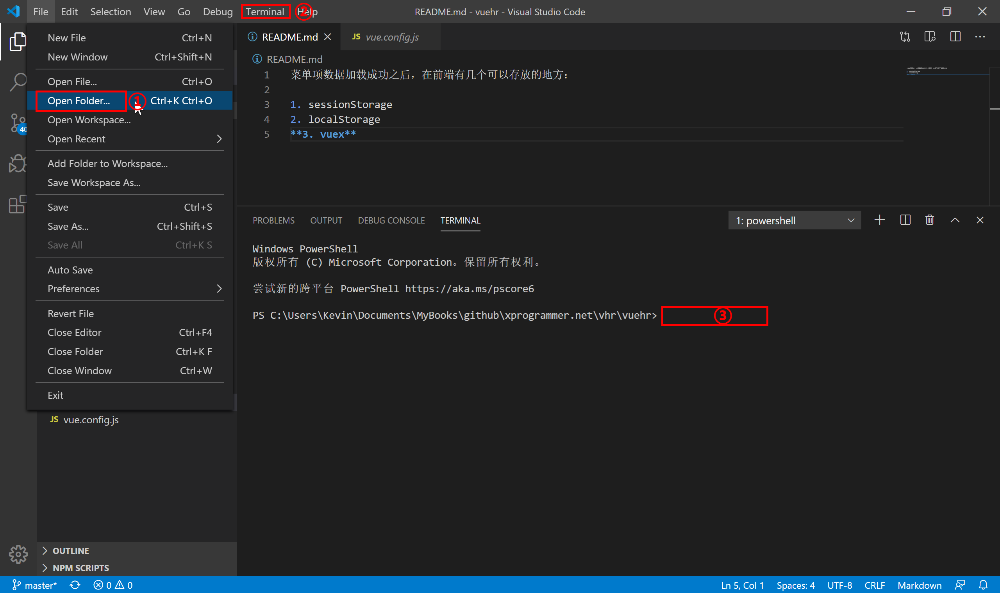

## 16.1 项目部署

为了方便开发过程中对配置和代码的修改，我 fork 了“微人事”这个项目。然后 git clone 版本库回来。

版本库里面包含两个项目：

后台服务：vhr ，包含了两个项目：vhrserver 和 mailserver；

前端项目：vuehr，使用 vue 技术的前端页面。

### 16.1.1 准备环境

在本示例中，MySQL、Redis 和 RabbitMQ，都是用Docker部署。

- MySQL：`docker pull mysql` 拉取镜像；
- Redis：`docker pull redis` 拉取镜像；
- RabbitMQ：`docker pull rabbitmq:3-management` 拉取镜像。



#### 16.1.1.1 MySQL

启动 MySQL Docker 容器：

```powershell
docker run --name mysql4vhr -p 3366:3306 -v C:\Users\Kevin\docker\mysql:/var/lib/mysql -e MYSQL_ROOT_PASSWORD=123456 -d mysql:latest
```

查看 MySQL 容器的日志：

```powershell
docker logs mysql4vhr
```

使用 Navicat Premium 连接数据库，报错：



这个错误的原因是由于 MySQL 8.0 之后的加密规则为 caching_sha2_password，而在此之前的加密规则为mysql_native_password，可以将加密规则改成 mysql_native_password 来修正上面的错误。

使用容器内的命令行，然后登录 MySQL 客户端，执行命令：

```powershell
docker exec -it mysql4vhr bash	
root@0aa81a4b6625:/# mysql -uroot -p123456
mysql> ALTER USER 'root'@'%' IDENTIFIED WITH mysql_native_password BY '123456';
```

使用 Navicat Premium 连接数据库后，新建查询，导入 vhr.sql 执行后，创建项目依赖的数据库。



随机打开数据库中的表，检查开发过程中的数据是否已经导入，确认开发数据库能正常工作。



#### 16.1.1.2 Redis

启动 Redis 容器：

```powershell
docker run --name redis4vhr -p 6679:6379 -v C:\Users\Kevin\docker\redis:/data -d redis redis-server --appendonly yes
```

在 Redis 容器中启动命令行工具，并做基本测试，验证其是否正确工作。

```powershell
PS C:\Users\Kevin> docker exec -it redis4vhr bash
root@259b52f4cfd5:/data# redis-cli
127.0.0.1:6379> set name 'Kevin'
OK
127.0.0.1:6379> get name
"Kevin"
127.0.0.1:6379>
```

#### 16.1.13 RabbitMQ

启动 RabbitMQ 容器：

```powershell
docker run -d --hostname localhost --name rabbitmq4vhr -p 5673:5672 -p 15673:15672 rabbitmq:3-management
```

打开浏览器，输入 [http://localhost:15672/](http://localhost:15672/) 地址，使用默认的用户 guest 和默认密码 guest 登录控制台。



检查 RabbitMQ 是否在端口 5762 上提供服务。

```powershell
PS C:\Users\Kevin> netstat -ano | findstr "LISTENING"| findstr ":5762"
  TCP    0.0.0.0:5762           0.0.0.0:0              LISTENING       11104
  TCP    [::]:5762              [::]:0                 LISTENING       11104
PS C:\Users\Kevin>
```

### 16.1.2 导入项目

整个 vhr 项目是一个前后端分离的项目，下图中的 ①vhr 是后端，②vuehr 是前台。



#### 16.1.2.1 后端

打开STS，导入 maven 项目，选择 \vhr\vhr 文件目录，为了方便管理 working set 设置为 vhr：



导入后的后台项目，如下图：



修改 `/mailserver/src/main/resources/application.properties` 文件使用 springbootcourse@163.com 邮箱来发送给邮件，修改 Rabbitmq 等配置信息。

```properties
server.port=8082

spring.mail.host=smtp.163.com
spring.mail.protocol=smtp
spring.mail.default-encoding=UTF-8
spring.mail.password=授权码，不是邮箱登录密码，切记
spring.mail.username=springbootcourse@163.com
spring.mail.port=25
spring.mail.properties.mail.stmp.socketFactory.class=javax.net.ssl.SSLSocketFactory
spring.mail.properties.mail.debug=true

spring.rabbitmq.host=localhost
spring.rabbitmq.port=5673
spring.rabbitmq.username=guest
spring.rabbitmq.password=guest
```

修改 `/vhr-web/src/main/resources/application.properties` 文件中的 MySQL 数据库连接、Redis、RabbitMQ 等信息。

```properties
server.port=8081

spring.datasource.type=com.alibaba.druid.pool.DruidDataSource
spring.datasource.url=jdbc:mysql://localhost:3366/vhr?useUnicode=true&characterEncoding=UTF-8&serverTimezone=Asia/Shanghai
spring.datasource.username=root
spring.datasource.password=123456

logging.level.org.javaboy.vhr.mapper=debug

spring.rabbitmq.host=localhost
spring.rabbitmq.port=5673
spring.rabbitmq.username=guest
spring.rabbitmq.password=guest

spring.redis.host=localhost
spring.redis.port=6379
spring.redis.database=0
spring.redis.password=

spring.cache.cache-names=menus_cache
```

#### 16.1.2.2 前端

打开 Visual Studio Code，在菜单 `File->Open Foler...` 打开 `\vhr\vuehr` 前端项目，然后打开 Terminal 在终端里输入 如下命令：

```
npm install
```



完成前端项目的设置。

### 16.1.3 运行测试

运行后端 mailserver 项目和 vhr-web 项目，然后在前端项目的 Visual Studio Code 终端中输入 `npm run serve` 启动前端项目。

打开浏览器，输入 [http://localhost:8080/](http://localhost:8080/) 地址，单击 “登录” 按钮，进入首页。


完成开发环境设置。