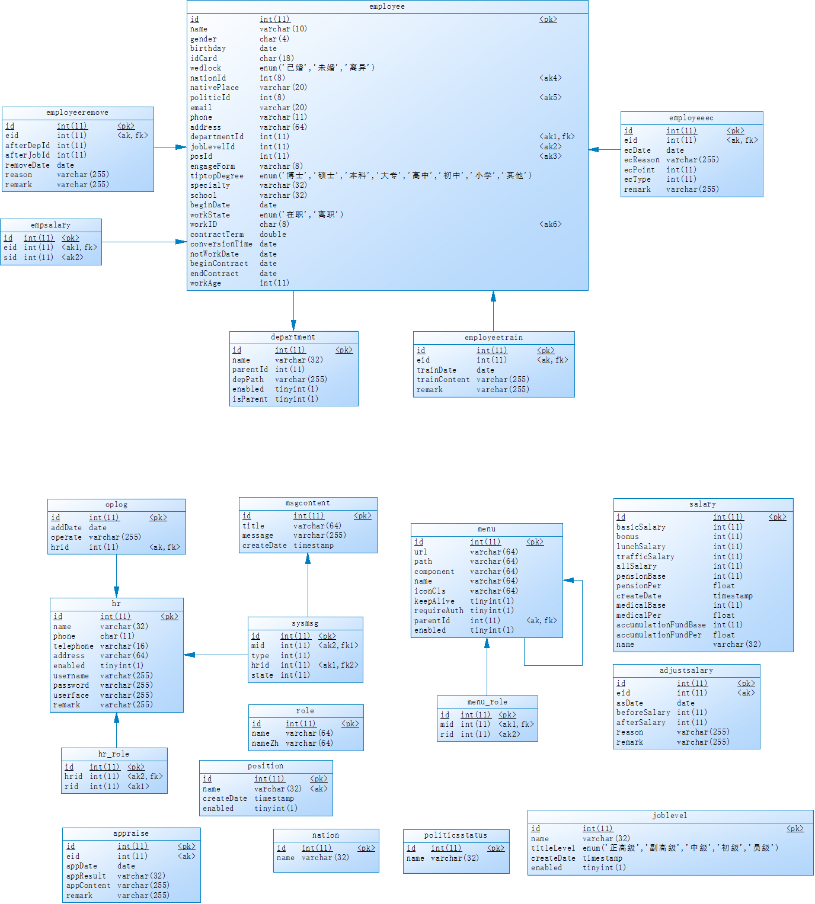
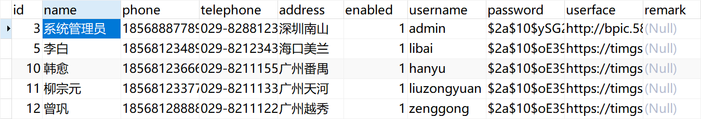
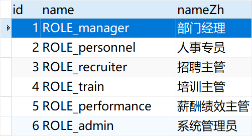
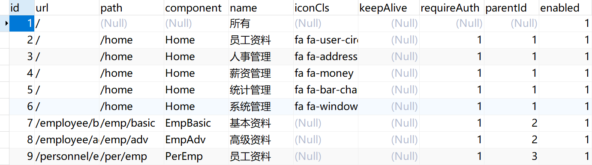
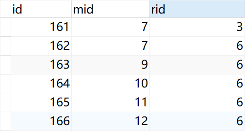
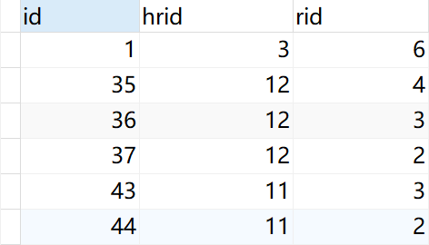

## 16.2 后端项目设计

在“微人事”这个项目中，我们重点讲解项目的后端设计，会极大的忽略前端项目设计。

### 16.2.1 数据库设计

将数据库脚本导入到 Power Designer 反向生成 E-R 图。



用户表、角色表、菜单资源表、角色分配菜单资源表、用户分配角色表等5张表，完成了 RBAC 的授权体系。

- hr：用户表，存放了用户的基本信息。



- role：角色表，name 字段表示角色的英文名称，按照 SpringSecurity 的规范，将以`ROLE_`开始，nameZh 字段表示角色的中文名称。



- menu：菜单资源表是一个自引用的主子表，通过 id 和 parentId 形成树形菜单。该表涉及到的字段有点多，由于前端采用了 Vue，因此当用户登录成功之后，系统将根据用户的角色动态加载需要的模块，所有模块的信息将保存在 menu 表中，menu 表中的 path、component、iconCls、keepAlive、requireAuth 等字段都是 Vue-Router 中需要的字段，也就是说 menu 中的数据在运行时会以 json 的形式返回给前端，再由 vue 动态更新 router，menu 中还有一个字段 url，表示一个 url pattern，即路径匹配规则，假设有一个路径匹配规则为 /admin/\*\*，那么当用户在客户端发起一个 /admin/user 的请求，将被 /admin/\*\* 拦截到，系统再去查看这个规则对应的角色是哪些，然后再去查看该用户是否具备相应的角色，进而判断该请求是否合法。



- menu_role：角色（role）分配了哪些资源（menu）的表，通过角色获取打包的资源。



- hr_role：用户（hr）分配了哪些角色（role）的表，用户通过分配的角色来访问角色上绑定的打包资源。



其他表，根据表名读者可以大致判断其用途，在本教程的学习过程中不关键。

### 16.2.2 数据库访问

本项目中的数据库访问使用的是 MyBatis 技术。

下面，我们以菜单资源表 menu 为例来说明其是如何完成数据库访问的，其他数据库表访问详见代码。

首先是 vhr-model 模块中存放的是数据库中表映射过来的对象，比如 Menu 对象，对应 menu 菜单资源表。

```java
public class Menu implements Serializable {
	private static final long serialVersionUID = 1L;
	private Integer id;
    private String url;
    private String path;
    private String component;
    private String name;
    private String iconCls;
    private Meta meta;
    private Integer parentId;
    private Boolean enabled;
    private List<Menu> children;
    private List<Role> roles;
...
```

数据库访问是在 vhr-mapper 模块中，依赖 vhr-model 模块，使用了阿里巴巴的 druid 数据库连接池。 

```xml
<dependency>
    <groupId>org.javaboy</groupId>
    <artifactId>vhr-model</artifactId>
    <version>1.0-SNAPSHOT</version>
</dependency>
<dependency>
    <groupId>org.mybatis.spring.boot</groupId>
    <artifactId>mybatis-spring-boot-starter</artifactId>
    <version>2.1.1</version>
</dependency>
<dependency>
    <groupId>com.alibaba</groupId>
    <artifactId>druid-spring-boot-starter</artifactId>
    <version>1.1.21</version>
</dependency>
```

MyBatis 的 mapper 分为 xml 文件和 java 接口文件两种，其中 xml 文件存放 MyBatis 格式的数据库访问 SQL 脚本语句。

例如菜单资源表的 MenuMapper.xml 文件：

```xml
<?xml version="1.0" encoding="UTF-8" ?>
<!DOCTYPE mapper PUBLIC "-//mybatis.org//DTD Mapper 3.0//EN" "http://mybatis.org/dtd/mybatis-3-mapper.dtd" >
<mapper namespace="org.javaboy.vhr.mapper.MenuMapper" >
  <resultMap id="BaseResultMap" type="org.javaboy.vhr.model.Menu" >
    <id column="id" property="id" jdbcType="INTEGER" />
    <result column="url" property="url" jdbcType="VARCHAR" />
    <result column="path" property="path" jdbcType="VARCHAR" />
    <result column="component" property="component" jdbcType="VARCHAR" />
    <result column="name" property="name" jdbcType="VARCHAR" />
    <result column="iconCls" property="iconCls" jdbcType="VARCHAR" />
    <result column="parentId" property="parentId" jdbcType="INTEGER" />
    <result column="enabled" property="enabled" jdbcType="BIT" />
    <association property="meta" javaType="org.javaboy.vhr.model.Meta">
      <result column="keepAlive" property="keepAlive" jdbcType="BIT" />
      <result column="requireAuth" property="requireAuth" jdbcType="BIT" />
    </association>
  </resultMap>
  <resultMap id="Menus2" type="org.javaboy.vhr.model.Menu" extends="BaseResultMap">
    <collection property="children" ofType="org.javaboy.vhr.model.Menu">
      <id column="id2" property="id" jdbcType="INTEGER" />
      <result column="url2" property="url" jdbcType="VARCHAR" />
      <result column="path2" property="path" jdbcType="VARCHAR" />
      <result column="component2" property="component" jdbcType="VARCHAR" />
      <result column="name2" property="name" jdbcType="VARCHAR" />
      <result column="iconCls2" property="iconCls" jdbcType="VARCHAR" />
      <result column="parentId2" property="parentId" jdbcType="INTEGER" />
      <result column="enabled2" property="enabled" jdbcType="BIT" />
      <association property="meta" javaType="org.javaboy.vhr.model.Meta">
        <result column="keepAlive2" property="keepAlive" jdbcType="BIT" />
        <result column="requireAuth2" property="requireAuth" jdbcType="BIT" />
      </association>
    </collection>
  </resultMap>
  <resultMap id="MenuWithRole" type="org.javaboy.vhr.model.Menu" extends="BaseResultMap">
    <collection property="roles" ofType="org.javaboy.vhr.model.Role">
      <id column="rid" property="id"/>
      <result column="rname" property="name"/>
      <result column="rnameZh" property="nameZh"/>
    </collection>
  </resultMap>
  <resultMap id="MenuWithChildren" type="org.javaboy.vhr.model.Menu" extends="BaseResultMap">
    <id column="id1" property="id"/>
    <result column="name1" property="name"/>
    <collection property="children" ofType="org.javaboy.vhr.model.Menu">
      <id column="id2" property="id"/>
      <result column="name2" property="name"/>
      <collection property="children" ofType="org.javaboy.vhr.model.Menu">
        <id column="id3" property="id"/>
        <result column="name3" property="name"/>
      </collection>
    </collection>
  </resultMap>
  <select id="getMidsByRid" resultType="java.lang.Integer">
    select mid from menu_role where rid=#{rid};
  </select>
  <select id="getAllMenus" resultMap="MenuWithChildren">
    select m1.`id` as id1,m1.`name` as name1,m2.`id` as id2,m2.`name` as name2,m3.`id` as id3,m3.`name` as name3 from menu m1,menu m2,menu m3 where m1.`id`=m2.`parentId` and m2.`id`=m3.`parentId` and m3.`enabled`=true order by m1.`id`,m2.`id`,m3.`id`
  </select>
  <select id="getAllMenusWithRole" resultMap="MenuWithRole">
    select m.*,r.`id` as rid,r.`name` as rname,r.`nameZh` as rnameZh from menu m,menu_role mr,role r where m.`id`=mr.`mid` and mr.`rid`=r.`id` order by m.`id`
  </select>
  <select id="getMenusByHrId" resultMap="Menus2">
    select distinct m1.*,m2.`id` as id2,m2.`component` as component2,m2.`enabled` as enabled2,m2.`iconCls` as iconCls2,m2.`keepAlive` as keepAlive2,m2.`name` as name2,m2.`parentId` as parentId2,m2.`requireAuth` as requireAuth2,m2.`path` as path2 from menu m1,menu m2,hr_role hrr,menu_role mr where m1.`id`=m2.`parentId` and hrr.`hrid`=#{hrid} and hrr.`rid`=mr.`rid` and mr.`mid`=m2.`id` and m2.`enabled`=true order by m1.`id`,m2.`id`
  </select>
  <sql id="Base_Column_List" >
    id, url, path, component, name, iconCls, keepAlive, requireAuth, parentId, enabled
  </sql>
  <select id="selectByPrimaryKey" resultMap="BaseResultMap" parameterType="java.lang.Integer" >
    select 
    <include refid="Base_Column_List" />
    from menu
    where id = #{id,jdbcType=INTEGER}
  </select>
  <delete id="deleteByPrimaryKey" parameterType="java.lang.Integer" >
    delete from menu
    where id = #{id,jdbcType=INTEGER}
  </delete>
  <insert id="insert" parameterType="org.javaboy.vhr.model.Menu" >
    insert into menu (id, url, path, 
      component, name, iconCls, 
      keepAlive, requireAuth, parentId, 
      enabled)
    values (#{id,jdbcType=INTEGER}, #{url,jdbcType=VARCHAR}, #{path,jdbcType=VARCHAR}, 
      #{component,jdbcType=VARCHAR}, #{name,jdbcType=VARCHAR}, #{iconcls,jdbcType=VARCHAR}, 
      #{keepalive,jdbcType=BIT}, #{requireauth,jdbcType=BIT}, #{parentid,jdbcType=INTEGER}, 
      #{enabled,jdbcType=BIT})
  </insert>
  <insert id="insertSelective" parameterType="org.javaboy.vhr.model.Menu" >
    insert into menu
    <trim prefix="(" suffix=")" suffixOverrides="," >
      <if test="id != null" >
        id,
      </if>
      <if test="url != null" >
        url,
      </if>
      <if test="path != null" >
        path,
      </if>
      <if test="component != null" >
        component,
      </if>
      <if test="name != null" >
        name,
      </if>
      <if test="iconcls != null" >
        iconCls,
      </if>
      <if test="keepalive != null" >
        keepAlive,
      </if>
      <if test="requireauth != null" >
        requireAuth,
      </if>
      <if test="parentid != null" >
        parentId,
      </if>
      <if test="enabled != null" >
        enabled,
      </if>
    </trim>
    <trim prefix="values (" suffix=")" suffixOverrides="," >
      <if test="id != null" >
        #{id,jdbcType=INTEGER},
      </if>
      <if test="url != null" >
        #{url,jdbcType=VARCHAR},
      </if>
      <if test="path != null" >
        #{path,jdbcType=VARCHAR},
      </if>
      <if test="component != null" >
        #{component,jdbcType=VARCHAR},
      </if>
      <if test="name != null" >
        #{name,jdbcType=VARCHAR},
      </if>
      <if test="iconcls != null" >
        #{iconcls,jdbcType=VARCHAR},
      </if>
      <if test="keepalive != null" >
        #{keepalive,jdbcType=BIT},
      </if>
      <if test="requireauth != null" >
        #{requireauth,jdbcType=BIT},
      </if>
      <if test="parentid != null" >
        #{parentid,jdbcType=INTEGER},
      </if>
      <if test="enabled != null" >
        #{enabled,jdbcType=BIT},
      </if>
    </trim>
  </insert>
  <update id="updateByPrimaryKeySelective" parameterType="org.javaboy.vhr.model.Menu" >
    update menu
    <set >
      <if test="url != null" >
        url = #{url,jdbcType=VARCHAR},
      </if>
      <if test="path != null" >
        path = #{path,jdbcType=VARCHAR},
      </if>
      <if test="component != null" >
        component = #{component,jdbcType=VARCHAR},
      </if>
      <if test="name != null" >
        name = #{name,jdbcType=VARCHAR},
      </if>
      <if test="iconcls != null" >
        iconCls = #{iconcls,jdbcType=VARCHAR},
      </if>
      <if test="keepalive != null" >
        keepAlive = #{keepalive,jdbcType=BIT},
      </if>
      <if test="requireauth != null" >
        requireAuth = #{requireauth,jdbcType=BIT},
      </if>
      <if test="parentid != null" >
        parentId = #{parentid,jdbcType=INTEGER},
      </if>
      <if test="enabled != null" >
        enabled = #{enabled,jdbcType=BIT},
      </if>
    </set>
    where id = #{id,jdbcType=INTEGER}
  </update>
  <update id="updateByPrimaryKey" parameterType="org.javaboy.vhr.model.Menu" >
    update menu
    set url = #{url,jdbcType=VARCHAR},
      path = #{path,jdbcType=VARCHAR},
      component = #{component,jdbcType=VARCHAR},
      name = #{name,jdbcType=VARCHAR},
      iconCls = #{iconcls,jdbcType=VARCHAR},
      keepAlive = #{keepalive,jdbcType=BIT},
      requireAuth = #{requireauth,jdbcType=BIT},
      parentId = #{parentid,jdbcType=INTEGER},
      enabled = #{enabled,jdbcType=BIT}
    where id = #{id,jdbcType=INTEGER}
  </update>
</mapper>
```

MyBatis mapper 规范的 java 接口文件，例如菜单资源表的 MenuMapper.java 文件。

```java
public interface MenuMapper {
    int deleteByPrimaryKey(Integer id);

    int insert(Menu record);

    int insertSelective(Menu record);

    Menu selectByPrimaryKey(Integer id);

    int updateByPrimaryKeySelective(Menu record);

    int updateByPrimaryKey(Menu record);

    List<Menu> getMenusByHrId(Integer hrid);

    List<Menu> getAllMenusWithRole();

    List<Menu> getAllMenus();

    List<Integer> getMidsByRid(Integer rid);
}
```

在 vhr-web 项目的 Spring Boot 启动类 VhrApplication 中注解 @`MapperScan(basePackages = "org.javaboy.vhr.mapper")` 设置了扫描 MyBatis Mapper 的路径，这样 MyBatis 数据访问就正确配置了。

```java
@SpringBootApplication
@EnableCaching
@MapperScan(basePackages = "org.javaboy.vhr.mapper")
public class VhrApplication {

    public static void main(String[] args) {
        SpringApplication.run(VhrApplication.class, args);
    }

}
```

### 16.2.3 服务层

服务层在 vhr-service 模块中，依赖了数据访问层。

```xml
<dependency>
    <groupId>org.javaboy</groupId>
    <artifactId>vhr-mapper</artifactId>
    <version>1.0-SNAPSHOT</version>
</dependency>
<dependency>
    <groupId>org.springframework.boot</groupId>
    <artifactId>spring-boot-starter-data-redis</artifactId>
</dependency>
<dependency>
    <groupId>org.springframework.boot</groupId>
    <artifactId>spring-boot-starter-cache</artifactId>
</dependency>
<dependency>
    <groupId>org.springframework.boot</groupId>
    <artifactId>spring-boot-starter-amqp</artifactId>
</dependency>
<dependency>
    <groupId>org.apache.poi</groupId>
    <artifactId>poi</artifactId>
    <version>4.1.1</version>
</dependency>
```

上面的 pom 依赖引入了缓存、消息及 POI 等依赖。

- Cache：缓存，参见 MenuService 的 `public List<Menu> getAllMenusWithRole()` 方法；
- Redis：键值（Key-Value）缓存，项目中用来做认证信息缓存，参见 MenuService 类；
- MQ：接入 RabbitMQ，雇员服务（EmployeeService）类中在 `public Integer addEmp(Employee employee)` 方法通过 RabbitTemplate 在新增雇员时向 RabbitMQ 发送消息，然后邮件服务（mailserver 后台服务）收到消息后发送邮件；
- POI：导入导出 Excel 数据。

例如菜单资源的服务类 MenuService，开启了缓存，并注入 MenuMapper、MenuRoleMapper 访问数据库。

```java
@Service
@CacheConfig(cacheNames = "menus_cache")
public class MenuService {
    @Autowired
    MenuMapper menuMapper;
    @Autowired
    MenuRoleMapper menuRoleMapper;
    public List<Menu> getMenusByHrId() {
        return menuMapper.getMenusByHrId(((Hr) SecurityContextHolder.getContext().getAuthentication().getPrincipal()).getId());
    }

    @Cacheable
    public List<Menu> getAllMenusWithRole() {
        return menuMapper.getAllMenusWithRole();
    }

    public List<Menu> getAllMenus() {
        return menuMapper.getAllMenus();
    }

    public List<Integer> getMidsByRid(Integer rid) {
        return menuMapper.getMidsByRid(rid);
    }

    @Transactional
    public boolean updateMenuRole(Integer rid, Integer[] mids) {
        menuRoleMapper.deleteByRid(rid);
        if (mids == null || mids.length == 0) {
            return true;
        }
        Integer result = menuRoleMapper.insertRecord(rid, mids);
        return result==mids.length;
    }
    
}
```

### 16.2.3 WEB 层

WEB 层（vhr-web）提供 REST 服务为前端，依赖了服务层（vhr-service），Spring Boot 的入口主程序在这里。

```xml
<dependency>
    <groupId>org.springframework.boot</groupId>
    <artifactId>spring-boot-starter-websocket</artifactId>
</dependency>
```

在 WEB 层，添加了 WebSocket 依赖，在 WebSocketConfig 配置类中完成 WebSocket 配置，在 WsController 类中完成聊天消息的后台发送。

### 16.2.3 消息服务

雇员服务（EmployeeService）类中在 `public Integer addEmp(Employee employee)` 方法通过 RabbitTemplate 在新增雇员时向 RabbitMQ 发送消息，然后邮件服务（mailserver 后台服务）模块的 MailReceiver  类收到消息后发送邮件。

### 16.2.4 邮件服务

后台 mailserver 模块依赖消息、邮件、Thymeleaf 模板提供了邮件服务。

```xml
<dependency>
    <groupId>org.springframework.boot</groupId>
    <artifactId>spring-boot-starter-amqp</artifactId>
</dependency>
<dependency>
    <groupId>org.springframework.boot</groupId>
    <artifactId>spring-boot-starter-mail</artifactId>
</dependency>
<dependency>
    <groupId>org.springframework.boot</groupId>
    <artifactId>spring-boot-starter-thymeleaf</artifactId>
</dependency>
```

邮件服务的配置信息，主要配置消息服务器和 smtp 邮件发送服务器信息。

```properties
server.port=8082

spring.mail.host=smtp.163.com
spring.mail.protocol=smtp
spring.mail.default-encoding=UTF-8
spring.mail.password=授权码，不是邮箱登录密码，切记
spring.mail.username=springbootcourse@163.com
spring.mail.port=25
spring.mail.properties.mail.stmp.socketFactory.class=javax.net.ssl.SSLSocketFactory
spring.mail.properties.mail.debug=true

spring.rabbitmq.host=localhost
spring.rabbitmq.port=5673
spring.rabbitmq.username=guest
spring.rabbitmq.password=guest
```

邮件模板使用了 thymeleaf 技术，项目中的邮件模板是由 mail.html 文件提供。

```html
...
欢迎 <span th:text="${name}"></span> 加入 Java达摩院 大家庭，您的入职信息如下：
<table border="1">
    <tr>
        <td>姓名</td>
        <td th:text="${name}"></td>
    </tr>
    <tr>
        <td>职位</td>
        <td th:text="${posName}"></td>
    </tr>
    <tr>
        <td>职称</td>
        <td th:text="${joblevelName}"></td>
    </tr>
    <tr>
        <td>部门</td>
        <td th:text="${departmentName}"></td>
    </tr>
</table>

<p>希望在未来的日子里，携手共进！</p>
...
```

Spring Boot 主程序 MailserverApplication 类中，注册了消息队列”javaboy.mail.welcome“，后续接收这个消息队列中的消息。

```java
@SpringBootApplication
public class MailserverApplication {

    public static void main(String[] args) {
        SpringApplication.run(MailserverApplication.class, args);
    }

    @Bean
    Queue queue() {
        return new Queue("javaboy.mail.welcome");
    }
}
```

邮件服务类 MailReceiver 从消息队列中接收到消息后使用 mail.html 邮件模板发送邮件。

```java
@Component
public class MailReceiver {

    public static final Logger logger = LoggerFactory.getLogger(MailReceiver.class);

    @Autowired
    JavaMailSender javaMailSender;
    @Autowired
    MailProperties mailProperties;
    @Autowired
    TemplateEngine templateEngine;

    @RabbitListener(queues = "javaboy.mail.welcome")
    public void handler(Employee employee) {
        logger.info(employee.toString());
        //收到消息，发送邮件
        MimeMessage msg = javaMailSender.createMimeMessage();
        MimeMessageHelper helper = new MimeMessageHelper(msg);
        try {
            helper.setTo(employee.getEmail());
            helper.setFrom(mailProperties.getUsername());
            helper.setSubject("入职欢迎");
            helper.setSentDate(new Date());
            Context context = new Context();
            context.setVariable("name", employee.getName());
            context.setVariable("posName", employee.getPosition().getName());
            context.setVariable("joblevelName", employee.getJobLevel().getName());
            context.setVariable("departmentName", employee.getDepartment().getName());
            String mail = templateEngine.process("mail", context);
            helper.setText(mail, true);
            javaMailSender.send(msg);
        } catch (MessagingException e) {
            e.printStackTrace();
            logger.error("邮件发送失败："+e.getMessage());
        }
    }
}
```

### 16.2.5 Redis 缓存

Redis 缓存在本项目中用来做认证信息缓存，参见 MenuService 类。

### 16.2.6 安全管理

HrService 类实现了 UserDetailsService 接口，从数据库中获取用户和用户拥有的角色（ROLE\_XXX，注意ROLE\_前缀），并配置到 SecurityConfig 这个 Spring Security 配置类中。

```java
@Configuration
public class SecurityConfig extends WebSecurityConfigurerAdapter {
    @Autowired
    HrService hrService;
    @Autowired
    CustomFilterInvocationSecurityMetadataSource customFilterInvocationSecurityMetadataSource;
    @Autowired
    CustomUrlDecisionManager customUrlDecisionManager;

    @Bean
    PasswordEncoder passwordEncoder() {
        return new BCryptPasswordEncoder();
    }

    @Override
    protected void configure(AuthenticationManagerBuilder auth) throws Exception {
        auth.userDetailsService(hrService);
    }

    @Override
    public void configure(WebSecurity web) throws Exception {
        web.ignoring().antMatchers("/login","/css/**","/js/**","/index.html","/img/**","/fonts/**","/favicon.ico");
    }

    @Override
    protected void configure(HttpSecurity http) throws Exception {
        http.authorizeRequests()
//                .anyRequest().authenticated()
                .withObjectPostProcessor(new ObjectPostProcessor<FilterSecurityInterceptor>() {
                    @Override
                    public <O extends FilterSecurityInterceptor> O postProcess(O object) {
                        object.setAccessDecisionManager(customUrlDecisionManager);
                        object.setSecurityMetadataSource(customFilterInvocationSecurityMetadataSource);
                        return object;
                    }
                })
                .and()
                .formLogin()
                .usernameParameter("username")
                .passwordParameter("password")
                .loginProcessingUrl("/doLogin")
                .loginPage("/login")
                .successHandler(new AuthenticationSuccessHandler() {
                    @Override
                    public void onAuthenticationSuccess(HttpServletRequest req, HttpServletResponse resp, Authentication authentication) throws IOException, ServletException {
                        resp.setContentType("application/json;charset=utf-8");
                        PrintWriter out = resp.getWriter();
                        Hr hr = (Hr) authentication.getPrincipal();
                        hr.setPassword(null);
                        RespBean ok = RespBean.ok("登录成功!", hr);
                        String s = new ObjectMapper().writeValueAsString(ok);
                        out.write(s);
                        out.flush();
                        out.close();
                    }
                })
                .failureHandler(new AuthenticationFailureHandler() {
                    @Override
                    public void onAuthenticationFailure(HttpServletRequest req, HttpServletResponse resp, AuthenticationException exception) throws IOException, ServletException {
                        resp.setContentType("application/json;charset=utf-8");
                        PrintWriter out = resp.getWriter();
                        RespBean respBean = RespBean.error("登录失败!");
                        if (exception instanceof LockedException) {
                            respBean.setMsg("账户被锁定，请联系管理员!");
                        } else if (exception instanceof CredentialsExpiredException) {
                            respBean.setMsg("密码过期，请联系管理员!");
                        } else if (exception instanceof AccountExpiredException) {
                            respBean.setMsg("账户过期，请联系管理员!");
                        } else if (exception instanceof DisabledException) {
                            respBean.setMsg("账户被禁用，请联系管理员!");
                        } else if (exception instanceof BadCredentialsException) {
                            respBean.setMsg("用户名或者密码输入错误，请重新输入!");
                        }
                        out.write(new ObjectMapper().writeValueAsString(respBean));
                        out.flush();
                        out.close();
                    }
                })
                .permitAll()
                .and()
                .logout()
                .logoutSuccessHandler(new LogoutSuccessHandler() {
                    @Override
                    public void onLogoutSuccess(HttpServletRequest req, HttpServletResponse resp, Authentication authentication) throws IOException, ServletException {
                        resp.setContentType("application/json;charset=utf-8");
                        PrintWriter out = resp.getWriter();
                        out.write(new ObjectMapper().writeValueAsString(RespBean.ok("注销成功!")));
                        out.flush();
                        out.close();
                    }
                })
                .permitAll()
                .and()
                .csrf().disable().exceptionHandling()
                //没有认证时，在这里处理结果，不要重定向
                .authenticationEntryPoint(new AuthenticationEntryPoint() {
            @Override
            public void commence(HttpServletRequest req, HttpServletResponse resp, AuthenticationException authException) throws IOException, ServletException {
                resp.setContentType("application/json;charset=utf-8");
                resp.setStatus(401);
                PrintWriter out = resp.getWriter();
                RespBean respBean = RespBean.error("访问失败!");
                if (authException instanceof InsufficientAuthenticationException) {
                    respBean.setMsg("请求失败，请联系管理员!");
                }
                out.write(new ObjectMapper().writeValueAsString(respBean));
                out.flush();
                out.close();
            }
        });
    }
}
```

### 16.2.7 全局异常

在 WEB 层的 GlobalExceptionHandler 类中简单演示了全局异常的使用。

```java
@RestControllerAdvice
public class GlobalExceptionHandler {
    @ExceptionHandler(SQLException.class)
    public RespBean sqlException(SQLException e) {
        if (e instanceof SQLIntegrityConstraintViolationException) {
            return RespBean.error("该数据有关联数据，操作失败!");
        }
        return RespBean.error("数据库异常，操作失败!");
    }
}
```
