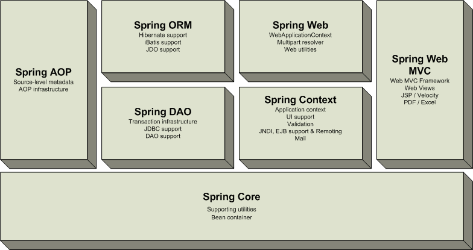
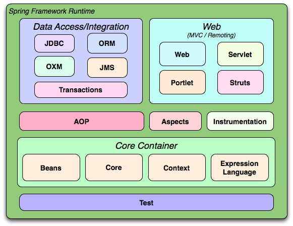
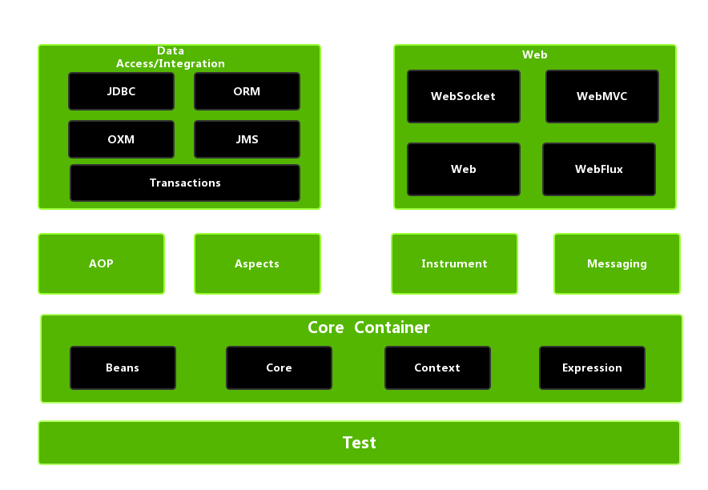

## 1.1  Spring介绍

当我们单独谈到 Spring 时，一般是指 Spring Framework，就如下面的 maven 依赖所示，当前最新的版本为5.2.1（2019年11月2日release）。

```xml
<dependency>
    <groupId>org.springframework</groupId>
    <artifactId>spring-core</artifactId>
    <version>5.2.1.RELEASE</version>
</dependency>
```

### <span id = 'springOverview1'>1.1.1 Spring概述</span>

Spring 是一个于 2003 年兴起的轻量级开源 Java 开发框架，由其作者 Rod Johnson 在其著作 “Expert One-On-One J2EE Development and Design” 中阐述的部分理念和原型衍生而来。它是为了解决企业应用开发的复杂性而创建的。框架的主要优势之一就是其**分层架构**，分层架构允许使用者选择使用哪一个组件，同时为 Java EE 应用程序开发提供集成的框架。

Spring 使用基本的 Java Bean（POJO）来完成以前只可能由 EJB 完成的事情。然而，Spring 的用途不仅限于服务器端的开发。从简单性、可测试性和松耦合的角度而言，任何 Java 应用都可以从 Spring 中受益（例如，Spring for Android）。Spring 的核心是控制反转（IoC）和面向切面编程（AOP）。简单来说，Spring 是一个分层的Java SE/EE full-stack（一站式） 轻量级开源框架（技术栈）。

下面，为了简化并抓住重点，我们以 Spring Framework 1.1.1 版本第一次提供的[reference](https://docs.spring.io/spring/docs/1.1.1/reference/)为基础，来介绍 Spring 的分层架构。

 Spring 框架（以版本1.1.1 为例）是一个分层架构，由 7 个定义良好的模块组成。Spring 模块构建在核心容器之上，核心容器定义了创建、配置和管理  bean 的方式，如下图所示：

  

组成 Spring 框架的每个模块（或组件）都可以单独存在，或者与其他一个或多个模块联合实现。每个模块的功能如下：

- **核心容器：**核心容器提供 Spring 框架的基本功能。核心容器的主要组件是 BeanFactory，它是工厂模式的实现。BeanFactory 使用控制反转 （IoC） 模式将应用程序的配置和依赖性规范与实际的应用程序代码分开。
- **Spring 上下文：**Spring 上下文是一个配置文件，向 Spring 框架提供上下文信息。Spring 上下文包括企业服务，例如 JNDI、EJB、电子邮件、国际化、校验和调度功能。
- **Spring AOP：**通过配置管理特性，Spring AOP 模块直接将面向方面的编程功能集成到了 Spring 框架中。所以，可以很容易地使 Spring 框架管理的任何对象支持 AOP。Spring AOP 模块为基于 Spring 的应用程序中的对象提供了事务管理服务。通过使用 Spring AOP，不用依赖 EJB 组件，就可以将声明性事务管理集成到应用程序中。
- **Spring DAO：**JDBC DAO 抽象层提供了有意义的异常层次结构，可用该结构来管理异常处理和不同数据库供应商抛出的错误消息。异常层次结构简化了错误处理，并且极大地降低了需要编写的异常代码数量（例如打开和关闭连接）。Spring DAO 的面向 JDBC 的异常遵从通用的 DAO 异常层次结构。
- **Spring ORM：**Spring 框架插入了若干个 ORM 框架，从而提供了 ORM 的对象关系工具，其中包括 JDO、Hibernate 和 iBatis SQL Map（现在的MyBatis）。所有这些都遵从 Spring 的通用事务和 DAO 异常层次结构。
- **Spring Web 模块：**Web 上下文模块建立在应用程序上下文模块之上，为基于 Web 的应用程序提供了上下文。所以，Spring 框架支持与 Jakarta Struts 的集成。Web 模块还简化了处理多部分请求以及将请求参数绑定到域对象的工作。

- **Spring MVC 框架：**MVC 框架是一个全功能的构建 Web 应用程序的 MVC 实现。通过策略接口，MVC 框架变成为高度可配置的，MVC 容纳了大量视图技术，其中包括 JSP、Velocity、Tiles、iText 和 POI。

Spring 框架的功能可以用在任何 J2EE 服务器中，大多数功能也适用于不受管理的环境。Spring 的核心要点是：支持不绑定到特定 J2EE 服务的可重用业务和数据访问对象。毫无疑问，这样的对象可以在不同 J2EE 环境 （Web 或 EJB）、独立应用程序、测试环境之间重用。

Spring Framework的核心思想是**IoC**（控制反转，依赖注入）和**AOP**（面向切面编程）。

**控制反转模式**（也称作依赖性介入）的基本概念是：不创建对象，但是描述创建它们的方式。在代码中不直接与对象和服务连接，但在配置文件中描述哪一个组件需要哪一项服务。容器 （在 Spring 框架中是 IOC 容器） 负责将这些联系在一起。

在典型的 IOC 场景中，容器创建了所有对象，并设置必要的属性将它们连接在一起，决定什么时间调用方法。

**面向方面的编程**，即 AOP，是一种编程技术，它允许程序员对横切关注点或横切典型的职责分界线的行为（例如日志和事务管理）进行模块化。AOP 的核心构造是*方面*，它将那些影响多个类的行为封装到可重用的模块中。

AOP 和 IOC 是补充性的技术，它们都运用模块化方式解决企业应用程序开发中的复杂问题。在典型的面向对象开发方式中，可能要将日志记录语句放在所有方法和 Java 类中才能实现日志功能。在 AOP 方式中，可以反过来将日志服务*模块化*，并以声明的方式将它们应用到需要日志的组件上。当然，优势就是 Java 类不需要知道日志服务的存在，也不需要考虑相关的代码。所以，用 Spring AOP 编写的应用程序代码是松散耦合的。

IoC 在 Spring 中体现在组件依赖注入，如 @Component， @Controller， @Service， @Repository 等注解。

AOP 在Spring 中的应用典型的有：

- 自动事务管理；
- 统一日志管理。

### <span id = 'springOverview2'>1.1.2 Spring的进化</span>

随着互联网技术的发展，Spring也在不断的进化，从最早轻量级的支持J2EE到现在对高并发，多线程异步程序的支持，Spring也从版本1到版本5不断的更新自己走在技术的最前沿，下面我们从Spring3到Spring5 看看spring的发展变迁。

[Spring 1 分层架构](https://docs.spring.io/spring/docs/1.1.1/reference/introduction.html#introduction-overview)：


[Spring 2 分层架构](https://docs.spring.io/spring/docs/2.0.0/reference/introduction.html#introduction-overview)：


[Spring 3 分层架构](https://docs.spring.io/spring/docs/3.0.0.RELEASE/reference/html/overview.html)：



[Spring 4 分层架构](https://docs.spring.io/spring/docs/4.0.0.RELEASE/spring-framework-reference/html/overview.html#overview-modules)：


Spring 5 分层架构：

到了 Spring 5.0 版本，Spring 已经太庞大了，官方已经很难用一张图来说明 Spring 的分层架构了，也许是底层架构已经足够完善，也许是 Spring 的精力已经转移到 Spring Boot/Cloud 上去了，总之，我找遍官方文档，都没有找到一张图。

在 [5.0.0.RC3](https://docs.spring.io/spring/docs/5.0.0.RC3/spring-framework-reference/overview.html#spring-introduction) 的 reference 里面保留了和版本4一致的 overview 图，从 5.0.0.RC4 开始，已经不提供分层架构 overview 图了。



#### 1.1.2.1 Spring 3.2.x和4.x的架构变化

1. 从上面的图中可以看出，总体的层次结构没有太大变化，变化的是 Spring 4 去掉了 struts 模块(spring-struts包)。增加 WebSocket 模块(spring-websocket包)，增加了对 WebSocket、SockJS 以及 STOMP 的支持，它与 JSR-356 Java WebSocket API 兼容。另外，还提供了基于 SockJS（对 WebSocket 的模拟）的回调方案，以适应不支持 WebSocket 协议的浏览器。

2. 同时增加了 messaging 模块(spring-messaging)，提供了对 STOMP 的支持，以及用于路由和处理来自 WebSocket 客户端的 STOMP 消息的注解编程模型。spring-messaging 模块中还 包含了 Spring Integration 项目中的核心抽象类，如 Message、MessageChannel、MessageHandler。

3. 如果去看源代码的话，还可以发现还有一个新增的包，加强了 beans 模块，就是 spring-beans-groovy。应用可以部分或完全使用 Groovy 编写。借助于 Spring 4.0，能够使用 Groovy DSL 定义外部的 Bean 配置，这类似于 XML Bean 声明，但是语法更为简洁。使用Groovy还能够在启动代码中直接嵌入Bean的声明。

4. 对JDK的支持：Java 8支持。当然也支持Java6和Java7，但最好在使用Spring框架3.X或4.X时，将JDK升级到Java7，因为有些版本至少需要Java7。使用Spring4.x时Java EE版本至少要6或以上，且需要JPA 2.0和Servlet 3.0 的支持，所以服务器，web容器需要做相应的升级。一个更具前瞻性的注意是，Spring4.0支持J2EE 7的适用级规范，比如JMS 2.0， JTA 1.2， JPA 2.1， Bean Validation 1.1和JSR-236并发工具包，在选择这些jar包时需要注意版本。

5. 核心容器提升：

    - 支持Bean的泛型注入，比如：@Autowired Repository customerRepository

    - 使用元注解开发暴露指定内部属性的自定义注解。

    - 通过 @Ordered注解或Ordered 接口对注入集合或数组的 Bean 进行排序。

    - @Lazy 注解可以用在注入点或 @Bean 定义上。

    - 为开发者引入 @Description 注解。

    - 引入 @Conditional 注解进行有条件的 Bean过滤。

    - 基于 CGLIB 的代理类不需要提供默认构造器，因为 Spring 框架将 CGLIB 整合到内部了。

    - 框架支持时区管理，比如 LocalContext

5. Web提升：

    - 增加新的 @RestController 注解，这样就不需要在每个 @RequestMapping 方法中添加 @ResponseBody 注解。

    - 添加 AsyncRestTemplate，在开发 REST 客户端时允许非阻塞异步支持。

    - 为 Spring MVC 应用程序开发提供全面的时区支持。

#### 1.1.2.2 Spring 5的架构变化

1. 升级到 Java SE 8 和 Java EE 7。

- 直到Spring 4 仍支持一些弃用的 Java 版本，但 Spring 5 已从旧包袱中解放出来。为了充分利用 Java 8 特性，它的代码库已进行了改进，而且该框架要求将 Java 8 作为最低的 JDK 版本。

- 在 API 级别上，Spring 5 兼容 Java EE 8 技术，满足对 Servlet 4.0、Bean Validation 2.0 和全新的 JSON Binding API 的需求。对 Java EE API 的最低要求为 V7，该版本引入了针对 Servlet、JPA 和 Bean Validation API 的次要版本。

2. 响应式编程模型

- Spring 5 最令人兴奋的新特性是它的响应式编程模型。Spring 5 Framework 基于一种响应式基础而构建，而且是完全异步和非阻塞的。只需少量的线程，新的事件循环执行模型就可以垂直扩展。

- 新的spring-webflux模块，一个基于reactive的spring-webmvc，完全的异步非阻塞，旨在使用event-loop执行模型和传统的线程池模型。

### <span id = 'springOverview3'>1.1.3 Spring 5的新特性</span>

Spring 5.0是在2013年发布Spring 4后的第一个大版本，5.0 M1在2016年7月28日发布，当前最新版本为5.2.1。随着Spring Boot 和 Spring Cloud的广泛使用，使用Spring 5的人数是越来越多，如果你之前使用过Spring 4，那么Spring 5有哪些新的特性呢？一起来看下吧

基本可以归为如下几类：

- JDK版本升级
- Core框架修订，核心容器更新
- Kotlin函数式编程
- 响应式编程模型
- 测试改进
- 额外库支持
- 停止维护一些特性

#### 1.1.3.1 JDK版本升级

Spring 5的代码基于Java 8的语法规范，因此要想使用Spring 5，JDK的版本至少要在8.0以上。最开始的时候Spring 5.0 想使用Java 9，但是Java 9发布的时间比Spring 慢了18个月，然后Spring开发团队决定从Spring 5.0 中去除Java 9的依赖。

#### 1.1.3.2 Core框架修订

基于Java8的反射增强，方法的参数在Spring 5中可以高效的被访问

核心的Spring接口提供了利用了Java 8 的默认接口实现，default方法，提供了一些可选的声明

@Nullable和@NotNull注解精确的标记了方法的参数和返回值，这样可以在编译的时候处理null值，而不至于在运行的时候抛出空指针异常，NullPointerExceptions。

在日志端，Spring 5.0提供了Common Logging的桥接模块，spring-jcl，代替了标准的Common Logging，同时它还可以自动的检测Log4J2.x，SLF4J，JUL(java.util.logging)，而不需要额外的依赖。

#### 1.1.3.3 Kotlin函数式编程

Spring 5.0引入了JetBrains的Kotlin语言支持，Kotlin是一种支持函数式编程的面向对象编程语言。Kotlin也运行在JVM之上，有了Kotlin的支持，开发者可以使用Spring的函数式编程处理Web的入口点和Bean的注册。

比如你可以写成如下的代码风格。

在web的入口点的时候：

```kotlin
{
    ("/movie" and accept(TEXT_HTML)).nest {
        GET("/", movieHandler::findAllView)
        GET("/{card}", movieHandler::findOneView)
    }
    
    ("/api/movie" and accept(APPLICATION_JSON)).nest {
        GET("/", movieApiHandler::findAll)
        GET("/{id}", movieApiHandler::findOne)
    }
}
```

在注册Bean的时候：

```kotlin
val context = GenericApplicationContext {
    registerBean()
    
    registerBean {
        Cinema(it.getBean()) 
    }
}
```

#### 1.1.3.4 响应式编程模型

激动人心的Spring 5.0特性就是它的响应式Web编程

Reactive Streams(响应式流)是NetFlix ，Pivotal, Typesafe, Red Hat, Oracle, Twitter, 和 Spray.io共同开发的一套规范。它提供了一些通用的API, 实现的话可以自己控制，就像Hibernate之JPA，JPA是api，Hibernate是实现。

响应式流是Java9的正式模块，但是在Java8中，我们需要引入额外的依赖。Spring5.0的流式支持基于响应式流的API的[Project Reactor](https://projectreactor.io/)

Spring 5.0有个新的模块叫做spring-webflux，可以支持响应式的Http和WebSocket客户端。

通过Spring Webflux，你可以创建Webclient，它是响应式和非阻塞的RestTemplate的替代。如下是代码示范：

```java
WebClient webClient = WebClient.create();
Mono person = webClient.get()
.uri("http://localhost:8080/movie/42")
.accept(MediaType.APPLICATION_JSON)
.exchange()
.then(response -> response.bodyToMono(Movie.class));
```

#### 1.1.3.5 测试改进

Spring 5.0完全支持Junit 5，在TestContext框架中，可以并行的执行测试。对于响应式的编程，Spring-test提供了WebTestClient来测试spring-webflux。WebTestClient，就像MockMvc不需要运行的服务器。

当然Spring 5.0还是支持Junit 4的，在未来的一段时间里Junit 4是都会存在的。

#### 1.1.3.6 支持更多的库

Spring 5.0现在支持下面的库版本：

- [Jackson 2.6](https://github.com/FasterXML/jackson/wiki/Jackson-Release-2.6)+
-  [EhCache](http://www.ehcache.org/documentation/3.0/) 2.10+ / 3.0 GA
-  [Hibernate 5.0](http://docs.jboss.org/hibernate/orm/5.0/userguide/html_single/Hibernate_User_Guide.html)+
-  [JDBC 4.0](https://docs.oracle.com/javadb/10.8.3.0/ref/rrefjdbc4_0summary.html)+
-  [XmlUnit 2.x](https://github.com/xmlunit/user-guide/wiki)+
-  [OkHttp 3.x](https://square.github.io/okhttp/)+
-  [Netty 4.1](https://netty.io/wiki/user-guide-for-4.x.html)+

#### 1.1.3.7 停止维护的一些特性

在API层面上，Spring5.0不再支持下面的包了：

- beans.factory.access
- jdbc.support.nativejdbc
- spring-aspects模块的mock.staticmock
- web.view.tiles2M. 现在Tiles 3是最低要求的版本
- orm.hibernate3和orm.hibernate4.现在支持Hibernate5

不再支持如下库：

- Portlet
- Velocity
- JasperReports
- XMLBeans
- JDO
- Guava

如果你在当前的项目中使用到了上面提到的这些库，那么最好不要升级到Spring5的版本

#### 1.1.3.8 小结

响应式编程已经变得越来越流行，我们会看到越来越多的技术实现响应式的方案，对响应式编程感兴趣的可以多做一些这方面的了解。