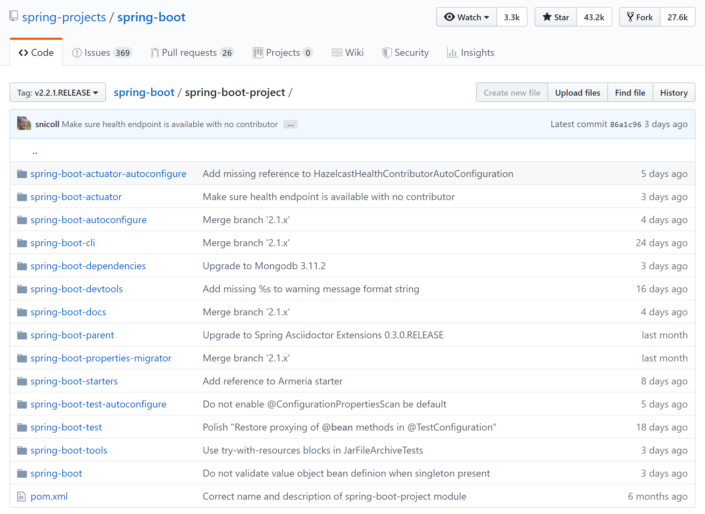

## 1.3 Spring Boot的主要模块

学习 Spring Boot必须得了解它的核心模块，以对其形成整体的印象。

和 Spring框架一样，Spring Boot也是一个庞大的项目，也是由许多核心子模块组成的。 

最权威的，也是最直接的是到Spring Boot在github上的源码，找到其[代码模块](https://github.com/spring-projects/spring-boot/tree/master/spring-boot-project)划分，如下图：

下面我们大概来了解一下 Spring Boot 的核心模块。

### 1.3.1 spring-boot

这是 Spring Boot 的主模块，也是支持其他模块的核心模块，主要包含以下几点：

- 提供了一个启动 Spring 应用的主类，并提供了一个相当方便的静态方法，它的主要是作用是负责创建和刷新 Spring 容器的上下文；

- 内嵌式的并可自由选择搭配的 WEB 应用容器，如：`Tomcat`, `Jetty`, `Undertow`等；

- 对配置外部化的支持；

- 提供一个很方便的 Spring 容器上下文初始化器，包括合理记录日志默认参数的支持。

### 1.3.2 spring-boot-autoconfigure

Spring Boot能根据类路径下的内容自动配置（启用）一些功能依赖（如数据库连接池、MongoDB、Redis等）。

Spring Boot提供的 `@EnableAutoConfiguration` 注解就是启用 Spring功能的自动配置。

自动配置功能可以推断用户可能需要加载哪些 Spring Bean, 如：如果类路径下有 `HicariCP` 这个连接池的包，此时并未提供任何有效连接池的配置，那么 Spring Boot就知道你可能需要一个连接池，并做相应配置。如果用户配置了其他连接池，那么 Spring Boot会放弃自动配置。

### 1.3.3 spring-boot-starters

Starters，我们叫它启动器好了，它是包括一系列依赖的描述符。简单的说就是，它可以一站式的帮你打包 Spring 及相关技术应用，而不需要你到处找依赖和示例配置代码，它都帮你做好了。

例如，第一章我们在介绍 Spring Boot 的时候就说了 `spring-boot-starter-web` 这个启动器，你只要引用了这个启动器应用，就会自动配置 WEB 应用的能力。

`spring-boot-starters` 这个启动器这主要提供了 `spring-boot`, `spring-context`, `spring-beans` 这三个 Spring 模块而已。

### 1.3.4 spring-boot-cli

Spring Boot CLI 是 Spring Boot Commad Line 的缩写，是 Spring Boot 命令行工具。在 Spring Boot CLI 中可以跑 Groovy 脚本，通过简单的 Java 语法就可以快速而又简单的学习 Spring Boot 原型。

它也能监控你的文件，一旦有变动就会自动重新编译和重新启动应用程序。

### 1.3.5 spring-boot-actuator

这是 Spring Boot 提供的执行端点，你可以更好的监控及和你的应用程序交互。这个模块提供了像健康端点、环境端点、Spring Bean端点等。

### 1.3.6 spring-boot-actuator-autoconfigure

这个原理同上，为 Spring Boot 执行端点提供自动配置。

### 1.3.7 spring-boot-test

Spring Boot测试模块，为应用测试提供了许多非常有用的核心功能。

### 1.3.8 spring-boot-test-autoconfigure

这个原理同上，为 Spring Boot 测试模块提供自动配置。

### 1.3.9 spring-boot-tools

这个模块包含了Spring Boot的一些工具，如Maven插件、Loader等。

例如其中的spring-boot-loader可以用来构建一个单独可执行的 jar 包，使用 `java -jar` 就能直接运行。我们一般不会直接使用这个来打包，而是使用 Spring Boot提供的 Maven（spring-boot-maven-plugin）或者 Gradle 插件就行了。

### 1.3.10 spring-boot-devtools

开发者工具模块，主要为 Spring Boot 开发阶段提供一些特性，如修改了代码自动重启应用等。这个模块的功能是可选的，只限于本地开发阶段，当打成整包运行时这些功能会被禁用。
