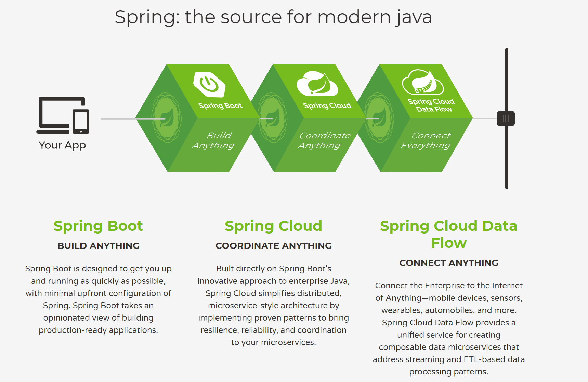

# 第1章 Spring Boot 介绍

当前，我们广泛使用的 Spring 技术栈，包含了基本的 Spring Framework，Spring Boot，Spring Cloud 和 Spring Cloud Data Flow。正如 Spring 官方网站[spring.io]( https://spring.io/ )宣称的一样：Spring 就是现代 java 之源。

其主要的三大系列框架，架构了 Spring 完整的宇宙：

- Spring Boot：构建万物；

- Spring Cloud：协同万物；

- Spring Cloud Data Flow：连接万物。



Spring 官方是这么宣传的，它也是这么做的，通过十多年的努力，它确实做到了是java程序员名副其实的**“源”**（the source）。

## <span id = 'springOverview'> 1.1  Spring 介绍</span>

当我们单独讲 Spring 时，一般是指 Spring Framework，就如下面的 maven 依赖所示，当前最新的版本为5.2.1（2019年11月2日release）。

```xml
<dependency>
    <groupId>org.springframework</groupId>
    <artifactId>spring-core</artifactId>
    <version>5.2.1.RELEASE</version>
</dependency>
```

### <span id = 'springOverview1'>1.1.1 Spring 概述</span>

Spring 是一个于2003 年兴起的一个轻量级的开源Java 开发框架，由其作者Rod Johnson 在其著作Expert One-On-One J2EE Development and Design中阐述的部分理念和原型衍生而来。它是为了解决企业应用开发的复杂性而创建的。框架的主要优势之一就是其分层架构，分层架构允许使用者选择使用哪一个组件，同时为 J2EE 应用程序开发提供集成的框架。

Spring使用基本的JavaBean（POJO）来完成以前只可能由EJB完成的事情。然而，Spring的用途不仅限于服务器端的开发。从简单性、可测试性和松耦合的角度而言，任何Java应用都可以从Spring中受益。Spring的核心是控制反转（IoC）和面向切面（AOP）。简单来说，Spring是一个分层的JavaSE/EE full-stack(一站式) 轻量级开源框架。

 Spring 框架是一个分层架构，由 7 个定义良好的模块组成。Spring 模块构建在核心容器之上，核心容器定义了创建、配置和管理 bean 的方式，如下图所示：

  

组成 Spring 框架的每个模块（或组件）都可以单独存在，或者与其他一个或多个模块联合实现。每个模块的功能如下：

- **核心容器：**核心容器提供 Spring 框架的基本功能。核心容器的主要组件是 BeanFactory，它是工厂模式的实现。BeanFactory 使用控制反转 （IoC） 模式将应用程序的配置和依赖性规范与实际的应用程序代码分开。
- **Spring 上下文：**Spring 上下文是一个配置文件，向 Spring 框架提供上下文信息。Spring 上下文包括企业服务，例如 JNDI、EJB、电子邮件、国际化、校验和调度功能。
- **Spring AOP：**通过配置管理特性，Spring AOP 模块直接将面向方面的编程功能集成到了 Spring 框架中。所以，可以很容易地使 Spring 框架管理的任何对象支持 AOP。Spring AOP 模块为基于 Spring 的应用程序中的对象提供了事务管理服务。通过使用 Spring AOP，不用依赖 EJB 组件，就可以将声明性事务管理集成到应用程序中。
- **Spring DAO：**JDBC DAO 抽象层提供了有意义的异常层次结构，可用该结构来管理异常处理和不同数据库供应商抛出的错误消息。异常层次结构简化了错误处理，并且极大地降低了需要编写的异常代码数量（例如打开和关闭连接）。Spring DAO 的面向 JDBC 的异常遵从通用的 DAO 异常层次结构。
- **Spring ORM：**Spring 框架插入了若干个 ORM 框架，从而提供了 ORM 的对象关系工具，其中包括 JDO、Hibernate 和 iBatis SQL Map。所有这些都遵从 Spring 的通用事务和 DAO 异常层次结构。
- **Spring Web 模块：**Web 上下文模块建立在应用程序上下文模块之上，为基于 Web 的应用程序提供了上下文。所以，Spring 框架支持与 Jakarta Struts 的集成。Web 模块还简化了处理多部分请求以及将请求参数绑定到域对象的工作。

- **Spring MVC 框架：**MVC 框架是一个全功能的构建 Web 应用程序的 MVC 实现。通过策略接口，MVC 框架变成为高度可配置的，MVC 容纳了大量视图技术，其中包括 JSP、Velocity、Tiles、iText 和 POI。

Spring 框架的功能可以用在任何 J2EE 服务器中，大多数功能也适用于不受管理的环境。Spring 的核心要点是：支持不绑定到特定 J2EE 服务的可重用业务和数据访问对象。毫无疑问，这样的对象可以在不同 J2EE 环境 （Web 或 EJB）、独立应用程序、测试环境之间重用。

Spring Framework的核心思想是**IoC**（控制反转，依赖注入）和**AOP**（面向切面编程）。

**控制反转模式**（也称作依赖性介入）的基本概念是：不创建对象，但是描述创建它们的方式。在代码中不直接与对象和服务连接，但在配置文件中描述哪一个组件需要哪一项服务。容器 （在 Spring 框架中是 IOC 容器） 负责将这些联系在一起。

在典型的 IOC 场景中，容器创建了所有对象，并设置必要的属性将它们连接在一起，决定什么时间调用方法。

**面向方面的编程**，即 AOP，是一种编程技术，它允许程序员对横切关注点或横切典型的职责分界线的行为（例如日志和事务管理）进行模块化。AOP 的核心构造是*方面*，它将那些影响多个类的行为封装到可重用的模块中。

AOP 和 IOC 是补充性的技术，它们都运用模块化方式解决企业应用程序开发中的复杂问题。在典型的面向对象开发方式中，可能要将日志记录语句放在所有方法和 Java 类中才能实现日志功能。在 AOP 方式中，可以反过来将日志服务*模块化*，并以声明的方式将它们应用到需要日志的组件上。当然，优势就是 Java 类不需要知道日志服务的存在，也不需要考虑相关的代码。所以，用 Spring AOP 编写的应用程序代码是松散耦合的。

IoC 在 Spring 中体现在组件依赖注入，如 @Component， @Controller， @Service， @Repository 等注解。

AOP 在Spring 中的应用典型的有：

- 自动事务管理；
- 统一日志管理。


### <span id = 'springOverview2'>1.1.2 Spring 的进化</span>


### <span id = 'springOverview3'>1.1.3 Spring 5 的新特性</span>


## <span id = 'springBootOverview'> 1.2. Spring Boot简介</span>


### <span id = 'springBootOverview1'>1.2.1 Spring Boot 概述</span>


### <span id = 'springBootOverview2'>1.2.2 Spring Boot 能做什么</span>


### <span id = 'springBootOverview3'>1.2.3 Spring Boot 2 的新特性</span>


## <span id = 'modules'>1.3. Spring Boot 的主要模块</span>


## <span id = 'helloSpringBoot'>1.4. Hello Spring Boot</span>


