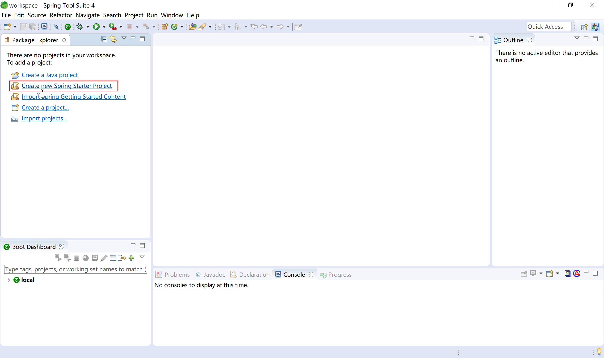
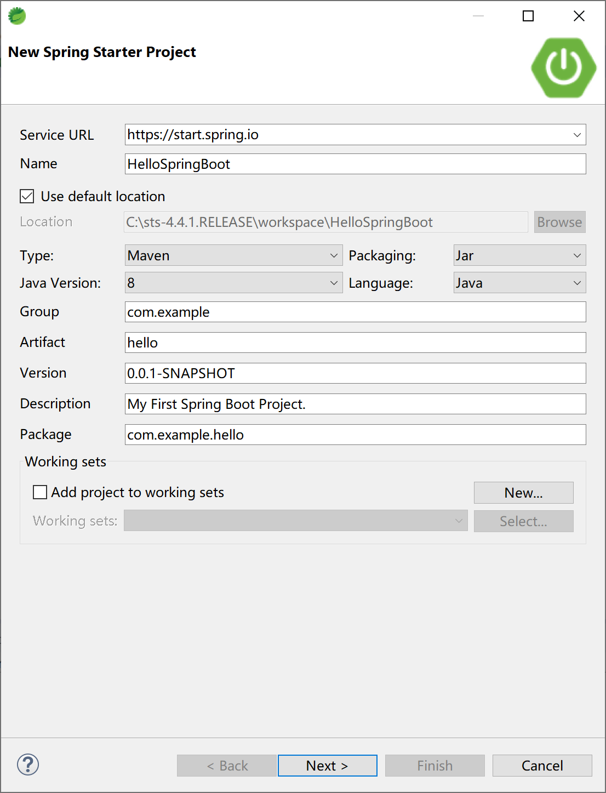
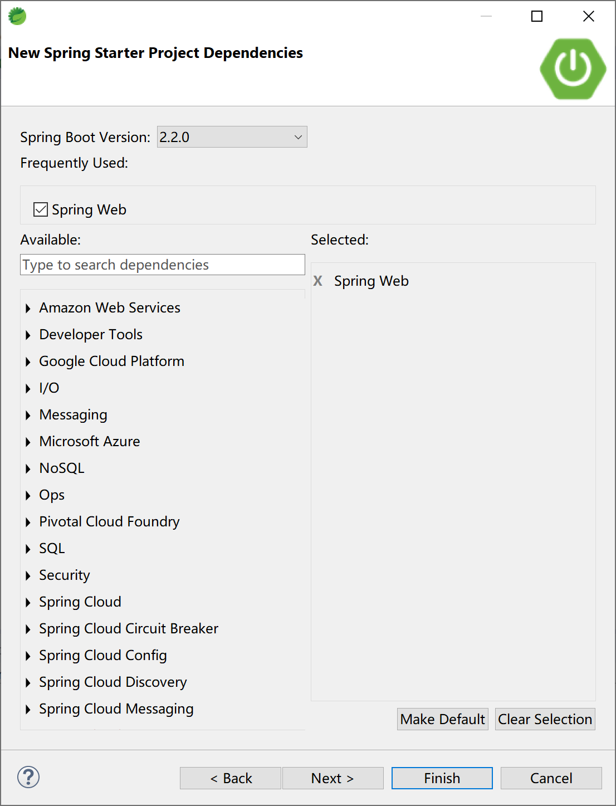
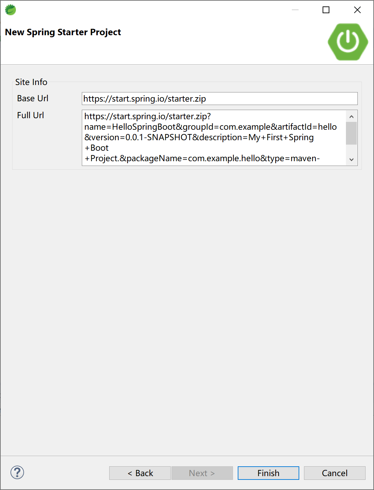
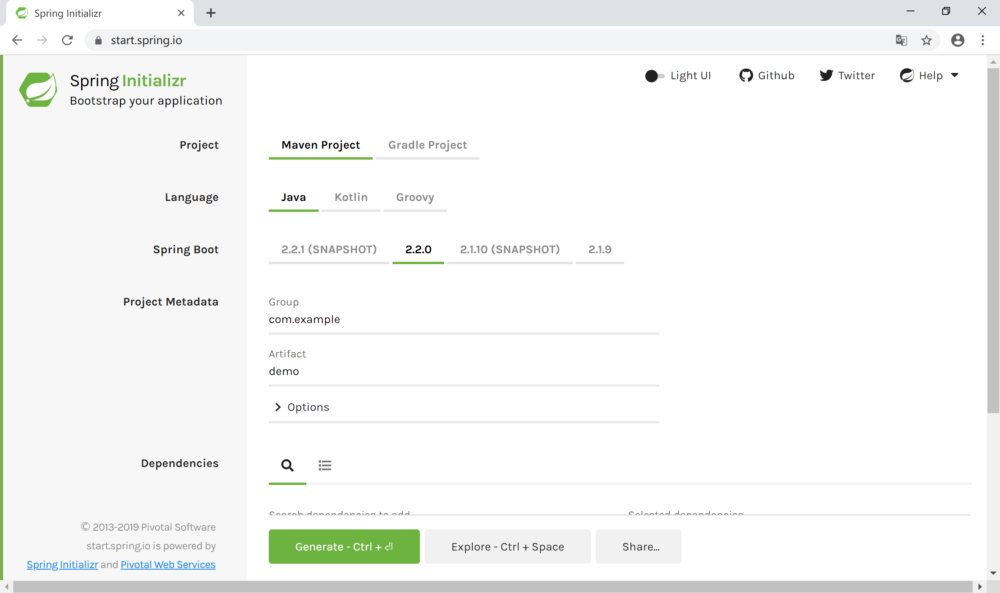
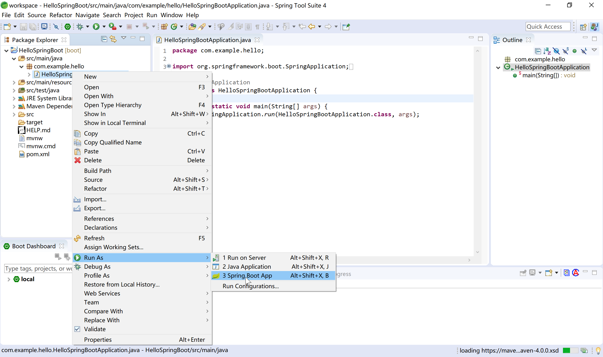
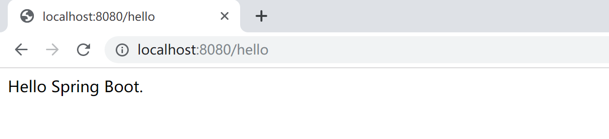

# 第1章 Spring Boot 介绍

当前，我们广泛使用的 Spring 技术栈，包含了基本的 Spring Framework，Spring Boot，Spring Cloud 和 Spring Cloud Data Flow。正如 Spring 官方网站[spring.io]( https://spring.io/ )宣称的一样：Spring 就是现代 java 之源。

其主要的三大系列框架，架构了 Spring 完整的宇宙：

- Spring Boot：构建万物；

- Spring Cloud：协同万物；

- Spring Cloud Data Flow：连接万物。


Spring 官方是这么宣传的，它也是这么做的，通过十多年的努力，它确实做到了是java程序员名副其实的**“源”**（the source）。

> 连接万物。什么是连接？
>
> 物联网中，5G是连接万物的基础。
>
> 中文社交网中，微信是连接人。
>
> 在Java程序开发中，Spring 就是连接的关键，就如它最早被叫做“胶水”一样。

## <span id = 'springOverview'> 1.1  Spring 介绍</span>

当我们单独讲 Spring 时，一般是指 Spring Framework，就如下面的 maven 依赖所示，当前最新的版本为5.2.1（2019年11月2日release）。

```xml
<dependency>
    <groupId>org.springframework</groupId>
    <artifactId>spring-core</artifactId>
    <version>5.2.1.RELEASE</version>
</dependency>
```

### <span id = 'springOverview1'>1.1.1 Spring 概述</span>

Spring 是一个于2003 年兴起的一个轻量级的开源Java 开发框架，由其作者Rod Johnson 在其著作Expert One-On-One J2EE Development and Design中阐述的部分理念和原型衍生而来。它是为了解决企业应用开发的复杂性而创建的。框架的主要优势之一就是其分层架构，分层架构允许使用者选择使用哪一个组件，同时为 J2EE 应用程序开发提供集成的框架。

Spring使用基本的JavaBean（POJO）来完成以前只可能由EJB完成的事情。然而，Spring的用途不仅限于服务器端的开发。从简单性、可测试性和松耦合的角度而言，任何Java应用都可以从Spring中受益。Spring的核心是控制反转（IoC）和面向切面（AOP）。简单来说，Spring是一个分层的JavaSE/EE full-stack(一站式) 轻量级开源框架。

下面，为了简化并抓住重点，我们以Spring Framework 1.1.1版本第一次提供的[reference](https://docs.spring.io/spring/docs/1.1.1/reference/)为基础，来介绍Spring的分层架构。

 Spring 框架是一个分层架构，由 7 个定义良好的模块组成。Spring 模块构建在核心容器之上，核心容器定义了创建、配置和管理 bean 的方式，如下图所示：

  

组成 Spring 框架的每个模块（或组件）都可以单独存在，或者与其他一个或多个模块联合实现。每个模块的功能如下：

- **核心容器：**核心容器提供 Spring 框架的基本功能。核心容器的主要组件是 BeanFactory，它是工厂模式的实现。BeanFactory 使用控制反转 （IoC） 模式将应用程序的配置和依赖性规范与实际的应用程序代码分开。
- **Spring 上下文：**Spring 上下文是一个配置文件，向 Spring 框架提供上下文信息。Spring 上下文包括企业服务，例如 JNDI、EJB、电子邮件、国际化、校验和调度功能。
- **Spring AOP：**通过配置管理特性，Spring AOP 模块直接将面向方面的编程功能集成到了 Spring 框架中。所以，可以很容易地使 Spring 框架管理的任何对象支持 AOP。Spring AOP 模块为基于 Spring 的应用程序中的对象提供了事务管理服务。通过使用 Spring AOP，不用依赖 EJB 组件，就可以将声明性事务管理集成到应用程序中。
- **Spring DAO：**JDBC DAO 抽象层提供了有意义的异常层次结构，可用该结构来管理异常处理和不同数据库供应商抛出的错误消息。异常层次结构简化了错误处理，并且极大地降低了需要编写的异常代码数量（例如打开和关闭连接）。Spring DAO 的面向 JDBC 的异常遵从通用的 DAO 异常层次结构。
- **Spring ORM：**Spring 框架插入了若干个 ORM 框架，从而提供了 ORM 的对象关系工具，其中包括 JDO、Hibernate 和 iBatis SQL Map（现在的MyBatis）。所有这些都遵从 Spring 的通用事务和 DAO 异常层次结构。
- **Spring Web 模块：**Web 上下文模块建立在应用程序上下文模块之上，为基于 Web 的应用程序提供了上下文。所以，Spring 框架支持与 Jakarta Struts 的集成。Web 模块还简化了处理多部分请求以及将请求参数绑定到域对象的工作。

- **Spring MVC 框架：**MVC 框架是一个全功能的构建 Web 应用程序的 MVC 实现。通过策略接口，MVC 框架变成为高度可配置的，MVC 容纳了大量视图技术，其中包括 JSP、Velocity、Tiles、iText 和 POI。

Spring 框架的功能可以用在任何 J2EE 服务器中，大多数功能也适用于不受管理的环境。Spring 的核心要点是：支持不绑定到特定 J2EE 服务的可重用业务和数据访问对象。毫无疑问，这样的对象可以在不同 J2EE 环境 （Web 或 EJB）、独立应用程序、测试环境之间重用。

Spring Framework的核心思想是**IoC**（控制反转，依赖注入）和**AOP**（面向切面编程）。

**控制反转模式**（也称作依赖性介入）的基本概念是：不创建对象，但是描述创建它们的方式。在代码中不直接与对象和服务连接，但在配置文件中描述哪一个组件需要哪一项服务。容器 （在 Spring 框架中是 IOC 容器） 负责将这些联系在一起。

在典型的 IOC 场景中，容器创建了所有对象，并设置必要的属性将它们连接在一起，决定什么时间调用方法。

**面向方面的编程**，即 AOP，是一种编程技术，它允许程序员对横切关注点或横切典型的职责分界线的行为（例如日志和事务管理）进行模块化。AOP 的核心构造是*方面*，它将那些影响多个类的行为封装到可重用的模块中。

AOP 和 IOC 是补充性的技术，它们都运用模块化方式解决企业应用程序开发中的复杂问题。在典型的面向对象开发方式中，可能要将日志记录语句放在所有方法和 Java 类中才能实现日志功能。在 AOP 方式中，可以反过来将日志服务*模块化*，并以声明的方式将它们应用到需要日志的组件上。当然，优势就是 Java 类不需要知道日志服务的存在，也不需要考虑相关的代码。所以，用 Spring AOP 编写的应用程序代码是松散耦合的。

IoC 在 Spring 中体现在组件依赖注入，如 @Component， @Controller， @Service， @Repository 等注解。

AOP 在Spring 中的应用典型的有：

- 自动事务管理；
- 统一日志管理。

### <span id = 'springOverview2'>1.1.2 Spring 的进化</span>

随着互联网技术的发展，Spring也在不断的进化，从最早轻量级的支持J2EE到现在对高并发，多线程异步程序的支持，Spring也不断的更新自己走在技术的最前沿，我们从Spring3到Spring5 看看spring的发展变迁。

Spring 1


Spring 2


Spring 3

s

Spring 4


Spring 5


#### 1.1.2.1 Spring 3.2.x和4.x 的架构变化

1. 从上面的图中可以看出，总体的层次结构没有太大变化，变化的是 Spring 4 去掉了 struts 模块(spring-struts包)。增加 WebSocket 模块(spring-websocket包)，增加了对 WebSocket、SockJS 以及 STOMP 的支持，它与 JSR-356 Java WebSocket API 兼容。另外，还提供了基于 SockJS（对 WebSocket 的模拟）的回调方案，以适应不支持 WebSocket 协议的浏览器。

2. 同时增加了 messaging 模块(spring-messaging)，提供了对 STOMP 的支持，以及用于路由和处理来自 WebSocket 客户端的 STOMP 消息的注解编程模型。spring-messaging 模块中还 包含了 Spring Integration 项目中的核心抽象类，如 Message、MessageChannel、MessageHandler。

3. 如果去看源代码的话，还可以发现还有一个新增的包，加强了 beans 模块，就是 spring-beans-groovy。应用可以部分或完全使用 Groovy 编写。借助于 Spring 4.0，能够使用 Groovy DSL 定义外部的 Bean 配置，这类似于 XML Bean 声明，但是语法更为简洁。使用Groovy还能够在启动代码中直接嵌入Bean的声明。

4. 对JDK的支持：Java 8支持。当然也支持Java6和Java7，但最好在使用Spring框架3.X或4.X时，将JDK升级到Java7，因为有些版本至少需要Java7。使用Spring4.x时Java EE版本至少要6或以上，且需要JPA 2.0和Servlet 3.0 的支持，所以服务器，web容器需要做相应的升级。一个更具前瞻性的注意是，Spring4.0支持J2EE 7的适用级规范，比如JMS 2.0， JTA 1.2， JPA 2.1， Bean Validation 1.1和JSR-236并发工具包，在选择这些jar包时需要注意版本。

5. 核心容器提升:

- 支持Bean的泛型注入，比如：@Autowired Repository customerRepository

- 使用元注解开发暴露指定内部属性的自定义注解。

- 通过 @Ordered注解或Ordered 接口对注入集合或数组的 Bean 进行排序。

- @Lazy 注解可以用在注入点或 @Bean 定义上。

- 为开发者引入 @Description 注解。

- 引入 @Conditional 注解进行有条件的 Bean过滤。

- 基于 CGLIB 的代理类不需要提供默认构造器，因为 Spring 框架将 CGLIB 整合到内部了。

- 框架支持时区管理，比如 LocalContext

5. Web提升

- 增加新的 @RestController 注解，这样就不需要在每个 @RequestMapping 方法中添加 @ResponseBody 注解。

- 添加 AsyncRestTemplate，在开发 REST 客户端时允许非阻塞异步支持。

- 为 Spring MVC 应用程序开发提供全面的时区支持。

#### 1.1.2.2 Spring 5 的架构变化

1. 升级到 Java SE 8 和 Java EE 7。

- 直到Spring 4 仍支持一些弃用的 Java 版本，但 Spring 5 已从旧包袱中解放出来。为了充分利用 Java 8 特性，它的代码库已进行了改进，而且该框架要求将 Java 8 作为最低的 JDK 版本。

- 在 API 级别上，Spring 5 兼容 Java EE 8 技术，满足对 Servlet 4.0、Bean Validation 2.0 和全新的 JSON Binding API 的需求。对 Java EE API 的最低要求为 V7，该版本引入了针对 Servlet、JPA 和 Bean Validation API 的次要版本。

2. 响应式编程模型

- Spring 5 最令人兴奋的新特性是它的响应式编程模型。Spring 5 Framework 基于一种响应式基础而构建，而且是完全异步和非阻塞的。只需少量的线程，新的事件循环执行模型就可以垂直扩展。

- 新的spring-webflux模块，一个基于reactive的spring-webmvc，完全的异步非阻塞，旨在使用event-loop执行模型和传统的线程池模型。

### <span id = 'springOverview3'>1.1.3 Spring 5 的新特性</span>

Spring 5.0是在2013年发布Spring 4后的第一个大版本，5.0 M1在2016年7月28日发布，当前最新版本为5.2.1。随着Spring Boot 和 Spring Cloud的广泛使用，使用Spring 5的人数是越来越多，如果你之前使用过Spring 4，那么Spring 5有哪些新的特性呢？一起来看下吧

基本可以归为如下几类：

- JDK版本升级
- Core框架修订，核心容器更新
- Kotlin函数式编程
- 响应式编程模型
- 测试改进
- 额外库支持
- 停止维护一些特性

#### 1.1.3.1 JDK版本升级

Spring 5的代码基于Java 8的语法规范，因此要想使用Spring 5，JDK的版本至少要在8.0以上。最开始的时候Spring 5.0 想使用Java 9，但是Java 9发布的时间比Spring 慢了18个月，然后Spring开发团队决定从Spring 5.0 中去除Java 9的依赖。

#### 1.1.3.2 Core框架修订

基于Java8的反射增强，方法的参数在Spring 5中可以高效的被访问

核心的Spring接口提供了利用了Java 8 的默认接口实现，default方法，提供了一些可选的声明

@Nullable和@NotNull注解精确的标记了方法的参数和返回值，这样可以在编译的时候处理null值，而不至于在运行的时候抛出空指针异常，NullPointerExceptions。

在日志端，Spring 5.0提供了Common Logging的桥接模块，spring-jcl，代替了标准的Common Logging，同时它还可以自动的检测Log4J2.x，SLF4J，JUL(java.util.logging)，而不需要额外的依赖。

#### 1.1.3.3 Kotlin函数式编程

Spring 5.0引入了JetBrains的Kotlin语言支持，Kotlin是一种支持函数式编程的面向对象编程语言。Kotlin也运行在JVM之上，有了Kotlin的支持，开发者可以使用Spring的函数式编程处理Web的入口点和Bean的注册。

比如你可以写成如下的代码风格。

在web的入口点的时候：

```kotlin
{
    ("/movie" and accept(TEXT_HTML)).nest {
        GET("/", movieHandler::findAllView)
        GET("/{card}", movieHandler::findOneView)
    }
    
    ("/api/movie" and accept(APPLICATION_JSON)).nest {
        GET("/", movieApiHandler::findAll)
        GET("/{id}", movieApiHandler::findOne)
    }
}
```

在注册Bean的时候：

```kotlin
val context = GenericApplicationContext {
    registerBean()
    
    registerBean {
        Cinema(it.getBean()) 
    }
}
```

#### 1.1.3.4 响应式编程模型

激动人心的Spring 5.0特性就是它的响应式Web编程

Reactive Streams(响应式流)是NetFlix ，Pivotal, Typesafe, Red Hat, Oracle, Twitter, 和 Spray.io共同开发的一套规范。它提供了一些通用的API, 实现的话可以自己控制，就像Hibernate之JPA，JPA是api，Hibernate是实现。

响应式流是Java9的正式模块，但是在Java8中，我们需要引入额外的依赖。Spring5.0的流式支持基于响应式流的API的[Project Reactor](https://projectreactor.io/)

Spring 5.0有个新的模块叫做spring-webflux，可以支持响应式的Http和WebSocket客户端。

通过Spring Webflux，你可以创建Webclient，它是响应式和非阻塞的RestTemplate的替代。如下是代码示范：

```java
WebClient webClient = WebClient.create();
Mono person = webClient.get()
.uri("http://localhost:8080/movie/42")
.accept(MediaType.APPLICATION_JSON)
.exchange()
.then(response -> response.bodyToMono(Movie.class));
```

#### 1.1.3.5 测试改进

Spring 5.0完全支持Junit 5，在TestContext框架中，可以并行的执行测试。对于响应式的编程，Spring-test提供了WebTestClient来测试spring-webflux。WebTestClient，就像MockMvc不需要运行的服务器。

当然Spring 5.0还是支持Junit 4的，在未来的一段时间里Junit 4是都会存在的。

#### 1.1.3.6 支持更多的库

Spring 5.0现在支持下面的库版本：

- [Jackson 2.6](https://github.com/FasterXML/jackson/wiki/Jackson-Release-2.6)+
-  [EhCache](http://www.ehcache.org/documentation/3.0/) 2.10+ / 3.0 GA
-  [Hibernate 5.0](http://docs.jboss.org/hibernate/orm/5.0/userguide/html_single/Hibernate_User_Guide.html)+
-  [JDBC 4.0](https://docs.oracle.com/javadb/10.8.3.0/ref/rrefjdbc4_0summary.html)+
-  [XmlUnit 2.x](https://github.com/xmlunit/user-guide/wiki)+
-  [OkHttp 3.x](https://square.github.io/okhttp/)+
-  [Netty 4.1](https://netty.io/wiki/user-guide-for-4.x.html)+

#### 1.1.3.7 停止维护的一些特性

在API层面上，Spring5.0不再支持下面的包了：

- beans.factory.access
- jdbc.support.nativejdbc
- spring-aspects模块的mock.staticmock
- web.view.tiles2M. 现在Tiles 3是最低要求的版本
- orm.hibernate3和orm.hibernate4.现在支持Hibernate5

不再支持如下库：

- Portlet
- Velocity
- JasperReports
- XMLBeans
- JDO
- Guava

如果你在当前的项目中使用到了上面提到的这些库，那么最好不要升级到Spring5的版本

#### 1.1.3.8 小结

响应式编程已经变得越来越流行，我们会看到越来越多的技术实现响应式的方案，对响应式编程感兴趣的可以多做更多的了解。

## <span id = 'springBootOverview'> 1.2. Spring Boot简介</span>

在 Java 后端框架繁荣的今天，Spring 框架无疑是最最火热，也是必不可少的开源框架，更是稳坐 Java 后端框架的龙头老大。

用过 Spring 框架的都知道 Spring 能流行是因为它的两把利器：IOC 和 AOP，IOC 可以帮助我们管理对象的依赖关系，极大减少对象的耦合性，而 AOP 的切面编程功能可以更方面的使用动态代理来实现各种动态方法功能（如事务、缓存、日志等）。

而要集成 Spring 框架，必须要用到 XML 配置文件，或者注解式的 Java 代码配置。无论是使用 XML 或者代码配置方式，都需要对相关组件的配置有足够的了解，然后再编写大量冗长的配置代码。

然后又有多少开发人员能精通这些配置呢？如果我们只提供一些配置参数让框架能自动配置这些组件，那是不是会更加容易。

基于简化 Spring 快速上手为目的，Spring Boot 框架诞生了！当然，Spring Boot之前，还有一个基于代码生成的叫做Spring Roo的开发工具。正如Spring Boot 宣称的那样“如果（骨架）代码可以生成，那就是不要生成代码，使用配置、自动装配方式，来的更优雅”。所以，Spring Roo早就被抛弃了，现在最火热的当然是，也必须是Spring Boot。

> Spring Roo is an easy-to-use development tool for quickly building web applications in the Java programming language, which can be used as an standalone application or as an Eclipse or STS plugin. It allows you to build high-quality, high-performance, lock-in-free enterprise applications in just minutes. 

### <span id = 'springBootOverview1'>1.2.1 Spring Boot 概述</span>

Spring Boot是 Spring 开源组织下的一个子项目，也是 Spring 组件一站式解决方案，主要是为了简化使用 Spring 框架的难度，简省繁重的配置。

Spring Boot提供了各种组件的启动器（starters），开发者只要能配置好对应组件参数，Spring Boot 就会自动配置，让开发者能快速搭建依赖于 Spring 组件的 Java 项目。

Spring Boot不但能创建传统的 war 包应用，还能创建独立的不依赖于任何外部容器（如：tomcat）的独立应用，使用 `java -jar` 命令就能启动。同时，Spring Boot也提供了一个命令行工具来执行 Spring 的脚本。

Spring Boot 的设计目标是：

- 为 Spring 应用开发提供一个更快、更容易上手的入门体验；
- 提供一系列在大型项目中经常用到的公共的非功能性特性，如：内嵌入服务器、安全、度量指标、健康检测、外部化配置；
- 零代码配置生成及零 XML 配置；

### <span id = 'springBootOverview2'>1.2.2 Spring Boot 能做什么</span>

1. **独立运行**

Spring Boot内嵌了各种 Servlet 容器，Tomcat、Jetty等，现在不再需要打成 war 包部署到容器中，Spring Boot 只要打成一个可执行的jar包就能独立运行，所有的依赖包都在一个 jar 包内。

对一个程序员来说，回归到入口main函数的感觉，简直是不能再棒了。

```java
package com.example.demo;

import org.springframework.boot.SpringApplication;
import org.springframework.boot.autoconfigure.SpringBootApplication;

@SpringBootApplication
public class DemoApplication {

	public static void main(String[] args) {
		SpringApplication.run(DemoApplication.class, args);
	}

}
```

2. **简化 Maven 配置**

例如只要依赖 `spring-boot-starter-web` 启动器，它包含所有 web 开发所有的依赖，就能拥有 Spring Web 的能力，极大简少了 maven 对依赖的配置。 

3. **自动配置**

Spring Boot能根据当前类路径下的类或者 jar 包里面来的类来自动配置 Spring Bean，如添加一个 `spring-boot-starter-web` 启动器就能拥有 web 的功能，无需其他配置。也可以在配置文件中添加相关配置来自定义装配，这个后面的课程会讲到，请关注后续内容。

4. **无代码生成和XML配置**

Spring Boot 配置过程中无代码生成，也无需XML配置文件就能完成所有配置工作，这一切都是借助于条件注解完成的，这也是 Spring 4+ 的核心功能之一。

5. **应用监控**

Spring Boot提供一系列端点可以监控服务及应用，能对Spring 应用做健康检测。

### <span id = 'springBootOverview3'>1.2.3 Spring Boot 2 的新特性</span>

Spring Boot 依赖于Spring，而Spring Cloud 又依赖于Spring Boot，因此Spring Boot2.0的发布正式整合了Spring5.0 的很多特性，同样后面Spring Cloud 最新版本的发布也整合了最新的Spring Boot2.0内容。 

#### 1.2.3.1 基于 Java 8，支持 Java 9

也就是说Spring Boot2.0的最低版本要求为JDK8，据了解国内大部分的互联网公司系统都还跑在JDK1.6/7上，因此想要升级到Spring Boot2.0的同学们注意啦，同时支持了Java9，也仅仅是支持而已。

#### 1.2.3.2 响应式编程

使用 Spring WebFlux/WebFlux.fn提供响应式 Web 编程支持， Webflux 是一个全新的非堵塞的函数式 Reactive Web 框架，可以用来构建异步的、非堵塞的、事件驱动的服务，在伸缩性方面表现非常好，此功能来源于Spring5.0。

Spring Boot2.0也提供对响应式编程的自动化配置，如：Reactive Spring Data、Reactive Spring Security 等。

#### 1.2.3.3 HTTP/2支持

在Tomcat, Undertow 和 Jetty 中均已支持 HTTP/2。

#### 1.2.3.4 对Kotlin支持

引入对 Kotlin 1.2.x 的支持，并提供了一个 runApplication 函数，让你通过惯用的 Kotlin 来运行 Spring Boot 应用程序。

#### 1.2.3.5 全新的执行器架构

全新的执行器架构，支持 Spring MVC, WebFlux 和 Jersey。

#### 1.2.3.6 支持 Quartz

Spring Boot1.0并没有提供对 Quartz 的支持，之前出现了各种集成方案，Spring Boot2.0给出了最简单的集成方式。

#### 1.2.3.7 Security

大大的简化了安全自动配置。

#### 1.2.3.8 Metrics

Metrics 方面，Spring Boot 2引入了Micrometer，来统一metrics的规范，使得开发人员更好的理解和使用metrics的模块，而不需要关心对接的具体存储是什么。

#### 1.2.3.9 监控方面

Spring Boot 2 增强了对 Micrometer 的集成。RabbitMQ、JVM 线程和垃圾收集指标会自动进行 instrument 监控，异步控制器(controller)也会自动添加到监控里。通过集成，还可以对 InfluxDB 服务器进行监控。

#### 1.2.3.10 数据方面

- db方面，默认引入了HikariCP，替代了之前的tomcat-pool作为底层的数据库连接池， 对比于tomcat-pool， HikariCP拥有更好的性能，总而言之就是提高了db的访问速度；
- JOOQ的支持；
- Redis方面， 默认引入了Lettuce, 替代了之前的jedis作为底层的redis链接方式；
- MongoDB\Hibernate优化。

#### 1.2.3.11 Thymeleaf 3

Spring Boot 2支持了Thymeleaf 3，Thymeleaf 3相对于Thymeleaf 2性能提升可不是一点点，因为2.0的性能确实不咋地，同时也使用了新的页面解析系统。

#### 1.2.3.12 OAuth 2.0

同时也加入了 对于OAuth 2.0的支持， 使得开发人员更加友好的使用spring-security来完成权限模块的开发。

#### 1.2.3.13 依赖组件的更新

- Jetty 9.4
- Tomcat 8.5
- Flyway 5
- Hibernate 5.2
- Gradle 3.4
- Thymeleaf 3.0

注意：最后还有一个小彩蛋，Spring Boot2.0支持了动态gif的启动logo打印，这纯粹是为了好玩。

## <span id = 'modules'>1.3 Spring Boot 的主要模块</span>

学习 Spring Boot 必须得了解它的核心模块，和 Spring 框架一样，Spring Boot 也是一个庞大的项目，也是由许多核心子模块组成的。 

下面我们大概来了解一下 Spring Boot 的核心模块。

### 1.3.1 spring-boot

这是 Spring Boot 的主模块，也是支持其他模块的核心模块，主要包含以下几点：

- 提供了一个启动 Spring 应用的主类，并提供了一个相当方便的静态方法，它的主要是作用是负责创建和刷新 Spring 容器的上下文；

- 内嵌式的并可自由选择搭配的 WEB 应用容器，如：`Tomcat`, `Jetty`, `Undertow`等；

- 对配置外部化的支持；

- 提供一个很方便的 Spring 容器上下文初始化器，包括合理记录日志默认参数的支持。

### 1.3.2 spring-boot-autoconfigure

Spring Boot能根据类路径下的内容自动一些公共大型应用，提供的 `@EnableAutoConfiguration` 注解就能启用 Spring 功能的自动配置。

自动配置功能可以推断用户可能需要加载哪些 Spring Bean, 如：如果类路径下有 `HicariCP` 这个连接池的包，此时并未提供任何有效连接池的配置，那么 Spring Boot 就知道你可能需要一个连接池，并做相应配置。如果用户配置了其他连接池，那么 Spring Boot 会放弃自动配置。

### 1.3.3 spring-boot-starters

Starters，我们叫它启动器好了，它是包括一系列依赖的描述符。简单的说就是，它可以一站式的帮你打包 Spring 及相关技术应用，而不需要你到处找依赖和示例配置代码，它都帮你做好了。

例如，第一章我们在介绍 Spring Boot 的时候就说了 `spring-boot-starter-web` 这个启动器，你只要引用了这个启动器应用，就会自动配置 WEB 应用的能力。

`spring-boot-starters` 这个启动器这主要提供了 `spring-boot`, `spring-context`, `spring-beans` 这三个 Spring 模块而已。

### 1.3.4 spring-boot-cli

这是 Spring Boot 的命令行工具，用于编译和运行 `Groovy` 源程序，可以十分简单的编写并运行一个应用程序。它也能监控你的文件，一旦有变动就会自动重新编译和重新启动应用程序。

### 1.3.5 spring-boot-actuator

这是 Spring Boot 提供的执行端点，你可以更好的监控及和你的应用程序交互。这个模块提供了像健康端点、环境端点、Spring Bean端点等。

### 1.3.6 spring-boot-actuator-autoconfigure

这个原理同上，为 Spring Boot 执行端点提供自动配置。

### 1.3.7 spring-boot-test

Spring Boot测试模块，为应用测试提供了许多非常有用的核心功能。

### 1.3.8 spring-boot-test-autoconfigure

这个原理同上，为 Spring Boot 测试模块提供自动配置。

### 1.3.9 spring-boot-loader

这个模块可以用来构建一个单独可执行的 jar 包，使用 `java -jar` 就能直接运行。一般不会直接使用这个来打包，使用 Spring Boot 提供的 Maven 或者 Gradle 插件就行了。

### 1.3.10 spring-boot-devtools

开发者工具模块，主要为 Spring Boot 开发阶段提供一些特性，如修改了代码自动重启应用等。这个模块的功能是可选的，只限于本地开发阶段，当打成整包运行时这些功能会被禁用。


## <span id = 'helloSpringBoot'>1.4 Hello Spring Boot</span>

程序员都有”Hello world.“情结，我们在了解了Spring和Spring Boot的历史和特性之后，也以Spring Boot的“Hello world.”来开始我们后续的Spring Boot学习。

请参照本教程第2章的“开发环境配置”，完成本地开发环境的配置，然后再来“Hello Spring Boot.”。

首先，我们创建一个Spring Starter工程，如下图所示：




输入项目名称、项目的GAV（maven依赖的坐标：**G**roup、**A**rtifact、**V**ersion）、Package等信息：




选择Spring Boot的版本，当前最新为2.2.0（截至2019年11月）：




其实，STS开发工具，是通过Eclipse插件连接到网络，根据我们之前给定的参数设定请求参数，然后在Spring官网生成项目骨架（starter.zip），这和在 [start.spring.io](https://start.spring.io/) 上生成项目骨架是完全一致的。




参考 [start.spring.io](https://start.spring.io/) 生成项目骨架，后台服务一定是相同的。




稍等片刻（如果网络不给力，有可能要等上好一阵子呢），maven会下载所有的依赖。

Spring官网为我们生成的pom.xml文件如下：

```xml
<?xml version="1.0" encoding="UTF-8"?>
<project xmlns="http://maven.apache.org/POM/4.0.0" xmlns:xsi="http://www.w3.org/2001/XMLSchema-instance"
	xsi:schemaLocation="http://maven.apache.org/POM/4.0.0 https://maven.apache.org/xsd/maven-4.0.0.xsd">
	<modelVersion>4.0.0</modelVersion>
	<parent>
		<groupId>org.springframework.boot</groupId>
		<artifactId>spring-boot-starter-parent</artifactId>
		<version>2.2.0.RELEASE</version>
		<relativePath/> <!-- lookup parent from repository -->
	</parent>
	<groupId>com.example</groupId>
	<artifactId>hello</artifactId>
	<version>0.0.1-SNAPSHOT</version>
	<name>HelloSpringBoot</name>
	<description>My First Spring Boot Project.</description>

	<properties>
		<java.version>1.8</java.version>
	</properties>

	<dependencies>
		<dependency>
			<groupId>org.springframework.boot</groupId>
			<artifactId>spring-boot-starter-web</artifactId>
		</dependency>

		<dependency>
			<groupId>org.springframework.boot</groupId>
			<artifactId>spring-boot-starter-test</artifactId>
			<scope>test</scope>
			<exclusions>
				<exclusion>
					<groupId>org.junit.vintage</groupId>
					<artifactId>junit-vintage-engine</artifactId>
				</exclusion>
			</exclusions>
		</dependency>
	</dependencies>

	<build>
		<plugins>
			<plugin>
				<groupId>org.springframework.boot</groupId>
				<artifactId>spring-boot-maven-plugin</artifactId>
			</plugin>
		</plugins>
	</build>

</project>
```

需要注意的有几点：

- 第6-9行的spring-boot-starter-parent；
- 第22-25行的spring-boot-starter-web；
- 第42-45行的spring-boot-maven-plugin；

这些依赖，为我们大大简化了Spring应用程序的配置。当然，其中也隐藏了大量的魔法，在第3章中我们会简要的介绍这些魔法是怎么实现的，在这里，大家不要过度关注，不理解也不影响我们Say Hello to Spring Boot.

我们再来关注启动入口类`HelloSpringBootApplication`，这将是我们进入Spring Boot世界的第一道门。

```java
package com.example.hello;

import org.springframework.boot.SpringApplication;
import org.springframework.boot.autoconfigure.SpringBootApplication;

@SpringBootApplication
public class HelloSpringBootApplication {

	public static void main(String[] args) {
		SpringApplication.run(HelloSpringBootApplication.class, args);
	}

}
```

这里唯一陌生的，也是最需要关注的，当然就是`@SpringBootApplication`这个注解。它标识了这个类是个Spring Boot的应用程序。

这个类中有main方法，运行它看看效果：



虽然没有啥效果，但控制台打出的日志，表明，这个Spring Boot程序确实可以正确运行。

```

  .   ____          _            __ _ _
 /\\ / ___'_ __ _ _(_)_ __  __ _ \ \ \ \
( ( )\___ | '_ | '_| | '_ \/ _` | \ \ \ \
 \\/  ___)| |_)| | | | | || (_| |  ) ) ) )
  '  |____| .__|_| |_|_| |_\__, | / / / /
 =========|_|==============|___/=/_/_/_/
 :: Spring Boot ::        (v2.2.0.RELEASE)

2019-11-06 22:27:52.949  INFO 1704 --- [           main] c.e.hello.HelloSpringBootApplication     : Starting HelloSpringBootApplication on NOTEBOOK-KEVIN with PID 1704 (C:\sts-4.4.1.RELEASE\workspace\HelloSpringBoot\target\classes started by Kevin in C:\sts-4.4.1.RELEASE\workspace\HelloSpringBoot)
2019-11-06 22:27:52.952  INFO 1704 --- [           main] c.e.hello.HelloSpringBootApplication     : No active profile set, falling back to default profiles: default
2019-11-06 22:27:53.663  INFO 1704 --- [           main] o.s.b.w.embedded.tomcat.TomcatWebServer  : Tomcat initialized with port(s): 8080 (http)
2019-11-06 22:27:53.671  INFO 1704 --- [           main] o.apache.catalina.core.StandardService   : Starting service [Tomcat]
2019-11-06 22:27:53.672  INFO 1704 --- [           main] org.apache.catalina.core.StandardEngine  : Starting Servlet engine: [Apache Tomcat/9.0.27]
2019-11-06 22:27:53.727  INFO 1704 --- [           main] o.a.c.c.C.[Tomcat].[localhost].[/]       : Initializing Spring embedded WebApplicationContext
2019-11-06 22:27:53.728  INFO 1704 --- [           main] o.s.web.context.ContextLoader            : Root WebApplicationContext: initialization completed in 736 ms
2019-11-06 22:27:53.861  INFO 1704 --- [           main] o.s.s.concurrent.ThreadPoolTaskExecutor  : Initializing ExecutorService 'applicationTaskExecutor'
2019-11-06 22:27:54.019  INFO 1704 --- [           main] o.s.b.w.embedded.tomcat.TomcatWebServer  : Tomcat started on port(s): 8080 (http) with context path ''
2019-11-06 22:27:54.021  INFO 1704 --- [           main] c.e.hello.HelloSpringBootApplication     : Started HelloSpringBootApplication in 1.422 seconds (JVM running for 2.316)
```

下面，我们为这个程序添加一个Controller，输出“Hello Spring Boot.”这句话。

首先创建`com.example.hello.controller`包，然后在其下创建`SayHelloController`类，代码如下：

```java
package com.example.hello.controller;

import org.springframework.web.bind.annotation.RequestMapping;
import org.springframework.web.bind.annotation.RestController;

@RestController
public class SayHelloController {
	
	@RequestMapping("/hello")
	public String sayHello() {
		return "Hello Spring Boot.";
	}

}
```

再次运行`HelloSpringBootApplication`这个类（当然，也可以说运行这个Spring Boot应用/程序），在控制台中输出的日志，已经包含`DispatcherServlet`这个Spring MVC的前端分发器类了。

```

  .   ____          _            __ _ _
 /\\ / ___'_ __ _ _(_)_ __  __ _ \ \ \ \
( ( )\___ | '_ | '_| | '_ \/ _` | \ \ \ \
 \\/  ___)| |_)| | | | | || (_| |  ) ) ) )
  '  |____| .__|_| |_|_| |_\__, | / / / /
 =========|_|==============|___/=/_/_/_/
 :: Spring Boot ::        (v2.2.0.RELEASE)

2019-11-06 22:33:48.882  INFO 7872 --- [           main] c.e.hello.HelloSpringBootApplication     : Starting HelloSpringBootApplication on NOTEBOOK-KEVIN with PID 7872 (C:\sts-4.4.1.RELEASE\workspace\HelloSpringBoot\target\classes started by Kevin in C:\sts-4.4.1.RELEASE\workspace\HelloSpringBoot)
2019-11-06 22:33:48.891  INFO 7872 --- [           main] c.e.hello.HelloSpringBootApplication     : No active profile set, falling back to default profiles: default
2019-11-06 22:33:49.558  INFO 7872 --- [           main] o.s.b.w.embedded.tomcat.TomcatWebServer  : Tomcat initialized with port(s): 8080 (http)
2019-11-06 22:33:49.564  INFO 7872 --- [           main] o.apache.catalina.core.StandardService   : Starting service [Tomcat]
2019-11-06 22:33:49.565  INFO 7872 --- [           main] org.apache.catalina.core.StandardEngine  : Starting Servlet engine: [Apache Tomcat/9.0.27]
2019-11-06 22:33:49.613  INFO 7872 --- [           main] o.a.c.c.C.[Tomcat].[localhost].[/]       : Initializing Spring embedded WebApplicationContext
2019-11-06 22:33:49.614  INFO 7872 --- [           main] o.s.web.context.ContextLoader            : Root WebApplicationContext: initialization completed in 688 ms
2019-11-06 22:33:49.731  INFO 7872 --- [           main] o.s.s.concurrent.ThreadPoolTaskExecutor  : Initializing ExecutorService 'applicationTaskExecutor'
2019-11-06 22:33:49.863  INFO 7872 --- [           main] o.s.b.w.embedded.tomcat.TomcatWebServer  : Tomcat started on port(s): 8080 (http) with context path ''
2019-11-06 22:33:49.865  INFO 7872 --- [           main] c.e.hello.HelloSpringBootApplication     : Started HelloSpringBootApplication in 1.262 seconds (JVM running for 1.873)
2019-11-06 22:33:59.678  INFO 7872 --- [nio-8080-exec-1] o.a.c.c.C.[Tomcat].[localhost].[/]       : Initializing Spring DispatcherServlet 'dispatcherServlet'
2019-11-06 22:33:59.678  INFO 7872 --- [nio-8080-exec-1] o.s.web.servlet.DispatcherServlet        : Initializing Servlet 'dispatcherServlet'
2019-11-06 22:33:59.686  INFO 7872 --- [nio-8080-exec-1] o.s.web.servlet.DispatcherServlet        : Completed initialization in 8 ms
```

打开浏览器，访问[localhost:8080/hello](http://localhost:8080/hello)，可以正确得到前面Controller类中sayHello方法的输出：



恭喜你，你已经完成了你的第一个Spring Boot程序。

后续，我们会一步一步地介绍在实际工作中，如何使用Spring Boot集成我们常用的开发框架/类库。