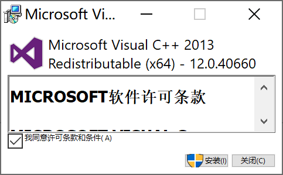
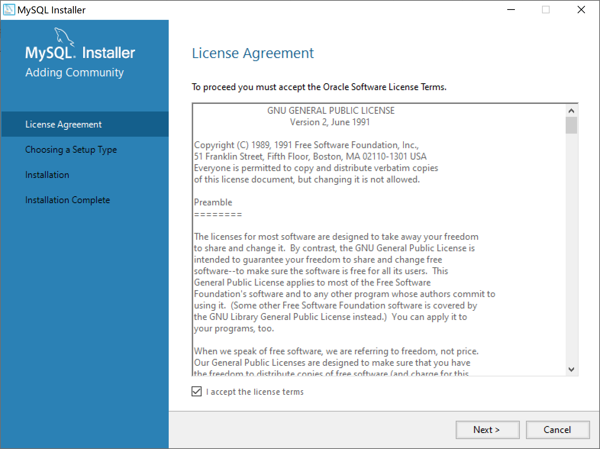
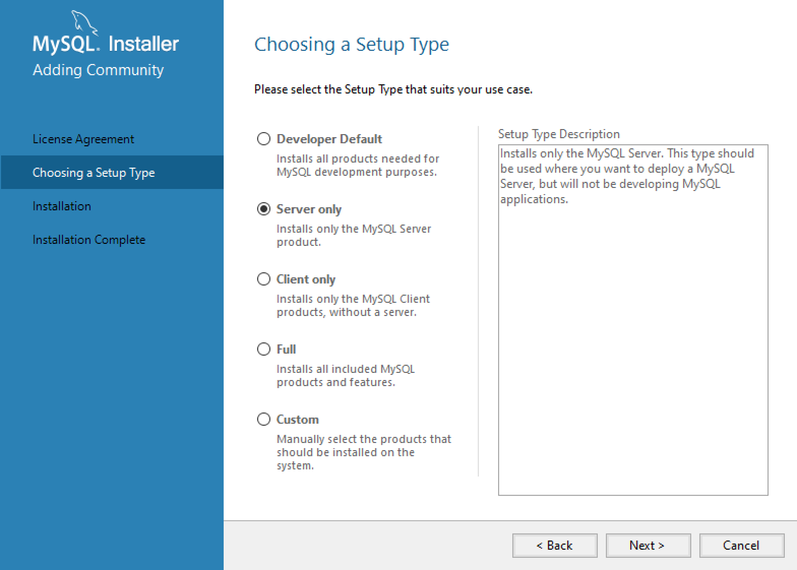
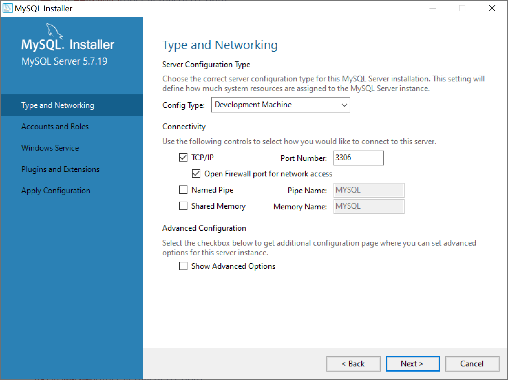
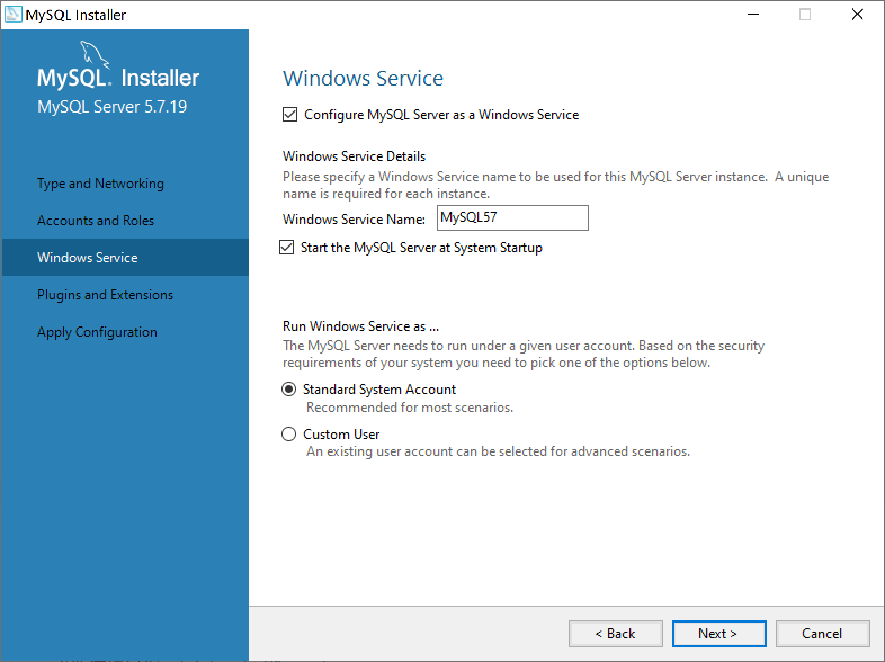
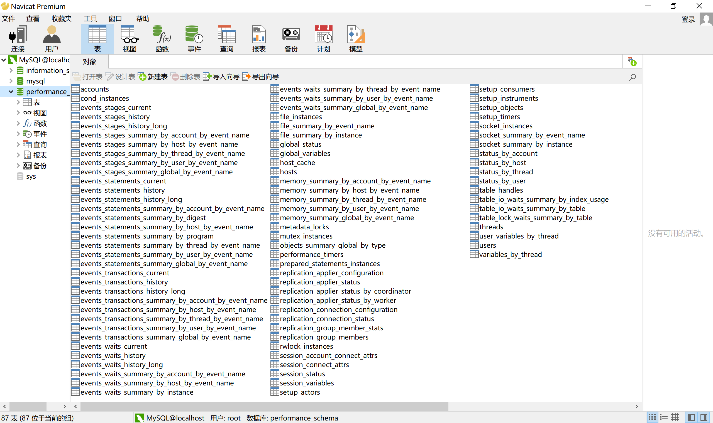

## 2.4 安装MySQL和管理工具

在Windows 10下安装MySQL 5.7.19，需要提前安装微软的VC++2013依赖库vcredist_x64，可在微软官方网站下载。

接下来就可以安装MySQL了。

选择“只安装服务器”。

确认安装。

安装完成。

准备配置MySQL服务器。

选择配置MySQL服务器类型。

配置服务器为开发服务器，以减少对计算机资源的占用。

设置root用户密码，尽量使用足够复杂的密码。

配置MySQL为Windows系统服务。

完成安装。

安装MySQL管理工具，如navicat。

打开navicat验证MySQL是否正确安装。

