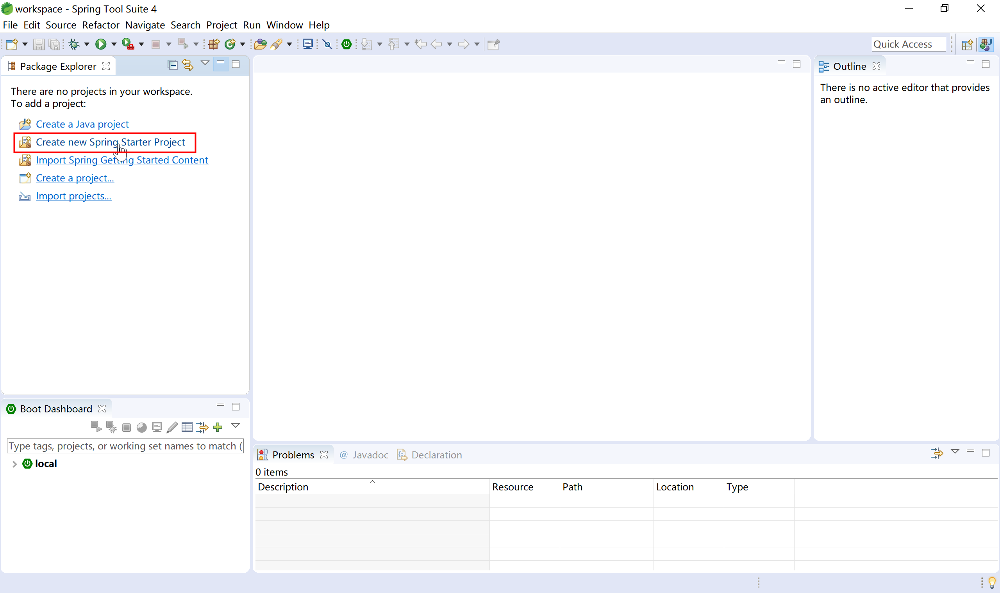
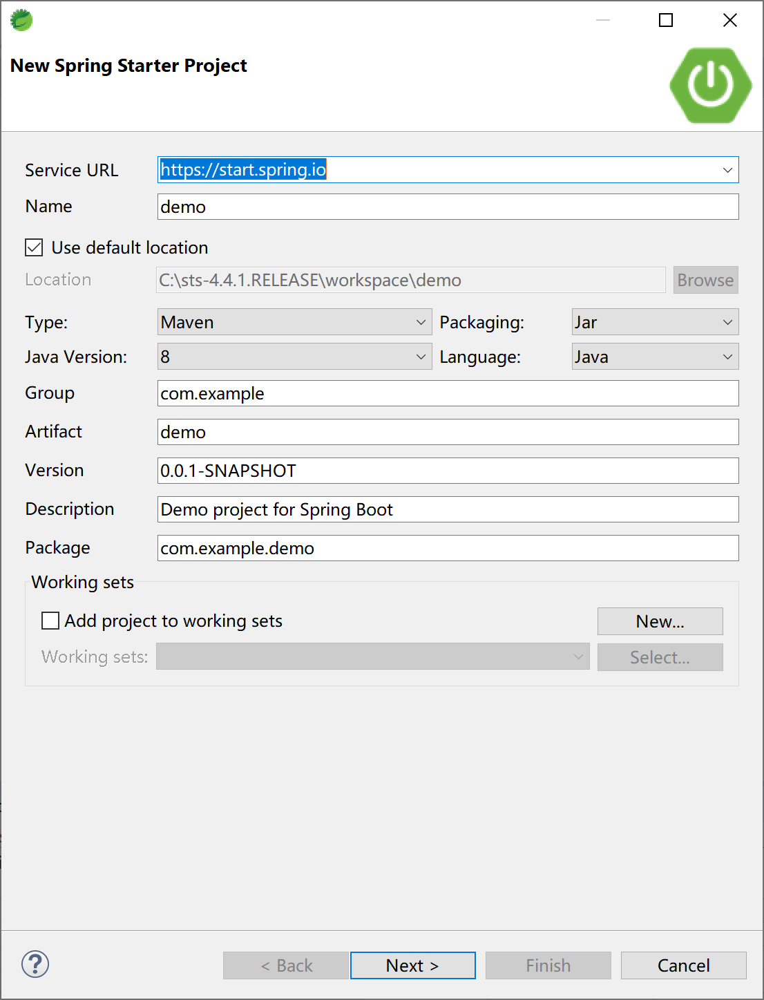
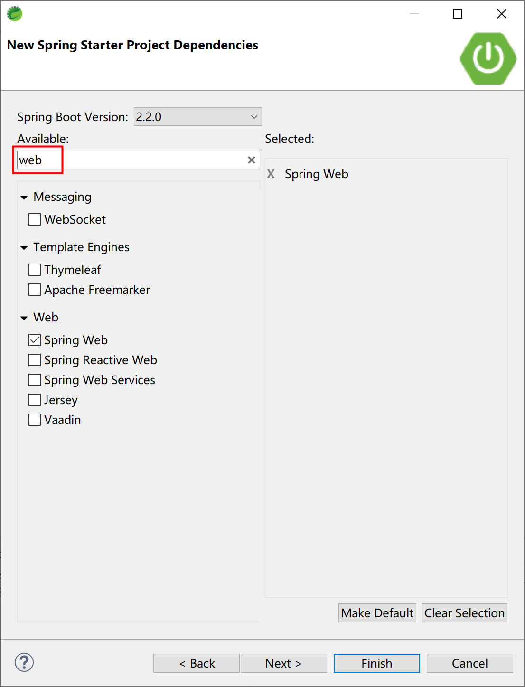
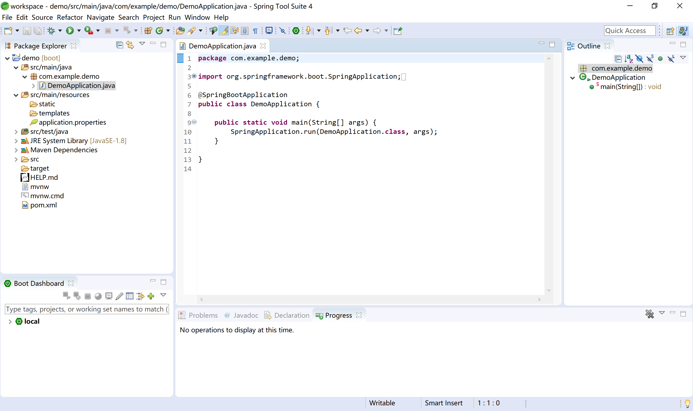

## 2.5 验证开发环境

在STS中新建一个Spring Starter项目。



在新建Spring Starter项目中，使用默认配置。



选择Spring Boot的starter，这里我们输入“web”进行快速定位和选择，然后单击Finish按钮。



STS会根据我们前面给定的项目信息，联网到[https://start.spring.io](https://start.spring.io)创建最初始的Spring Boot项目。



我们可以进一步检查pom文件，观察其内容如下：

```xml
<?xml version="1.0" encoding="UTF-8"?>
<project xmlns="http://maven.apache.org/POM/4.0.0" xmlns:xsi="http://www.w3.org/2001/XMLSchema-instance"
	xsi:schemaLocation="http://maven.apache.org/POM/4.0.0 https://maven.apache.org/xsd/maven-4.0.0.xsd">
	<modelVersion>4.0.0</modelVersion>
	<parent>
		<groupId>org.springframework.boot</groupId>
		<artifactId>spring-boot-starter-parent</artifactId>
		<version>2.2.0.RELEASE</version>
		<relativePath/> <!-- lookup parent from repository -->
	</parent>
	<groupId>com.example</groupId>
	<artifactId>demo</artifactId>
	<version>0.0.1-SNAPSHOT</version>
	<name>demo</name>
	<description>Demo project for Spring Boot</description>

	<properties>
		<java.version>1.8</java.version>
	</properties>

	<dependencies>
		<dependency>
			<groupId>org.springframework.boot</groupId>
			<artifactId>spring-boot-starter-web</artifactId>
		</dependency>

		<dependency>
			<groupId>org.springframework.boot</groupId>
			<artifactId>spring-boot-starter-test</artifactId>
			<scope>test</scope>
			<exclusions>
				<exclusion>
					<groupId>org.junit.vintage</groupId>
					<artifactId>junit-vintage-engine</artifactId>
				</exclusion>
			</exclusions>
		</dependency>
	</dependencies>

	<build>
		<plugins>
			<plugin>
				<groupId>org.springframework.boot</groupId>
				<artifactId>spring-boot-maven-plugin</artifactId>
			</plugin>
		</plugins>
	</build>

</project>
```

检查启动类DemoApplication，代码如下：

```java
package com.example.demo;

import org.springframework.boot.SpringApplication;
import org.springframework.boot.autoconfigure.SpringBootApplication;

@SpringBootApplication
public class DemoApplication {

	public static void main(String[] args) {
		SpringApplication.run(DemoApplication.class, args);
	}

}
```

编写HelloController，响应“/hello”请求。

```java
package com.example.demo.controller;

import org.springframework.web.bind.annotation.RequestMapping;
import org.springframework.web.bind.annotation.RestController;

@RestController
public class HelloController {
	
	@RequestMapping("/hello")
	public String sayHello() {
		return "Hello Spring Boot.";
	}

}
```

通过启动类DemoApplication启动项目。


注意观察控制台中输出的SpringBoot信息，其中包含SpringBoot版本号的启动logo。


打开Chrome浏览器，[http://localhost:8080/hello](http://localhost:8080/hello) ，可正确显示前面HelloController中hello方法输出的字符串“Hello Spring Boot.”。


通过上述步骤，就已经准备好了Spring Boot的开发环境。

