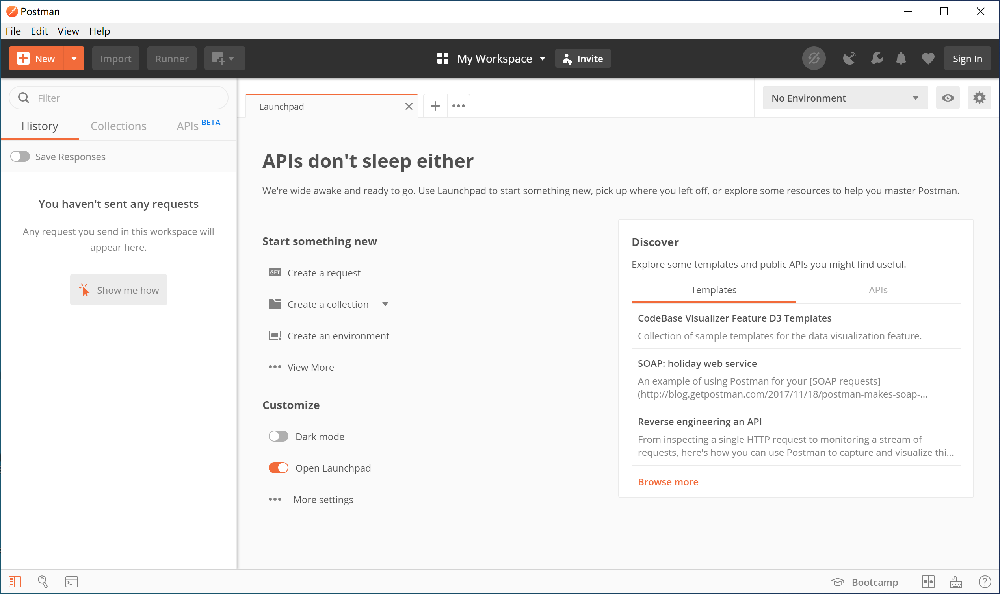
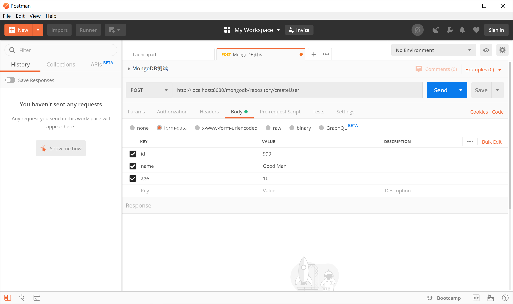
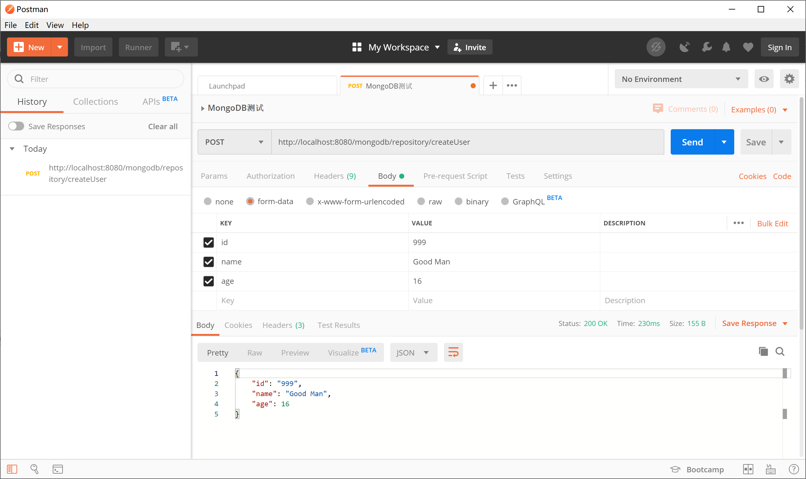

## 2.6 安装Postman

在后端系统的开发测试过程中，浏览器可以很好地模拟get请求，但是post请求需要携带数据，这个时候就需要一个顺手的工具来模拟前端发起的请求。

Postman在发送网络HTTP请求方面就是一个专业的工具。

到[https://www.getpostman.com/downloads/](https://www.getpostman.com/downloads/)下载对应操作系统的Postman，然后双击`Postman-win64-7.12.0-Setup.exe`安装。

打开Postman，新建一个请求，选择类型为POST，输入地址，添加Body的form-data，然后发送请求。

经测试，能够返回正确的结果，验证安装成功。

> 该后台接口的功能是将新创建的User对象保存到MongoDB中同时将该User对象返回。

