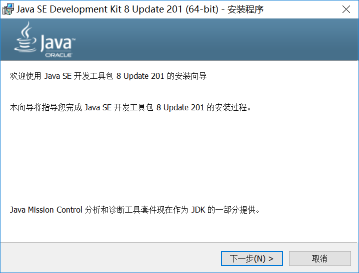
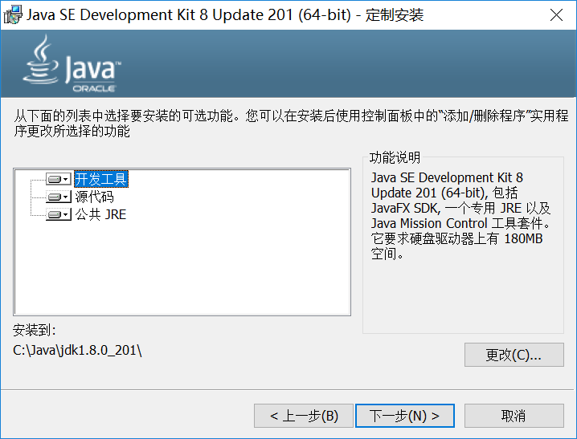
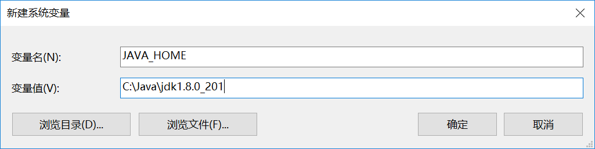
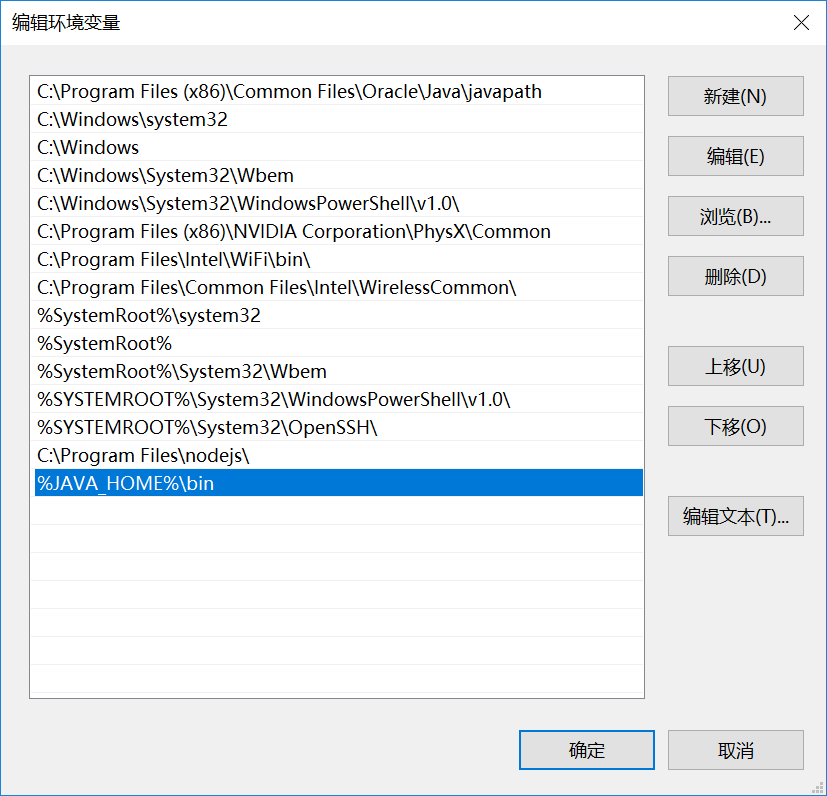
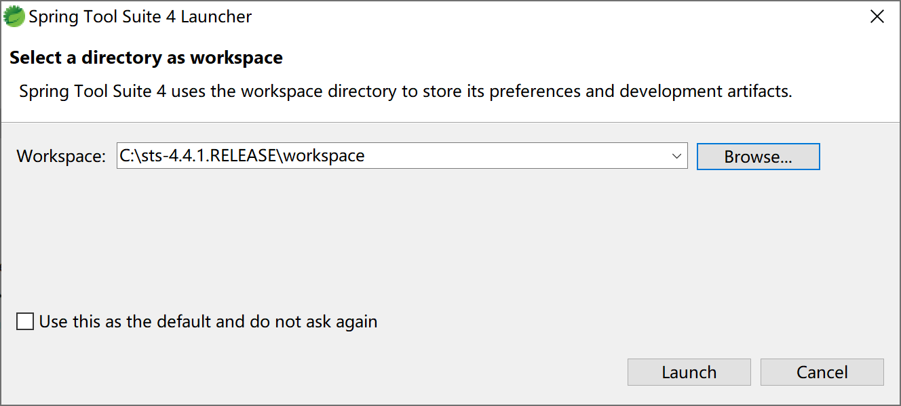
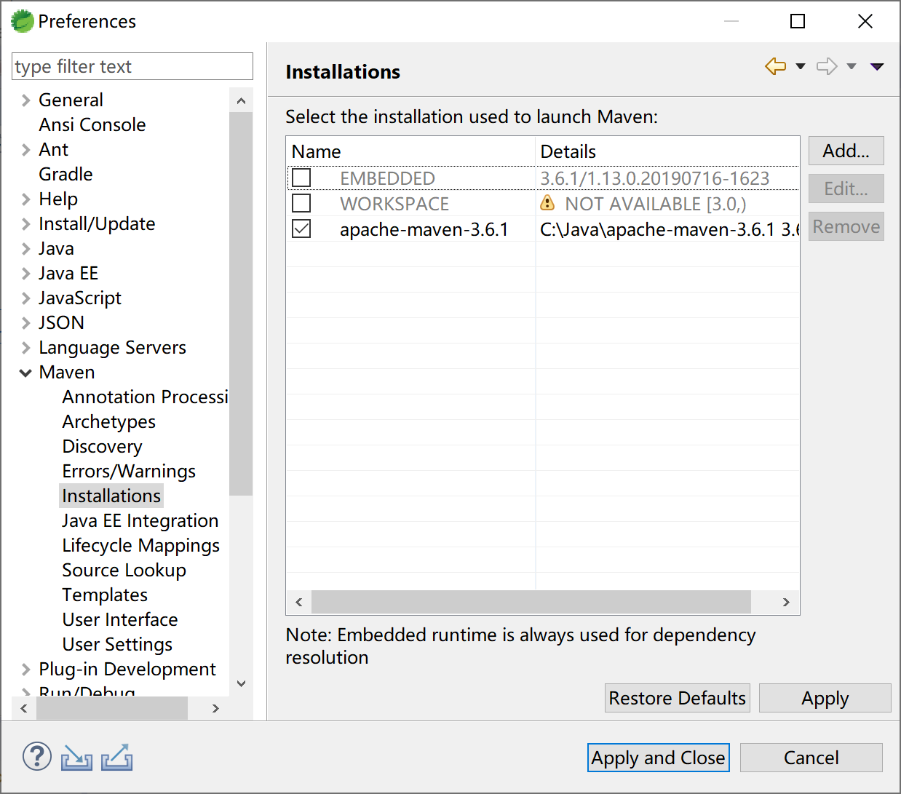

# 第2章 开发环境配置

工欲利其事，必先利其器。

为了更好的有序推进学习进度，在本教程中，将使用如下的开发环境，各位同学在学习过程中最好与以下开发工具的版本保持一致。

| 序号 | 软件    | 版本          | 说明                                  |
| ---- | ------- | ------------- | ------------------------------------- |
| 1    | JDK     | 8u201         | java 开发套件                         |
| 2    | Maven   | 3.6.0         | 项目构建，依赖管理                    |
| 3    | STS     | 4.4.1.RELEASE | 基于eclipse的整合Spring插件的开发环境 |
|      | Windows | 10            | 操作系统                              |

## <span id = 'jdk'>安装JDK</span>

首先去Oracle官网下载[ Java SE Development Kit 8u201](https://www.oracle.com/technetwork/java/javase/downloads/jdk8-downloads-2133151.html)。

然后双击运行下载回来的**jdk-8u201-windows-x64.exe**文件。



指定安装路径，例如，我将JDK安装到 **C:\\Java\\jdk1.8.0_201\\** 下。需要注意的是，JDK安装目录尽量不要含中文和（或）空格。



进行安装。


安装完JDK后，安装程序会弹出Oracle用户许可提醒信息，接受即可。


继续安装JRE，建议jre也安装到一个不含中文和（或）空格的目录中。


JRE安装中。


安装完成。


设置JAVA_HOME环境变量。



将JAVA加入path，方面后续通过命令行使用jdk。



验证jdk是否正确安装：打开命令窗口，输入‘java -version'，查看安装的jdk版本信息，如正确显示jdk版本信息，则jdk成功安装并配置正确。


## <span id = 'maven'>安装Maven</span>

Maven是Apache下的一个开源项目，它基于项目对象模型(POM project object model)，可以通过一小段描述信息（配置）来管理项目的构建，报告和文档，是一个优秀的、被广泛使用的软件项目管理工具软件。

> 基本上，国内所有的规模以上软件公司，使用Java语言开发的软件，都是用Maven进行项目管理。

Maven 除了以程序构建能力为特色之外，还提供许多高级项目管理工具。由于 Maven 的缺省构建规则有较高的可重用性，所以常常用两三行 Maven 构建脚本就可以构建简单的项目。

使用Maven可以很方便的对项目的依赖进行管理，并支持脚本的继承。对于一个由多个子项目组成的项目来说，子项目可以继承父项目的构建脚本，从而方便统一管理并有效地减少了构建脚本的冗余。

首先到Apache Maven官网下载[apache-maven-3.6.0-bin.zip](http://mirrors.shu.edu.cn/apache/maven/maven-3/3.6.0/binaries/apache-maven-3.6.0-bin.zip)。

将下载回来的zip文件，解压。例如解压到**C:\\Java\apache-maven-3.6.0**目录下。

由于使用maven创建的项目默认使用jdk5，不能满足开发需求。我们需要对maven做统一配置，以避免每次新建项目时都需要重复设置一次。

在maven主目录的conf目录下打开配置文件settings.xml，找到profiles段（大约在182行），在其内添加一个profile段，代码如下：

```xml
<profile>
    <id>jdk-1.8</id>
    <activation>
        <activeByDefault>true</activeByDefault>
        <jdk>1.8</jdk>
    </activation>
    <properties>
        <maven.compiler.source>1.8</maven.compiler.source>
        <maven.compiler.target>1.8</maven.compiler.target>
        <maven.compiler.compilerVersion>1.8</maven.compiler.compilerVersion>
    </properties>
</profile>
```

由于maven中央仓库在国外，网络访问速度很慢，为了加快依赖包下载，强烈建议为maven设置国内仓库镜像，比较快的国内镜像仓库推荐阿里云。

在配置文件settings.xml文件中找到mirrors段（大约在146行），在其内添加一段mirror，代码如下：

```xml
<mirror>
    <id>nexus-aliyun</id>
    <mirrorOf>*</mirrorOf>
    <name>Nexus aliyun</name>
    <url>http://maven.aliyun.com/nexus/content/groups/public</url>
</mirror>
```

## <span id = 'sts'>安装STS</span>

STS是Spring官方在Eclipse IDE for Enterprise Java Developers的基础上整合了Spring开发插件后的开发工具发行版，使用这个发行版进行Spring相关应用开发非常方便，强烈推荐。

首先去Spring官网，下载Spring整合开发工具[Spring Tools 4 for （Eclipse STS Spring Tool Suite）](https://download.springsource.com/release/STS4/4.4.1.RELEASE/dist/e4.13/spring-tool-suite-4-4.4.1.RELEASE-e4.13.0-win32.win32.x86_64.self-extracting.jar)。

将下载回来的jar文件存放到例如C:\，然后在命令行窗口（如果解压安装在C:\，需要“以管理员身份运行”命令窗口）执行安装命令：

```
java -jar spring-tool-suite-4-4.4.1.RELEASE-e4.13.0-win32.win32.x86_64.self-extracting.jar
```

将STS解压到当前目录


为STS创建工作空间目录，例如**C:\sts-4.4.1.RELEASE\workspace**，然后启动STS集成开发工具。



由于Windows系统的默认字符集是GBK，我们需要为工作空间指定UTF-8字符集。


在STS中配置外部maven，以保持开发环境内外配置及调用一致。



为STS指定Maven配置文件，以使用前面设置的JDK8及阿里云仓库镜像。


## <span id = 'mysql'>安装MySQL</span>

在Windows 10下安装MySQL 5.7.19，需要提前安装微软的VC++2013依赖库vcredist_x64，可在微软官方网站下载。


接下来就可以安装MySQL了。


选择“只安装服务器”。


确认安装。


安装完成。


准备配置MySQL服务器。


选择配置MySQL服务器类型。


配置服务器为开发服务器，以减少对计算机资源的占用。


设置root用户密码，尽量使用足够复杂的密码。


配置MySQL为Windows系统服务。


完成安装。


安装MySQL管理工具，如navicat。


打开navicat验证MySQL是否正确安装。


## <span id = 'validation'>验证开发环境</span>

在STS中新建一个Spring Starter项目。


在新建Spring Starter项目中，使用默认配置。


选择Spring Boot的starter，这里我们输入“web”进行快速定位和选择，然后单击Finish按钮。


STS会根据我们前面给定的项目信息，联网到https://start.spring.io创建最初始的Spring Boot项目。


我们可以进一步检查pom文件，观察其内容如下：

```xml
<?xml version="1.0" encoding="UTF-8"?>
<project xmlns="http://maven.apache.org/POM/4.0.0" xmlns:xsi="http://www.w3.org/2001/XMLSchema-instance"
	xsi:schemaLocation="http://maven.apache.org/POM/4.0.0 https://maven.apache.org/xsd/maven-4.0.0.xsd">
	<modelVersion>4.0.0</modelVersion>
	<parent>
		<groupId>org.springframework.boot</groupId>
		<artifactId>spring-boot-starter-parent</artifactId>
		<version>2.2.0.RELEASE</version>
		<relativePath/> <!-- lookup parent from repository -->
	</parent>
	<groupId>com.example</groupId>
	<artifactId>demo</artifactId>
	<version>0.0.1-SNAPSHOT</version>
	<name>demo</name>
	<description>Demo project for Spring Boot</description>

	<properties>
		<java.version>1.8</java.version>
	</properties>

	<dependencies>
		<dependency>
			<groupId>org.springframework.boot</groupId>
			<artifactId>spring-boot-starter-web</artifactId>
		</dependency>

		<dependency>
			<groupId>org.springframework.boot</groupId>
			<artifactId>spring-boot-starter-test</artifactId>
			<scope>test</scope>
			<exclusions>
				<exclusion>
					<groupId>org.junit.vintage</groupId>
					<artifactId>junit-vintage-engine</artifactId>
				</exclusion>
			</exclusions>
		</dependency>
	</dependencies>

	<build>
		<plugins>
			<plugin>
				<groupId>org.springframework.boot</groupId>
				<artifactId>spring-boot-maven-plugin</artifactId>
			</plugin>
		</plugins>
	</build>

</project>
```

检查启动类DemoApplication，代码如下：

```java
package com.example.demo;

import org.springframework.boot.SpringApplication;
import org.springframework.boot.autoconfigure.SpringBootApplication;

@SpringBootApplication
public class DemoApplication {

	public static void main(String[] args) {
		SpringApplication.run(DemoApplication.class, args);
	}

}
```

编写HelloController，响应“/hello”请求。

```java
package com.example.demo.controller;

import org.springframework.web.bind.annotation.RequestMapping;
import org.springframework.web.bind.annotation.RestController;

@RestController
public class HelloController {
	
	@RequestMapping("/hello")
	public String sayHello() {
		return "Hello Spring Boot.";
	}

}
```

通过启动类DemoApplication启动项目。


注意观察控制台中输出的SpringBoot信息，其中包含SpringBoot版本号的启动logo。


打开Chrome浏览器，访问http://localhost:8080/hello，可正确显示前面HelloController中hello方法输出的字符串“Hello Spring Boot.”。


通过上述步骤，就已经准备好了Spring Boot的开发环境。