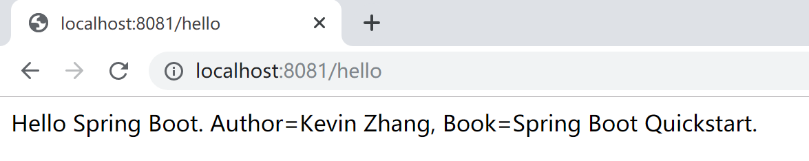

## 3.2 基本配置

本小节，分析 Spring Boot 的基本配置，了解其配置项，方便后续在开发过程中正确配置 Spring Boot 应用程序。

### 3.2.1 父级依赖

我们在几乎在所有的 Spring Boot 项目中，都会看到`spring-boot-starter-parent`这样的父级依赖。

```xml
<parent>
    <groupId>org.springframework.boot</groupId>
    <artifactId>spring-boot-starter-parent</artifactId>
    <version>2.2.1.RELEASE</version>
    <relativePath/> <!-- lookup parent from repository -->
</parent>
```

父级依赖，确定了 Spring Boot 项目的主版本和 默认依赖：

1. java 版本默认使用 1.8；

2. 编码格式默认使用 utf-8；

3. 提供 Dependency Management 进行项目依赖的版本管理；

4. 默认的资源过滤与插件管理。

其后的一些启动器（starter），就不需要指定版本了。

```xml
<dependency>
    <groupId>org.springframework.boot</groupId>
    <artifactId>spring-boot-starter-web</artifactId>
</dependency>
```

例如上面的 web 依赖，只需要指定`spring-boot-starter-web`即可。

但是，在机缘巧合的情况下，我们的项目（很有可能是遗留项目）已经有了`parent`，那该怎么办呢？

Spring 一贯做法是”约定大于配置“，但总会为特殊情况下留下挪腾的空间：使用`dependencyManagement`方式 import pom：

```xml
<dependencyManagement>
    <dependencies>
        <dependency>
            <!-- Import dependency management from Spring Boot -->
            <groupId>org.springframework.boot</groupId>
            <artifactId>spring-boot-dependencies</artifactId>
            <version>2.2.1.RELEASE</version>
            <type>pom</type>
            <scope>import</scope>
        </dependency>
    </dependencies>
</dependencyManagement>
```

然后，就可以安心地使用项目中的（或组织要求的）parent 了。

### 3.2.2 application.properties

Spring Boot 使用了一个全局的配置文件 application.properties，可以存在于项目的几个地方，其优先级从高到低依次是：

1. 项目根目录 config 文件夹里面（优先级最高）；

2. 项目根目录；

3. src/main/resources/config/ 文件夹里面（classpath:/config）；

4. src/main/resources/ 文件夹里面（classpath:/）（优先级最低）。

Sping Boot 的全局配置文件的作用是对一些默认配置的配置值进行修改，例如修改内嵌的 tomcat 端口：

```properties
server.port=8081
server.tomcat.uri-encoding=UTF-8
```

> Spring Boot 中可供修改的配置，可参考[官方文档](https://docs.spring.io/spring-boot/docs/current/reference/html/appendix-application-properties.html#common-application-properties)或本教程**附录2 Spring Boot配置大全**。

优先级高的配置内容会覆盖优先级低的配置内容。

> 级别高的配置会覆盖级别低的相同配置，级别高的配置没有的项，级别低有的项会同样生效。
> 也就是说，无论级别高低，配置都会生效，只是相同的配置被级别高的配置覆盖。

**特别说明的是：**在运行时，使用 cmd 命令行指定特定的配置文件，其优化级最高，优先于应用中的配置文件。

```powershell
java -jar hello-0.0.1-SNAPSHOT.jar --spring.config.location=D:/work/application.properties
```
存放在配置文件中的自定义配置，还可以在项目中引用。

例如，我们在`application.properties`文件中有如下两个自定义配置项：

```properties
server.port=8081
server.tomcat.uri-encoding=UTF-8
net.xprogrammer.author=Kevin Zhang
net.xprogrammer.book=Spring Boot Quickstart.
```

然后直接在需要使用的地方通过注解`@Value(value="${config.name}")`就可以绑定到你想要的属性上面。

```java
package com.example.hello.controller;

import org.springframework.beans.factory.annotation.Value;
import org.springframework.web.bind.annotation.RequestMapping;
import org.springframework.web.bind.annotation.RestController;

@RestController
public class SayHelloController {
	@Value("${net.xprogrammer.author}")
	private String author;
	
	@Value("${net.xprogrammer.book}")
	private String book;
	
	@RequestMapping("/hello")
	public String sayHello() {
		return "Hello Spring Boot. Author=" + author + ", Book=" + book;
	}

}
```

如上面第9-13行，就绑定了`application.properties`文件中的两个自定义配置项。

其执行结果如下：



### 3.2.3 application.yml

在 Spring Boot 中，配置文件有两种不同的格式：一个是 properties ，另一个是 yaml 。 

application.yml 的作用和 application.properties 一样，用法也一样，只是书写和看起来更方便。

比如上小节中的配置信息，翻译为yaml表示为：

```yaml
server:
  port: 8081
  tomcat:
    uri-encoding: UTF-8
```

### 3.2.4 Profile

在进行实际开发的时候，分为本地环境、测试环境和生产环境，这就需要配置多个配置文件，如端口号等。我们当然可以每更换一个环境就改一次配置，但是十分繁琐。

在Spring Boot中，可以通过Profile（概要文件）实现多场景下的配置切换，方便开发过程中进行测试和生产环境的部署。 下面将大致介绍一下如何使用Spring Boot Profile配置不同环境的配置文件。

例如，开发环境的服务器端口为 8080，测试环境中的端口为 8081，以这个最简单的场景来描述 Profile 是如何使用的。

在`src/main/resources/`下创建 **application.properties、application-dev.properties、application-test.properties**3个文件。

application.properties 文件内容如下：（启用 dev profile，这个时候，服务器端口为`8080`）

```properties
spring.profiles.active=dev
```
application-dev.properties文件内容如下：

```properties
server.port=8080
```
application-test.properties文件内容如下：

```properties
server.port=8081
```

如果application.properties文件内容为`spring.profiles.active=test`则，服务器端口为`8081`。

### 3.2.5 Web 容器配置

Spring Boot 支持内嵌使用 Tomcat、Jetty 和 Undertow 三种 web 容器，其默认配置为 Tomcat。 

- Tomcat：默认的，也是Java程序员最熟悉的容器；
- Jetty：高并发轻量级服务器 ；
- Undertow： 红帽公司开源的非常轻量并性能最好的服务器。

在 application.properties 文件中可为web容器指定一些配置。

```properties
server.port=8080  
server.context-path=/  
  
# tomcat相关设置  
server.tomcat.uri-encoding=UTF-8  
```

只需要引入 spring-boot-start-web 依赖，默认采用的 Tomcat 作为容器，其默认配置如下：

```properties
server.tomcat.accept-count=100 # Maximum queue length for incoming connection requests when all possible request processing threads are in use.
server.tomcat.accesslog.buffered=true # Whether to buffer output such that it is flushed only periodically.
server.tomcat.accesslog.directory=logs # Directory in which log files are created. Can be absolute or relative to the Tomcat base dir.
server.tomcat.accesslog.enabled=false # Enable access log.
server.tomcat.accesslog.file-date-format=.yyyy-MM-dd # Date format to place in the log file name.
server.tomcat.accesslog.pattern=common # Format pattern for access logs.
server.tomcat.accesslog.prefix=access_log # Log file name prefix.
server.tomcat.accesslog.rename-on-rotate=false # Whether to defer inclusion of the date stamp in the file name until rotate time.
server.tomcat.accesslog.request-attributes-enabled=false # Set request attributes for the IP address, Hostname, protocol, and port used for the request.
server.tomcat.accesslog.rotate=true # Whether to enable access log rotation.
server.tomcat.accesslog.suffix=.log # Log file name suffix.
server.tomcat.additional-tld-skip-patterns= # Comma-separated list of additional patterns that match jars to ignore for TLD scanning.
server.tomcat.background-processor-delay=10s # Delay between the invocation of backgroundProcess methods. If a duration suffix is not specified, seconds will be used.
server.tomcat.basedir= # Tomcat base directory. If not specified, a temporary directory is used.
server.tomcat.internal-proxies=10\\.\\d{1,3}\\.\\d{1,3}\\.\\d{1,3}|\\
        192\\.168\\.\\d{1,3}\\.\\d{1,3}|\\
        169\\.254\\.\\d{1,3}\\.\\d{1,3}|\\
        127\\.\\d{1,3}\\.\\d{1,3}\\.\\d{1,3}|\\
        172\\.1[6-9]{1}\\.\\d{1,3}\\.\\d{1,3}|\\
        172\\.2[0-9]{1}\\.\\d{1,3}\\.\\d{1,3}|\\
        172\\.3[0-1]{1}\\.\\d{1,3}\\.\\d{1,3}\\
        0:0:0:0:0:0:0:1\\
        ::1 # Regular expression that matches proxies that are to be trusted.
server.tomcat.max-connections=10000 # Maximum number of connections that the server accepts and processes at any given time.
server.tomcat.max-http-post-size=2MB # Maximum size of the HTTP post content.
server.tomcat.max-swallow-size=2MB # Maximum amount of request body to swallow.
server.tomcat.max-threads=200 # Maximum amount of worker threads.
server.tomcat.min-spare-threads=10 # Minimum amount of worker threads.
server.tomcat.port-header=X-Forwarded-Port # Name of the HTTP header used to override the original port value.
server.tomcat.protocol-header= # Header that holds the incoming protocol, usually named "X-Forwarded-Proto".
server.tomcat.protocol-header-https-value=https # Value of the protocol header indicating whether the incoming request uses SSL.
server.tomcat.redirect-context-root=true # Whether requests to the context root should be redirected by appending a / to the path.
server.tomcat.remote-ip-header= # Name of the HTTP header from which the remote IP is extracted. For instance, `X-FORWARDED-FOR`.
server.tomcat.resource.allow-caching=true # Whether static resource caching is permitted for this web application.
server.tomcat.resource.cache-ttl= # Time-to-live of the static resource cache.
server.tomcat.uri-encoding=UTF-8 # Character encoding to use to decode the URI.
```

要引入 Jetty 容器，使用如下 Maven 配置：

```xml
<dependency>  
    <groupId>org.springframework.boot</groupId>  
    <artifactId>spring-boot-starter-web</artifactId>  
    <exclusions>  
        <exclusion>  
            <artifactId>spring-boot-starter-tomcat</artifactId>  
            <groupId>org.springframework.boot</groupId>  
        </exclusion>  
    </exclusions>  
</dependency>  
  
<dependency>  
    <groupId>org.springframework.boot</groupId>  
    <artifactId>spring-boot-starter-jetty</artifactId>  
</dependency>
```

Jetty容器的默认配置如下：

```properties
server.jetty.acceptors=-1 # Number of acceptor threads to use. When the value is -1, the default, the number of acceptors is derived from the operating environment.
server.jetty.accesslog.append=false # Append to log.
server.jetty.accesslog.date-format=dd/MMM/yyyy:HH:mm:ss Z # Timestamp format of the request log.
server.jetty.accesslog.enabled=false # Enable access log.
server.jetty.accesslog.extended-format=false # Enable extended NCSA format.
server.jetty.accesslog.file-date-format= # Date format to place in log file name.
server.jetty.accesslog.filename= # Log filename. If not specified, logs redirect to "System.err".
server.jetty.accesslog.locale= # Locale of the request log.
server.jetty.accesslog.log-cookies=false # Enable logging of the request cookies.
server.jetty.accesslog.log-latency=false # Enable logging of request processing time.
server.jetty.accesslog.log-server=false # Enable logging of the request hostname.
server.jetty.accesslog.retention-period=31 # Number of days before rotated log files are deleted.
server.jetty.accesslog.time-zone=GMT # Timezone of the request log.
server.jetty.max-http-post-size=200000B # Maximum size of the HTTP post or put content.
server.jetty.selectors=-1 # Number of selector threads to use. When the value is -1, the default, the number of selectors is derived from the operating environment.
```

要引入 Undertow，使用如下 Maven 配置：

```xml
<dependency>  
    <groupId>org.springframework.boot</groupId>  
    <artifactId>spring-boot-starter-web</artifactId>  
    <exclusions>  
        <exclusion>  
            <artifactId>spring-boot-starter-tomcat</artifactId>  
            <groupId>org.springframework.boot</groupId>  
        </exclusion>  
    </exclusions>  
</dependency>  
  
<dependency>  
    <groupId>org.springframework.boot</groupId>  
    <artifactId>spring-boot-starter-undertow</artifactId>  
</dependency>
```

Undertow 典型的配置，使用 application.yml 配置（顺便熟悉一下 yaml 配置方式）：

```yaml
# 设置IO线程数, 它主要执行非阻塞的任务,它们会负责多个连接, 默认设置每个CPU核心一个线程
# 不要设置过大，如果过大，启动项目会报错：打开文件数过多
server:
  undertow:
     io-threads: 16
# 阻塞任务线程池, 当执行类似servlet请求阻塞IO操作, undertow会从这个线程池中取得线程
# 它的值设置取决于系统线程执行任务的阻塞系数，默认值是IO线程数*8
     worker-threads: 256
# 以下的配置会影响buffer,这些buffer会用于服务器连接的IO操作,有点类似netty的池化内存管理
# 每块buffer的空间大小,越小的空间被利用越充分，不要设置太大，以免影响其他应用，合适即可
     buffer-size: 1024
# 每个区分配的buffer数量 , 所以pool的大小是buffer-size * buffers-per-region
     buffers-per-region: 1024
# 是否分配的直接内存(NIO直接分配的堆外内存)
     direct-buffers: true
```

Undertow 容器的默认配置如下：

```properties
server.undertow.accesslog.dir= # Undertow access log directory.
server.undertow.accesslog.enabled=false # Whether to enable the access log.
server.undertow.accesslog.pattern=common # Format pattern for access logs.
server.undertow.accesslog.prefix=access_log. # Log file name prefix.
server.undertow.accesslog.rotate=true # Whether to enable access log rotation.
server.undertow.accesslog.suffix=log # Log file name suffix.
server.undertow.buffer-size= # Size of each buffer.
server.undertow.direct-buffers= # Whether to allocate buffers outside the Java heap. The default is derived from the maximum amount of memory that is available to the JVM.
server.undertow.eager-filter-init=true # Whether servlet filters should be initialized on startup.
server.undertow.io-threads= # Number of I/O threads to create for the worker. The default is derived from the number of available processors.
server.undertow.max-http-post-size=-1B # Maximum size of the HTTP post content. When the value is -1, the default, the size is unlimited.
server.undertow.worker-threads= # Number of worker threads. The default is 8 times the number of I/O threads.
```

### 3.2.6 定制 banner

为了发挥娱乐精神，Spring Boot 启动信息中的 banner 也是可以定制的。

我个人觉得，这就是一个彩蛋。
