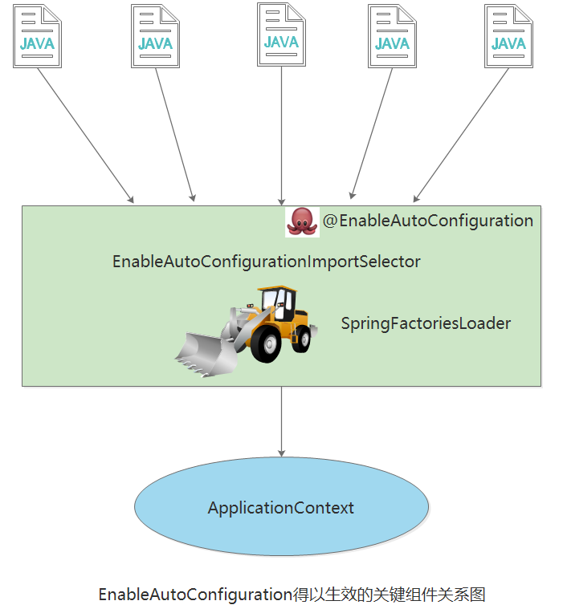

## 3.3 启动类与核心注解

在我们实际的工作中，一般都会使用前后端分离机构来构建业务应用系统。一个典型的Spring Boot后台应用以restful方式提供服务。

在Spring Boot后台应用中，我们通常会看到一个含有main方法的启动类被`SpringApplication.run`方法运行。了解这个启动类，有助于我们对Spring Boot应用加深理解。

### 3.3.1 启动类

标注`@SpringBootApplication`注解的类，就是Spring Boot应用程序的启动类。这个启动类中包含main方法。

Spring Boot通过SpringApplication这个类的run方法来加载这个类，运行Spring Boot应用。

```java
package com.example.hello;

import org.springframework.boot.SpringApplication;
import org.springframework.boot.autoconfigure.SpringBootApplication;

@SpringBootApplication
public class HelloSpringBootApplication {

	public static void main(String[] args) {
		SpringApplication.run(HelloSpringBootApplication.class, args);
	}

}
```

run方法做了两件事：

1. 创建SpringApplication对象；在对象初始化时保存事件监听器，容器初始化类以及判断是否为web应用，保存包含main方法的主配置类。
2. 调用run方法；准备spring的上下文，完成容器的初始化，创建，加载等。会在不同的时机触发监听器的不同事件。
```java
	/**
	 * Static helper that can be used to run a {@link SpringApplication} from the
	 * specified source using default settings.
	 * @param primarySource the primary source to load
	 * @param args the application arguments (usually passed from a Java main method)
	 * @return the running {@link ApplicationContext}
	 */
	public static ConfigurableApplicationContext run(Class<?> primarySource, String... args) {
		return run(new Class<?>[] { primarySource }, args);
	}

	/**
	 * Static helper that can be used to run a {@link SpringApplication} from the
	 * specified sources using default settings and user supplied arguments.
	 * @param primarySources the primary sources to load
	 * @param args the application arguments (usually passed from a Java main method)
	 * @return the running {@link ApplicationContext}
	 */
	public static ConfigurableApplicationContext run(Class<?>[] primarySources, String[] args) {
		return new SpringApplication(primarySources).run(args);
	}

	/**
	 * Create a new {@link SpringApplication} instance. The application context will load
	 * beans from the specified primary sources (see {@link SpringApplication class-level}
	 * documentation for details. The instance can be customized before calling
	 * {@link #run(String...)}.
	 * @param primarySources the primary bean sources
	 * @see #run(Class, String[])
	 * @see #SpringApplication(ResourceLoader, Class...)
	 * @see #setSources(Set)
	 */
	public SpringApplication(Class<?>... primarySources) {
		this(null, primarySources);
	}
```

可以通过阅读Spring Boot源码（如上面的代码片段）和运行时跟踪代码，进一步了解其运行机制。

### 3.3.2 核心注解

`@SpringBootApplication`注解就是Spring Boot的核心注解。

几乎所有的Spring Boot应用，都是用`@SpringBootApplication`这个注解标注的。

```java
/**
 * Indicates a {@link Configuration configuration} class that declares one or more
 * {@link Bean @Bean} methods and also triggers {@link EnableAutoConfiguration
 * auto-configuration}, {@link ComponentScan component scanning}, and
 * {@link ConfigurationPropertiesScan configuration properties scanning}. This is a
 * convenience annotation that is equivalent to declaring {@code @Configuration},
 * {@code @EnableAutoConfiguration}, {@code @ComponentScan}.
 *
 * @author Phillip Webb
 * @author Stephane Nicoll
 * @author Andy Wilkinson
 * @since 1.2.0
 */
@Target(ElementType.TYPE)
@Retention(RetentionPolicy.RUNTIME)
@Documented
@Inherited
@SpringBootConfiguration
@EnableAutoConfiguration
@ComponentScan(excludeFilters = { @Filter(type = FilterType.CUSTOM, classes = TypeExcludeFilter.class),
		@Filter(type = FilterType.CUSTOM, classes = AutoConfigurationExcludeFilter.class) })
public @interface SpringBootApplication {

	/**
	 * Exclude specific auto-configuration classes such that they will never be applied.
	 * @return the classes to exclude
	 */
	@AliasFor(annotation = EnableAutoConfiguration.class)
	Class<?>[] exclude() default {};

	/**
	 * Exclude specific auto-configuration class names such that they will never be
	 * applied.
	 * @return the class names to exclude
	 * @since 1.3.0
	 */
	@AliasFor(annotation = EnableAutoConfiguration.class)
	String[] excludeName() default {};

	/**
	 * Base packages to scan for annotated components. Use {@link #scanBasePackageClasses}
	 * for a type-safe alternative to String-based package names.
	 * <p>
	 * <strong>Note:</strong> this setting is an alias for
	 * {@link ComponentScan @ComponentScan} only. It has no effect on {@code @Entity}
	 * scanning or Spring Data {@link Repository} scanning. For those you should add
	 * {@link org.springframework.boot.autoconfigure.domain.EntityScan @EntityScan} and
	 * {@code @Enable...Repositories} annotations.
	 * @return base packages to scan
	 * @since 1.3.0
	 */
	@AliasFor(annotation = ComponentScan.class, attribute = "basePackages")
	String[] scanBasePackages() default {};

	/**
	 * Type-safe alternative to {@link #scanBasePackages} for specifying the packages to
	 * scan for annotated components. The package of each class specified will be scanned.
	 * <p>
	 * Consider creating a special no-op marker class or interface in each package that
	 * serves no purpose other than being referenced by this attribute.
	 * <p>
	 * <strong>Note:</strong> this setting is an alias for
	 * {@link ComponentScan @ComponentScan} only. It has no effect on {@code @Entity}
	 * scanning or Spring Data {@link Repository} scanning. For those you should add
	 * {@link org.springframework.boot.autoconfigure.domain.EntityScan @EntityScan} and
	 * {@code @Enable...Repositories} annotations.
	 * @return base packages to scan
	 * @since 1.3.0
	 */
	@AliasFor(annotation = ComponentScan.class, attribute = "basePackageClasses")
	Class<?>[] scanBasePackageClasses() default {};

	/**
	 * Specify whether {@link Bean @Bean} methods should get proxied in order to enforce
	 * bean lifecycle behavior, e.g. to return shared singleton bean instances even in
	 * case of direct {@code @Bean} method calls in user code. This feature requires
	 * method interception, implemented through a runtime-generated CGLIB subclass which
	 * comes with limitations such as the configuration class and its methods not being
	 * allowed to declare {@code final}.
	 * <p>
	 * The default is {@code true}, allowing for 'inter-bean references' within the
	 * configuration class as well as for external calls to this configuration's
	 * {@code @Bean} methods, e.g. from another configuration class. If this is not needed
	 * since each of this particular configuration's {@code @Bean} methods is
	 * self-contained and designed as a plain factory method for container use, switch
	 * this flag to {@code false} in order to avoid CGLIB subclass processing.
	 * <p>
	 * Turning off bean method interception effectively processes {@code @Bean} methods
	 * individually like when declared on non-{@code @Configuration} classes, a.k.a.
	 * "@Bean Lite Mode" (see {@link Bean @Bean's javadoc}). It is therefore behaviorally
	 * equivalent to removing the {@code @Configuration} stereotype.
	 * @since 2.2
	 * @return whether to proxy {@code @Bean} methods
	 */
	@AliasFor(annotation = Configuration.class)
	boolean proxyBeanMethods() default true;

}
```

通过阅读`@SpringBootApplication`的源码，发现其由3个注解构成：

1. `@SpringBootConfiguration`
2. `@EnableAutoConfiguration`
3. `@ComponentScan`

如果我们将`@SpringBootApplication`注解替换为上面3个注解，效果一样。

```java
package com.example.hello;

import org.springframework.boot.SpringApplication;
import org.springframework.boot.SpringBootConfiguration;
import org.springframework.boot.autoconfigure.AutoConfigurationExcludeFilter;
import org.springframework.boot.autoconfigure.EnableAutoConfiguration;
import org.springframework.boot.context.TypeExcludeFilter;
import org.springframework.context.annotation.ComponentScan;
import org.springframework.context.annotation.ComponentScan.Filter;
import org.springframework.context.annotation.FilterType;

//@SpringBootApplication
@SpringBootConfiguration
@EnableAutoConfiguration
@ComponentScan(excludeFilters = { @Filter(type = FilterType.CUSTOM, classes = TypeExcludeFilter.class),
		@Filter(type = FilterType.CUSTOM, classes = AutoConfigurationExcludeFilter.class) })
public class HelloSpringBootApplication {

	public static void main(String[] args) {
		SpringApplication.run(HelloSpringBootApplication.class, args);
	}

}
```
#### 3.3.2.1 @ComponentScan

`@ComponentScan`这个注解在Spring中很重要，它的功能其实就是自动扫描并加载符合条件的组件（比如@Component、@Controller、@RestController、@Service和@Repository等）或者bean定义，最终将这些bean定义加载到Spring IoC容器中。

我们可以通过basePackages等属性来细粒度的定制`@ComponentScan`自动扫描的范围，如果不指定（通常情况下，我们都不会指定basePackages），则默认Spring框架实现会从声明`@ComponentScan`所在类的package进行扫描。这也就是为什么我们一般都是将启动类放到应用的“根包”中，然后在其下再放置各个模块/功能的包。

`@ComponentScan`告诉Spring 哪个packages 的用注解标识的类 会被spring自动扫描并且装入bean容器。

例如，如果你有个类用@Controller注解标识了，那么，如果不加上`@ComponentScan`自动扫描该controller，那么该Controller就不会被Spring扫描到，也就不会装入Spring容器（IoC）中，因此你配置的这个Controller也没有意义。

下面列出`@ComponentScan`注解的参数，说明其作用：

```properties
basePackageClasses：对basepackages()指定扫描注释组件包类型安全的替代。 
excludeFilters：指定不适合组件扫描的类型。
includeFilters：指定哪些类型有资格用于组件扫描。
lazyInit：指定是否应注册扫描的beans为lazy初始化。
nameGenerator：用于在Spring容器中的检测到的组件命名。
resourcePattern：控制可用于组件检测的类文件。
scopedProxy：指出代理是否应该对检测元件产生，在使用过程中会在代理风格时尚的范围是必要的。
scopeResolver：用于解决检测到的组件的范围。
useDefaultFilters：指示是否自动检测类的注释 
```

`@ComponentScan`注解在Spring Boot应用启动类中的存在形式为：

```java
@ComponentScan(excludeFilters = { @Filter(type = FilterType.CUSTOM, classes = TypeExcludeFilter.class),
		@Filter(type = FilterType.CUSTOM, classes = AutoConfigurationExcludeFilter.class) })
```

所以，我们同样可以在`@SpringBootApplication`注解上为其配置参数，以控制组件扫描行为。

```java
/*
 * Copyright 2002-2016 the original author or authors.
 *
 * Licensed under the Apache License, Version 2.0 (the "License");
 * you may not use this file except in compliance with the License.
 * You may obtain a copy of the License at
 *
 *      https://www.apache.org/licenses/LICENSE-2.0
 *
 * Unless required by applicable law or agreed to in writing, software
 * distributed under the License is distributed on an "AS IS" BASIS,
 * WITHOUT WARRANTIES OR CONDITIONS OF ANY KIND, either express or implied.
 * See the License for the specific language governing permissions and
 * limitations under the License.
 */

package org.springframework.context.annotation;

import java.lang.annotation.Documented;
import java.lang.annotation.ElementType;
import java.lang.annotation.Repeatable;
import java.lang.annotation.Retention;
import java.lang.annotation.RetentionPolicy;
import java.lang.annotation.Target;

import org.springframework.beans.factory.support.BeanNameGenerator;
import org.springframework.core.annotation.AliasFor;
import org.springframework.core.type.filter.TypeFilter;

/**
 * Configures component scanning directives for use with @{@link Configuration} classes.
 * Provides support parallel with Spring XML's {@code <context:component-scan>} element.
 *
 * <p>Either {@link #basePackageClasses} or {@link #basePackages} (or its alias
 * {@link #value}) may be specified to define specific packages to scan. If specific
 * packages are not defined, scanning will occur from the package of the
 * class that declares this annotation.
 *
 * <p>Note that the {@code <context:component-scan>} element has an
 * {@code annotation-config} attribute; however, this annotation does not. This is because
 * in almost all cases when using {@code @ComponentScan}, default annotation config
 * processing (e.g. processing {@code @Autowired} and friends) is assumed. Furthermore,
 * when using {@link AnnotationConfigApplicationContext}, annotation config processors are
 * always registered, meaning that any attempt to disable them at the
 * {@code @ComponentScan} level would be ignored.
 *
 * <p>See {@link Configuration @Configuration}'s Javadoc for usage examples.
 *
 * @author Chris Beams
 * @author Juergen Hoeller
 * @author Sam Brannen
 * @since 3.1
 * @see Configuration
 */
@Retention(RetentionPolicy.RUNTIME)
@Target(ElementType.TYPE)
@Documented
@Repeatable(ComponentScans.class)
public @interface ComponentScan {

	/**
	 * Alias for {@link #basePackages}.
	 * <p>Allows for more concise annotation declarations if no other attributes
	 * are needed &mdash; for example, {@code @ComponentScan("org.my.pkg")}
	 * instead of {@code @ComponentScan(basePackages = "org.my.pkg")}.
	 */
	@AliasFor("basePackages")
	String[] value() default {};

	/**
	 * Base packages to scan for annotated components.
	 * <p>{@link #value} is an alias for (and mutually exclusive with) this
	 * attribute.
	 * <p>Use {@link #basePackageClasses} for a type-safe alternative to
	 * String-based package names.
	 */
	@AliasFor("value")
	String[] basePackages() default {};

	/**
	 * Type-safe alternative to {@link #basePackages} for specifying the packages
	 * to scan for annotated components. The package of each class specified will be scanned.
	 * <p>Consider creating a special no-op marker class or interface in each package
	 * that serves no purpose other than being referenced by this attribute.
	 */
	Class<?>[] basePackageClasses() default {};

	/**
	 * The {@link BeanNameGenerator} class to be used for naming detected components
	 * within the Spring container.
	 * <p>The default value of the {@link BeanNameGenerator} interface itself indicates
	 * that the scanner used to process this {@code @ComponentScan} annotation should
	 * use its inherited bean name generator, e.g. the default
	 * {@link AnnotationBeanNameGenerator} or any custom instance supplied to the
	 * application context at bootstrap time.
	 * @see AnnotationConfigApplicationContext#setBeanNameGenerator(BeanNameGenerator)
	 */
	Class<? extends BeanNameGenerator> nameGenerator() default BeanNameGenerator.class;

	/**
	 * The {@link ScopeMetadataResolver} to be used for resolving the scope of detected components.
	 */
	Class<? extends ScopeMetadataResolver> scopeResolver() default AnnotationScopeMetadataResolver.class;

	/**
	 * Indicates whether proxies should be generated for detected components, which may be
	 * necessary when using scopes in a proxy-style fashion.
	 * <p>The default is defer to the default behavior of the component scanner used to
	 * execute the actual scan.
	 * <p>Note that setting this attribute overrides any value set for {@link #scopeResolver}.
	 * @see ClassPathBeanDefinitionScanner#setScopedProxyMode(ScopedProxyMode)
	 */
	ScopedProxyMode scopedProxy() default ScopedProxyMode.DEFAULT;

	/**
	 * Controls the class files eligible for component detection.
	 * <p>Consider use of {@link #includeFilters} and {@link #excludeFilters}
	 * for a more flexible approach.
	 */
	String resourcePattern() default ClassPathScanningCandidateComponentProvider.DEFAULT_RESOURCE_PATTERN;

	/**
	 * Indicates whether automatic detection of classes annotated with {@code @Component}
	 * {@code @Repository}, {@code @Service}, or {@code @Controller} should be enabled.
	 */
	boolean useDefaultFilters() default true;

	/**
	 * Specifies which types are eligible for component scanning.
	 * <p>Further narrows the set of candidate components from everything in {@link #basePackages}
	 * to everything in the base packages that matches the given filter or filters.
	 * <p>Note that these filters will be applied in addition to the default filters, if specified.
	 * Any type under the specified base packages which matches a given filter will be included,
	 * even if it does not match the default filters (i.e. is not annotated with {@code @Component}).
	 * @see #resourcePattern()
	 * @see #useDefaultFilters()
	 */
	Filter[] includeFilters() default {};

	/**
	 * Specifies which types are not eligible for component scanning.
	 * @see #resourcePattern
	 */
	Filter[] excludeFilters() default {};

	/**
	 * Specify whether scanned beans should be registered for lazy initialization.
	 * <p>Default is {@code false}; switch this to {@code true} when desired.
	 * @since 4.1
	 */
	boolean lazyInit() default false;


	/**
	 * Declares the type filter to be used as an {@linkplain ComponentScan#includeFilters
	 * include filter} or {@linkplain ComponentScan#excludeFilters exclude filter}.
	 */
	@Retention(RetentionPolicy.RUNTIME)
	@Target({})
	@interface Filter {

		/**
		 * The type of filter to use.
		 * <p>Default is {@link FilterType#ANNOTATION}.
		 * @see #classes
		 * @see #pattern
		 */
		FilterType type() default FilterType.ANNOTATION;

		/**
		 * Alias for {@link #classes}.
		 * @see #classes
		 */
		@AliasFor("classes")
		Class<?>[] value() default {};

		/**
		 * The class or classes to use as the filter.
		 * <p>The following table explains how the classes will be interpreted
		 * based on the configured value of the {@link #type} attribute.
		 * <table border="1">
		 * <tr><th>{@code FilterType}</th><th>Class Interpreted As</th></tr>
		 * <tr><td>{@link FilterType#ANNOTATION ANNOTATION}</td>
		 * <td>the annotation itself</td></tr>
		 * <tr><td>{@link FilterType#ASSIGNABLE_TYPE ASSIGNABLE_TYPE}</td>
		 * <td>the type that detected components should be assignable to</td></tr>
		 * <tr><td>{@link FilterType#CUSTOM CUSTOM}</td>
		 * <td>an implementation of {@link TypeFilter}</td></tr>
		 * </table>
		 * <p>When multiple classes are specified, <em>OR</em> logic is applied
		 * &mdash; for example, "include types annotated with {@code @Foo} OR {@code @Bar}".
		 * <p>Custom {@link TypeFilter TypeFilters} may optionally implement any of the
		 * following {@link org.springframework.beans.factory.Aware Aware} interfaces, and
		 * their respective methods will be called prior to {@link TypeFilter#match match}:
		 * <ul>
		 * <li>{@link org.springframework.context.EnvironmentAware EnvironmentAware}</li>
		 * <li>{@link org.springframework.beans.factory.BeanFactoryAware BeanFactoryAware}
		 * <li>{@link org.springframework.beans.factory.BeanClassLoaderAware BeanClassLoaderAware}
		 * <li>{@link org.springframework.context.ResourceLoaderAware ResourceLoaderAware}
		 * </ul>
		 * <p>Specifying zero classes is permitted but will have no effect on component
		 * scanning.
		 * @since 4.2
		 * @see #value
		 * @see #type
		 */
		@AliasFor("value")
		Class<?>[] classes() default {};

		/**
		 * The pattern (or patterns) to use for the filter, as an alternative
		 * to specifying a Class {@link #value}.
		 * <p>If {@link #type} is set to {@link FilterType#ASPECTJ ASPECTJ},
		 * this is an AspectJ type pattern expression. If {@link #type} is
		 * set to {@link FilterType#REGEX REGEX}, this is a regex pattern
		 * for the fully-qualified class names to match.
		 * @see #type
		 * @see #classes
		 */
		String[] pattern() default {};

	}

}
```

#### 3.3.2.2 @EnableAutoConfiguration

`@EnableAutoConfiguration`简单概括一下就是，借助@Import的支持，收集和注册特定场景相关的bean定义。

而`@EnableAutoConfiguration`也是借助@Import的帮助，将所有符合自动配置条件的bean定义加载到IoC容器中来。

```java
@Target(ElementType.TYPE)
@Retention(RetentionPolicy.RUNTIME)
@Documented
@Inherited
@AutoConfigurationPackage
@Import(AutoConfigurationImportSelector.class)
public @interface EnableAutoConfiguration {

	String ENABLED_OVERRIDE_PROPERTY = "spring.boot.enableautoconfiguration";

	/**
	 * Exclude specific auto-configuration classes such that they will never be applied.
	 * @return the classes to exclude
	 */
	Class<?>[] exclude() default {};

	/**
	 * Exclude specific auto-configuration class names such that they will never be
	 * applied.
	 * @return the class names to exclude
	 * @since 1.3.0
	 */
	String[] excludeName() default {};

}
```

如上面的`@EnableAutoConfiguration`所示，其中最关键的要属`@Import(AutoConfigurationImportSelector.class)`，借助`AutoConfigurationImportSelector`，`@EnableAutoConfiguration`可以帮助Spring Boot应用将所有符合条件的`@Configuration`配置都加载到当前Spring Boot创建并使用的IoC容器中来进行统一管理。

   

#### 3.3.2.3 @SpringBootConfiguration

