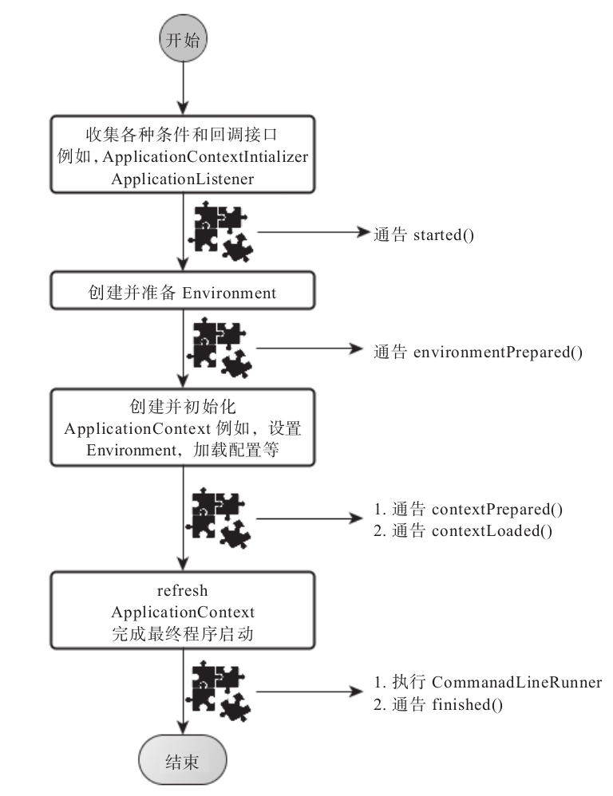

## 3.4 启动过程

跟踪 SpringApplication 的 run 方法是我们观察 Spring Boot 应用是如何启动的主要方法，该方法的主要流程大体可以归纳如下：

1） 如果我们使用的是 SpringApplication 的静态 run 方法，那么，这个方法里面首先要创建一个 SpringApplication 对象实例，然后调用这个创建好的 SpringApplication 的实例方法。在 SpringApplication 实例初始化的时候，它会提前做几件事情：

- 根据 classpath 里面是否存在某个特征类（org.springframework.web.context.ConfigurableWebApplicationContext）来决定是否应该创建一个为 Web 应用使用的 ApplicationContext 类型。
- 使用 SpringFactoriesLoader 在应用的 classpath 中查找并加载所有可用的 ApplicationContextInitializer。
- 使用 SpringFactoriesLoader 在应用的 classpath 中查找并加载所有可用的 ApplicationListener。
- 推断并设置 main 方法的定义类。

2） SpringApplication 实例初始化完成并且完成设置后，就开始执行 run 方法的逻辑了，方法执行伊始，首先遍历执行所有通过 SpringFactoriesLoader 可以查找到并加载的 SpringApplicationRunListener。调用它们的 started() 方法，告诉这些 SpringApplicationRunListener，“诺，俺的 SpringBoot 应用要开始执行啦~”。

3） 创建并配置当前 Spring Boot 应用将要使用的 Environment（包括配置要使用的 PropertySource 以及 Profile）。

4） 遍历调用所有 SpringApplicationRunListener 的 environmentPrepared() 方法，告诉他们：“当前 SpringBoot 应用使用的 Environment 准备好了咯！”。

5） 如果 SpringApplication 的 showBanner 属性被设置为 true，则打印 banner。

6） 根据用户是否明确设置了ApplicationContext 类型以及初始化阶段的推断结果，决定该为当前 SpringBoot 应用创建什么类型的 ApplicationContext 并创建完成，然后根据条件决定是否添加 ShutdownHook，决定是否使用自定义的 BeanNameGenerator，决定是否使用自定义的 ResourceLoader，当然，最重要的，将之前准备好的 Environment 设置给创建好的 ApplicationContext 使用。

7） ApplicationContext 创建好之后，SpringApplication 会再次借助 SpringFactoriesLoader，查找并加载 classpath 中所有可用的 ApplicationContextInitializer，然后遍历调用这些ApplicationContextInitializer 的 initialize(applicationContext) 方法来对已经创建好的ApplicationContext 进行进一步的处理。

8） 遍历调用所有 SpringApplicationRunListener 的 contextPrepared(ConfigurableApplicationContext context) 方法。

9） 最核心的一步，将之前通过 @EnableAutoConfiguration 获取的所有配置以及其他形式的 IoC 容器配置加载到已经准备完毕的 ApplicationContext。

10） 遍历调用所有 SpringApplicationRunListener 的 contextLoaded(ConfigurableApplicationContext context) 方法。

11） 调用 ApplicationContext 的 refresh() 方法，完成 IoC 容器可用的最后一道工序。

12） 查找当前 ApplicationContext 中是否注册有 CommandLineRunner，如果有，则遍历执行它们。

13） 正常情况下，遍历执行 SpringApplicationRunListener 的 finished() 方法（如果整个过程出现异常，则依然调用所有SpringApplicationRunListener的finished()方法，只不过这种情况下会将异常信息一并传入处理）

去除事件通知点后，整个流程如下：

