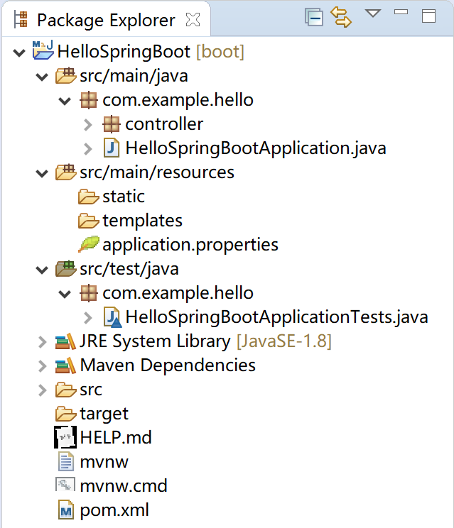

# 第3章 Spring Boot原理剖析

Spring Boot拥有很多的魔法，大部分基于这样一条原则“约定大于配置”：通过固定的目录结构和优先级，大大简化了程序的开发工作量。同时，Spring Boot也为“个性化”的项目或“个性化”的人提供了配置选项。对我们向客户交付软件产品而言，遵循Spring Boot的“约定”是明智之选。

Spring Boot的启动类和核心注解，是其“自动配置”的的基础。

本章，我们会从项目结构、启动类与核心注解和自动配置原理三个方面简要介绍Spring Boot的原理。需要进一步学习的同学，我推荐“**Spring Boot编程思想(核心篇)**”这本书，对在项目中针对Spring Boot框架扩展大有裨益。

## <span id = "structure">3.1 项目结构</span>

Spring官方为我们生成的项目，都具有固定的项目结构。下面，我们以上一章提供的“Hello Spring Boot”项目为例，来介绍Spring Boot的项目结构。



### 3.1.1 Maven配置文件

pom.xml文件，maven项目的配置依赖管理文件。其中包含了Spring Boot版本、各种starter和spring-boot-maven-plugin插件。

```xml
<?xml version="1.0" encoding="UTF-8"?>
<project xmlns="http://maven.apache.org/POM/4.0.0" xmlns:xsi="http://www.w3.org/2001/XMLSchema-instance"
	xsi:schemaLocation="http://maven.apache.org/POM/4.0.0 https://maven.apache.org/xsd/maven-4.0.0.xsd">
	<modelVersion>4.0.0</modelVersion>
	<parent>
		<groupId>org.springframework.boot</groupId>
		<artifactId>spring-boot-starter-parent</artifactId>
		<version>2.2.1.RELEASE</version>
		<relativePath/> <!-- lookup parent from repository -->
	</parent>
	<groupId>com.example</groupId>
	<artifactId>hello</artifactId>
	<version>0.0.1-SNAPSHOT</version>
	<name>HelloSpringBoot</name>
	<description>My First Spring Boot Project.</description>

	<properties>
		<java.version>1.8</java.version>
	</properties>

	<dependencies>
		<dependency>
			<groupId>org.springframework.boot</groupId>
			<artifactId>spring-boot-starter-web</artifactId>
		</dependency>

		<dependency>
			<groupId>org.springframework.boot</groupId>
			<artifactId>spring-boot-starter-test</artifactId>
			<scope>test</scope>
			<exclusions>
				<exclusion>
					<groupId>org.junit.vintage</groupId>
					<artifactId>junit-vintage-engine</artifactId>
				</exclusion>
			</exclusions>
		</dependency>
	</dependencies>

	<build>
		<plugins>
			<plugin>
				<groupId>org.springframework.boot</groupId>
				<artifactId>spring-boot-maven-plugin</artifactId>
			</plugin>
		</plugins>
	</build>

</project>
```

- spring-boot-starter-parent：是 Spring Boot的版本仲裁中心，其指定了Spring Boot的版本；
- starter启动器：Spring Boot的各种模块依赖，基于自动配置，为我们做了大量的配置依赖工作；
- spring-boot-maven-plugin插件： 能够以Maven的方式为应用提供Spring Boot的支持，即为Spring Boot应用提供了执行Maven操作的可能。 能够将Spring Boot应用打包为可执行的jar或war文件，然后以通常的方式运行Spring Boot应用。

这里特别说明一下spring-boot-maven-plugin提供的5个Maven Goals：

- spring-boot:repackage，默认goal。在mvn package之后，再次打包可执行的jar/war，同时保留mvn package生成的jar/war为.origin；
- spring-boot:run，运行Spring Boot应用；
- spring-boot:start，在mvn integration-test阶段，进行Spring Boot应用生命周期的管理；
- spring-boot:stop，在mvn integration-test阶段，进行Spring Boot应用生命周期的管理；
- spring-boot:build-info，生成Actuator使用的构建信息文件build-info.properties。

### 3.1.2 src/main/java

代码主目录，Spring  Boot的启动类就在这里。例如，`com.example.hello.HelloSpringBootApplication`。

启动类管理了其下的各个package的默认扫描，例如扫描其下package中的Controller。

根据项目开发规范，一般而言，其实体类(entity) 、数据访问类(Dao) 、服务类(Service) 、前端控制器(Controller) 、常量接口类(constant) 和一些工具类(utils) 都应该放置在这里。

### 3.1.3 src/main/resources

各种资源，如配置文件application.properties都应该放在这里。如果你的程序使用了MyBatis，则其mapper文件也应该放在这里的某个子目录下。

静态资源文件存放在static子目录中。如果你的Spring Boot应用是个前后端分离的项目，为了简化部署（只有一台服务器，服务用户人数在50人左右的简单应用），可以将前端vue的对应文件放置在这里，然后使用`java -jar xxx.jar`就可以运行这个程序了。

动态模板文件存放在templates子目录中。例如项目中的Thymeleaf 模板文件。

### 3.1.4 src/test/java

顾名思义，这里是单元测试代码的栖身之处。

## <span id = "baseConfig">3.2 基本配置</span>

本小节，分析Spring Boot的基本配置，了解其配置项。

### 3.2.1 父级依赖

我们在几乎在所有的Spring Boot项目中，都会看到`spring-boot-starter-parent`这样的父级依赖。

```xml
<parent>
    <groupId>org.springframework.boot</groupId>
    <artifactId>spring-boot-starter-parent</artifactId>
    <version>2.2.1.RELEASE</version>
    <relativePath/> <!-- lookup parent from repository -->
</parent>
```

父级依赖，确定了Spring Boot项目的主版本和 默认依赖：

1. java版本默认使用1.8；

2. 编码格式默认使用utf-8；

3. 提供Dependency Management进行项目依赖的版本管理；

4. 默认的资源过滤与插件管理。

其后的一些启动器（starter），就不需要指定版本了。

```xml
<dependency>
    <groupId>org.springframework.boot</groupId>
    <artifactId>spring-boot-starter-web</artifactId>
</dependency>
```

例如上面的web依赖，只需要指定`spring-boot-starter-web`即可。

但是，在机缘巧合的情况下，我们的项目（很有可能是遗留项目）已经有了`parent`，那该怎么办呢？

Spring一贯做法是”约定大于配置“，但总会为特殊情况下留下挪腾的空间：使用`dependencyManagement`方式import pom：

```xml
<dependencyManagement>
    <dependencies>
        <dependency>
            <!-- Import dependency management from Spring Boot -->
            <groupId>org.springframework.boot</groupId>
            <artifactId>spring-boot-dependencies</artifactId>
            <version>2.2.1.RELEASE</version>
            <type>pom</type>
            <scope>import</scope>
        </dependency>
    </dependencies>
</dependencyManagement>
```

然后，就可以安心地使用项目中的（或组织要求的）parent了。

### 3.2.2 application.properties

### 3.2.3 application.yml

### 3.2.4 Profile

### 3.2.5 Web容器配置

### 3.2.6 定制banner

为了发挥娱乐精神，Spring Boot启动信息中的banner也是可以定制的。我个人觉得，这就是一个彩蛋。


## <span id = "annotation">3.3 启动类与核心注解</span>

标注@SpringBootApplication注解的类，就是Spring Boot应用程序的启动类。这个启动类中包含main方法。

@SpringBootApplication注解就是Spring Boot的核心注解。

```java
/*
 * Copyright 2012-2019 the original author or authors.
 *
 * Licensed under the Apache License, Version 2.0 (the "License");
 * you may not use this file except in compliance with the License.
 * You may obtain a copy of the License at
 *
 *      https://www.apache.org/licenses/LICENSE-2.0
 *
 * Unless required by applicable law or agreed to in writing, software
 * distributed under the License is distributed on an "AS IS" BASIS,
 * WITHOUT WARRANTIES OR CONDITIONS OF ANY KIND, either express or implied.
 * See the License for the specific language governing permissions and
 * limitations under the License.
 */

package org.springframework.boot.autoconfigure;

import java.lang.annotation.Documented;
import java.lang.annotation.ElementType;
import java.lang.annotation.Inherited;
import java.lang.annotation.Retention;
import java.lang.annotation.RetentionPolicy;
import java.lang.annotation.Target;

import org.springframework.boot.SpringBootConfiguration;
import org.springframework.boot.context.TypeExcludeFilter;
import org.springframework.boot.context.properties.ConfigurationPropertiesScan;
import org.springframework.context.annotation.Bean;
import org.springframework.context.annotation.ComponentScan;
import org.springframework.context.annotation.ComponentScan.Filter;
import org.springframework.context.annotation.Configuration;
import org.springframework.context.annotation.FilterType;
import org.springframework.core.annotation.AliasFor;
import org.springframework.data.repository.Repository;

/**
 * Indicates a {@link Configuration configuration} class that declares one or more
 * {@link Bean @Bean} methods and also triggers {@link EnableAutoConfiguration
 * auto-configuration}, {@link ComponentScan component scanning}, and
 * {@link ConfigurationPropertiesScan configuration properties scanning}. This is a
 * convenience annotation that is equivalent to declaring {@code @Configuration},
 * {@code @EnableAutoConfiguration}, {@code @ComponentScan}.
 *
 * @author Phillip Webb
 * @author Stephane Nicoll
 * @author Andy Wilkinson
 * @since 1.2.0
 */
@Target(ElementType.TYPE)
@Retention(RetentionPolicy.RUNTIME)
@Documented
@Inherited
@SpringBootConfiguration
@EnableAutoConfiguration
@ComponentScan(excludeFilters = { @Filter(type = FilterType.CUSTOM, classes = TypeExcludeFilter.class),
		@Filter(type = FilterType.CUSTOM, classes = AutoConfigurationExcludeFilter.class) })
public @interface SpringBootApplication {

	/**
	 * Exclude specific auto-configuration classes such that they will never be applied.
	 * @return the classes to exclude
	 */
	@AliasFor(annotation = EnableAutoConfiguration.class)
	Class<?>[] exclude() default {};

	/**
	 * Exclude specific auto-configuration class names such that they will never be
	 * applied.
	 * @return the class names to exclude
	 * @since 1.3.0
	 */
	@AliasFor(annotation = EnableAutoConfiguration.class)
	String[] excludeName() default {};

	/**
	 * Base packages to scan for annotated components. Use {@link #scanBasePackageClasses}
	 * for a type-safe alternative to String-based package names.
	 * <p>
	 * <strong>Note:</strong> this setting is an alias for
	 * {@link ComponentScan @ComponentScan} only. It has no effect on {@code @Entity}
	 * scanning or Spring Data {@link Repository} scanning. For those you should add
	 * {@link org.springframework.boot.autoconfigure.domain.EntityScan @EntityScan} and
	 * {@code @Enable...Repositories} annotations.
	 * @return base packages to scan
	 * @since 1.3.0
	 */
	@AliasFor(annotation = ComponentScan.class, attribute = "basePackages")
	String[] scanBasePackages() default {};

	/**
	 * Type-safe alternative to {@link #scanBasePackages} for specifying the packages to
	 * scan for annotated components. The package of each class specified will be scanned.
	 * <p>
	 * Consider creating a special no-op marker class or interface in each package that
	 * serves no purpose other than being referenced by this attribute.
	 * <p>
	 * <strong>Note:</strong> this setting is an alias for
	 * {@link ComponentScan @ComponentScan} only. It has no effect on {@code @Entity}
	 * scanning or Spring Data {@link Repository} scanning. For those you should add
	 * {@link org.springframework.boot.autoconfigure.domain.EntityScan @EntityScan} and
	 * {@code @Enable...Repositories} annotations.
	 * @return base packages to scan
	 * @since 1.3.0
	 */
	@AliasFor(annotation = ComponentScan.class, attribute = "basePackageClasses")
	Class<?>[] scanBasePackageClasses() default {};

	/**
	 * Specify whether {@link Bean @Bean} methods should get proxied in order to enforce
	 * bean lifecycle behavior, e.g. to return shared singleton bean instances even in
	 * case of direct {@code @Bean} method calls in user code. This feature requires
	 * method interception, implemented through a runtime-generated CGLIB subclass which
	 * comes with limitations such as the configuration class and its methods not being
	 * allowed to declare {@code final}.
	 * <p>
	 * The default is {@code true}, allowing for 'inter-bean references' within the
	 * configuration class as well as for external calls to this configuration's
	 * {@code @Bean} methods, e.g. from another configuration class. If this is not needed
	 * since each of this particular configuration's {@code @Bean} methods is
	 * self-contained and designed as a plain factory method for container use, switch
	 * this flag to {@code false} in order to avoid CGLIB subclass processing.
	 * <p>
	 * Turning off bean method interception effectively processes {@code @Bean} methods
	 * individually like when declared on non-{@code @Configuration} classes, a.k.a.
	 * "@Bean Lite Mode" (see {@link Bean @Bean's javadoc}). It is therefore behaviorally
	 * equivalent to removing the {@code @Configuration} stereotype.
	 * @since 2.2
	 * @return whether to proxy {@code @Bean} methods
	 */
	@AliasFor(annotation = Configuration.class)
	boolean proxyBeanMethods() default true;

}
```

通过阅读@SpringBootApplication的源码，发现其由3个注解构成：

1. @SpringBootConfiguration
2. @EnableAutoConfiguration
3. @ComponentScan

如果我们将@SpringBootApplication注解替换为上面3个注解，效果一样。

```java
package com.example.hello;

import org.springframework.boot.SpringApplication;
import org.springframework.boot.SpringBootConfiguration;
import org.springframework.boot.autoconfigure.AutoConfigurationExcludeFilter;
import org.springframework.boot.autoconfigure.EnableAutoConfiguration;
import org.springframework.boot.context.TypeExcludeFilter;
import org.springframework.context.annotation.ComponentScan;
import org.springframework.context.annotation.ComponentScan.Filter;
import org.springframework.context.annotation.FilterType;

//@SpringBootApplication
@SpringBootConfiguration
@EnableAutoConfiguration
@ComponentScan(excludeFilters = { @Filter(type = FilterType.CUSTOM, classes = TypeExcludeFilter.class),
		@Filter(type = FilterType.CUSTOM, classes = AutoConfigurationExcludeFilter.class) })
public class HelloSpringBootApplication {

	public static void main(String[] args) {
		SpringApplication.run(HelloSpringBootApplication.class, args);
	}

}
```

## <span id = "autoConfig">3.4 自动配置原理</span>

## <span id = 'homework'>3.5 课后作业</span>

