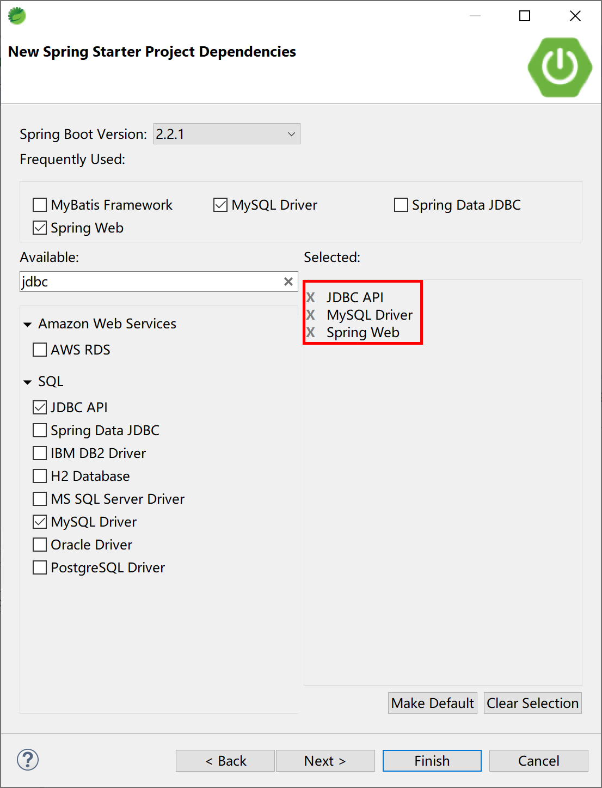
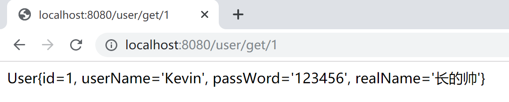

## 5.1 Spring Boot集成JdbcTemplate

原生的jdbc操作并不友好：需要自己加载驱动、创建连接、写数据库查询/新增/修改/删除的SQL（或调用存储过程）、自己控制事务、完成从数据库返回的ResultSet（java.sql.ResultSet）中取数（字段值）并且再把这些数存放到对象中。整个过程比较复杂，经常重复，并且没有什么技术含量。

针对这种情况，各种ORM（ Object Relational Mapping， 对象关系映射）技术应运而生，解决关系数据库到java对象的匹配问题。在这个领域中，经常使用到的有JPA、Hibernate、MyBatis等ORM框架。

当然，在大部分项目情况下，我们都会直接使用更加强大的持久化框架来访问数据库，比如MyBatis、Hibernate或者Spring Data JPA，但有的时候在项目中也会直接用到原生jdbc来操作数据库。我现在能够想到的唯一原因，就是原生jdbc直接、小巧、不引入第三方库。

但是，在Spring应用中，直接使用jdbc方式已经几乎见不到了。为了方便，Spring对数据库的操作在jdbc上面做了更深层次的封装（也是非常薄的一层封装）。

Spring封装提供的JdbcTemplate就是一个操作数据库的便捷工具。我们可以借助JdbcTemplate来执行所有数据库操作，例如插入，更新，删除和从数据库中检索数据，并且有效避免直接使用jdbc带来的繁琐编码。

JdbcTemplate主要提供以下五种类型的方法：

- execute方法：可以用于执行任何SQL语句，一般用于执行DDL语句。
- update、batchUpdate方法：用于执行新增、修改、删除等语句。
- query方法及queryForXXX方法：用于执行查询相关的语句。
- call方法：用于执行数据库存储过程和函数相关的语句。

下面我们在Spring Boot应用中引入JdbcTemplate方式操作数据，看看如何将JdbcTemplate技术集成到Spring Boot中去。

### 5.1.1 新建项目

使用Spring Starter工具新建Spring Boot项目。

注意要选中**JDBC API**、MySQL Driver和Spring Web的依赖。

> **JDBC API**依赖对应的starter是：`spring-boot-starter-jdbc`。



项目的pom文件，如下：

```xml
<?xml version="1.0" encoding="UTF-8"?>
<project xmlns="http://maven.apache.org/POM/4.0.0" xmlns:xsi="http://www.w3.org/2001/XMLSchema-instance"
	xsi:schemaLocation="http://maven.apache.org/POM/4.0.0 https://maven.apache.org/xsd/maven-4.0.0.xsd">
	<modelVersion>4.0.0</modelVersion>
	<parent>
		<groupId>org.springframework.boot</groupId>
		<artifactId>spring-boot-starter-parent</artifactId>
		<version>2.2.1.RELEASE</version>
		<relativePath/> <!-- lookup parent from repository -->
	</parent>
	<groupId>com.example</groupId>
	<artifactId>jdbc-template</artifactId>
	<version>0.0.1-SNAPSHOT</version>
	<name>jdbc-template</name>
	<description>JdbcTemplate Example.</description>

	<properties>
		<java.version>1.8</java.version>
	</properties>

	<dependencies>
		<dependency>
			<groupId>org.springframework.boot</groupId>
			<artifactId>spring-boot-starter-jdbc</artifactId>
		</dependency>
		<dependency>
			<groupId>org.springframework.boot</groupId>
			<artifactId>spring-boot-starter-web</artifactId>
		</dependency>

		<dependency>
			<groupId>mysql</groupId>
			<artifactId>mysql-connector-java</artifactId>
			<scope>runtime</scope>
		</dependency>
		<dependency>
			<groupId>org.springframework.boot</groupId>
			<artifactId>spring-boot-starter-test</artifactId>
			<scope>test</scope>
			<exclusions>
				<exclusion>
					<groupId>org.junit.vintage</groupId>
					<artifactId>junit-vintage-engine</artifactId>
				</exclusion>
			</exclusions>
		</dependency>
	</dependencies>

	<build>
		<plugins>
			<plugin>
				<groupId>org.springframework.boot</groupId>
				<artifactId>spring-boot-maven-plugin</artifactId>
			</plugin>
		</plugins>
	</build>

</project>
```

项目的配置文件`application.yml`中配置数据库连接信息。

```yaml
# mysql数据源配置
spring:
  datasource:
    url: jdbc:mysql://localhost:3306/spring_boot_course?useUnicode=true&characterEncoding=utf-8&serverTimezone=GMT%2B8
    username: root
    password: 123456
    driver-class-name: com.mysql.cj.jdbc.Driver
```

> 需要注意的是：在我们的练习环境中使用的是MySQL 5.7数据库，Spring Boot使用当前的jdbc驱动（8.0.18）application.yml配置需要注意如下两点：
>
> - url需要设置时区参数，例如`jdbc:mysql://localhost:3306/spring_boot_course?useUnicode=true&characterEncoding=utf-8&serverTimezone=GMT%2B8`；
> - jdbc驱动，需要使用`com.mysql.cj.jdbc.Driver`。

### 5.1.2 新建Entity类

实体类，一般对应了数据库中的表，其中的每一个属性，对应了表中的一个字段。

```java
package com.example.jdbctemplate.entity;

public class User {
	
	private Integer id;
	private String userName;
	private String passWord;
	private String realName;
（省略getter、setter）
	@Override
	public String toString() {

        return "User{" +
                "id=" + id +
                ", userName='" + userName + '\'' +
                ", passWord='" + passWord + '\'' +
                ", realName='" + realName + '\'' +
                '}';
	}
}
```

对应表user的MySQL DDL如下：

```sql
DROP TABLE IF EXISTS `user`;
CREATE TABLE `user` (
  `id` int(32) NOT NULL AUTO_INCREMENT,
  `userName` varchar(32) NOT NULL,
  `passWord` varchar(50) NOT NULL,
  `realName` varchar(32) DEFAULT NULL,
  PRIMARY KEY (`id`)
) ENGINE=InnoDB AUTO_INCREMENT=2 DEFAULT CHARSET=utf8;
```
插入1条数据，供测试：

```sql
INSERT INTO `user` VALUES ('1', 'Kevin', '123456', '长的帅');
```

### 5.1.3 新建DAO类

DAO类是通过JdbcTemplate存取数据的关键，并且通过`@Repository`注解将其纳入Spring容器管理，供其他Spring组件（bean）使用，一般都是注入到Service类中。

```java
package com.example.jdbctemplate.dao;

import org.springframework.beans.factory.annotation.Autowired;
import org.springframework.jdbc.core.BeanPropertyRowMapper;
import org.springframework.jdbc.core.JdbcTemplate;
import org.springframework.stereotype.Repository;

import com.example.jdbctemplate.entity.User;

@Repository
public class UserDAO {

	@Autowired
	JdbcTemplate jdbcTemplate;

	public User getUser(int id) {
		String sql = "select * from user where id=" + id;
		return jdbcTemplate.queryForObject(sql, new BeanPropertyRowMapper<>(User.class));
	}

}
```

注意上面代码中的第13-14行，其中直接注入了JdbcTemplate对象，供操作SQL用。

第17-18行，就是使用JdbcTemplate对象完成了一次查询，并且将数据库查询结果（一行数据）封装（BeanPropertyRowMapper）到了一个对象（实体类User对象）中。

> JdbcTemplate对象是从哪里来的？那就是Spring Boot Starter（启动器）的魔法了。
>
> 在本项目中，`spring-boot-starter-jdbc`自动在Spring容器中注册了JdbcTemplate对象。

### 5.1.4 新建Service类

服务类中注入DAO类，在向外提供的服务中需要用数据库操作时，调用DAO对象的对应方法，即可和数据库交互。

```java
package com.example.jdbctemplate.service;

import org.springframework.beans.factory.annotation.Autowired;
import org.springframework.stereotype.Service;

import com.example.jdbctemplate.dao.UserDAO;
import com.example.jdbctemplate.entity.User;

@Service
public class UserService {

	@Autowired
	UserDAO userDAO;

	public User getUser(int id) {
		return userDAO.getUser(id);
	}

}
```

### 5.1.5 新建Controller类

新建一个控制器类，在接收到用户请求`/user/get/1`时通过Service对象中的DAO对象对应方法访问数据库中id=1的这条记录，并通过ResponseBody返回。

```java
package com.example.jdbctemplate.controller;

import org.springframework.beans.factory.annotation.Autowired;
import org.springframework.web.bind.annotation.PathVariable;
import org.springframework.web.bind.annotation.RequestMapping;
import org.springframework.web.bind.annotation.RestController;

import com.example.jdbctemplate.service.UserService;

@RestController
@RequestMapping("/user")
public class UserController {

	@Autowired
	private UserService userService;

	@RequestMapping("get/{id}")
	public String getUser(@PathVariable int id) {
		return userService.getUser(id).toString();
	}
	
}
```

### 5.2.6 运行验证

运行该项目的启动类`JdbcTemplateApplication`，在浏览器中访问[http://localhost:8080/user/get/1](http://localhost:8080/user/get/1)，验证是否可以正确的查询到数据库中的记录。



以上就是如何在Spring Boot中集成`JdbcTemplate`，使用最简单最原始的SQL与数据库交互的示例。

在大多数情况下，我们都会选择一些ORM技术来与数据库进行交互，下一小节，我们会介绍MyBatis这个ORM框架。

> 本小节示例项目代码：
>
> [https://github.com/gyzhang/SpringBootCourseCode/tree/master/spring-boot-jdbc](https://github.com/gyzhang/SpringBootCourseCode/tree/master/spring-boot-jdbc)