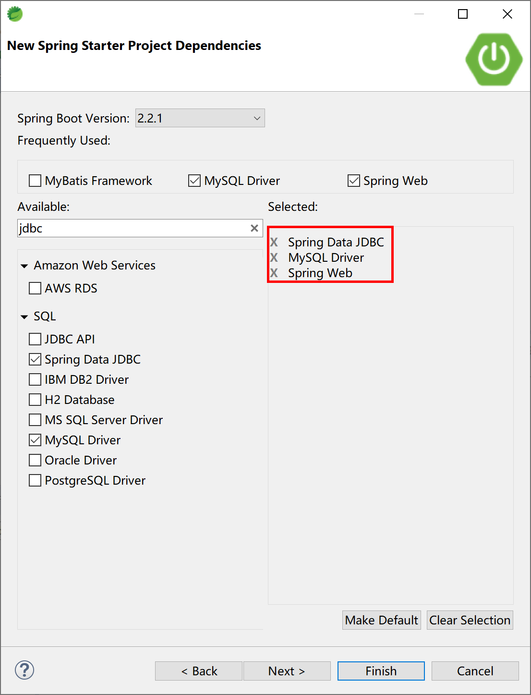

## 5.1 Spring Boot集成JdbcTemplate

Spring对数据库的操作在jdbc上面做了更深层次的封装，而JdbcTemplate便是Spring提供的一个操作数据库的便捷工具。我们可以借助JdbcTemplate来执行所有数据库操作，例如插入，更新，删除和从数据库中检索数据，并且有效避免直接使用jdbc带来的繁琐编码。

JdbcTemplate主要提供以下五种类型的方法：

- execute方法：可以用于执行任何SQL语句，一般用于执行DDL语句。
- update、batchUpdate方法：用于执行新增、修改、删除等语句。
- query方法及queryForXXX方法：用于执行查询相关的语句。
- call方法：用于执行数据库存储过程和函数相关的语句。

当然，在大部分情况下，我们都会直接使用更加强大的持久化框架来访问数据库，比如MyBatis、Hibernate或者Spring Data JPA，但有的时候在项目中也会用到JdbcTemplate这种数据库访问方式。

