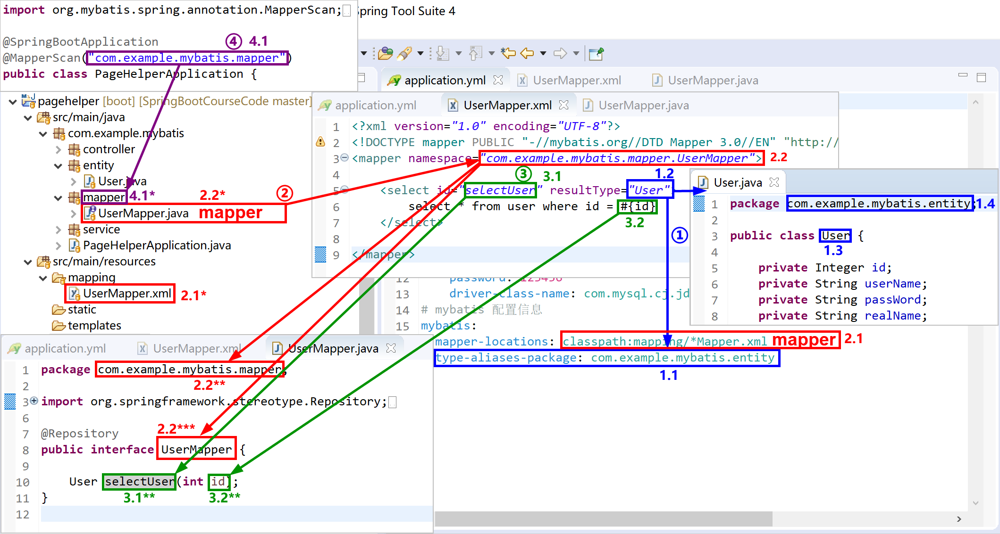

## 5.2 Spring Boot集成MyBatis

MyBatis 是一款优秀的持久层框架，它支持定制化 SQL、存储过程以及高级映射。MyBatis 避免了几乎所有的 JDBC 代码和手动设置参数以及获取结果集。

MyBatis 可以使用简单的 XML 或注解来配置和映射原生类型、接口和 Java 的 POJO（Plain Old Java Objects，普通老式 Java 对象）为数据库中的记录。 

> 官方[参考文档](https://mybatis.org/mybatis-3/zh/index.html)，有中文版，描述非常详细，在这里，能解决你的所有疑问。

由于MyBatis在系统复杂性、便捷性和可控性方面找到了一个较好平衡。能够满足DBA对数据库的架构设计，也能满足开发人员对复杂SQL的编写，同时又能满足技术经理/架构师对SQL调优的需求。所以，最近几年来，MyBatis使用得越来越广泛。

要想掌握MyBatis，必须熟悉其几个重要的概念：

1. **mapper：**映射器，里面存放了增删改查等映射语句和其对应的java接口（在运行时使用 动态代理），通常情况下，我们指一个mapper是在说这个mapper的xml文件和其对应的接口java文件。MyBatis 的真正强大在于它的映射语句，也是它的魔力所在。由于它的异常强大，映射器（mapper）的 XML 文件就显得相对简单。如果拿它跟具有相同功能的 JDBC 代码进行对比，你会立即发现省掉了将近 95% 的代码。MyBatis 就是针对 SQL 构建的，并且比普通的方法做的更好。 
2. **namespace：**命名空间。在之前版本的 MyBatis 中，命名空间的作用并不大，是可选的。 但现在，随着命名空间越发重要，你必须指定命名空间。命名空间的作用有两个。
- 利用更长的完全限定名来将不同的语句隔离开来，同时将mapper的xml文件和java接口绑定。
   - 将命名空间置于合适的 Java 包命名空间之中，代码会变得更加整洁，也有利于你更方便地使用 MyBatis。
3. **resultType：**返回结果类型。例如如一个按照id查询的select语句返回表中一条记录，MyBatis通过mapper，在java中将其映射成一个对象返回。

MyBatis中的概念较多，对应使用到的文件也较多，为了更加形象的理解MyBatis的配置对应关系，我们通过如下Spring Boot项目的MyBatis配置关系示意图，来学习如何正确地将MyBatis的各种元素有机的联系起来。



如上图所示：

1. 红色mapper 2.1指定了项目中mapper映射xml文件（例如上图中的2.1* UserMapper.xml文件，其中存放了select等语句）存放的位置（大多数项目都习惯于将其存放于resources/mapping文件夹下）；
2. 红色namespace命名空间 2.2将本mapper映射xml文件和对应的java接口文件（2.2*）连接起来；
3. 蓝色1.1的`type-aliases-package`指定了1.2`resultType`的简写方法（上图中的，1.2`User`会被MyBatis解释成`com.example.mybatis.entity.User`）；
4. 蓝色返回类型1.2User（实际上是`com.example.mybatis.entity.User`）对应的是1.4包下的entity实体类1.3User；
5. 绿色3.1selectUser是一个select查询，其对应的java接口文件中的方法为3.1**selectUser方法，返回类型为蓝色1.2User；
6. 绿色3.1selectUser这个select查询，使用了一个3.2id参数，对应java接口文件3.1** selectUser方法参数3.2**id；
7. 紫色4.1`@MapperScan("com.example.mybatis.mapper")`注解指定了mapper的java接口文件扫描的包位置4.1*，上图中，红色2.2UserMapper接口文件就存放在其中。

> - application.yml配置文件中（红色2.1）设定了mapper的xml文件存放位置；
>
> - Spring Boot配置类（本例中将其配置到了Spring Boot的启动类上了）中，设定了mapper的java接口文件扫描位置。在项目启动时，MyBatis将扫描（扫描`@Repository`注解）到的mapper的java接口文件和mapper的xml动态代理成我们真正用到的Dao类，完成数据库的访问，并返回映射后的java对象，完成ORM（对象关系映射）过程。

Spring Boot通过starter使用MyBatis是非常方便的。

在pom.xml文件中添加`mybatis-spring-boot-starter`启动器，和MySQL数据的jdbc驱动，就可以使用MyBatis了。

```xml
<dependency>
    <groupId>org.mybatis.spring.boot</groupId>
    <artifactId>mybatis-spring-boot-starter</artifactId>
    <version>2.1.1</version>
</dependency>
<dependency>
    <groupId>mysql</groupId>
    <artifactId>mysql-connector-java</artifactId>
    <scope>runtime</scope>
</dependency>
```

> 需要注意的是：在我们的练习环境中使用的是MySQL 5.7数据库，Spring Boot使用当前的jdbc驱动（8.0.18）application.yml配置需要注意如下两点：
>
> - url需要设置时区参数，例如`jdbc:mysql://localhost:3306/spring_boot_course?useUnicode=true&characterEncoding=utf-8&serverTimezone=GMT%2B8`；
> - jdbc驱动，需要使用`com.mysql.cj.jdbc.Driver`。

### 5.2.1 创建项目

首先在STS中创建一个Spring Boot项目，选中的starter有：

- Spring Web;
- MySQL Driver;
- MyBatis Framework.


其pom.xml文件内容如下：

```xml
<?xml version="1.0" encoding="UTF-8"?>
<project xmlns="http://maven.apache.org/POM/4.0.0" xmlns:xsi="http://www.w3.org/2001/XMLSchema-instance"
	xsi:schemaLocation="http://maven.apache.org/POM/4.0.0 https://maven.apache.org/xsd/maven-4.0.0.xsd">
	<modelVersion>4.0.0</modelVersion>
	<parent>
		<groupId>org.springframework.boot</groupId>
		<artifactId>spring-boot-starter-parent</artifactId>
		<version>2.2.1.RELEASE</version>
		<relativePath/> <!-- lookup parent from repository -->
	</parent>
	<groupId>com.example</groupId>
	<artifactId>mybatis</artifactId>
	<version>0.0.1-SNAPSHOT</version>
	<name>MyBatis</name>
	<description>MyBatis Example.</description>

	<properties>
		<java.version>1.8</java.version>
	</properties>

	<dependencies>
		<dependency>
			<groupId>org.springframework.boot</groupId>
			<artifactId>spring-boot-starter-web</artifactId>
		</dependency>
		<dependency>
			<groupId>org.mybatis.spring.boot</groupId>
			<artifactId>mybatis-spring-boot-starter</artifactId>
			<version>2.1.1</version>
		</dependency>

		<dependency>
			<groupId>mysql</groupId>
			<artifactId>mysql-connector-java</artifactId>
			<scope>runtime</scope>
		</dependency>
		<dependency>
			<groupId>org.springframework.boot</groupId>
			<artifactId>spring-boot-starter-test</artifactId>
			<scope>test</scope>
			<exclusions>
				<exclusion>
					<groupId>org.junit.vintage</groupId>
					<artifactId>junit-vintage-engine</artifactId>
				</exclusion>
			</exclusions>
		</dependency>
	</dependencies>

	<build>
		<plugins>
			<plugin>
				<groupId>org.springframework.boot</groupId>
				<artifactId>spring-boot-maven-plugin</artifactId>
			</plugin>
		</plugins>
	</build>

</project>
```

### 5.2.2 修改配置文件

在application.yml文件中配置数据库连接信息：

```yaml
# mysql数据源配置
spring:
  datasource:
    url: jdbc:mysql://localhost:3306/spring_boot_course?useUnicode=true&characterEncoding=utf-8&serverTimezone=GMT%2B8
    username: root
    password: 123456
    driver-class-name: com.mysql.cj.jdbc.Driver
# mybatis 配置信息
mybatis:
  mapper-locations: classpath:mapping/*Mapper.xml
  type-aliases-package: com.example.mybatis.entity
```

### 5.2.3 启动类

启动类，也是一个配置类（`@SpringBootApplication`是个复合注解），可在上配置MyBatis的扫描注解。

```java
package com.example.mybatis;

import org.mybatis.spring.annotation.MapperScan;
import org.springframework.boot.SpringApplication;
import org.springframework.boot.autoconfigure.SpringBootApplication;

@SpringBootApplication
@MapperScan("com.example.mybatis.mapper")
public class MyBatisApplication {

	public static void main(String[] args) {
		SpringApplication.run(MyBatisApplication.class, args);
	}

}
```

其中第8行是添加的MyBatis的mapper扫描包位置。

项目中通常会包含多个业务功能模块，mapper会放置在各自功能模块下的mapper包中，请参考如下代码配置多个扫描包位置：

```java
@MapperScan({"com.example.mybatis.admin.mapper","com.example.mybatis.report.mapper"})
```

### 5.2.4 实体类

实体类，一般对应了数据库中的表。

```java
package com.example.mybatis.entity;

public class User {
	
	private Integer id;
	private String userName;
	private String passWord;
	private String realName;
（省略getter、setter和toString方法）
```

对应表user的MySQL DDL如下：

```sql
DROP TABLE IF EXISTS `user`;
CREATE TABLE `user` (
  `id` int(32) NOT NULL AUTO_INCREMENT,
  `userName` varchar(32) NOT NULL,
  `passWord` varchar(50) NOT NULL,
  `realName` varchar(32) DEFAULT NULL,
  PRIMARY KEY (`id`)
) ENGINE=InnoDB AUTO_INCREMENT=2 DEFAULT CHARSET=utf8;
```
插入1条数据，供测试：

```sql
INSERT INTO `user` VALUES ('1', 'Kevin', '123456', '长的帅');
```

### 5.2.5 映射器（mapper）

mapper的xml文件：

```xml
<?xml version="1.0" encoding="UTF-8"?>
<!DOCTYPE mapper PUBLIC "-//mybatis.org//DTD Mapper 3.0//EN" "http://mybatis.org/dtd/mybatis-3-mapper.dtd">
<mapper namespace="com.example.mybatis.mapper.UserMapper">

    <select id="selectUser" resultType="User">
        select * from user where id = #{id}
    </select>
 
</mapper>
```

mapper的java接口文件：

```java
package com.example.mybatis.mapper;

import org.springframework.stereotype.Repository;

import com.example.mybatis.entity.User;

@Repository
public interface UserMapper {

	User selectUser(int id);
}
```

注意第7行的注解，标注了这是个受MyBatis管理的DAO类。

### 5.2.6 服务类

服务类完成业务功能。一般企业应用，都会在服务类中注入DAO来操作数据库。

```java
package com.example.mybatis.service;

import org.springframework.beans.factory.annotation.Autowired;
import org.springframework.stereotype.Service;

import com.example.mybatis.entity.User;
import com.example.mybatis.mapper.UserMapper;

@Service
public class UserService {
    @Autowired
    UserMapper userMapper;
    public User selectUser(int id){
        return userMapper.selectUser(id);
    }
}
```

其中第11-12行，就注入了`UserMapper`这个DAO。

### 5.2.7 控制器类

控制器类与前端交互，并调用服务类完成业务操作。

```java
package com.example.mybatis.controller;

import org.springframework.beans.factory.annotation.Autowired;
import org.springframework.web.bind.annotation.PathVariable;
import org.springframework.web.bind.annotation.RequestMapping;
import org.springframework.web.bind.annotation.RestController;

import com.example.mybatis.service.UserService;

@RestController
@RequestMapping("/user")
public class UserController {
 
    @Autowired
    private UserService userService;
 
    @RequestMapping("get/{id}")
    public String GetUser(@PathVariable int id){
        return userService.selectUser(id).toString();
    }

}
```

其中第14-15行，就注入了服务类`UserService`。

### 5.2.8 运行验证

运行该项目的启动类`MyBatisApplication`，在浏览器中访问[http://localhost:8080/user/get/1](http://localhost:8080/user/get/1)，验证是否可以正确的查询到数据库中的记录。


