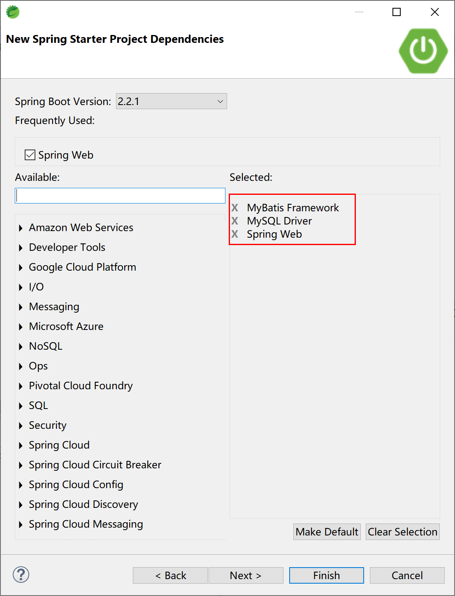

## 5.3 MyBatis分页

一旦谈及ORM持久化，就必须涉及其查询结果集的分页问题。

在MyBatis中，一旦涉及分页，基本上都会想到PageHelper这个开源分页插件项目

> 如果你也在用 MyBatis，建议尝试该分页插件（PageHelper），这一定是最方便使用的分页插件。分页插件支持任何复杂的单表、多表分页。 

- 物理分页：支持常见的 12 种数据库：
  Oracle,MySql,MariaDB,SQLite,DB2,PostgreSQL,SqlServer 等；
- 支持多种分页方式：
  支持常见的RowBounds(PageRowBounds)，PageHelper.startPage 方法调用，
  Mapper 接口参数调用；
- QueryInterceptor 规范：
  使用 QueryInterceptor 规范，开发插件更轻松。

下面，我们先简单介绍在传统Spring中如何使用分页插件，然后再以一个Spring Boot项目来学习其简化的“启动器（starter）”用法。

> 为什么要用传统Spring方式来介绍？
>
> 因为这样能更好的理解其配置内容的详细信息。

### 5.3.1 引入分页插件

在 pom.xml 中添加如下依赖：

```xml
<dependency>
    <groupId>com.github.pagehelper</groupId>
    <artifactId>pagehelper</artifactId>
    <version>5.1.10</version>
</dependency>
```

### 5.3.2 配置拦截器插件

特别注意，新版拦截器是 `com.github.pagehelper.PageInterceptor`。 `com.github.pagehelper.PageHelper` 现在是一个特殊的 `dialect` 实现类，是分页插件的默认实现类，提供了和以前相同的用法。 

 使用 spring 的属性配置方式，可以使用 `plugins` 属性像下面这样配置：

```xml
<bean id="sqlSessionFactory" class="org.mybatis.spring.SqlSessionFactoryBean">
  <!-- 注意其他配置 -->
  <property name="plugins">
    <array>
      <bean class="com.github.pagehelper.PageInterceptor">
        <property name="properties">
          <!--使用下面的方式配置参数，一行配置一个 -->
          <value>
            params=value1
          </value>
        </property>
      </bean>
    </array>
  </property>
</bean>
```

**分页插件参数介绍：**
分页插件提供了多个可选参数，这些参数使用时，按照上面配置方式中的示例配置即可。

分页插件可选参数如下：

dialect：默认情况下会使用 PageHelper 方式进行分页，如果想要实现自己的分页逻辑，可以实现 Dialect(com.github.pagehelper.Dialect) 接口，然后配置该属性为实现类的全限定名称。

**下面几个参数都是针对默认dialect情况下的参数。使用自定义dialect实现时，下面的参数没有任何作用。** 

1. helperDialect：分页插件会自动检测当前的数据库链接，自动选择合适的分页方式。 你可以配置helperDialect属性来指定分页插件使用哪种方言。配置时，可以使用下面的缩写值：
oracle,mysql,mariadb,sqlite,hsqldb,postgresql,db2,sqlserver,informix,h2,sqlserver2012,derby
特别注意：使用 SqlServer2012 数据库时，需要手动指定为 sqlserver2012，否则会使用SqlServer2005 的方式进行分页。
你也可以实现 AbstractHelperDialect，然后配置该属性为实现类的全限定名称即可使用自定义的实现方法。

2. offsetAsPageNum：默认值为 false，该参数对使用 RowBounds 作为分页参数时有效。 当该参数设置为 true 时，会将 RowBounds 中的 offset 参数当成 pageNum 使用，可以用页码和页面大小两个参数进行分页。

3. rowBoundsWithCount：默认值为false，该参数对使用 RowBounds 作为分页参数时有效。 当该参数设置为true时，使用 RowBounds 分页会进行 count 查询。

4. pageSizeZero：默认值为 false，当该参数设置为 true 时，如果 pageSize=0 或者 RowBounds.limit = 0 就会查询出全部的结果（相当于没有执行分页查询，但是返回结果仍然是 Page 类型）。

5. reasonable：分页合理化参数，默认值为false。当该参数设置为 true 时，pageNum<=0 时会查询第一页， pageNum>pages（超过总数时），会查询最后一页。默认false 时，直接根据参数进行查询。

6. params：为了支持startPage(Object params)方法，增加了该参数来配置参数映射，用于从对象中根据属性名取值， 可以配置 pageNum,pageSize,count,pageSizeZero,reasonable，不配置映射的用默认值， 默认值为pageNum=pageNum;pageSize=pageSize;count=countSql;reasonable=reasonable;pageSizeZero=pageSizeZero。

7. supportMethodsArguments：支持通过 Mapper 接口参数来传递分页参数，默认值false，分页插件会从查询方法的参数值中，自动根据上面 params 配置的字段中取值，查找到合适的值时就会自动分页。 使用方法可以参考测试代码中的 com.github.pagehelper.test.basic 包下的 ArgumentsMapTest 和 ArgumentsObjTest。

8. autoRuntimeDialect：默认值为 false。设置为 true 时，允许在运行时根据多数据源自动识别对应方言的分页 （不支持自动选择sqlserver2012，只能使用sqlserver），用法和注意事项参考下面的场景五。

9. closeConn：默认值为 true。当使用运行时动态数据源或没有设置 helperDialect 属性自动获取数据库类型时，会自动获取一个数据库连接， 通过该属性来设置是否关闭获取的这个连接，默认true关闭，设置为 false 后，不会关闭获取的连接，这个参数的设置要根据自己选择的数据源来决定。

重要提示：

当 offsetAsPageNum=false 的时候，由于 PageNum 问题，RowBounds查询的时候 reasonable 会强制为 false。使用 PageHelper.startPage 方法不受影响。

### 5.3.3 Spring Boot集成方式

首先创建一个Spring Boot项目，选中的starter有：

- Spring Web;
- MySQL Driver;
- MyBatis Framework.



然后手动添加mybatis-spring-boot-starter，以使用PageHelper分页插件。

其pom文件为：

```xml
<?xml version="1.0" encoding="UTF-8"?>
<project xmlns="http://maven.apache.org/POM/4.0.0" xmlns:xsi="http://www.w3.org/2001/XMLSchema-instance"
	xsi:schemaLocation="http://maven.apache.org/POM/4.0.0 https://maven.apache.org/xsd/maven-4.0.0.xsd">
	<modelVersion>4.0.0</modelVersion>
	<parent>
		<groupId>org.springframework.boot</groupId>
		<artifactId>spring-boot-starter-parent</artifactId>
		<version>2.2.1.RELEASE</version>
		<relativePath/> <!-- lookup parent from repository -->
	</parent>
	<groupId>com.example.mybatis</groupId>
	<artifactId>pagehelper</artifactId>
	<version>0.0.1-SNAPSHOT</version>
	<name>PageHelper</name>
	<description>MyBatis PageHelper Example.</description>

	<properties>
		<java.version>1.8</java.version>
	</properties>

	<dependencies>
		<dependency>
			<groupId>org.springframework.boot</groupId>
			<artifactId>spring-boot-starter-web</artifactId>
		</dependency>
		<dependency>
			<groupId>org.mybatis.spring.boot</groupId>
			<artifactId>mybatis-spring-boot-starter</artifactId>
			<version>2.1.1</version>
		</dependency>
		
      	<!-- pagehelper分页插件依赖 -->
        <dependency>
            <groupId>com.github.pagehelper</groupId>
            <artifactId>pagehelper-spring-boot-starter</artifactId>
            <version>1.2.12</version>
        </dependency>		

		<dependency>
			<groupId>mysql</groupId>
			<artifactId>mysql-connector-java</artifactId>
			<scope>runtime</scope>
		</dependency>
		<dependency>
			<groupId>org.springframework.boot</groupId>
			<artifactId>spring-boot-starter-test</artifactId>
			<scope>test</scope>
			<exclusions>
				<exclusion>
					<groupId>org.junit.vintage</groupId>
					<artifactId>junit-vintage-engine</artifactId>
				</exclusion>
			</exclusions>
		</dependency>
	</dependencies>

	<build>
		<plugins>
			<plugin>
				<groupId>org.springframework.boot</groupId>
				<artifactId>spring-boot-maven-plugin</artifactId>
			</plugin>
		</plugins>
	</build>

</project>
```

上面的pom.xml文件中，第32-37行，就是使用PageHelper分页插件的启动器依赖。

使用application.yml为PageHelper配置参数：

```yaml
# 分页插件配置
pagehelper:
  helper-dialect: mysql
  reasonable: true
  support-methods-arguments: true
  params: count=countsql
# mysql数据源配置
spring:
  datasource:
    url: jdbc:mysql://localhost:3306/springboot?useUnicode=true&characterEncoding=utf-8
    driver-class-name: com.mysql.jdbc.Driver
    username: root
    password: 123456
```

配置参数说明：

| 属性                      | 作用                          | 说明                                                         |
| ------------------------- | ----------------------------- | ------------------------------------------------------------ |
| helper-dialect            | 指定数据库                    | 可以不配置，插件会自动检测数据库的类型                       |
| reasonable                | 分页合理化参数，默认值为false | 当该参数设置为 true 时，pageNum<=0 时会查询第一页， pageNum>pages（超过总数时），会查询最后一页。默认false 时，直接根据参数进行查询。 |
| params                    | 用于从对象中根据属性名取值    | 可以配置pageNum,pageSize,count,pageSizeZero,reasonable。不配置映射的用默认值。 |
| support-methods-arguments | 默认值false                   | 分页插件会从查询方法的参数值中，自动根据上面 params 配置的字段中取值，查找到合适的值时就会自动分页。 |


