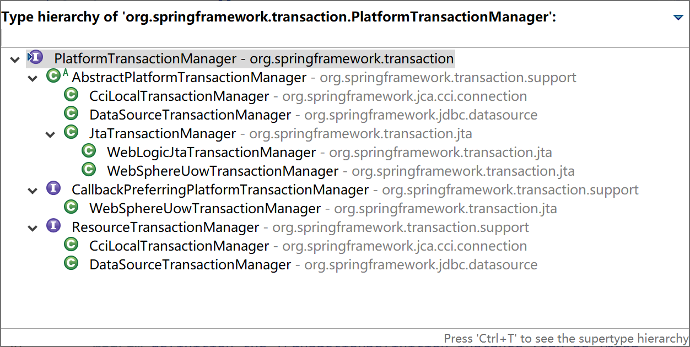

## 6.2 事务的使用

Java EE 中访问数据的技术众多，包含了从最基础的 JDBC 到各种方便快捷的 ORM 技术，如 JTA、Hibernate、MyBatis 等。Spring 面对众多的数据访问技术，在事务管理 API 上定义了一个抽象的 PlatformTransactionManager 接口来隔离事务底层的复杂性，让应用程序开发人员不需要了解底层的事务 API 就可以得心应手的使用事务管理机制。

Spring 在 PlatformTransactionManager 接口上提供了几类常用的事务管理器：

- DataSourceTransactionManager
- CciLocalTransactionManager
- JtaTransactionManager
- WebLogicJtaTransactionManager
- WebSphereUowTransactionManager



我们经常用的 MyBatis，通常都是使用的`DataSourceTransactionManager`这个事务管理器。

```xml
<bean id="transactionManager" class="org.springframework.jdbc.datasource.DataSourceTransactionManager">
  <property name="dataSource" ref="dataSource" />
</bean>
```

### 6.2.1 编程式事务

编程式事务是指程序员通过程序代码，明确的控制事务的提交、撤回操作，整个过程非常繁杂。现在已经很少使用了，你可能会在一些遗留系统中看到这种用法。

例如下面的“转账”原生 JDBC 事务代码片段，在 Spring 出现之前，我们经常用到这样的方式来管理事务。

```java
Connection con = null;
try{
    con = JdbcUtils.getConnection();
    con.setAutoCommit(false);
    AccountDao dao = new AccountDao();
    dao.updateBalance(con,from,-money); //给from减去相应金额
    dao.updateBalance(con,to,+money); //给to加上相应金额
    con.commit(); //提交事务
} catch (Exception e) {
    try {
        con.rollback(); //事务回滚
    } catch (SQLException e1) {
        e.printStackTrace();
    }
    throw new RuntimeException(e);
}
```

Spring 当然支持编程式事务（虽然强烈不推荐），但也提供了相应的封装。你可以使用 TransactionTemplate 或者底层的 PlatformTransactionManager。对于编程式事务管理，Spring 推荐使用 TransactionTemplate。 

参考如下“转账”代码片段，了解 Spring 是如何使用 TransactionTemplate 对编程式事务提供支持的。

```java
@Autowired
TransactionTemplate transactionTemplate;
@Autowired
AccountDao dao;
...
    
//开启“转账”事务
boolean result = transactionTemplate.execute(new TransactionCallback<Boolean>() {
    @Override
    public Boolean doInTransaction(TransactionStatus status) {
        try {
            dao.updateBalance(con,from,-money); //给from减去相应金额
            dao.updateBalance(con,to,+money); //给to加上相应金额
        } catch (Exception e) {
            status.setRollbackOnly();
            logger.error(e.getMessage(), e);
            return false;
        }
        return true;
    }
});
```

使用 PlatformTransactionManager 方式的转账”代码片段如下：

```java
@Autowired
PlatformTransactionManager transactionManager;
@Autowired
AccountDao dao;
...
    
DefaultTransactionDefinition def = new DefaultTransactionDefinition();//定义事务
def.setReadOnly(false);
def.setIsolationLevel(TransactionDefinition.ISOLATION_READ_COMMITTED);//隔离级别
def.setPropagationBehavior(TransactionDefinition.PROPAGATION_REQUIRED);//传播策略
TransactionStatus status = transactionManager.getTransaction(def);
try {
    dao.updateBalance(con,from,-money); //给from减去相应金额
    dao.updateBalance(con,to,+money); //给to加上相应金额
    transactionManager.commit(status);//提交事务
} catch (Exception e) {
    transactionManager.rollback(status);//回滚事务
    throw new RuntimeException(e);
}
```

### 6.2.2 声明式事务

声明式事务是建立在 AOP 之上的。其本质是对方法前后进行拦截，然后在目标方法开始之前创建或者加入一个事务，在执行完目标方法之后根据执行情况提交或者回滚事务。声明式事务最大的优点就是不需要通过编程的方式管理事务，这样就不需要在业务逻辑代码中掺杂事务管理的代码，只需在配置文件中做相关的事务规则声明（或通过基于 @Transactional 注解的方式），便可以将事务规则应用到业务逻辑中。

> 事务是典型的切面，声明式事务也是 AOP 的一个典型应用。

显然声明式事务管理要优于编程式事务管理，这正是 Spring 倡导的非侵入式的开发方式。声明式事务管理使业务代码不受污染，一个普通的 POJO 对象，只要加上注解就可以获得完全的事务支持。

声明式事务管理有两种常用的方式，一种是基于 tx 和 aop 名字空间的 xml 配置文件，另一种就是基于 @Transactional 注解。显然基于注解的方式更简单易用，更清爽。   

下面，以我们常用的 MyBatis 环境为例，说明声明式事务是如何使用的。

```xml
xmlns:tx="http://www.springframework.org/schema/tx"
...
<tx:annotation-driven transaction-manager="transactionManager"/>
<bean id="sqlSessionFactory" class="org.mybatis.spring.SqlSessionFactoryBean"> 
    <property name="dataSource" ref="dataSource" />  
    <property name="configLocation">  
        <value>classpath:mybatis-config.xml</value>  
    </property>  
</bean> 

<bean id="transactionManager" class="org.springframework.jdbc.datasource.DataSourceTransactionManager">  
    <property name="dataSource" ref="dataSource" />  
</bean>

<!--dataSource配置略-->
```

MyBatis 自动参与到 Spring 事务管理中，无需额外配置，只要 org.mybatis.spring.SqlSessionFactoryBean 引用的数据源与 DataSourceTransactionManager 引用的数据源一致即可。

基于注解的事务管理，只需要在需要事务的类或方法上添加 @Transactional 注解即可。

当作用于类上时，该类的所有 public 方法将都具有该类型的事务属性，同时，我们也可以在方法级别使用该注解来覆盖类级别的定义。 

> @Transactional 注解应该只被应用到 public 方法上，这是由 Spring AOP 的本质决定的。如果你在 protected、private 或者默认可见性的方法上使用 @Transactional 注解，这将被忽略，也不会抛出任何异常。 

Spring 在很早以前，也提供配置扫描匹配的方式使用事务，例如如下配置 xml 片段。

```xml
<tx:advice id="txAdvice" transaction-manager="transactionManager">  
    <tx:attributes>  
        <tx:method name="update*" propagation="REQUIRED" read-only="false" rollback-for="java.lang.Exception"/>  
        <tx:method name="insert" propagation="REQUIRED" read-only="false"/>  
    </tx:attributes>  
</tx:advice>  
  
<aop:config>  
    <aop:pointcut id="txService" expression="execution (* com.example.service.*(..))"/>  
    <aop:advisor advice-ref="txAdvice" pointcut-ref="txService"/>  
</aop:config>  
```

上面配置中的`txAdvice`配置了事务需要添加到哪些方法上去，并为其指定了事务的传播策略（当然，也可以为其定义事务隔离级别）为 REQUIRED。`txService`切面定义了在哪些包下的类需要应用这个切面。第 10 行的 advisor，将切面和事务方法结合起来，这样，Spring 将对`com.example.service`包下的所有类上的 update 开头的方法使用 REQUIRED 事务管理，使用数据库默认的事务隔离配置（Spring 默认使用数据库的事务隔离级别）。

### 6.2.3 类级别事务

在类上使用 `@Transactional(propagation=Propagation.REQUIRED,isolation=Isolation.DEFAULT,readOnly=true) `注解，表示这个类中的所有 public 方法都需要事务支持。事务传播策略为 REQUIRED，事务隔离级别为 DEFAULT。

通常，事务标注在服务层类上面。比如下面代码片段中的 UserService 类。

```java
@Service
@Transactional(readOnly = true)
public class UserService {
...
```

### 6.2.4 方法级事务

方法级事务标注，同样使用`@Transactional(propagation=Propagation.REQUIRED,isolation=Isolation.DEFAULT,readOnly=true) `注解，并且方法级注解会覆盖类级别注解配置。也就是说方法级事务标注优先于类级别事务标注。

比较常见的一种做法是，在方法级事务标注上使用读写事务。比如下面代码片段中的 saveUser 方法。

```java
@Service
@Transactional(readOnly = true)
public class UserService {
    @Autowired
    UserMapper userMapper;
...
@Transactional(propagation=Propagation.REQUIRED,isolation=Isolation.DEFAULT,readOnly=false)
    public void saveUser(User user) {
    	userMapper.saveUser(user);
    }
    
}
```

### 6.2.5 Spring Boot 中使用事务

Spring Boot 为事务的使用做了极大的简化，默认对 JDBC、JPA、MyBatis 开启了事务管理。

Spring Boot 中自动配置事务管理的类是`TransactionAutoConfiguration`，其依赖于`JtaAutoConfiguration`、`HibernateJpaAutoConfiguration`、`DataSourceTransactionManagerAutoConfiguration`、`Neo4jDataAutoConfiguration`等。

```java
@Configuration(proxyBeanMethods = false)
@ConditionalOnClass(PlatformTransactionManager.class)
@AutoConfigureAfter({ JtaAutoConfiguration.class, HibernateJpaAutoConfiguration.class,
		DataSourceTransactionManagerAutoConfiguration.class, Neo4jDataAutoConfiguration.class })
@EnableConfigurationProperties(TransactionProperties.class)
public class TransactionAutoConfiguration {
...
```

我们查看`DataSourceTransactionManagerAutoConfiguration`可以看到其开启了对声明式事务的支持。

```java
@Configuration(proxyBeanMethods = false)
@ConditionalOnClass({ JdbcTemplate.class, PlatformTransactionManager.class })
@AutoConfigureOrder(Ordered.LOWEST_PRECEDENCE)
@EnableConfigurationProperties(DataSourceProperties.class)
public class DataSourceTransactionManagerAutoConfiguration {

	@Configuration(proxyBeanMethods = false)
	@ConditionalOnSingleCandidate(DataSource.class)
	static class DataSourceTransactionManagerConfiguration {

		@Bean
		@ConditionalOnMissingBean(PlatformTransactionManager.class)
		DataSourceTransactionManager transactionManager(DataSource dataSource,
				ObjectProvider<TransactionManagerCustomizers> transactionManagerCustomizers) {
			DataSourceTransactionManager transactionManager = new DataSourceTransactionManager(dataSource);
			transactionManagerCustomizers.ifAvailable((customizers) -> customizers.customize(transactionManager));
			return transactionManager;
		}

	}

}
```

所以，当我们在 Spring Boot 中使用 MyBatis 时，就已经支持声明式事务了。

在实际工作中，只需要在类或方法上使用`@Transactional(propagation=Propagation.REQUIRED,isolation=Isolation.DEFAULT,readOnly=true) `注解就可以委托 Spring 来管理事务了。

例如如下“用户”服务的类，使用`@Transactional`注解就能完成所有的事务管理工作。

```java
package com.example.mybatis.service;

import java.util.List;

import org.springframework.beans.factory.annotation.Autowired;
import org.springframework.stereotype.Service;
import org.springframework.transaction.annotation.Isolation;
import org.springframework.transaction.annotation.Propagation;
import org.springframework.transaction.annotation.Transactional;

import com.example.mybatis.entity.User;
import com.example.mybatis.mapper.UserMapper;

@Service
@Transactional(readOnly = true)
public class UserService {
    @Autowired
    UserMapper userMapper;
    
    public User selectUser(int id){
        return userMapper.selectUser(id);
    }

    public List<User> selectAllUsers(){
        return userMapper.selectAllUsers();
    }
    
    @Transactional(propagation=Propagation.REQUIRED,isolation=Isolation.DEFAULT,readOnly=false)
    public void saveUser(User user) {
    	userMapper.saveUser(user);
    }
    
}
```

### 6.2.6 事务使用最佳实践

在实际项目中，事务是切面到服务层（服务类的服务方法，其中包含了具体的业务逻辑）上。所有的服务编排，都应该在服务层完成：原子服务是一个方法，组合服务也是一个方法。

- 不允许将 @Transactional 标注到 DAO 上；
- 不允许将 @Transactional 标注到 Controller 上；
- Controller 中的 handler 方法中，只允许调用一个 Service 方法；
- 绝对不允许在 Controller 中的 handler 方法中编排服务，因为编排服务本身就是业务逻辑，属于服务层。

> 本小节示例项目代码：
>
> [https://github.com/gyzhang/SpringBootCourseCode/tree/master/spring-boot-transaction](https://github.com/gyzhang/SpringBootCourseCode/tree/master/spring-boot-transaction)
