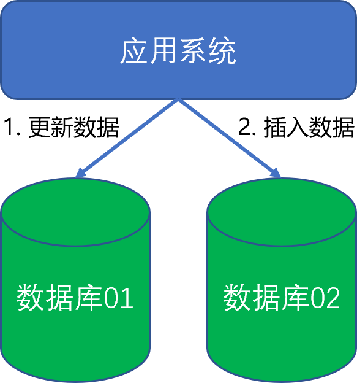
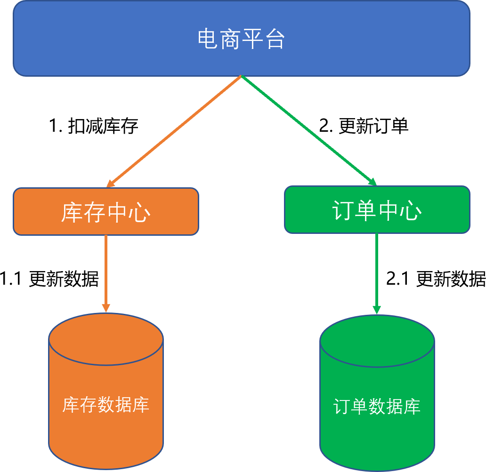
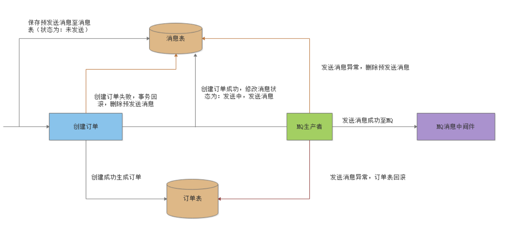
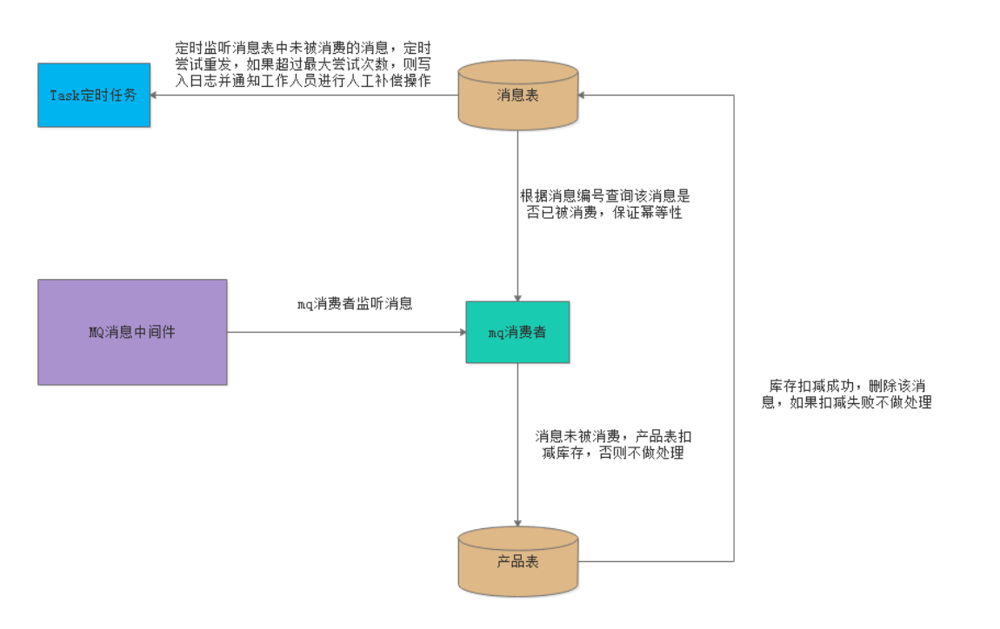

## 6.3 分布式事务

本小节对分布式事务做概念级的一般性介绍，供读者了解分布式事务概念及常见实现方法。通常情况下，分布式事务都是由平台级架构设计来做的，一般工作中只是遵循架构规范来完成编码实现，所以这里也不做代码示例。

分布式事务就是指事务的参与者、支持事务的服务器、资源服务器以及事务管理器分别位于不同的分布式系统的不同节点之上。简单的说，就是一次大的操作由不同的小操作组成，这些小的操作分布在不同的服务器上，且属于不同的应用，分布式事务需要保证这些小操作要么全部成功，要么全部失败。本质上来说，分布式事务就是为了保证不同数据库的数据一致性。 

### 6.3.1 CAP理论

CAP理论是由Eric Brewer在2000年的PODC会议上提出的，该理论在两年后被证明成立：“一个分布式系统不可能同时满足一致性（C：Consistency）、可用性（A：Availability）和分区容错性（P：Partition tolerance）这三个基本需求，最多只能同时满足其中两项”。 

- **Consistency：一致性**。在分布式环境下，一致性是指数据在多个副本之间能否保持一致的特性。在一致性的需求下，当一个系统在数据一致的状态下执行更新操作后，应该保证系统的数据仍然处于一直的状态。

  对于一个将数据副本分布在不同分布式节点上的系统来说，如果对第一个节点的数据进行了更新操作并且更新成功后，却没有使得第二个节点上的数据得到相应的更新，于是在对第二个节点的数据进行读取操作时，获取的依然是老数据（或称为脏数据），这就是典型的分布式数据不一致的情况。在分布式系统中，如果能够做到针对一个数据项的更新操作执行成功后，所有的用户都可以读取到其最新的值，那么这样的系统就被认为具有强一致性。

- **Availability：可用性**。可用性是指系统提供的服务必须一直处于可用的状态，对于用户的每一个操作请求总是能够在有限的时间内返回结果。这里的重点是“有限时间内”和“返回结果”。

  “有限时间内”是指，对于用户的一个操作请求，系统必须能够在指定的时间内返回对应的处理结果，如果超过了这个时间范围，那么系统就被认为是不可用的。另外，“有限的时间内”是指系统设计之初就设计好的运行指标，通常不同系统之间有很大的不同，无论如何，对于用户请求，系统必须存在一个合理的响应时间，否则用户便会对系统感到失望。

  “返回结果”是可用性的另一个非常重要的指标，它要求系统在完成对用户请求的处理后，返回一个正常的响应结果。正常的响应结果通常能够明确地反映出队请求的处理结果，即成功或失败，而不是一个让用户感到困惑的返回结果。

- **Partition tolerance：分区容错性**。分区容错性约束了一个分布式系统具有如下特性：分布式系统在遇到任何网络分区故障的时候，仍然需要能够保证对外提供满足一致性和可用性的服务，除非是整个网络环境都发生了故障。

  网络分区是指在分布式系统中，不同的节点分布在不同的子网络（机房或异地网络）中，由于一些特殊的原因导致这些子网络出现网络不连通的状况，但各个子网络的内部网络是正常的，从而导致整个系统的网络环境被切分成了若干个孤立的区域。需要注意的是，组成一个分布式系统的每个节点的加入与退出都可以看作是一个特殊的网络分区。

对于一个分布式系统而言，分区容错性是一个最基本的要求。因为既然是一个分布式系统，那么分布式系统中的组件必然需要被部署到不同的节点，否则也就无所谓分布式系统了，因此必然出现子网络。而对于分布式系统而言，网络问题又是一个必定会出现的异常情况，因此分区容错性也就成为了一个分布式系统必然需要面对和解决的问题。因此系统架构师往往需要把精力花在如何根据业务特点在C（一致性）和A（可用性）之间寻求平衡。 

### 6.3.2 分布式事务产生的原因

#### 6.3.2.1 数据库分库分表

当数据库单表产生的数据超过1000万条（一般参考值，根据数据库表结构不同而不同），那么就要考虑分库分表，具体分库分表的原理在此不做解释。简单的说就是原来的一个数据库变成了多个数据库。这时候，如果一个操作既访问“数据库01”，又要访问“数据库02”，而且要保证数据的一致性，那么就要用到分布式事务。

 

#### 6.3.2.2 应用服务化/微服务化

所谓的服务化/微服务化，就是业务按照功能服务进行拆分，以支持系统的扩展。比如原来单机支撑了整个电商网站，现在对整个网站进行拆分，分离出了订单中心、用户中心、库存中心。对于订单中心，有专门的数据库存储订单信息，用户中心也有专门的数据库存储用户信息，库存中心也会有专门的数据库存储库存信息。这时候如果要同时对订单和库存进行操作，那么就会涉及到订单数据库和库存数据库，为了保证数据一致性，就需要用到分布式事务。 

以上两种情况表象不同，但是本质相同，都是因为要操作的数据库变多了，就导致了分布式事务。 

### 6.3.3  TCC-补偿型事务解决方案

TCC指的是Try(尝试)、Confirm（确认）、Cancle（取消）。其核心思想是：针对每个操作，都要注册一个与其对应的确认和补偿（撤销）操作。它分为三个阶段：

1. Try 阶段主要是对业务系统做检测及资源预留。

2. Confirm 阶段主要是对业务系统做确认提交，Try阶段执行成功并开始执行 Confirm阶段时，默认 Confirm阶段是不会出错的。即：只要Try成功，Confirm一定成功。

3. Cancel 阶段主要是在业务执行错误，需要回滚的状态下执行的业务取消，预留资源释放。

举个例子，假入 Bob 要向 Smith 转账，思路大概是：

1. 首先在 Try 阶段，要先调用远程接口把 Smith 和 Bob 的钱给冻结起来。

2. 在 Confirm 阶段，执行远程调用的转账的操作，转账成功进行解冻。

3. 如果第2步执行成功，那么转账成功，如果第二步执行失败，则调用远程冻结接口对应的解冻方法 (Cancel)。

**优点：** 跟两阶段提交（2PC）比起来，实现以及流程相对简单了一些，但数据的一致性比2PC也要差一些。

**缺点：** 缺点还是比较明显的，在2，3步中都有可能失败。TCC属于应用层的一种补偿方式，所以需要程序员在实现的时候多写很多补偿的代码，在一些场景中，一些业务流程可能用TCC不太好定义及处理。

### 6.3.4 基于可靠消息的最终一致性解决方案

基于可靠消息的最终一致性解决方案通常叫做“消息事务”，就是基于消息中间件的两阶段提交，本质上是对消息中间件的一种特殊利用。它是将本地事务和发消息放在了一个分布式事务里，保证要么本地操作成功成功并且对外发消息成功，要么两者都失败，开源的RocketMQ就支持这一特性。

基于消息中间件的两阶段提交往往用在高并发场景下，将一个分布式事务拆成一个消息事务（A系统的本地操作+发消息）+B系统的本地操作，其中B系统的操作由消息驱动，只要消息事务成功，那么A操作一定成功，消息也一定发出来了，这时候B会收到消息去执行本地操作，如果本地操作失败，消息会重投，直到B操作成功，这样就变相地实现了A与B的分布式事务。 

我们以订单业务为例，来介绍基于可靠消息的最终一致性分布式事务解决方案。

订单系统流程图：

1. 创建订单之前，创建预发送消息，保存到消息表中，此时消息状态为：未发送；

2. 创建订单，如果创建订单失败则将消息表预发送消息删除；

3. 创建订单成功后，修改消息表预发送消息状态为发送中，并发送消息至MQ；

4. 如果发送消息失败，则订单回滚并删除消息表消息；发送成功则万事大吉。

产品系统流程图：

1. 从MQ消息中间件中监听并消费消息，将json消息转为订单对象；

2. 根据消息编号查询该消息是否已被消费，保证幂等性；

3. 如果消息未被消费（即存在此消息），则产品表扣减库存；如果已经消费（不存在此消息），则不做处理；

4. 产品表扣减库存成功，则删除此消息；扣减失败，则不做处理；

5. 定时任务会定时扫描消息表中超时未被消费的消息，然后尝试重发，如果超过最大重试次数后仍未被消费，则记录日志并通知工作人员进行人工补偿操作。

基于可靠消息的分布式事务虽然不能保证结果的强一致，但是可以通过可靠消息使得结果最终一致。

### 6.3.5 基于Atomikos的分布式事务解决方案  

**XA ：** XA是一个规范或是一个事务的协议。XA协议由Tuxedo首先提出的，并交给X/Open组织，作为资源管理器（数据库）与事务管理器的接口标准。

​	XA规范定义了：

1. TransactionManager： 这个TransactionManager可以通过管理多个ResourceManager来管理多个Resouce，也就是管理多个数据源。
2. XAResource： 针对数据资源封装的一个接口。
3. 两段式提交：多数据源事务提交的机制。

**JTA(Java Transaction Manager)：** 是Java规范，是XA在Java上的实现。

1. TransactionManager ： 常用方法，可以开启，回滚，获取事务...
2. XAResouce：资源管理，通过Session来进行事务管理，commit(xid)...
3. XID：每一个事务都分配一个特定的XID。

JTA是如何实现多数据源的事务管理呢？主要的原理就是两阶段提交。

Atomikos是实现JTA事务管理的第三方管理工具。

在业务规模较小的情况下，使用Atomikos是一个可选方案。