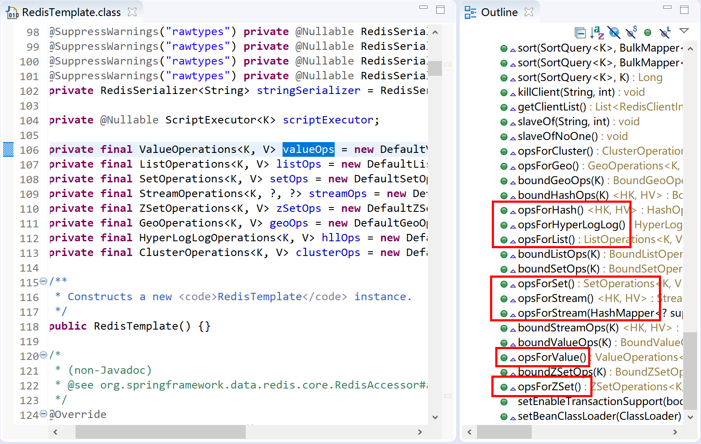

## 7.2 集成Redis

Spring Boot为集成Redis提供了方便的启动器（Starter），在Spring Boot的自动配置中我们可以看到是通过RedisCacheConfiguration来进行配置的。


在项目中，只需要添加`spring-boot-starter-data-redis`就可以集成使用Redis了。

```xml
<dependency>
    <groupId>org.springframework.boot</groupId>
    <artifactId>spring-boot-starter-data-redis</artifactId>
</dependency>
```

首先新建一个项目，选中`Spring Data Redis(Access+Driver)`依赖。


然后，在Spring Test类中注入`StringRedisTemplate`模板类，添加一个测试方法，调用模板类对象操作Redis。

```java
package com.example.redis;

import static org.junit.jupiter.api.Assertions.assertEquals;

import javax.annotation.Resource;

import org.junit.jupiter.api.Test;
import org.springframework.boot.test.context.SpringBootTest;
import org.springframework.data.redis.core.StringRedisTemplate;

@SpringBootTest
class SpringBootRedisApplicationTests {

	@Resource
	private StringRedisTemplate strTemplate;

	@Test
	public void testRedis() {
		strTemplate.opsForValue().set("name", "Kevin");
		String name = strTemplate.opsForValue().get("name");
		assertEquals("Kevin", name);
	}
}
```

运行测试用例：

检查其是否通过测试，JUnit测试，绿色条为测试通过。


在Redis命令行中检查name的值，是否为“Kevin”。


以上就是Spring Boot中集成Redis并使用模板类操作Redis的示例。

通过查阅Spring Boot源码，在`RedisTemplate`这个类文件中可以非常清晰的看到其对Reidis不同的数据类型提供了不同的操作方法。



由于Redis中我们最经常操作的是数据类型是字符串类型的，所以Spring Boot专门扩展了一个字符串相关的模板类`StringRedisTemplate extends RedisTemplate<String, String>`。

