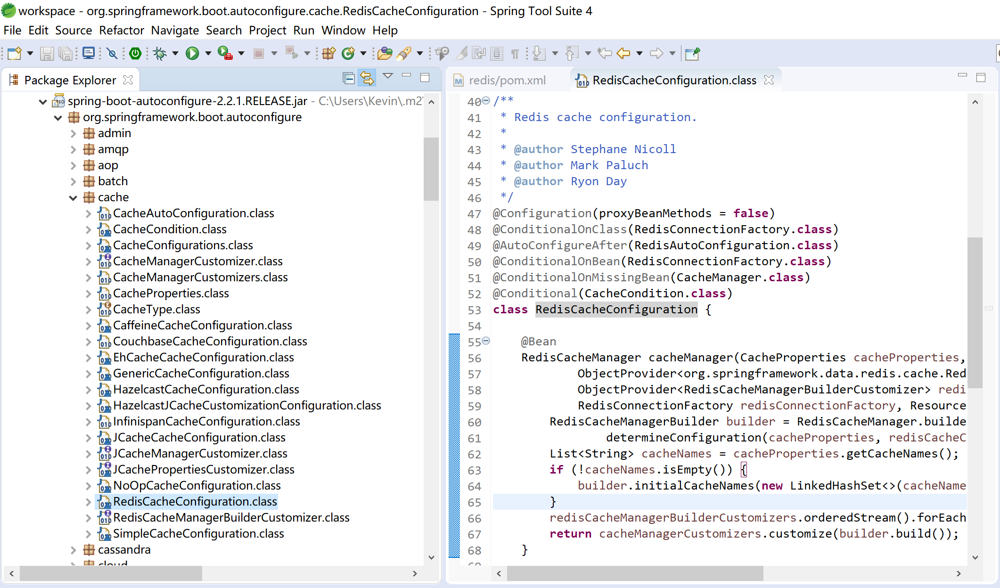
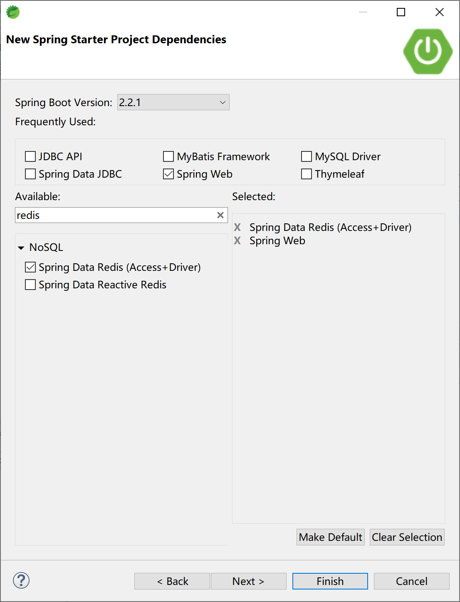
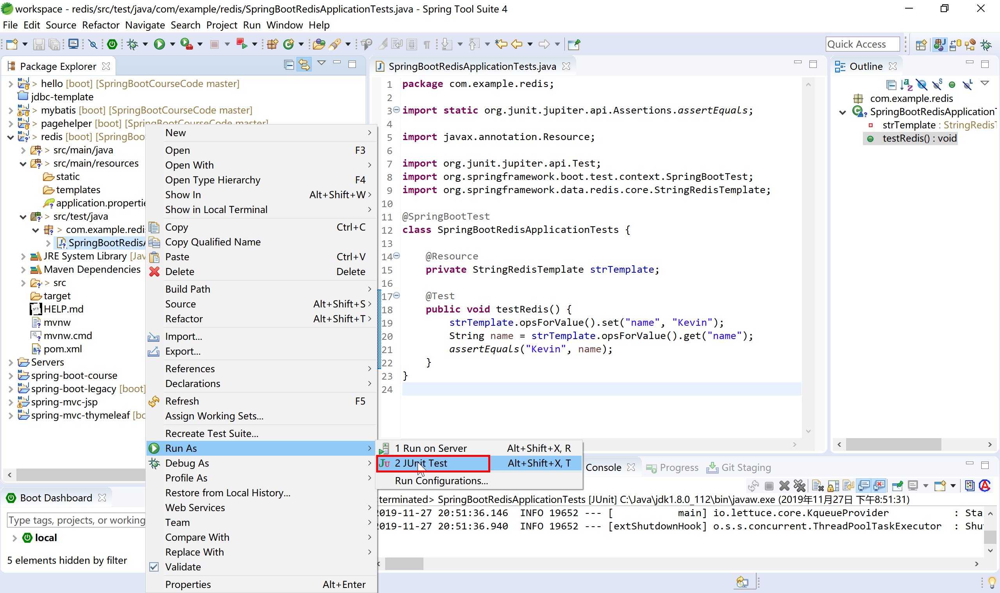
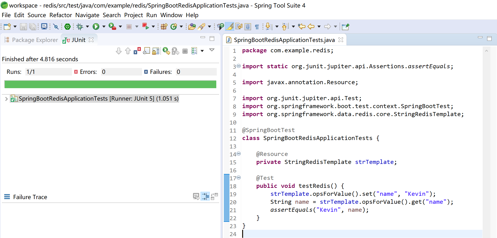
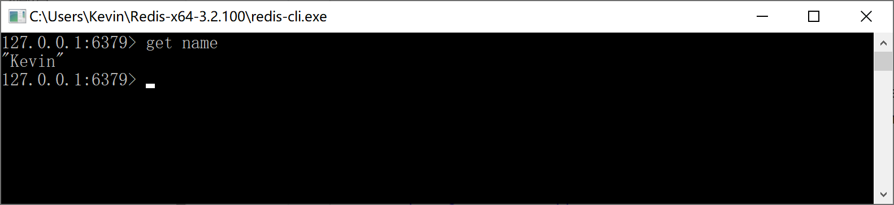

## 7.2 集成Redis





```xml
<dependency>
    <groupId>org.springframework.boot</groupId>
    <artifactId>spring-boot-starter-data-redis</artifactId>
</dependency>
```





```java
package com.example.redis;

import static org.junit.jupiter.api.Assertions.assertEquals;

import javax.annotation.Resource;

import org.junit.jupiter.api.Test;
import org.springframework.boot.test.context.SpringBootTest;
import org.springframework.data.redis.core.StringRedisTemplate;

@SpringBootTest
class SpringBootRedisApplicationTests {

	@Resource
	private StringRedisTemplate strTemplate;

	@Test
	public void testRedis() {
		strTemplate.opsForValue().set("name", "Kevin");
		String name = strTemplate.opsForValue().get("name");
		assertEquals("Kevin", name);
	}
}
```

运行测试用例：

检查其是否通过测试，JUnit测试，绿色条为测试通过。



在Redis命令行中检查name的值，是否为“Kevin”。

