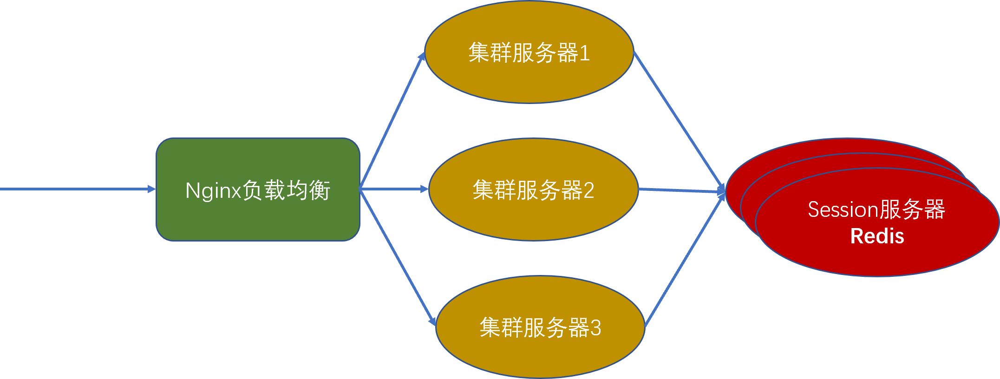
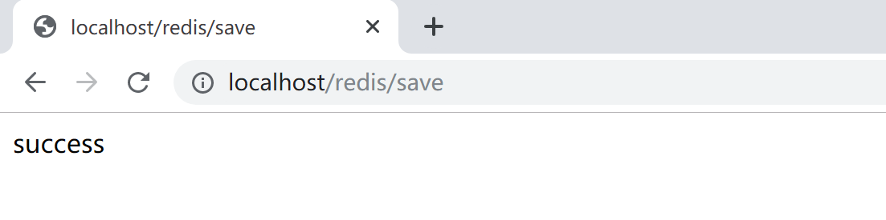
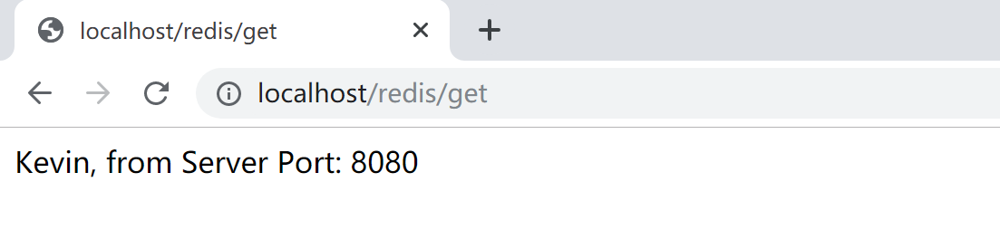

## 7.3 Session 共享

在正常情况下，用户访问一个无状态的 http 请求，服务器为了记住这个用户，会在服务器端启动（这个session第一次访问服务器）/加载一个 session，并通过 session id 来保持用户端和服务器端的“状态”，比如该用户是否已经登录，是否已经分配了对应的角色，是否具有操作某些资源（菜单）的权限等。

服务端的 Session 在 Servlet 规范中就是 HttpSession：服务器在内存中创建 HttpSession，应用程序在这个 session 对象中保存对象，每次请求来了，判断 session 对象中存放的值，根据这个值做对应的事（调用后续业务逻辑：登录，或业务操作）。

在单机服务器环境下，上述机制运行得很好，例如 Tomcat 天生就能解决上面的所有问题。

随着业务的发展，单机性能不能满足系统对并发、响应时间方面的需求，这时，我们就会通过横向扩展搭建服务器集群。为了保证客户访问的一致性（通过一个域名地址访问），我们可以利用一些软件（Nginx）或硬件（F5）来做负载均衡，将前端接收到的访问请求根据负载均衡策略分发到后台的服务器集群中的某一台服务器上。这样，就会导致同一个用户在不同的时间访问的实际服务器是不同的，而不同的服务器内存中的 session 不能共享，带来一些不希望看到的后果：比如，用户在 A 服务器上登录了，第二次请求被分发到 B 服务器上，B 服务器的 session 判断用户并没有登录，跳转到登录页面，要求用户登录。这样的体验是错误的，不符合预期的，当然也是非常糟糕的。

在集群/分布式环境下，如何保证各个服务器实例之间的 session 共享同步，就成了一个必须解决的问题。

Spring Boot 提供了自动化的 session 共享机制，结合 Redis 可以非常方便地解决这个问题。其设计原理非常简单：就是把原本存放在各个服务器（如tomcat）内存中的 session 拿出来，集中存放在一个独立的 Redis 服务器（可以是高可用集群）上，每个服务器都访问这个独立的 Redis 服务器，这样无论用户的请求被负载均衡器分发到集群中的哪一个服务器上，都访问的都是同一个 session。



### 7.3.1 下载并配置 Nginx

到官网 [http://nginx.org/en/download.html](http://nginx.org/en/download.html) 下载稳定版[ nginx/Windows-1.16.1](http://nginx.org/download/nginx-1.16.1.zip)，然后解压到用户目录（`C:\Users\Kevin\nginx-1.16.1`）下。

编辑 `C:\Users\Kevin\nginx-1.16.1\conf\nginx.conf` 文件，在http节点下添加upstream，名字为tomcat，并在server的location的proxy_pass下，代理转发到upstream，并为其配置超时参数。

```
upstream tomcat{
    server 127.0.0.1:8080 weight=1;
    server 127.0.0.1:8081 weight=1;
}
server {
    listen       80;
    server_name  localhost;

    #charset koi8-r;

    #access_log  logs/host.access.log  main;

    location / {
        proxy_pass http://tomcat;
		proxy_connect_timeout 1;
		proxy_read_timeout 1;
		proxy_send_timeout 1;
    }
```

这样，就配置好了一个简单的负载均衡器，我们可以通过 [http://localhost](http://localhost) 访问后面两台 tomcat 服务器（分别在端 8080 和 8081 上，权重都为 1，也就是说每台服务器承载 50% 的流量）。

### 7.3.2 开发示例代码

继续使用上一小节创建的 Spring Boot 工程，添加 Session 共享支持。

```xml
<dependency>
   <groupId>org.springframework.session</groupId>
   <artifactId>spring-session-data-redis</artifactId>
</dependency>
<dependency>
    <groupId>org.springframework.boot</groupId>
    <artifactId>spring-boot-starter-data-redis</artifactId>
</dependency>
<dependency>
    <groupId>org.springframework.boot</groupId>
    <artifactId>spring-boot-starter-web</artifactId>
</dependency>
```

在`application.properties`中配置 Redis 服务器信息。

```properties
spring.redis.database=0
spring.redis.host=localhost
spring.redis.port=6379
spring.redis.password=
```

创建一个`RedisSessionController`控制器，在访问`/redis/save`时将信息存放到 session中。

```java
package com.example.redis.controller;

import javax.servlet.http.HttpSession;

import org.springframework.beans.factory.annotation.Value;
import org.springframework.web.bind.annotation.RequestMapping;
import org.springframework.web.bind.annotation.RestController;

@RestController
@RequestMapping("/redis")
public class RedisSessionController {

	@Value("${server.port}")
	String port;
	
	@RequestMapping("/save")
	public String save(HttpSession session) {
		session.setAttribute("name", "Kevin");
		return "success";
	}

	@RequestMapping("/get")
	public String get(HttpSession session) {
		String name = (String) session.getAttribute("name");
		return name + ", from Server Port: " + port;
	}

}
```

在同一个 session 的后续访问`/redis/get`时，从 session 中取出之前存放的 name 值，并给出当前服务器的端口，以指示是从哪个服务器访问的。

### 7.3.3 测试

双击`C:\Users\Kevin\Redis-x64-3.2.100\redis-server.exe`运行 Redis 服务器。

在 STS 中把项目导出为可运行 jar 包，然后打开两个命令行终端，分别执行如下语句，启动两个 tomcat 服务器，将示例项目分别运行于 8080 和 8081 端口。

```
java -jar redis-0.0.1-SNAPSHOT.jar --server.port=8080
java -jar redis-0.0.1-SNAPSHOT.jar --server.port=8081
```

双击`C:\Users\Kevin\nginx-1.16.1\nginx.exe`运行 Nginx 负载均衡服务器。

1. 打开浏览器，访问 [http://localhost/redis/save](http://localhost/redis/save) 将 Kevin 值存放到 session 中的 name 这个 key 中。



2. 访问 [http://localhost/redis/get](http://localhost/redis/get) 检查当前 session 中存放的 name 值。当前是由 8081 服务器提供服务。


3. 刷新浏览器，同一 session 将访问到另外一台服务器（端口为 8080），能正确获取 session 中的 name 值。



> 正常情况下，刷新浏览器，会由8080和8081两台tomcat服务器交替提供服务。

由于我们配置的两台 tomcat 服务器的负载均衡权重都是 1，正常情况下刷新一次就可以访问到另外一台服务器，如果没有访问到另外一台服务器，读者可以尝试这多刷新几次，就可以看到上面的测试结果。

> 本小节示例项目代码：
>
> [https://github.com/gyzhang/SpringBootCourseCode/tree/master/spring-boot-redis](https://github.com/gyzhang/SpringBootCourseCode/tree/master/spring-boot-redis)
