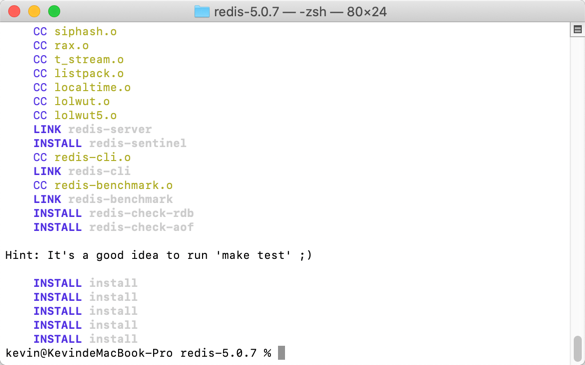
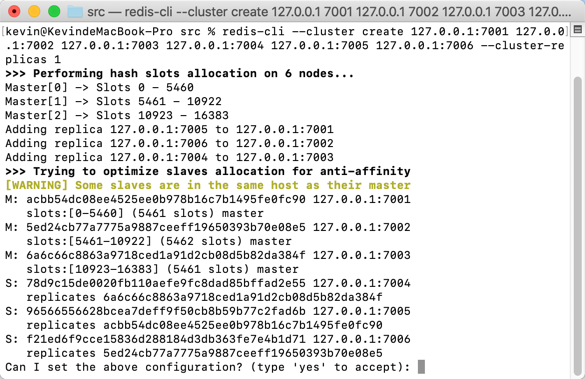
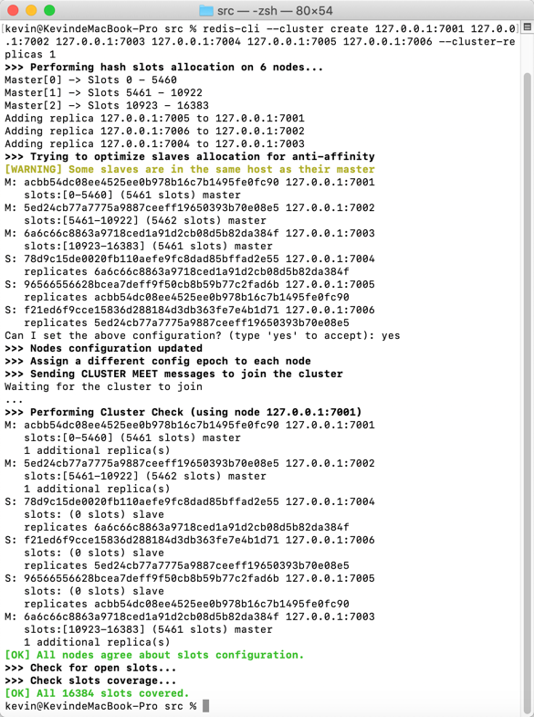
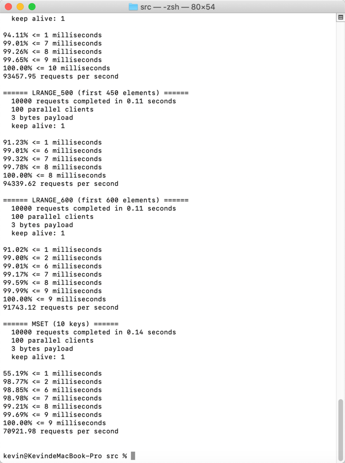
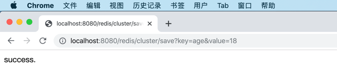
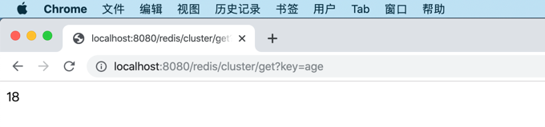

## 7.4 Redis 集群

Redis 官方不支持 Windows，所以，这一小节我们以 macOS 操作系统为例，来搭建 Redis 集群，Linux（如CentOS）下的集群搭建步骤和 macOS 相同。

本小节参考[官方集群搭建](http://redis.io/topics/cluster-tutorial)文档说明来在本机上搭建三主三从的集群，端口分布为 7001-7006。

> Redis 集群需要至少3个节点，主从复制集群至少需要 6 个节点。否则会提示如下错误信息：
> ```
> *** ERROR: Invalid configuration for cluster creation.
> *** Redis Cluster requires at least 3 master nodes.
> *** This is not possible with 2 nodes and 1 replicas per node.
> *** At least 6 nodes are required.
> ```

### 7.4.1 下载安装

在[官方下载](http://download.redis.io/releases/redis-5.0.7.tar.gz)最新的稳定版 Redis 5.0.7，将下载的文件`redis-5.0.7.tar.gz`拷贝到用户目录下。

打开终端，输入`tar -zxf redis-5.0.7.tar.gz`将其解压到`/Users/kevin/redis-5.0.7`目录。

进入 Redis 目录（`/Users/kevin/redis-5.0.7`）后输入`make install`编译安装 Redis 服务器。

> 你的mac可能会出现`xcrun: error: invalid active developer path (/Library/Developer/CommandLineTools), missing xcrun at: /Library/Developer/CommandLineTools/usr/bin/xcrun`错误，可以执行`xcode-select --install`命令，安装编译依赖环境。



### 7.4.2 单机配置

我们编译安装完 Redis 后，建议先配置单机环境，检查 Redis 服务器是否能正常工作。

为了方便文件分类存放，建议创建配置 etc 和数据库 db 目录。

```bash
mkdir etc
mkdir db
```

在`/Users/kevin/redis-5.0.7/etc/redis-single-7001.conf`配置文件中配置 Redis 参数。

```
#修改为守护模式
daemonize yes
#设置进程锁文件
pidfile /Users/kevin/redis-5.0.7/db/redis-7001.pid
#ip地址
bind 127.0.0.1
#端口
port 7001
#客户端超时时间
timeout 300
#日志级别
loglevel debug
#日志文件位置
logfile /Users/kevin/redis-5.0.7/logs/redis-7001.log
#设置数据库的数量，默认数据库为0，可以使用SELECT <dbid>命令在连接上指定数据库id
databases 16
##指定在多长时间内，有多少次更新操作，就将数据同步到数据文件，可以多个条件配合
#save <seconds> <changes>
#Redis默认配置文件中提供了三个条件：
save 900 1
save 300 10
save 60 10000
#指定存储至本地数据库时是否压缩数据，默认为yes，Redis采用LZF压缩，如果为了节省CPU时间，可以关闭该选项，但会导致数据库文件变的巨大
rdbcompression yes
#指定本地数据库文件名
dbfilename dump-7001.rdb
#指定本地数据库路径
dir /Users/kevin/redis-5.0.7/db/
#指定是否在每次更新操作后进行日志记录，Redis在默认情况下是异步的把数据写入磁盘，如果不开启，可能会在断电时导致一段时间内的数据丢失。因为 redis本身同步数据文件是按上面save条件来同步的，所以有的数据会在一段时间内只存在于内存中
appendonly no
#指定更新日志条件，共有3个可选值：
#no：表示等操作系统进行数据缓存同步到磁盘（快）
#always：表示每次更新操作后手动调用fsync()将数据写到磁盘（慢，安全）
#everysec：表示每秒同步一次（折衷，默认值）
appendfsync everysec
```

在命令终端执行如下命令，在 7001 端口上启动 Redis 单机服务器。

```bash
/Users/kevin/redis-5.0.7/src/redis-server /Users/kevin/redis-5.0.7/etc/redis-single-7001.conf
```

输入命令`ps -ef | grep redis`检查 Redis 是否在 7001 端口上启动。

```
kevin@KevindeMacBook-Pro src % ps -ef | grep redis                   
  501  2048     1   0  9:12上午 ??         0:00.84 /Users/kevin/redis-5.0.7/src/redis-server *:7001 
  501  2070   943   0  9:15上午 ttys000    0:00.00 grep redis
```

在命令终端执行命令`redis-cli -h 127.0.0.1 -p 7001`，启动 Redis 客户端，往 Redis 中添加一条记录并获取，检查是否正确保存和查询记录。

```bash
kevin@KevindeMacBook-Pro src % /Users/kevin/redis-5.0.7/src/redis-cli -h 127.0.0.1 -p 7001
127.0.0.1:7001> set name 'Kevin'
OK
127.0.0.1:7001> get name
"Kevin"
127.0.0.1:7001> 
```

### 7.4.3 集群配置

本测试集群为 6 台在本地机器上的 Redis 服务器，只是端口号不同。

将`redis-single-7001.conf`配置文件拷贝为`redis-7001.conf`，并在文件末尾添加集群配置内容。

```
#开启集群
cluster-enabled yes
#该节点的对应的节点配置文件
cluster-config-file redis-7001.conf
#集群超时时间
cluster-node-timeout 5000
```

完整的配置文件如下：

```
#修改为守护模式
daemonize yes
#设置进程锁文件
pidfile /Users/kevin/redis-5.0.7/db/redis-7001.pid
#ip地址
bind 127.0.0.1
#端口
port 7001
#客户端超时时间
timeout 300
#日志级别
loglevel debug
#日志文件位置
logfile /Users/kevin/redis-5.0.7/logs/redis-7001.log
#设置数据库的数量，默认数据库为0，可以使用SELECT <dbid>命令在连接上指定数据库id
databases 16
##指定在多长时间内，有多少次更新操作，就将数据同步到数据文件，可以多个条件配合
#save <seconds> <changes>
#Redis默认配置文件中提供了三个条件：
save 900 1
save 300 10
save 60 10000
#指定存储至本地数据库时是否压缩数据，默认为yes，Redis采用LZF压缩，如果为了节省CPU时间，可以关闭该选项，但会导致数据库文件变的巨大
rdbcompression yes
#指定本地数据库文件名
dbfilename dump-7001.rdb
#指定本地数据库路径
dir /Users/kevin/redis-5.0.7/db/
#指定是否在每次更新操作后进行日志记录，Redis在默认情况下是异步的把数据写入磁盘，如果不开启，可能会在断电时导致一段时间内的数据丢失。因为 redis本身同步数据文件是按上面save条件来同步的，所以有的数据会在一段时间内只存在于内存中
appendonly no
#指定更新日志条件，共有3个可选值：
#no：表示等操作系统进行数据缓存同步到磁盘（快）
#always：表示每次更新操作后手动调用fsync()将数据写到磁盘（慢，安全）
#everysec：表示每秒同步一次（折衷，默认值）
appendfsync everysec

#开启集群
cluster-enabled yes
#该节点的对应的节点配置文件
cluster-config-file redis-7001.conf
#集群超时时间
cluster-node-timeout 5000
```

拷贝`redis-7001.conf`为 7002-7006，并修改文件中的所有的 7001 为对应端口，然后保存。

> 使用查找替换功能，将redis-7001.conf文件中的所有7001替换为7002，7003...

分别启动 7001-7006 服务器。

```bash
/Users/kevin/redis-5.0.7/src/redis-server /Users/kevin/redis-5.0.7/etc/redis-7001.conf
/Users/kevin/redis-5.0.7/src/redis-server /Users/kevin/redis-5.0.7/etc/redis-7002.conf
/Users/kevin/redis-5.0.7/src/redis-server /Users/kevin/redis-5.0.7/etc/redis-7003.conf
/Users/kevin/redis-5.0.7/src/redis-server /Users/kevin/redis-5.0.7/etc/redis-7004.conf
/Users/kevin/redis-5.0.7/src/redis-server /Users/kevin/redis-5.0.7/etc/redis-7005.conf
/Users/kevin/redis-5.0.7/src/redis-server /Users/kevin/redis-5.0.7/etc/redis-7006.conf
```

执行`ps -ef | grep redis`命令，检查六台 Redis 服务器是否正确启动。

```bash
kevin@KevindeMacBook-Pro src % ps -ef | grep redis
  501  2209     1   0 10:14上午 ??         0:01.43 /Users/kevin/redis-5.0.7/src/redis-server 127.0.0.1:7001 [cluster] 
  501  2212     1   0 10:15上午 ??         0:01.35 /Users/kevin/redis-5.0.7/src/redis-server 127.0.0.1:7002 [cluster] 
  501  2229     1   0 10:19上午 ??         0:00.14 /Users/kevin/redis-5.0.7/src/redis-server 127.0.0.1:7003 [cluster] 
  501  2231     1   0 10:19上午 ??         0:00.13 /Users/kevin/redis-5.0.7/src/redis-server 127.0.0.1:7004 [cluster] 
  501  2233     1   0 10:19上午 ??         0:00.10 /Users/kevin/redis-5.0.7/src/redis-server 127.0.0.1:7005 [cluster] 
  501  2235     1   0 10:19上午 ??         0:00.09 /Users/kevin/redis-5.0.7/src/redis-server 127.0.0.1:7006 [cluster] 
  501  2237   943   0 10:20上午 ttys000    0:00.00 grep redis
```

执行命令`redis-cli --cluster create 127.0.0.1:7001 127.0.0.1:7002 127.0.0.1:7003 127.0.0.1:7004 127.0.0.1:7005 127.0.0.1:7006 --cluster-replicas 1`创建集群。

```bash
/Users/kevin/redis-5.0.7/src/redis-cli --cluster create 127.0.0.1:7001 127.0.0.1:7002 127.0.0.1:7003 127.0.0.1:7004 127.0.0.1:7005 127.0.0.1:7006 --cluster-replicas 1
```

如果你严格按照本小节的步骤操作，很有可能要报错，错误信息如下：

```
[ERR] Node 127.0.0.1:7001 is not empty. Either the node already knows other nodes (check with CLUSTER NODES) or contains some key in database 0.
```

原因如上面错误提示“contains some key in database 0”，是因为我们之前的测试数据本地落盘后数据库中有记录了。解决办法是删除`/Users/kevin/redis-5.0.7/db`目录下的所有文件。

然后再次执行命令`redis-cli --cluster create 127.0.0.1:7001 127.0.0.1:7002 127.0.0.1:7003 127.0.0.1:7004 127.0.0.1:7005 127.0.0.1:7006 --cluster-replicas 1`创建集群。



输入`yes`确认信息后，Redis 开始创建主从复制集群，耐心等待（时间应该少于2分钟），直到集群创建完成。



使用命令`redis-cli -h 127.0.0.1 -p 7003 -c cluster nodes`连接到任意集群节点服务器（这里我们连接的是 7003 端口的那台 Redis 服务器），检查集群节点情况。

```bash
kevin@KevindeMacBook-Pro src % redis-cli -h 127.0.0.1 -p 7003 -c cluster nodes
96566556628bcea7deff9f50cb8b59b77c2fad6b 127.0.0.1:7005@17005 slave acbb54dc08ee4525ee0b978b16c7b1495fe0fc90 0 1575081455088 5 connected
5ed24cb77a7775a9887ceeff19650393b70e08e5 127.0.0.1:7002@17002 master - 0 1575081456099 2 connected 5461-10922
f21ed6f9cce15836d288184d3db363fe7e4b1d71 127.0.0.1:7006@17006 slave 5ed24cb77a7775a9887ceeff19650393b70e08e5 0 1575081455086 6 connected
78d9c15de0020fb110aefe9fc8dad85bffad2e55 127.0.0.1:7004@17004 slave 6a6c66c8863a9718ced1a91d2cb08d5b82da384f 0 1575081454073 4 connected
6a6c66c8863a9718ced1a91d2cb08d5b82da384f 127.0.0.1:7003@17003 myself,master - 0 1575081454000 3 connected 10923-16383
acbb54dc08ee4525ee0b978b16c7b1495fe0fc90 127.0.0.1:7001@17001 master - 0 1575081454000 1 connected 0-5460
```

使用命令`redis-cli --cluster check 127.0.0.1:7002`检查集群情况。

```
kevin@KevindeMacBook-Pro src % redis-cli --cluster check 127.0.0.1:7002
127.0.0.1:7002 (5ed24cb7...) -> 0 keys | 5462 slots | 1 slaves.
127.0.0.1:7003 (6a6c66c8...) -> 0 keys | 5461 slots | 1 slaves.
127.0.0.1:7001 (acbb54dc...) -> 0 keys | 5461 slots | 1 slaves.
[OK] 0 keys in 3 masters.
0.00 keys per slot on average.
>>> Performing Cluster Check (using node 127.0.0.1:7002)
M: 5ed24cb77a7775a9887ceeff19650393b70e08e5 127.0.0.1:7002
   slots:[5461-10922] (5462 slots) master
   1 additional replica(s)
M: 6a6c66c8863a9718ced1a91d2cb08d5b82da384f 127.0.0.1:7003
   slots:[10923-16383] (5461 slots) master
   1 additional replica(s)
S: f21ed6f9cce15836d288184d3db363fe7e4b1d71 127.0.0.1:7006
   slots: (0 slots) slave
   replicates 5ed24cb77a7775a9887ceeff19650393b70e08e5
M: acbb54dc08ee4525ee0b978b16c7b1495fe0fc90 127.0.0.1:7001
   slots:[0-5460] (5461 slots) master
   1 additional replica(s)
S: 78d9c15de0020fb110aefe9fc8dad85bffad2e55 127.0.0.1:7004
   slots: (0 slots) slave
   replicates 6a6c66c8863a9718ced1a91d2cb08d5b82da384f
S: 96566556628bcea7deff9f50cb8b59b77c2fad6b 127.0.0.1:7005
   slots: (0 slots) slave
   replicates acbb54dc08ee4525ee0b978b16c7b1495fe0fc90
[OK] All nodes agree about slots configuration.
>>> Check for open slots...
>>> Check slots coverage...
[OK] All 16384 slots covered.
```

### 7.4.4 集群测试

使用命令`redis-cli -c -h 127.0.0.1 -p 7002`启动 Redis 客户端，连接到集群中的 7002 服务器，往 Redis 集群中添加一条记录并获取，检查是否正确保存和查询记录。

```bash
kevin@KevindeMacBook-Pro src % redis-cli -c -h 127.0.0.1 -p 7002
127.0.0.1:7002> set name 'Kevin'
OK
127.0.0.1:7002> get name
"Kevin"
127.0.0.1:7002> 
```

退出连接 7002 服务器的 Redis 客户端。使用命令`redis-cli -c -h 127.0.0.1 -p 7005`启动 Redis 客户端，连接到集群中的 7005 服务器，在 Redis 集群中获取刚才通过 7002 服务器添加的 name=Kevin 的那条记录。

```
kevin@KevindeMacBook-Pro src % redis-cli -c -h 127.0.0.1 -p 7005
127.0.0.1:7005> get name
-> Redirected to slot [5798] located at 127.0.0.1:7002
"Kevin"
127.0.0.1:7002> 
```

经检查，集群可以正常工作。

如果是生产环境下的 Redis 集群，不要忘了使用`redis-benchmark -h 127.0.0.1 -p 7006 -c 100 -n 10000 `命令检查服务器性能。

> 100个并发连接，10000个请求，检测host为127.0.0.1端口为7006的redis服务器性能 



如上图所示，在我的MacBook Pro（i5+8G内存）笔记本上，每秒能处理7万多个请求，超过98%的请求响应时间少于2毫秒。

### 7.4.5 Spring Boot 使用 Redis 集群

在`Spring Boot 1.x`系列中，访问 Redis 使用的客户端是`Jedis`，但是到了`Spring Boot 2.x`使用的客户端是`Lettuce`。 

关于`Jedis`跟`Lettuce`的区别如下：

- Lettuce  和  Jedis 的定位都是 Redis 的 Client，所以他们都可以直接连接 Redis Server。
- Jedis 在实现上是直接连接的 Redis Server，如果在多线程环境下是非线程安全的，这个时候只有使用连接池，为每个 Jedis 实例增加物理连接。
- Lettuce 的连接是基于 Netty 的，连接实例（StatefulRedisConnection）可以在多个线程间并发访问，因为 StatefulRedisConnection 是线程安全的，所以一个连接实例（StatefulRedisConnection）就可以满足多线程环境下的并发访问，当然这个也是可伸缩的设计，一个连接实例不够的情况也可以按需增加连接实例。

所以，在 Spring Boot 2.x 中使用 Redis 集群，建议最好使用`Lettuce`连接 Redis 集群服务器。

在 Spring Boot 中访问单机 Redis 服务器和集群服务器，差别在于配置，最终代码都是使用 StringRedisTemplate（或RedisTemplate） 模板类来操作 Redis 数据。

在配置文件`application.yml`中添加Redis集群配置。

```yaml
server:
  port: 8080
spring:
  redis:
    timeout: 6000ms
    cluster:
      max-redirects: 3
      nodes:
        - 127.0.0.1:7001
        - 127.0.0.1:7002
        - 127.0.0.1:7003
        - 127.0.0.1:7004
        - 127.0.0.1:7005
        - 127.0.0.1:7006 
```

编写`RedisController`控制器类，测试访问和保存 Redis 集群服务器中值对记录。

```java
package com.example.redis.controller;

import javax.annotation.Resource;

import org.springframework.data.redis.core.StringRedisTemplate;
import org.springframework.web.bind.annotation.RequestMapping;
import org.springframework.web.bind.annotation.RestController;

@RestController
@RequestMapping("/redis/cluster")
public class RedisController {

	@Resource
	private StringRedisTemplate strTemplate;	
	
	@RequestMapping("/save")
	public String save(String key, String value) {
		strTemplate.opsForValue().set(key, value);
		return "success.";
	}
	
	@RequestMapping("/get")
	public String get(String key) {
		String value = strTemplate.opsForValue().get(key);
		return value;
	}

}
```

在浏览器中访问 [http://localhost:8080/redis/cluster/get?key=name](http://localhost:8080/redis/cluster/get?key=name) 这个地址，访问之前集群测试中放入到 Redis 集群中的 name 这个 key 对应的值。


在浏览器中访问 [http://localhost:8080/redis/cluster/save?key=age&value=18](http://localhost:8080/redis/cluster/save?key=age&value=18) 这个地址，将 age=18 这个 Key-Value 值对存入 Redis 集群中。



在浏览器中访问 [http://localhost:8080/redis/cluster/get?key=age](http://localhost:8080/redis/cluster/get?key=age) 这个地址，访问 Redis 集群服务器中的 age 这个 key 对应的值。



在命令终端中，连接到 Redis 集群的 7005 服务器，查询 name 和 age，可以看到 name 存放在 7002 服务器的 slot 中，age 存放在 7001 服务器的 slot 中。

```bash
kevin@KevindeMacBook-Pro src % redis-cli -c -h 127.0.0.1 -p 7005
127.0.0.1:7005> get name
-> Redirected to slot [5798] located at 127.0.0.1:7002
"Kevin"
127.0.0.1:7002> get age
-> Redirected to slot [741] located at 127.0.0.1:7001
"18"
```

通过`redis-cli --cluster check 127.0.0.1:7002`命令再次检查集群服务器，能够看到`[OK] 2 keys in 3 masters.`信息，就是我们上面通过命令存入 Redis 集群的 name 和通过 Spring Boot 应用存入的 age 这两条记录了。

```bash
kevin@KevindeMacBook-Pro src % redis-cli --cluster check 127.0.0.1:7002
127.0.0.1:7002 (5ed24cb7...) -> 1 keys | 5462 slots | 1 slaves.
127.0.0.1:7003 (6a6c66c8...) -> 0 keys | 5461 slots | 1 slaves.
127.0.0.1:7001 (acbb54dc...) -> 1 keys | 5461 slots | 1 slaves.
[OK] 2 keys in 3 masters.
0.00 keys per slot on average.
>>> Performing Cluster Check (using node 127.0.0.1:7002)
M: 5ed24cb77a7775a9887ceeff19650393b70e08e5 127.0.0.1:7002
   slots:[5461-10922] (5462 slots) master
   1 additional replica(s)
M: 6a6c66c8863a9718ced1a91d2cb08d5b82da384f 127.0.0.1:7003
   slots:[10923-16383] (5461 slots) master
   1 additional replica(s)
S: f21ed6f9cce15836d288184d3db363fe7e4b1d71 127.0.0.1:7006
   slots: (0 slots) slave
   replicates 5ed24cb77a7775a9887ceeff19650393b70e08e5
M: acbb54dc08ee4525ee0b978b16c7b1495fe0fc90 127.0.0.1:7001
   slots:[0-5460] (5461 slots) master
   1 additional replica(s)
S: 78d9c15de0020fb110aefe9fc8dad85bffad2e55 127.0.0.1:7004
   slots: (0 slots) slave
   replicates 6a6c66c8863a9718ced1a91d2cb08d5b82da384f
S: 96566556628bcea7deff9f50cb8b59b77c2fad6b 127.0.0.1:7005
   slots: (0 slots) slave
   replicates acbb54dc08ee4525ee0b978b16c7b1495fe0fc90
[OK] All nodes agree about slots configuration.
>>> Check for open slots...
>>> Check slots coverage...
[OK] All 16384 slots covered.
```
> 本小节示例项目代码：
>
> [https://github.com/gyzhang/SpringBootCourseCode/tree/master/spring-boot-redis](https://github.com/gyzhang/SpringBootCourseCode/tree/master/spring-boot-redis)
