## 8.1 MongoDB简介

MongoDB是用C++语言编写的非关系型数据库。特点是高性能、易部署、易使用，存储数据十分方便，主要特性有：

- 面向集合存储，易于存储对象类型的数据；
- 模式自由；
- 支持动态查询；
- 支持完全索引，包含内部对象；
- 支持复制和故障恢复；
- 使用高效的二进制数据存储，包括大型对象；
- 文件存储格式为BSON（一种JSON的扩展）；

MongoDB有广泛的使用场景，是传统关系型数据的有效补充。

- 网站数据：MongoDB非常适合实时的插入，更新与查询，并具备网站实时数据存储所需的复制及高度伸缩性。

- 缓存：由于性能很高，MongoDB也适合作为信息基础设施的缓存层。在系统重启之后，由MongoDB搭建的持久化缓存可以避免下层的数据源过载。

- 大尺寸、低价值的数据：使用传统的关系数据库存储一些数据时可能会比较贵，在此之前，很多程序员往往会选择传统的文件进行存储。

- 高伸缩性的场景：MongoDB非常适合由数十或者数百台服务器组成的数据库。

- 用于对象及JSON数据的存储：MongoDB的BSON数据格式非常适合文档格式化的存储及查询。

2018年6月，MongoDB在4.0版本中支持ACID事务，成为第一个支持强事务的NoSQL数据库，更加扩大了其使用的范围。

### 8.1.1 基本概念

在关系型数据库中，主要由**数据库（database）**、**表（table）**、**记录（rows）**三个层次概念组成。

在MongoDB数据库中，主要由**数据库（database）**、**集合（collection）**、**文档对象（document）**三个层次概念组成。

| 对比项       | MongoDB      | MySQL/Oracle   |
| ------------ | ------------ | -------------- |
| 表           | 集合         | 二维表table    |
| 表的一行数据 | 文档document | 一条记录record |
| 表字段       | 键key        | 字段field      |
| 字段值       | 值value      | 值value        |
| 主外键       | 无           | PK，FK         |
| 灵活度扩展性 | 极高         | 差             |

MongoDB里的集合对应于关系型数据库里的表，但是集合中没有列、行和关系的概念，集合中只有文档，一个文档就相当于一条记录，这体现了模式自由的特点。

- 文档（document）是MongoDB中数据的基本单元，非常类似于关系型数据库系统中的行（但是比行要复杂的多）;
- 集合（collection）就是一组文档，如果说MongoDB中的文档类似于关系型数据库中的行，那么集合就如同表;

如下为官方给出的文档（document）示例，是典型的json数据。

```json
{
  "_id": "5cf0029caff5056591b0ce7d",
  "firstname": "Jane",
  "lastname": "Wu",
  "address": {
    "street": "1 Circle Rd",
    "city": "Los Angeles",
    "state": "CA",
    "zip": "90404"
  },
  "hobbies": ["surfing", "coding"]
}
```

其使用的查询语言也非常方便，简单易懂。

```bash
> db.users.find({ "address.zip" : "90404" })
{ "_id": "5cf0029caff5056591b0ce7d", "firstname": "Jane", "lastname": "Wu", "address":{}}
{ "_id": "507f1f77bcf86cd799439011", "firstname": "Jon", "lastname": "Davis", "address":{}}
{ "_id": "5349b4ddd2781d08c09890f3", "firstname": "Jim", "lastname": "White", "address":{}}
{ "_id": "5bf142459b72e12b2b1b2cd", "firstname": "Jeff", "lastname": "Taylor", "address":{}}
{ "_id": "5cf003283b23d04a40d5f88a", "firstname": "Jerry", "lastname": "Miller", "address":{}}
{ "_id": "5bf142459b72e12b2b1b2cd", "firstname": "Jai", "lastname": "Williams", "address":{}}
{ "_id": "5cf0036deaa1742dd225ea35", "firstname": "Jess", "lastname": "Johnson", "address":{}}
{ "_id": "54495ad94c934721ede76d90", "firstname": "Jill", "lastname": "Brown", "address":{}}
{ "_id": "566eb3c704c7b31facbb0007", "firstname": "Janet", "lastname": "Jones", "address":{}}
{ "_id": "5a999cc461d36489a27f2563", "firstname": "Jan", "lastname":
```

或者这样支持事务的复杂查询：

```javascript
session.start_transaction()
order = { line_items : [ { item : 5, quantity: 6 } ] }
db.orders.insertOne( order, session=session );
for x in order.line_items:
  db.inventory.update(
    { _id  : x.item } ,
    { $inc : { number : -1 * x.quantity } },
    session=session
  )
session.commit_transaction()
```

MongoDB的单个实例可以容纳多个独立的数据库，每一个数据库都有自己的集合和权限。

MongoDB自带简洁但功能强大的`JavaScript Shell`，这个工具对于管理MongoDB实例和操作数据作用非常大。

每一个文档都有一个特殊的键 **“_id”**，它在文档所处的集合中是唯一的，相当于关系数据库中的表的主键。

MongoDB支持的数据类型，如下表所示：

| 数据类型           | 描述                                                         |
| :----------------- | :----------------------------------------------------------- |
| String             | 字符串。存储数据常用的数据类型。在 MongoDB 中，UTF-8 编码的字符串才是合法的。 |
| Integer            | 整型数值。用于存储数值。根据你所采用的服务器，可分为 32 位或 64 位。 |
| Boolean            | 布尔值。用于存储布尔值（真/假）。                            |
| Double             | 双精度浮点值。用于存储浮点值。                               |
| Min/Max keys       | 将一个值与 BSON（二进制的 JSON）元素的最低值和最高值相对比。 |
| Array              | 用于将数组或列表或多个值存储为一个键。                       |
| Timestamp          | 时间戳。记录文档修改或添加的具体时间。                       |
| Object             | 用于内嵌文档。                                               |
| Null               | 用于创建空值。                                               |
| Symbol             | 符号。该数据类型基本上等同于字符串类型，但不同的是，它一般用于采用特殊符号类型的语言。 |
| Date               | 日期时间。用 UNIX 时间格式来存储当前日期或时间。你可以指定自己的日期时间：创建 Date 对象，传入年月日信息。 |
| Object ID          | 对象 ID。用于创建文档的 ID。                                 |
| Binary Data        | 二进制数据。用于存储二进制数据。                             |
| Code               | 代码类型。用于在文档中存储 JavaScript 代码。                 |
| Regular expression | 正则表达式类型。用于存储正则表达式。                         |

### 8.1.2 下载安装

MongoDB官方提供有Windows、Linux、macOS等操作系统的安装包下载。本小节使用Windows版本进行介绍。

到官方网站[https://www.mongodb.com/download-center/community](https://www.mongodb.com/download-center/community)下载Windows x64最新4.2.1版本的MSI安装包。

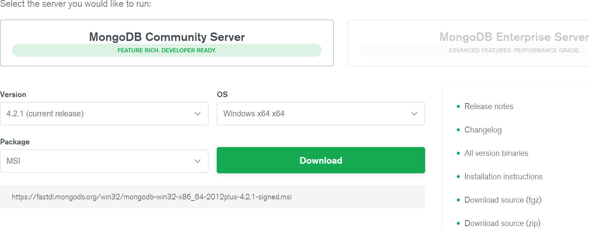

双击下载的`mongodb-win32-x86_64-2012plus-4.2.1-signed.msi`安装文件，启动安装过程。


选择“完全”安装。

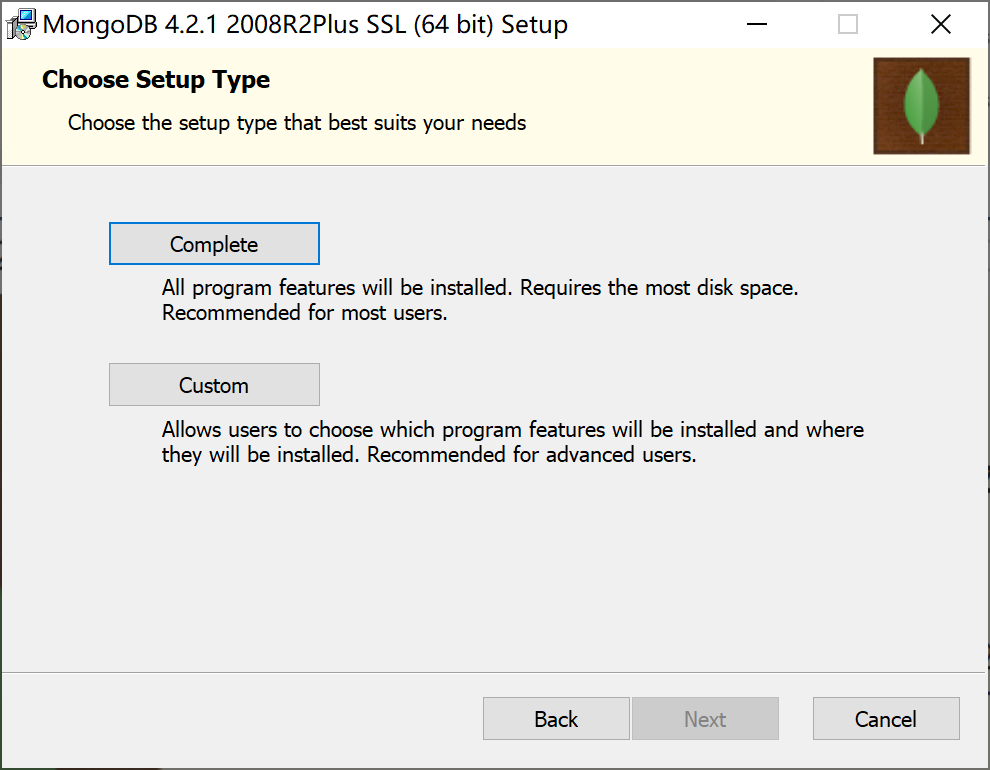

在“Install MongoDB Compass”安装步骤中，取消“Install MongoDB Compass”复选框，否则安装程序会到网上下载这个GUI管理工具，由于网络下载原因，会导致安装过程特别漫长。

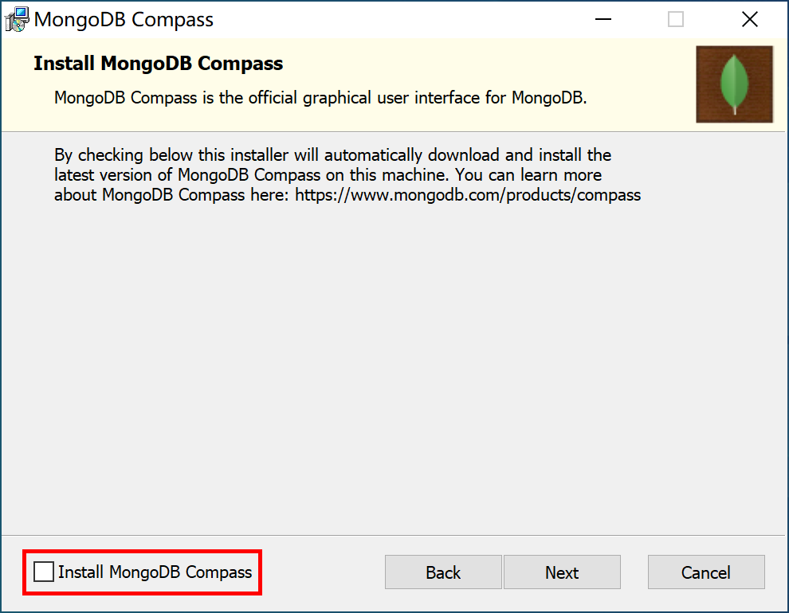

剩余安装步骤，全部选择默认即可。

安装完毕后，检查Windows服务，确认MongoDB服务已经启动。

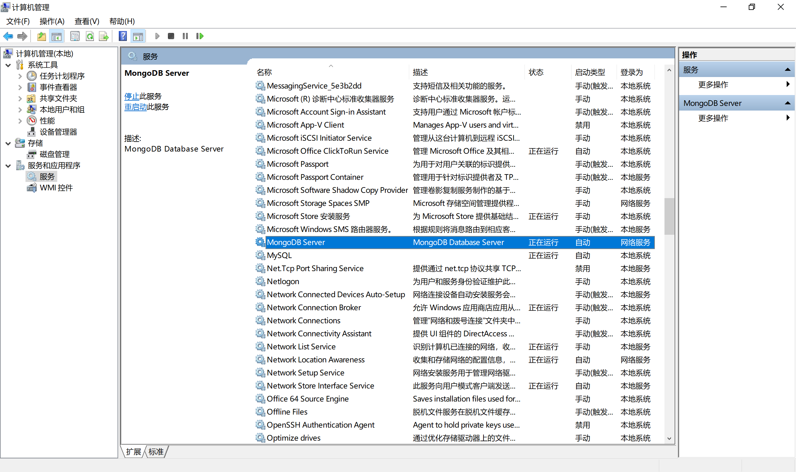

如果读者想使用官方GUI管理工具（MongoDB Compass），可以自行到[https://www.mongodb.com/download-center/compass](https://www.mongodb.com/download-center/compass)这里使用下载工具（如迅雷）快速下载，并自己安装。

### 8.1.3 安装管理工具

连接MongoDB有多种方式，除了可以使用MongoDB自带的最原始的命令窗口工具外，还可以使用功能强大的“NoSQL Manager for MongoDB”客户端GUI管理工具来连接MongoDB。

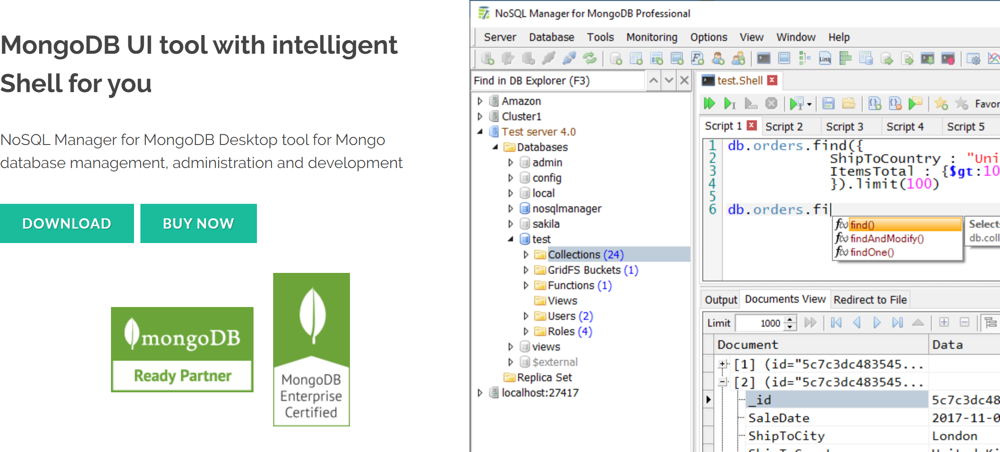

到mongodbmanager官网[https://www.mongodbmanager.com/download](https://www.mongodbmanager.com/download)下载Free版本的管理工具，按照正常步骤安装即可。


安装完毕后，打开管理工具，连接到本地MongoDB服务器。

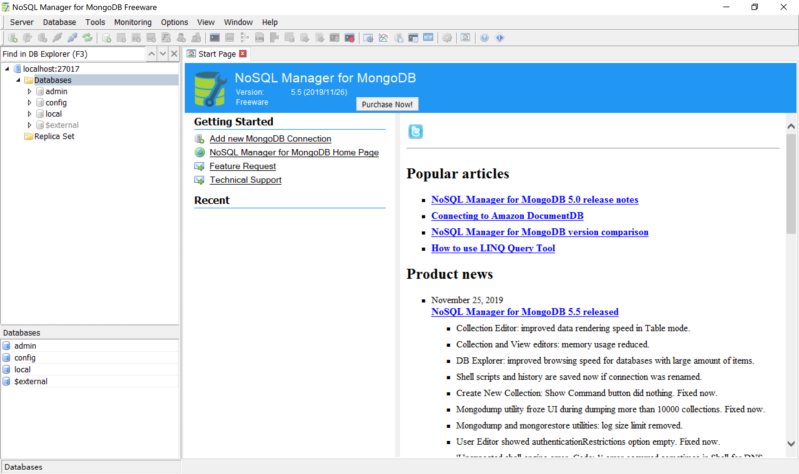

通过GUI管理工具，可以方便地看到MongoDB安装完毕后，默认创建了admin、config和local等3个数据库。

在Database上右键，创建数据库test，并在test数据库中创建test_collection。

在test_collection中创建一个文档（document），内容为官方网站首页给出的示例数据。

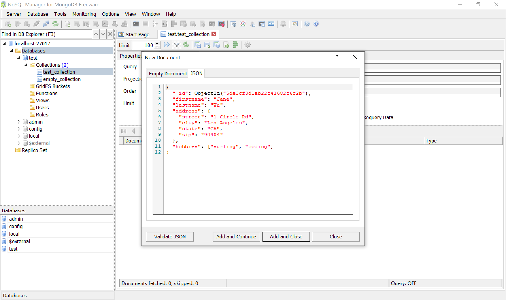

保存后，在界面中可查看到数据已正确保存。

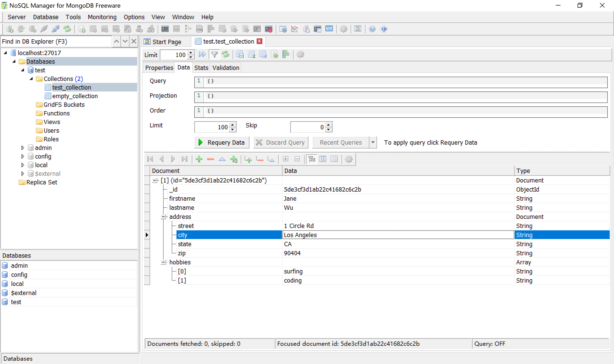

如果读者安装了MongoDB Compass，可以打开MongoDB Compass查看保存在MongoDB服务器中的数据。

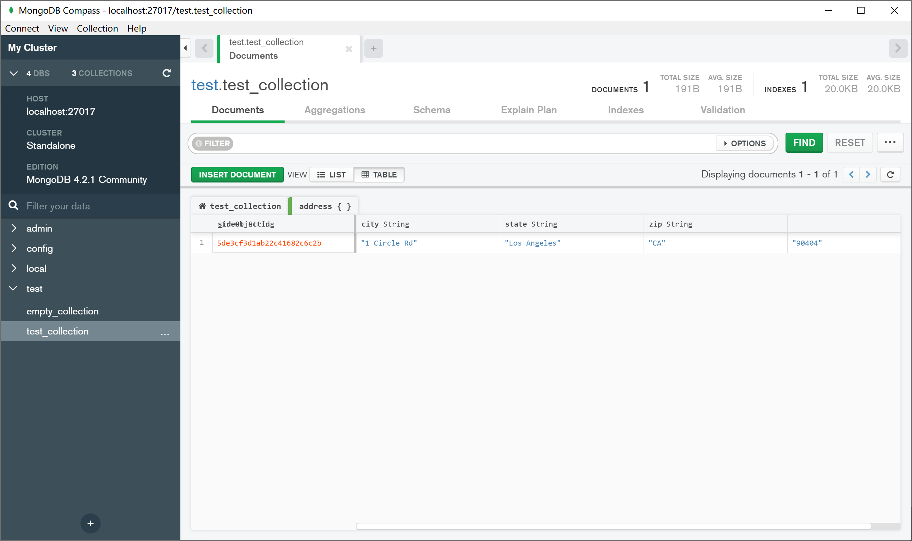

个人感觉，其界面不如NoSQL Manager for MongoDB看起来方便。当然，读者可以选用自己顺手的GUI管理工具，或者直接使用命令行工具来管理，最终效果都是一样的。

### 8.1.4 常用命令

在资源管理器（C:\Program Files\MongoDB\Server\4.2\bin）下找到`mongo.exe`，双击，打开MongoDB的命令行管理终端。

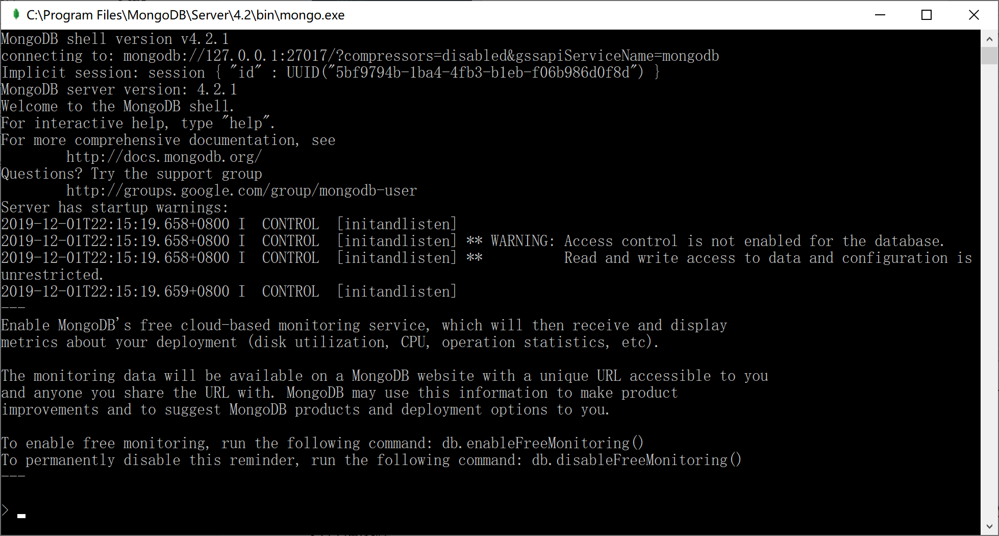

接下来，我们介绍一些MongoDB的命令，熟悉一下MongoDB的操作，更详细的MongoDB的操作，请参考官方文档。

显示所有的数据库：

```
> show dbs;
admin   0.000GB
config  0.000GB
local   0.000GB
test    0.000GB
```

切换到前面创建的test数据库：

```
> use test;
switched to db test
```

创建一个名为user的集合：

```
> db.createCollection("user");
{ "ok" : 1 }
```

显示数据库中所有的集合：

```
> show collections;
empty_collection
test_collection
user
```

在user集合中插入2个文档：

```
> db.user.insert({"id":1,"name":"Kevin","age":"18"});
WriteResult({ "nInserted" : 1 })
> db.user.insert({"id":2,"name":"Roy","age":"8"});
WriteResult({ "nInserted" : 1 })
```

查询user集合中的所有文档：

```
> db.user.find();
{ "_id" : ObjectId("5de3d41cb422c3774fecc6e8"), "id" : 1, "name" : "Kevin", "age" : "18" }
{ "_id" : ObjectId("5de3d4cfb422c3774fecc6e9"), "id" : 2, "name" : "Roy", "age" : "8" }
```

查询user集合中name=Kevin的文档：

```
> db.user.find({"name":"Kevin"});
{ "_id" : ObjectId("5de3d41cb422c3774fecc6e8"), "id" : 1, "name" : "Kevin", "age" : "18" }
```

更新user集合中id=1的文档的name为Kevin Zhang，并添加属性smart，值为The Best，并查询所有记录检查更新结果：

```
> db.user.update({"id":1}, {"id":1,"name":"Kevin Zhang","age":"18","smart":"The Best"})
WriteResult({ "nMatched" : 1, "nUpserted" : 0, "nModified" : 1 })
> db.user.find();
{ "_id" : ObjectId("5de3d41cb422c3774fecc6e8"), "id" : 1, "name" : "Kevin Zhang", "age" : "18", "smart" : "The Best" }
{ "_id" : ObjectId("5de3d4cfb422c3774fecc6e9"), "id" : 2, "name" : "Roy", "age" : "8" }
```

再添加一个文档（查询结果为3个文档），供后续删除练习用：

```
> db.user.insert({"id":3,"name":"Good Man","age":"16"});
WriteResult({ "nInserted" : 1 })
> db.user.find();
{ "_id" : ObjectId("5de3d41cb422c3774fecc6e8"), "id" : 1, "name" : "Kevin Zhang", "age" : "18", "smart" : "The Best" }
{ "_id" : ObjectId("5de3d4cfb422c3774fecc6e9"), "id" : 2, "name" : "Roy", "age" : "8" }
{ "_id" : ObjectId("5de3d790b422c3774fecc6ea"), "id" : 3, "name" : "Good Man", "age" : "16" }
```

删除id=3的文档，并查询检查，确认查询结果为2个文档：

```
> db.user.remove({"id":3});
WriteResult({ "nRemoved" : 1 })
> db.user.find();
{ "_id" : ObjectId("5de3d41cb422c3774fecc6e8"), "id" : 1, "name" : "Kevin Zhang", "age" : "18", "smart" : "The Best" }
{ "_id" : ObjectId("5de3d4cfb422c3774fecc6e9"), "id" : 2, "name" : "Roy", "age" : "8" }
```

通过GUI管理工具，查看数据库中集合文档的变化情况，可以清晰得看到test数据库中新增了1个user集合，这个集合中有2个文档，并且这两个文档的字段数不相同（有别于关系型数据库如MySQL，同一张表中字段必须相同）。

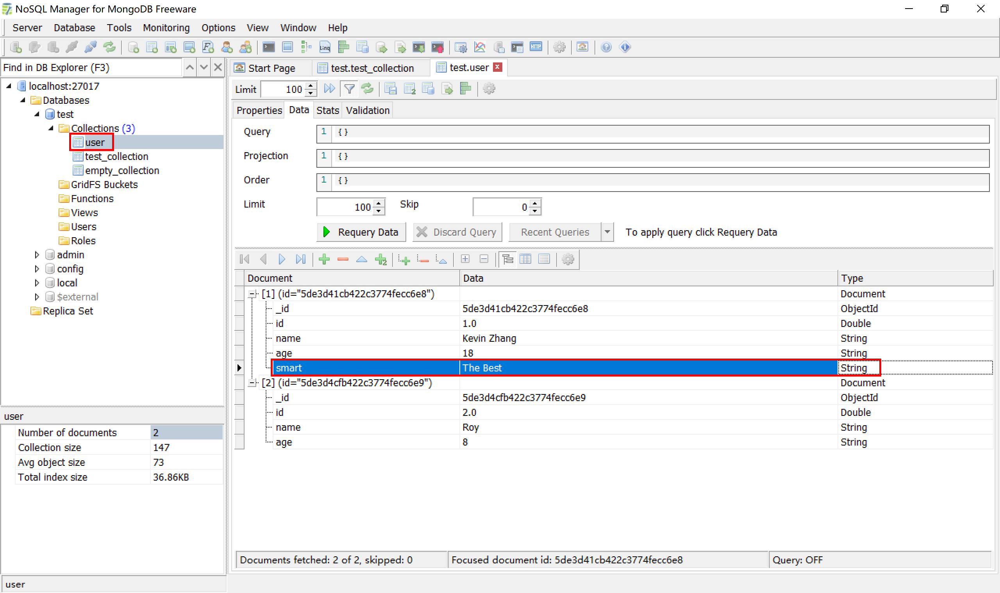