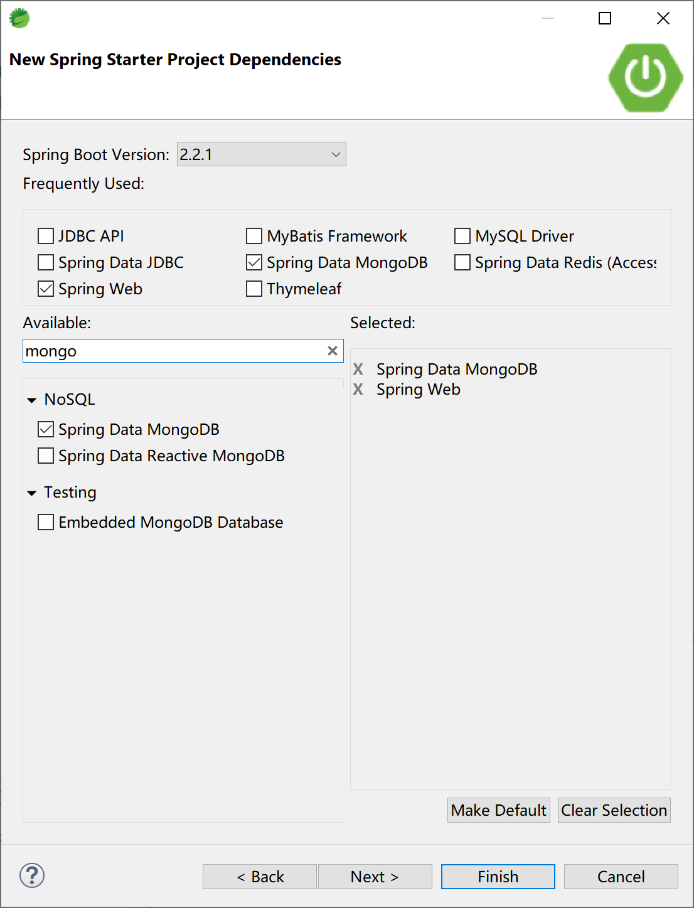
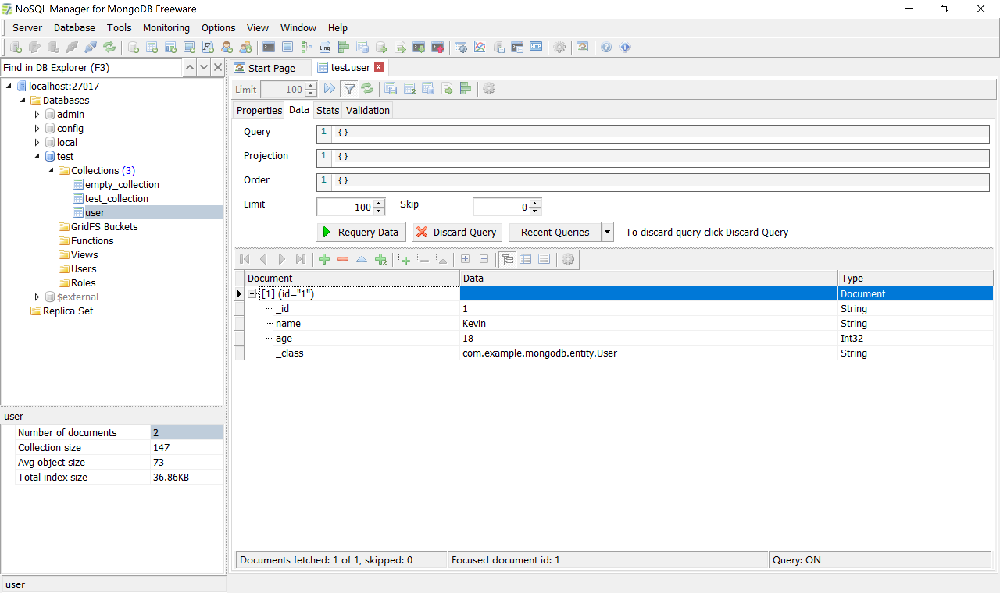
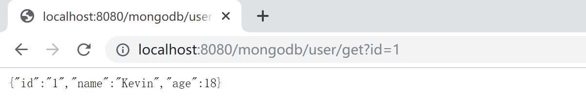
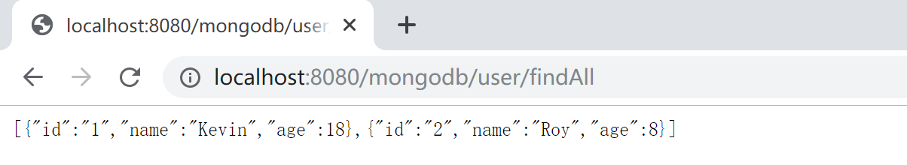
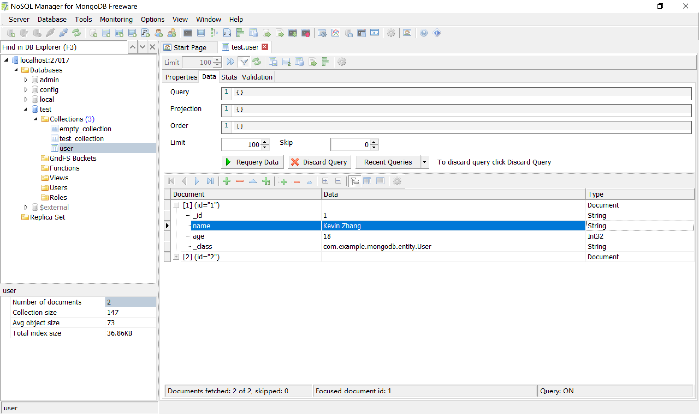
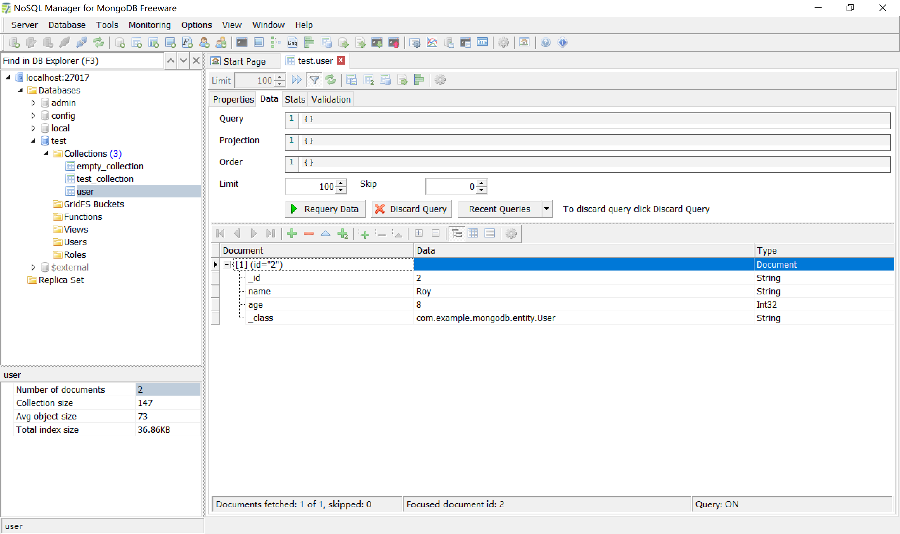
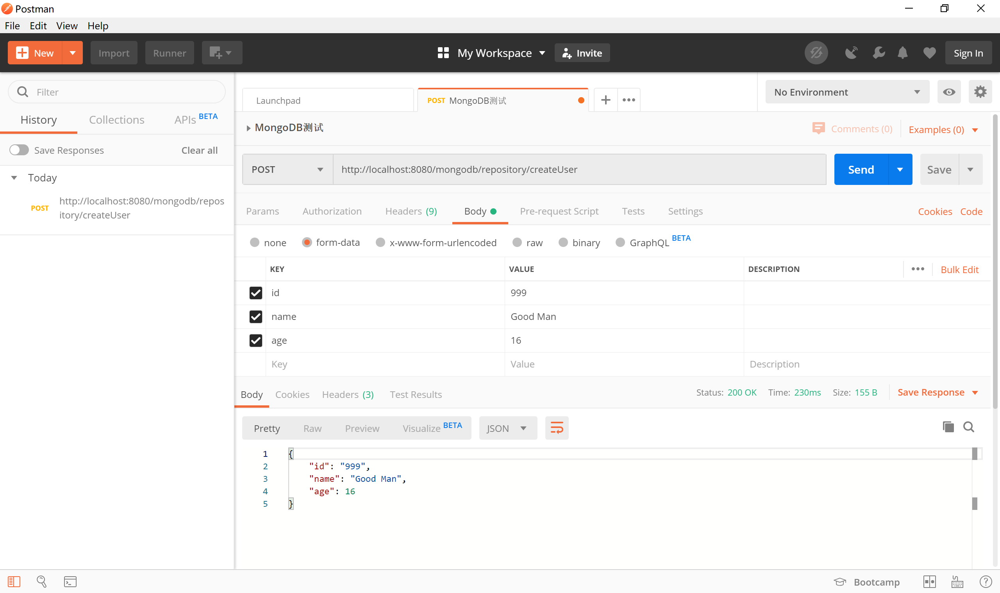
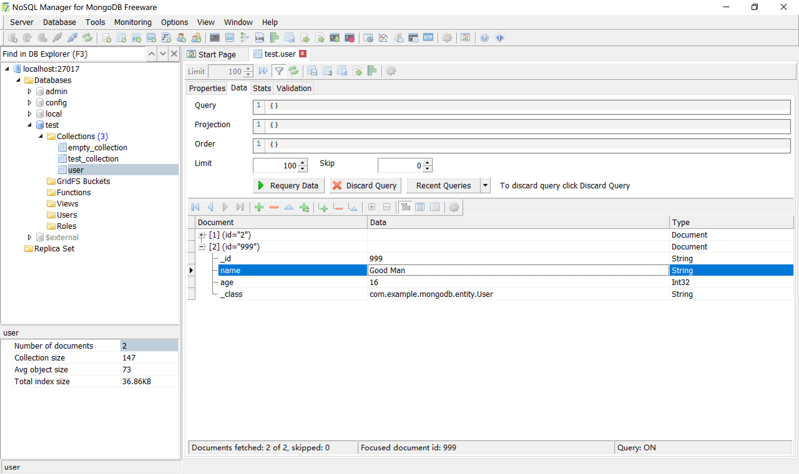
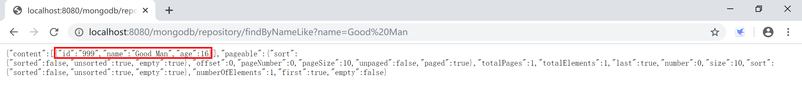
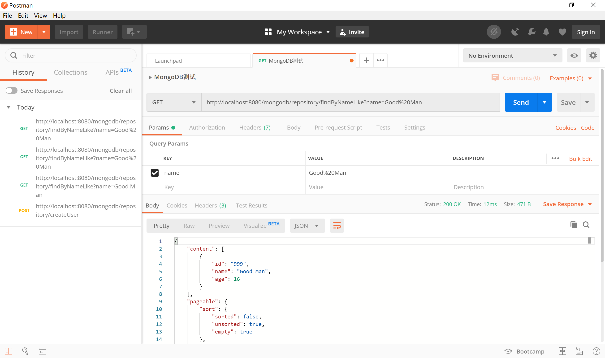

## 8.2 集成 MongoDB

Spring Boot 对常见的数据源都通过“Spring Data”项目提供了支持，当然，MongoDB 就是通过“Spring Data MongoDB”来支持的。所有的 Spring Data 子项目的使用方式都基本一致：使用模板（提供 xxxTemplate 类，如 MongoTemplate、RedisTemplate）和类似于 JPA 的 Repository 类（如 MongoRepository 接口的 SimpleMongoRepository 实现类）。

### 8.2.1 创建项目

在 STS 中新建项目，选中 Spring Web 和 Spring Data MongoDB 依赖。



创建的项目中，依赖的启动器（starter）如下：

```xml
<dependency>
    <groupId>org.springframework.boot</groupId>
    <artifactId>spring-boot-starter-data-mongodb</artifactId>
</dependency>
<dependency>
    <groupId>org.springframework.boot</groupId>
    <artifactId>spring-boot-starter-web</artifactId>
</dependency>
```

在 application.yml 配置文件中配置 MongoDB 的连接信息，连接到本地 MongoDB 服务器。

```yaml
spring:
  application:
    name: spirng-boot-mongodb
  data:
    mongodb:
      host: localhost
      port: 27017
      database: test
```

后续，我们将使用在上一小节中创建的 test 数据库中的 user 集合（Collection）来完成代码示例。

### 8.2.2 使用 MongoTemplate

在 entity 包下创建 User 实体类，对应 user 集合中的文档。

```java
public class User {

	private String id;
	private String name;
	private int age;
...
```

我们在示例中提供 3 个字段：id，name 和 age。

在 service 包下创建服务类 UserService，其中提供针对 User 的增删改查功能。

```java
package com.example.mongodb.service;

import java.util.List;

import org.springframework.beans.factory.annotation.Autowired;
import org.springframework.data.mongodb.core.MongoTemplate;
import org.springframework.data.mongodb.core.query.Criteria;
import org.springframework.data.mongodb.core.query.Query;
import org.springframework.data.mongodb.core.query.Update;
import org.springframework.stereotype.Service;

import com.example.mongodb.entity.User;

@Service
public class UserService {

	@Autowired
	private MongoTemplate mongoTemplate;

	public String save(String id, String name, int age) {
		User user = new User();
		user.setId(id);
		user.setName(name);
		user.setAge(age);
		
		mongoTemplate.save(user);
		return "success";
	}

	public List<User> findAll() {
		return mongoTemplate.findAll(User.class);
	}

	public User get(String id) {
		Query query = new Query(Criteria.where("_id").is(id));
		return mongoTemplate.findOne(query, User.class);
	}

	public String update(String id, String name, int age) {
		User user = new User();
		user.setId(id);
		user.setName(name);
		user.setAge(age);
		
		Query query = new Query(Criteria.where("_id").is(id));
		Update update = new Update().set("name", name).set("age", age);
		mongoTemplate.updateFirst(query, update, User.class);
		return "success";
	}
	
	public String delete(String id, String name, int age) {
		User user = new User();
		user.setId(id);
		user.setName(name);
		user.setAge(age);
		
		mongoTemplate.remove(user);
		return "success";
	}
}
```

上述代码中的 17-18 行注入 MongoTemplate 类，后续就使用这个模板类完成 CRUD 的操作。

控制器类，UserController 提供了一些 url 与浏览器交互。

> 为了方便测试，我们这里不使用 post 提交表单的方式，而通过 get 方式附加 url 参数的形式和后台交互。

```java
package com.example.mongodb.controller;

import java.util.List;

import org.springframework.beans.factory.annotation.Autowired;
import org.springframework.web.bind.annotation.RequestMapping;
import org.springframework.web.bind.annotation.RestController;

import com.example.mongodb.entity.User;
import com.example.mongodb.service.UserService;

@RestController
@RequestMapping("/mongodb/user/")
public class UserController {

	@Autowired
	UserService userService;
	
	@RequestMapping("/save")
	public String save(String id, String name, int age) {
		return userService.save(id, name, age);
	}
	
	@RequestMapping("/findAll")
	public List<User> findAll() {
		return userService.findAll();
	}
	
	@RequestMapping("/get")
	public User get(String id) {
		return userService.get(id);
	}
	
	@RequestMapping("/update")
	public String update(String id, String name, int age) {
		return userService.update(id, name, age);
	}
	
	@RequestMapping("/delete")
	public String delete(String id, String name, int age) {
		return userService.delete(id, name, age);
	}

}
```

运行这个 Spring Boot 应用，通过浏览器测试验证针对 MongoDB 的增删改查功能。

新增：[http://localhost:8080/mongodb/user/save?id=1&name=Kevin&age=18](http://localhost:8080/mongodb/user/save?id=1&name=Kevin&age=18) ，结果如下：



查找单一记录：[http://localhost:8080/mongodb/user/get?id=1](http://localhost:8080/mongodb/user/get?id=1) ，结果如下：



再通过 [http://localhost:8080/mongodb/user/save?id=2&name=Roy&age=8](http://localhost:8080/mongodb/user/save?id=2&name=Roy&age=8) ，增加另外一条记录。

查找所有的记录：[http://localhost:8080/mongodb/user/findAll](http://localhost:8080/mongodb/user/findAll) ，结果如下：



修改id=1的记录：[http://localhost:8080/mongodb/user/update?id=1&name=Kevin%20Zhang&age=18](http://localhost:8080/mongodb/user/update?id=1&name=Kevin%20Zhang&age=18) ，结果如下（注意查看第1条记录的name字段的值）：



删除记录：[http://localhost:8080/mongodb/user/delete?id=1&name=Kevin%20Zhang&age=18](http://localhost:8080/mongodb/user/delete?id=1&name=Kevin%20Zhang&age=18) ，结果如下（id=1的那条记录已经被删除了）：



### 8.2.3 使用 MongoRepository

Spring Data 提供了针对 MongoDB 的、与 [JPA规范](https://docs.spring.io/spring-data/jpa/docs/current/reference/html/#jpa.query-methods.query-creation) 保持一致的操作接口。

**Supported keywords inside method names**

| Keyword                | Sample                                                       | JPQL snippet                                                 |
| :--------------------- | :----------------------------------------------------------- | :----------------------------------------------------------- |
| `And`                  | `findByLastnameAndFirstname`                                 | `… where x.lastname = ?1 and x.firstname = ?2`               |
| `Or`                   | `findByLastnameOrFirstname`                                  | `… where x.lastname = ?1 or x.firstname = ?2`                |
| `Is`, `Equals`         | `findByFirstname`,`findByFirstnameIs`,`findByFirstnameEquals` | `… where x.firstname = ?1`                                   |
| `Between`              | `findByStartDateBetween`                                     | `… where x.startDate between ?1 and ?2`                      |
| `LessThan`             | `findByAgeLessThan`                                          | `… where x.age < ?1`                                         |
| `LessThanEqual`        | `findByAgeLessThanEqual`                                     | `… where x.age <= ?1`                                        |
| `GreaterThan`          | `findByAgeGreaterThan`                                       | `… where x.age > ?1`                                         |
| `GreaterThanEqual`     | `findByAgeGreaterThanEqual`                                  | `… where x.age >= ?1`                                        |
| `After`                | `findByStartDateAfter`                                       | `… where x.startDate > ?1`                                   |
| `Before`               | `findByStartDateBefore`                                      | `… where x.startDate < ?1`                                   |
| `IsNull`, `Null`       | `findByAge(Is)Null`                                          | `… where x.age is null`                                      |
| `IsNotNull`, `NotNull` | `findByAge(Is)NotNull`                                       | `… where x.age not null`                                     |
| `Like`                 | `findByFirstnameLike`                                        | `… where x.firstname like ?1`                                |
| `NotLike`              | `findByFirstnameNotLike`                                     | `… where x.firstname not like ?1`                            |
| `StartingWith`         | `findByFirstnameStartingWith`                                | `… where x.firstname like ?1` (parameter bound with appended `%`) |
| `EndingWith`           | `findByFirstnameEndingWith`                                  | `… where x.firstname like ?1` (parameter bound with prepended `%`) |
| `Containing`           | `findByFirstnameContaining`                                  | `… where x.firstname like ?1` (parameter bound wrapped in `%`) |
| `OrderBy`              | `findByAgeOrderByLastnameDesc`                               | `… where x.age = ?1 order by x.lastname desc`                |
| `Not`                  | `findByLastnameNot`                                          | `… where x.lastname <> ?1`                                   |
| `In`                   | `findByAgeIn(Collection ages)`                               | `… where x.age in ?1`                                        |
| `NotIn`                | `findByAgeNotIn(Collection ages)`                            | `… where x.age not in ?1`                                    |
| `True`                 | `findByActiveTrue()`                                         | `… where x.active = true`                                    |
| `False`                | `findByActiveFalse()`                                        | `… where x.active = false`                                   |
| `IgnoreCase`           | `findByFirstnameIgnoreCase`                                  | `… where UPPER(x.firstame) = UPPER(?1)`                      |

在 dao 包下创建 UserDAO 接口，并给出符合上述命令规范的方法，如 findByNameLike 方法。

```java
package com.example.mongodb.dao;

import org.springframework.data.domain.Page;
import org.springframework.data.domain.Pageable;
import org.springframework.data.mongodb.repository.MongoRepository;

import com.example.mongodb.entity.User;

public interface UserDAO extends MongoRepository<User, String> {
	public Page<User> findByNameLike(String name, Pageable pageable);
}
```

创建控制器 RepositoryController，注入 UserDAO，添加控制器方法。

```java
package com.example.mongodb.controller;

import org.springframework.beans.factory.annotation.Autowired;
import org.springframework.data.domain.Page;
import org.springframework.data.domain.PageRequest;
import org.springframework.web.bind.annotation.RequestMapping;
import org.springframework.web.bind.annotation.RestController;

import com.example.mongodb.dao.UserDAO;
import com.example.mongodb.entity.User;

@RestController
@RequestMapping("/mongodb/repository/")
public class RepositoryController {

	@Autowired
	UserDAO userDAO;

	@RequestMapping("/createUser")
	public User createUser(User user) {
		return userDAO.save(user);
	}

	@RequestMapping("/findByNameLike")
	public Page<User> findByNameLike(String name) {
		PageRequest pageable = PageRequest.of(0, 10);
		return userDAO.findByNameLike(name, pageable);
	}
}
```

其中的 createUser 方法使用了`org.springframework.data.repository.CrudRepository`接口中的 save 方法。

其中 findByNameLike 方法使用的是我们遵循 Spring Data JPA 方法名规范在 UserDAO 类中提供的`findByNameLike(name, pageable)`方法。

运行程序，使用 Postman 测试，createUser 服务接口：



检查 MongoDB 中的数据，确认其已经正确创建 id 为 999 的记录。



通过浏览器访问 [http://localhost:8080/mongodb/repository/findByNameLike?name=Good Man](http://localhost:8080/mongodb/repository/findByNameLike?name=Good Man)，检查是否正确返回查询到的数据。



通过 Postman 发起 get 请求，请求地址为 [http://localhost:8080/mongodb/repository/findByNameLike?name=Good Man](http://localhost:8080/mongodb/repository/findByNameLike?name=Good%20Man) ，检查其返回的数据为 id=999 的记录。



> 本小节示例项目代码：
>
> [https://github.com/gyzhang/SpringBootCourseCode/tree/master/spring-boot-mongodb](https://github.com/gyzhang/SpringBootCourseCode/tree/master/spring-boot-mongodb)
