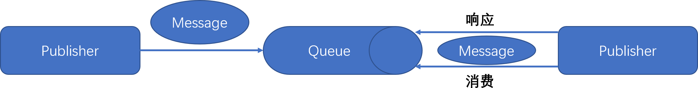
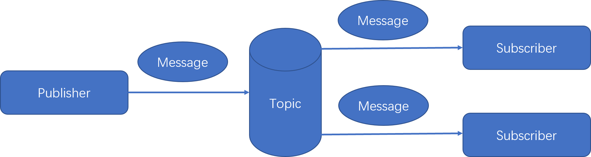

## 9.1 有关消息的概念

本小节介绍一些有关消息的概念，为理解学习后续集成常用消息中间件的知识打下基础。

### 9.1.1 基本概念

JMS（Java消息服务，[JSR 343: Java Message Service 2.0](https://jcp.org/en/jsr/detail?id=343)）是Java平台上有关“面向消息中间件（MOM）”的技术规范，它便于处于消息系统中的Java应用程序之间进行消息交换，并且通过提供标准的产生、发送、接收消息的接口简化企业应用的开发。

MQ全称为Message Queue（消息队列）是一种应用程序对应用程序的通信方法，是面向消息中间件（MOM）的最终实现，是真正的服务提供者。MQ的实现可以基于JMS，也可以基于其他规范或标准。

消息传递指的是程序之间通过在消息中发送数据进行通信，而不是通过直接调用彼此来通信，直接调用通常是用于诸如远过程调用（RPC）的技术。

应用程序通过写入和消息列队中的数据（消息）来通信，从而避免了应用程序之间的相互连接（高耦合）。

“生产者-消费者”模型是MQ的一个典型的代表：一端往消息队列中不断的写入消息，而另一端则可以读取或者订阅队列中的消息。常见的MQ消息中间件是遵循JMS和（或）AMQP协议规范的具体实现产品。

> [AMQP](http://www.amqp.org/)，即Advanced Message Queuing Protocol，一个提供统一消息服务的应用层标准高级消息队列协议，是应用层协议的一个开放标准，为面向消息的中间件设计。基于此协议的客户端与消息中间件可传递消息，并不受客户端/中间件不同产品，不同的开发语言等条件的限制。

我们经常会在项目中，将一些无需即时返回且耗时的操作提取出来，进行异步处理。而这种异步处理的方式大大的节省了服务器的请求响应时间，从而提高了系统的吞吐量。

JMS中的一些术语：

1. Provider(MessageProvider)：生产者，指消息的生产者，发送消息的程序。

2. Consumer(MessageConsumer)：消费者，指消息的消费者，接收消息的程序。

3. P2P：Point to Point，即点对点的消息模型。

  

4. Pub/Sub：publish/Subscribe，即发布/订阅的消息模型。
    
5. Queue：队列，在消息的传输过程中保存消息的容器。
6. Topic：主题。消息的发布者将消息发布到一个内容节点，消息的订阅者在这个内容节点订阅（接收）消息，这个内容节点就是主题。主题使得消息的发布者和订阅者保持相互独立。
7. ConnectionFactory：连接工厂，JMS用来创建连接的工厂（一种常见的设计模式：工厂模式）。
8. Connection：JMS客户端到JMS Provider的连接。
9. Destination：消息的目的地。
10. Session：会话，一个发送或者接受消息的线程。

JMS规范的两种消息传输方式Topic（一对多）和Queue（一对一），比较如下：

| 比较项         | Topic                                                        | Queue                                                        |
| -------------- | ------------------------------------------------------------ | ------------------------------------------------------------ |
| 概要           | Publish Subscribe messaging 发布订阅消息                     | Point-to-Point 点对点                                        |
| 有无状态       | 数据默认不落地，是无状态的                                   | 数据默认会在mq服务器上以文件形式保存，比如Active MQ一般保存在$AMQ_HOME\data\kr-store\data下面。也可以配置成DB存储 |
| 完整性保障     | 并不保证publisher发布的每条数据，Subscriber都能接受到        | 保证每条数据都能被receiver接收                               |
| 消息是否会丢失 | 一般来说publisher发布消息到某一个topic时，只有正在监听该topic地址的sub能够接收到消息；如果没有sub在监听，该topic就丢失了 | Sender发送消息到目标Queue，receiver可以异步接收这个Queue上的消息。Queue上的消息如果暂时没有receiver来取，也不会丢失 |
| 发布接收策略   | 一对多的消息发布接收策略，监听同一个topic地址的多个sub都能收到publisher发送的消息。Sub接收完通知mq服务器 | 一对一的消息发布接收策略，一个sender发送的消息，只能有一个receiver接收。receiver接收完后，通知mq服务器已接收，mq服务器对queue里的消息采取删除或其他操作 |

### 9.1.2 高可用

当前所有的主流消息中间件，都支持高可用。

在生产环境下可以通过集群方式来保证消息中间件的高可用（HA）性。

消息中间件集群包括两种，普通模式和镜像模式：

- 普通模式是每个节点存相同的元数据，只有一个存真正的数据实体，当消费者从某个没有数据实体的节点读数据时，需要临时在节点间传输数据。这种集群做不到高可用。

- 镜像模式：消息队列为镜像队列，实现了消息队列的高可用，但是占用大量网络带宽同步镜像队列中的数据。

### 9.1.3 幂等

在可靠消息支持的分布式事务场景下，我们需要消息的消费满足“有且仅有一次”的条件。

幂等（idempotent, idempotence）在数学上有明确的定义：

设f为一由X映射至X的一元运算，则f为幂等的，当对于所有在X内的x，f(f(x)) = f(x)。
特别的是，恒等函数一定是幂等的，且任一常数函数也都是幂等的。

基于幂等的数学定义，结合消息消费的场景，我们能够很容易的总结出消息幂等的概念：

如果消息重试多次，消费者端对该重复消息消费多次与消费一次的结果是相同的，并且多次消费没有对系统产生副作用，那么我们就称这个过程是消息幂等的。

> 支付场景下，消费者消费扣款消息，对一笔订单进行扣款操作。
>
> 这个扣款操作重复多次与执行一次的效果相同，只进行一次真实扣款，用户的扣款记录中对应该笔订单的只有一条扣款流水。不会多扣。那么我们就说这个扣款操作是符合要求的，这个消费过程是消息幂等的。