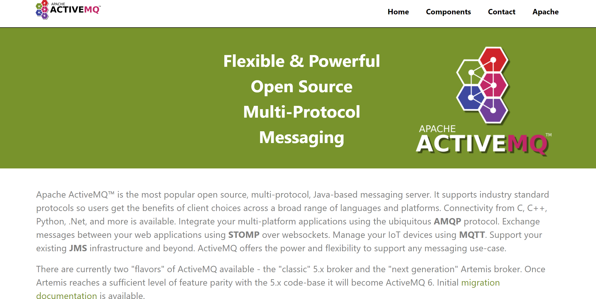
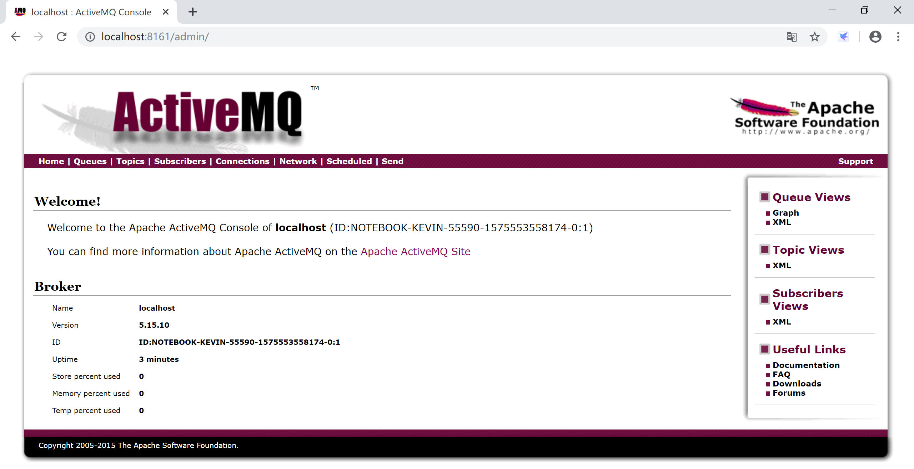
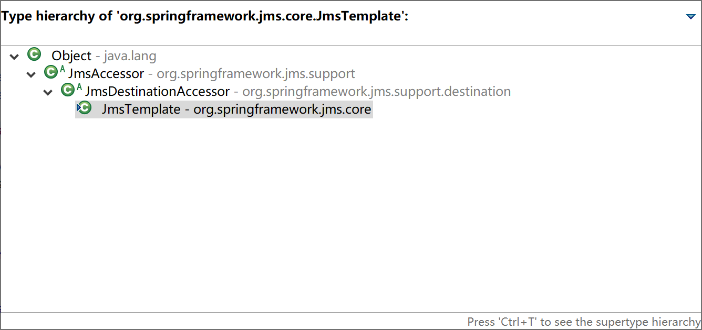
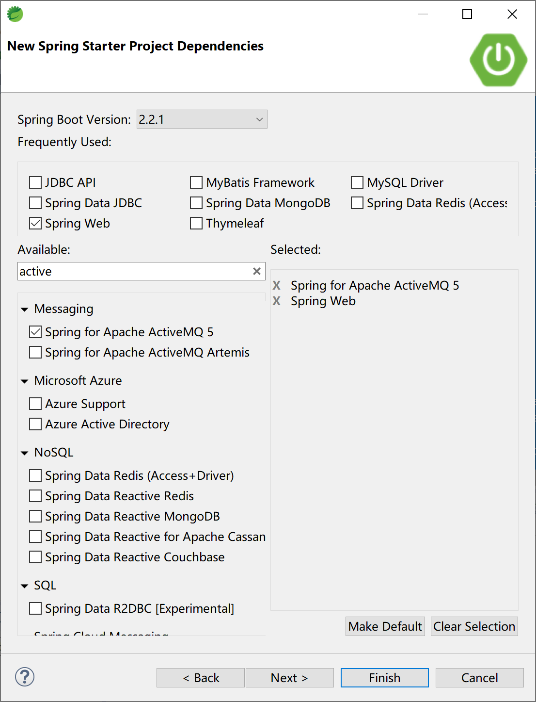
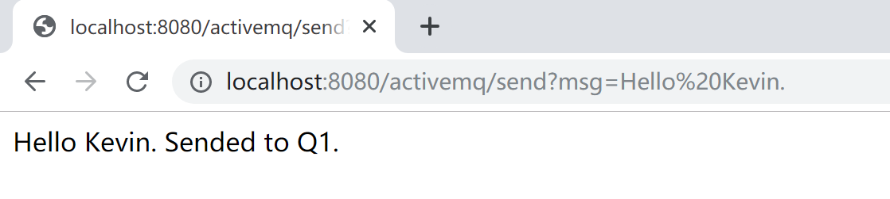
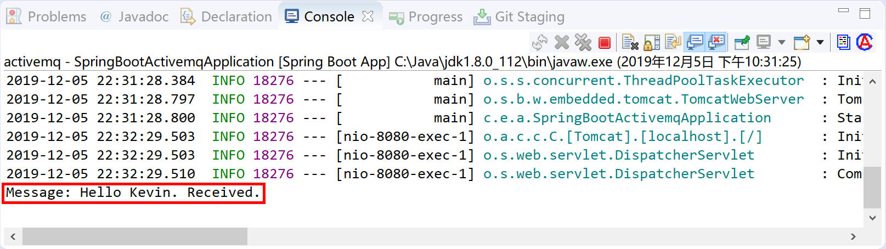
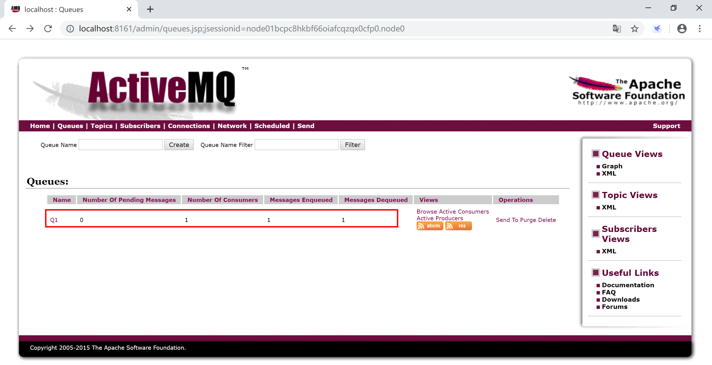

## 9.2 Spring Boot集成ActiveMQ

ActiveMQ是一种基于JMS 1.1规范的开源的消息中间件，ActiveMQ的设计目标是提供标准的，面向消息的，能够跨越多语言和多系统的应用集成消息通信中间件。



ActiveMQ非常成熟，功能强大，在早些年业内大量的公司以及项目中都有应用，偶尔会有较低概率丢失消息，现在社区活跃度在降低，国内应用越来越少。官方现在对ActiveMQ 5.x维护越来越少，几个月才发布一个版本。

### 9.2.1安装配置

到官网下载最新的[ apache-activemq-5.15.10-bin.zip](http://www.apache.org/dyn/closer.cgi?filename=/activemq/5.15.10/apache-activemq-5.15.10-bin.zip&action=download)为Windows编译好的zip解压包。

解压到磁盘，例如`C:\Java\apache-activemq-5.15.10`这个目录。

打开命令终端，进入ActiveMQ安装目录，执行`activemq.bat start`启动ActiveMQ服务器。

访问[http://localhost:8161/index.html](http://localhost:8161/index.html)控制台，点击[Manage ActiveMQ broker](http://localhost:8161/admin/)用户名和密码都是admin，进入管理界面，检查ActiveMQ是否正确安装。

　　　　现在社区以及国内应用都越来越少，官方社区现在对ActiveMQ 5.x维护越来越少，几个月才发布一个版本  



> 因为ActiveMQ应用得越来越少，我们就不做集群安装配置演示了。

### 9.2.2 Spring Boot集成ActiveMQ

Spring Boot为ActiveMQ提供了启动器（starter），集成ActiveMQ很方便。

Spring为JMS提供了`org.springframework.jms.core.JmsTemplate`模板类，封装了常用的消息操作，使用起来非常方便。



新建一个Spring Boot项目，选择Spring Web和Spring for Apache ActiveMQ 5这两个starter依赖。



项目pom文件，最主要的就是：

```xml
<dependency>
    <groupId>org.springframework.boot</groupId>
    <artifactId>spring-boot-starter-activemq</artifactId>
</dependency>
```

在配置文件application.yml中配置到ActiveMQ的连接信息：

```yaml
spring:
  activemq:
    broker-url: tcp://localhost:61616
    user: admin
    password: admin
```

创建一个Controller，接收用户输入，向MQ发送消息：

```java
package com.example.activemq.controller;

import javax.jms.JMSException;
import javax.jms.Message;
import javax.jms.Session;
import javax.jms.TextMessage;

import org.springframework.beans.factory.annotation.Autowired;
import org.springframework.jms.core.JmsTemplate;
import org.springframework.jms.core.MessageCreator;
import org.springframework.web.bind.annotation.RequestMapping;
import org.springframework.web.bind.annotation.RestController;

@RestController
@RequestMapping("/activemq/")
public class ActiveMQController {
	
	@Autowired
	private JmsTemplate jmsTemplate;
	
	@RequestMapping("/send")
	public String sendMsg(String msg) {
		jmsTemplate.send("Q1", new MessageCreator() {
			
			@Override
			public Message createMessage(Session session) throws JMSException {
				TextMessage textMessage = session.createTextMessage();
                textMessage.setText(msg);
                return textMessage;
			}
		});
        
		return msg + " Sended to Q1.";
	}

}
```

在Controller中注入`private JmsTemplate jmsTemplate;`，然后使用JmsTemplate的send方法向Q1队列发送消息。

创建一个服务类，监听消息队列Q1，并简单地将接收到地消息输出到控制台。

```java
package com.example.activemq.service;

import org.springframework.jms.annotation.JmsListener;
import org.springframework.stereotype.Service;

@Service
public class MessageListener {
	
	@JmsListener(destination = "Q1")
	public void msgReceive(String msg) {
		System.out.println("Message: " + msg + " Received.");
	}

}
```

注解`@JmsListener(destination = "Q1")`表示msgReceive方法监听Q1这个队列。

运行Spring Boot应用程序，访问[http://localhost:8080/activemq/send?msg=Hello%20Kevin.](http://localhost:8080/activemq/send?msg=Hello Kevin.)，向消息队列中发送“Hello Kevin.”这样一条消息。



然后观察Spring Boot应用的控制台，可以看到由MessageListener.msgReceive方法从Q1接收到消息后在控制台输出的信息。



在ActiveMQ的管理控制台，也可以看到由程序创建的Q1队列，及消息消费者和消息相关的信息。



