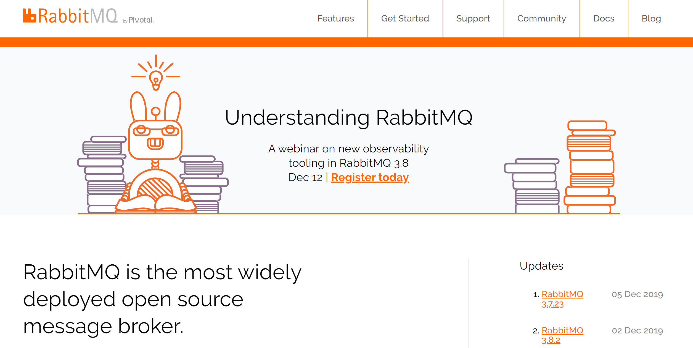
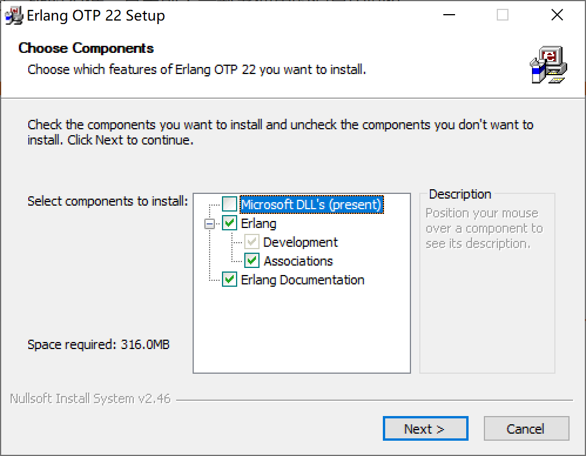
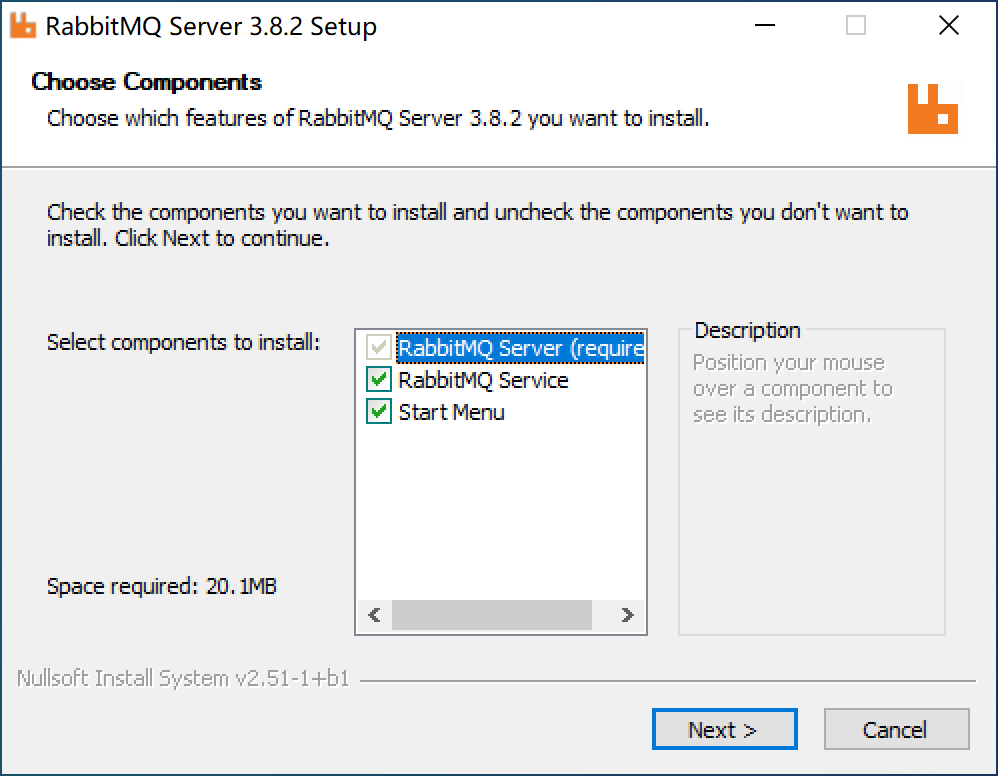
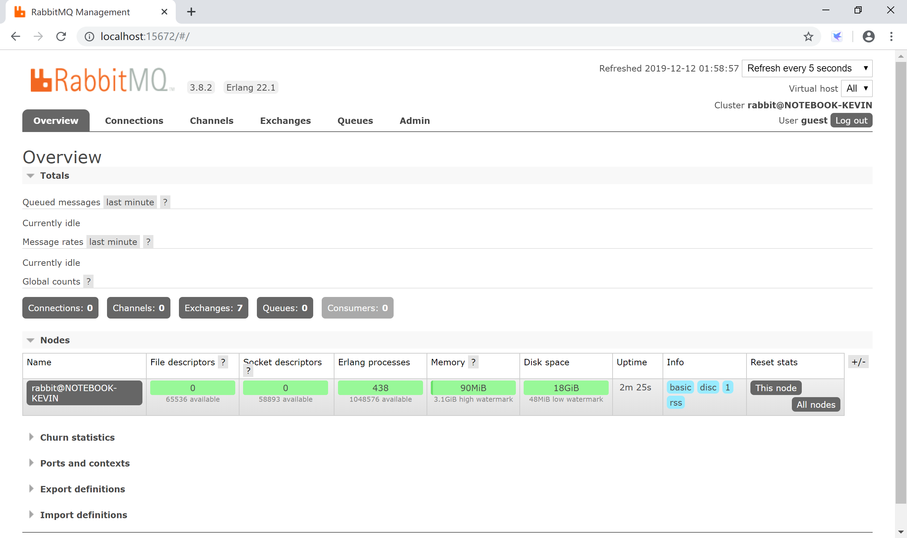
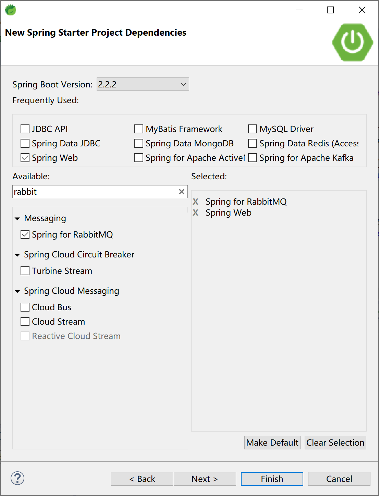
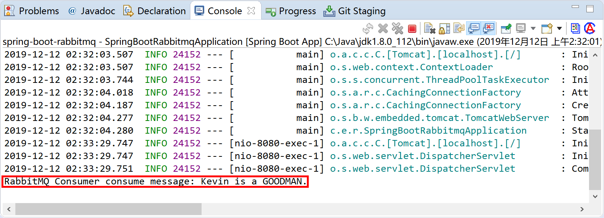
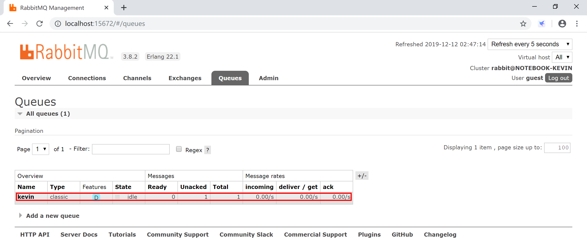
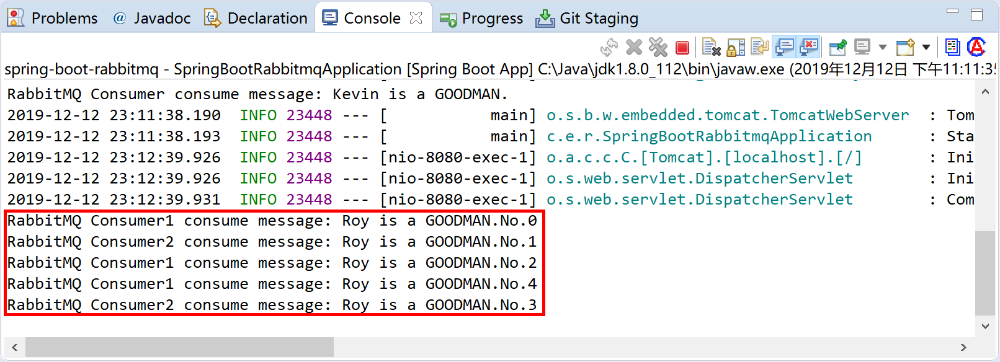
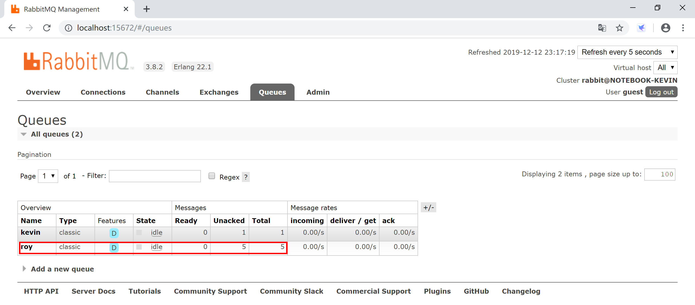

## 9.3 Spring Boot集成RabbitMQ

RabbitMQ是实现了高级消息队列协议（AMQP）的开源消息中间件，基于erlang开发，并发能力很强，性能极好，延时很低，是当前大量部署使用的消息中间件。



RabbitMQ发送消息时，是先把消息发送给Exchange（交换器），然后再分发给有相应RoutingKey（路由键）关系的Queue（队列）。

在RabbitMQ中消息交换器有四种：

1. **Direct**模式：消息中的路由键（routing key）如果和 Binding 中的 binding key 一致， 交换器就将消息发到对应的队列中。路由键与队列名完全匹配。
2. **Topic**模式：主题交换器通过模式匹配消息的路由键属性，然后将消息分配到绑定到该模式的队列。它将路由键和绑定键的字符串切分成单词，这些单词之间用点隔开。该交换器会识别两个通配符：“#”和“\*”。#匹配0个或多个单词，\*匹配一个单词。
3. **Fanout**模式：每个发到 fanout 类型交换器的消息都会分到所有绑定的队列上去。fanout 交换器不处理路由键，只是简单的将队列绑定到交换器上，每个发送到交换器的消息都会被转发到与该交换器绑定的所有队列上（就像广播一样）。fanout 类型转发消息是最快的。
4. **Header**模式： 和主题交换器有点相似，头交换器的路由值基于消息的header数据。主题交换器路由键只有是字符串，而头交换器可以是整型和哈希值。

> Headers交换器允许你匹配AMQP消息的header而非路由键，除此之外headers交换器和direct交换器完全一致，但性能却很差，几乎用不到。

### 9.3.1 安装配置

到[RabbitMQ官网](http://www.rabbitmq.com/)下载最新版[rabbitmq-server-3.8.2.exe](https://github.com/rabbitmq/rabbitmq-server/releases/download/v3.8.2/rabbitmq-server-3.8.2.exe)。

安装运行RabbitMQ需要64位的Erlang，针对3.8.2版本的RabbitMQ官方推荐Erlang 22.1版本。

到[Erlang官网](https://www.erlang.org/)下载[otp_win64_22.1.exe](https://erlang.org/download/otp_win64_22.1.exe)。

#### 9.3.1.1 安装Erlang

使用默认配置安装Erlang。



#### 9.3.1.2 安装RabbitMQ

使用默认配置安装RabbitMQ。



RabbitMQ提供了Web管理界面。

打开命令提示符窗口，进入`C:\Program Files\RabbitMQ Server\rabbitmq_server-3.8.2\sbin`目录，执行`rabbitmq-plugins.bat enable rabbitmq_management` 开启Web管理插件。

```powershell
Microsoft Windows [版本 10.0.18362.476]
(c) 2019 Microsoft Corporation。保留所有权利。

C:\Users\Kevin>cd C:\Program Files\RabbitMQ Server\rabbitmq_server-3.8.2\sbin

C:\Program Files\RabbitMQ Server\rabbitmq_server-3.8.2\sbin>rabbitmq-plugins.bat enable rabbitmq_management
Enabling plugins on node rabbit@NOTEBOOK-KEVIN:
rabbitmq_management
The following plugins have been configured:
  rabbitmq_management
  rabbitmq_management_agent
  rabbitmq_web_dispatch
Applying plugin configuration to rabbit@NOTEBOOK-KEVIN...
The following plugins have been enabled:
  rabbitmq_management
  rabbitmq_management_agent
  rabbitmq_web_dispatch

started 3 plugins.

C:\Program Files\RabbitMQ Server\rabbitmq_server-3.8.2\sbin>
```

打开浏览器访问[http://localhost:15672/](http://localhost:15672/)，使用guest用户，密码guest登录管理控制台。



### 9.3.2 与Spring Boot集成

新建Spring Boot项目，选择Spring for RabbitMQ+Spring Web启动器依赖。



pom文件的主要依赖为`spring-boot-starter-amqp`。

```xml
<dependency>
    <groupId>org.springframework.boot</groupId>
    <artifactId>spring-boot-starter-amqp</artifactId>
</dependency>
<dependency>
    <groupId>org.springframework.boot</groupId>
    <artifactId>spring-boot-starter-web</artifactId>
</dependency>
```

在配置文件application.yml中添加RabbitMQ连接等配置信息。

```yaml
spring:
  application:
    name: spring-boot-rabbitmq
  rabbitmq:
    host: 127.0.0.1
    port: 5672
    username: guest
    password: guest
# 开启发送确认
    publisher-confirm-type: correlated
# 开启发送失败退回
    publisher-returns: true
# 开启ACK
    listener:
      direct:
        acknowledge-mode: manual
      simple:
        acknowledge-mode: manual
```

#### 9.3.2.1 一对一模式

一个生产者对一个消费者模式，生产者将消息投送到队列中，消费者从队列中消费消息，然后就结束了。

创建配置类RabbitMQConfig，在其中配置消息队列`kevin`。

```java
package com.example.rabbitmq.config;

import org.springframework.amqp.core.Queue;
import org.springframework.context.annotation.Bean;
import org.springframework.context.annotation.Configuration;


@Configuration
public class RabbitMQConfig {

    @Bean
    public Queue kevinQueue() {
        return new Queue("kevin");
    }

}
```

创建消息生产者RabbitMQProducer，使用注入的AmqpTemplate对象向消息队列`kevin`发送消息。

```java
package com.example.rabbitmq.producer;

import org.springframework.amqp.core.AmqpTemplate;
import org.springframework.beans.factory.annotation.Autowired;
import org.springframework.stereotype.Component;

@Component
public class RabbitMQProducer {
	
	@Autowired 
	AmqpTemplate amqpTemplate;
	
	public void sendMessage(String msg) {
		amqpTemplate.convertAndSend("kevin", msg);
	}

}
```

创建消息消费者RabbitMQConsumer，监听`kevin`消息队列的消息，并在管理控制台上输出信息。

```java
package com.example.rabbitmq.consumer;

import org.springframework.amqp.rabbit.annotation.RabbitHandler;
import org.springframework.amqp.rabbit.annotation.RabbitListener;
import org.springframework.stereotype.Component;

@Component
@RabbitListener(queues = "kevin")
public class RabbitMQConsumer {
	
	@RabbitHandler
    public void receive(String msg) {
		System.out.println("RabbitMQ Consumer consume message: " + msg);
	}

}
```

创建与用户交互的控制器类RabbitMQController，在`/rabbitmq/send`路径上接收用户输入。

```java
package com.example.rabbitmq.controller;

import org.springframework.beans.factory.annotation.Autowired;
import org.springframework.web.bind.annotation.RequestMapping;
import org.springframework.web.bind.annotation.RestController;

import com.example.rabbitmq.producer.RabbitMQProducer;

@RestController
@RequestMapping("/rabbitmq/")
public class RabbitMQController {
	
	@Autowired
	RabbitMQProducer rabbitMQProducer;
	
	@RequestMapping("/send")
	public String sendMsg(String msg) {
		rabbitMQProducer.sendMessage(msg);
		return msg + " Sended to kevin.";
	}

}
```

运行Spring Boot应用，打开浏览器访问[http://localhost:8080/rabbitmq/send?msg=Kevin is a GOODMAN.](http://localhost:8080/rabbitmq/send?msg=Kevin is a GOODMAN.)，向RabbitMQ发送消息。


RabbitMQ消费者（RabbitMQConsumer类）消费消息，并在控制台打印信息。



通过管理控制台，可以看到消息队列的相关情况。



#### 9.3.2.2 一对多模式

一个生产者对多个消费者，该模式下可以是一个生产者将消息投递到一个队列，该队列对应多个消费者，此时每条消息只会被消费一次，多个消费者循环处理。另外也可以是一个生产者将消息投递到多个队列里，此时消息是被复制处理。

在配置类`com.example.rabbitmq.config.RabbitMQConfig`中添加一个新的消息队列roy。

```java
@Bean
public Queue royQueue() {
    return new Queue("roy");
}
```

创建消息生产者RabbitMQProducerMore，使用注入的AmqpTemplate对象向消息队列`roy`发送消息。

```java
package com.example.rabbitmq.producer;

import org.springframework.amqp.core.AmqpTemplate;
import org.springframework.beans.factory.annotation.Autowired;
import org.springframework.stereotype.Component;

@Component
public class RabbitMQProducerMore {
	
	@Autowired 
	AmqpTemplate amqpTemplate;
	
	public void sendMessage(String msg) {
		amqpTemplate.convertAndSend("roy", msg);
	}

}
```

创建消息消费者RabbitMQConsumer1，监听`roy`消息队列的消息，并在管理控制台上输出信息。

```java
package com.example.rabbitmq.consumer;

import org.springframework.amqp.rabbit.annotation.RabbitHandler;
import org.springframework.amqp.rabbit.annotation.RabbitListener;
import org.springframework.stereotype.Component;

@Component
@RabbitListener(queues = "roy")
public class RabbitMQConsumer1 {
	
	@RabbitHandler
    public void receive(String msg) {
		System.out.println("RabbitMQ Consumer1 consume message: " + msg);
	}

}
```

创建消息消费者RabbitMQConsumer2，监听`roy`消息队列的消息，并在管理控制台上输出信息。

```java
package com.example.rabbitmq.consumer;

import org.springframework.amqp.rabbit.annotation.RabbitHandler;
import org.springframework.amqp.rabbit.annotation.RabbitListener;
import org.springframework.stereotype.Component;

@Component
@RabbitListener(queues = "roy")
public class RabbitMQConsumer2 {
	
	@RabbitHandler
    public void receive(String msg) {
		System.out.println("RabbitMQ Consumer2 consume message: " + msg);
	}

}
```

在控制器类RabbitMQController中，添加`/rabbitmq/sendMore`路径上接收用户输入，并调用RabbitMQProducerMore（消息生产者类）中的sendMessage方法循环发送5条消息到roy消息队列上。

```java
@Autowired
RabbitMQProducerMore rabbitMQProducerMore;

@RequestMapping("/sendMore")
public String sendMoreMsg(String msg) {
    for (int i = 0; i < 5; i++) {
        rabbitMQProducerMore.sendMessage(msg + "No." + i);
    }
    return msg + " Sended 5 Messages to roy.";
}
```

运行Spring Boot应用，打开浏览器访问[http://localhost:8080/rabbitmq/sendMore?msg=Roy is a GOODMAN.](http://localhost:8080/rabbitmq/sendMore?msg=Roy is a GOODMAN.)，向RabbitMQ发送消息。


RabbitMQ消费者（RabbitMQConsumer1类和RabbitMQConsumer2类）轮流消费消息，并在控制台打印信息。



通过管理控制台，可以看到消息队列的相关情况。



一个生产者将消息投递到多个队列里的场景，请读者自行完成练习。


#### 9.3.2.3 ACK消息确认


> ACK：acknowledgement，确认。